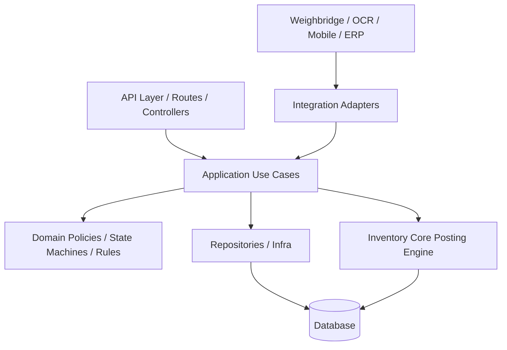
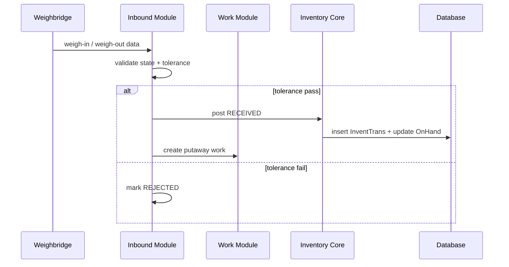
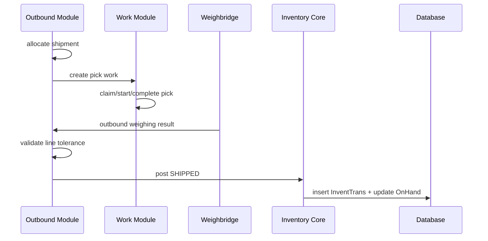
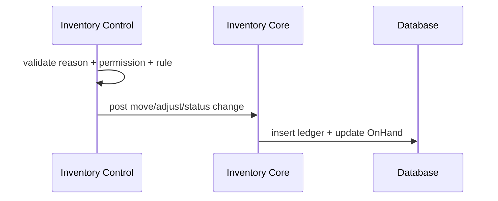

# Backend Architecture — SWM TVL (Single-Tenant, Phase 1)

> Mục đích của tài liệu này là giúp team dev hiểu thống nhất kiến trúc backend cho dự án SWM TVL ở giai đoạn hiện tại, tránh lệch hướng sang mô hình SaaS multi-tenant và tập trung đúng vào bài toán vận hành kho, tồn kho, weighing, work execution và billing.

---

## 1. Mục tiêu kiến trúc

Kiến trúc backend cho SWM TVL phải phục vụ 4 mục tiêu chính:

1. **Đúng nghiệp vụ kho**: không sai tồn, không sai luồng nhập/xuất, không sai billing.
2. **Dễ maintain**: module boundaries rõ, rule không rải khắp nơi.
3. **Scale đủ cho Phase 1–2**: nhiều warehouse, nhiều giao dịch/ngày, nhiều user đồng thời nhưng chưa over-engineer.
4. **An toàn audit/reconciliation**: mọi biến động phải truy vết được, có idempotency, có reversal thay vì sửa/xóa.

Hệ thống này **không thiết kế theo hướng multi-tenant SaaS** ở Phase 1. Đây là **single-tenant system** cho TVL, nhưng có nhiều warehouse, nhiều owner, nhiều luồng nghiệp vụ và nhiều integration.

---

## 2. Architectural stance

### 2.1 Chúng ta chọn kiến trúc gì?

Chọn mô hình:

- **Modular monolith**
- **Single-tenant**
- **Domain-oriented modules**
- **Prisma + relational database**
- **Inventory Core làm trung tâm**
- **Work Execution tách riêng khỏi Inbound/Outbound**
- **Integration là adapter layer, không ôm business rule**

### 2.2 Vì sao không chọn multi-tenant architecture?

Vì ở giai đoạn hiện tại:

- hệ thống phục vụ **một tổ chức vận hành là TVL**;
- complexity thật nằm ở **warehouse scope, owner scope, inventory dimensions, weighbridge, billing traceability**;
- không cần `tenant middleware`, `tenant routing`, `feature by tenant`, `dynamic module registry`.

Nếu build multi-tenant từ đầu sẽ làm tăng độ phức tạp nhưng không giải quyết pain point lớn nhất của dự án.

### 2.3 Vì sao không tách microservices ngay?

Vì Phase 1 cần:

- tốc độ delivery nhanh;
- transaction integrity cao;
- ít operational overhead;
- team dev có thể debug end-to-end dễ.

Microservice ở giai đoạn này sẽ làm tăng:

- distributed transaction complexity,
- event choreography complexity,
- hạ tầng deploy/monitoring,
- độ khó debug.

Do đó, lựa chọn phù hợp nhất là **modular monolith với boundaries chặt**.

---

## 3. Core principles bắt buộc

Đây là các nguyên tắc mà toàn bộ team backend phải tuân thủ.

### 3.1 Inventory là source of truth

- `InventTrans` là **ledger** ghi nhận mọi biến động tồn kho.
- `OnHand` là **current stock projection**.
- Mọi thay đổi tồn kho phải đi qua `InventTrans`, sau đó mới cập nhật `OnHand`.
- Không module nào được update `OnHand` trực tiếp từ controller/service/UI path.

### 3.2 Posting point là hữu hạn và rõ ràng

- Inbound chỉ post physical tại **RECEIVED**.
- Outbound chỉ post physical tại **SHIPPED**.
- Các state trung gian không được tự ý post inventory.

### 3.3 Ledger là immutable

- Không update/xóa record `InventTrans` đã post.
- Correction phải dùng **reversal transaction**.
- Mọi side effect phải audit được.

### 3.4 Work là execution layer, không phải inventory layer

- `WorkHeader/WorkLine` quản lý task ngoài hiện trường.
- Work có thể là trigger cho inventory event.
- Work không được ghi ledger trực tiếp theo kiểu tùy tiện; phải gọi vào `inventory-core`.

### 3.5 Integration là adapter, không là business owner

- Weighbridge chỉ nhận dữ liệu cân, normalize, log, retry.
- OCR chỉ extract dữ liệu và trả về candidate values.
- ERP sync chỉ push data ra ngoài.
- Rule tolerance, state transition, approval nằm ở domain module tương ứng.

### 3.6 Mọi command có side effect phải idempotent

Các API như:

- receive weigh-in / weigh-out,
- confirm receipt,
- ship shipment,
- complete work,
- inventory adjustment,
- sync from mobile,
- callback từ weighbridge,

đều phải có `externalId` hoặc cơ chế tương đương để chống duplicate create/post.

---

## 4. Kiến trúc tổng thể



### 4.1 Các layer chính

#### API Layer

Chịu trách nhiệm:

- nhận request,
- validate input,
- authn/authz,
- mapping request/response,
- không chứa business rule.

#### Application Layer

Chịu trách nhiệm:

- orchestration use case,
- gọi domain policy,
- gọi repository,
- gọi inventory posting engine,
- mở transaction khi cần.

#### Domain Layer

Chịu trách nhiệm:

- state machine,
- invariant,
- rule tolerance,
- allocation policy,
- status policy,
- business validation.

#### Infra Layer

Chịu trách nhiệm:

- Prisma repository,
- external adapter,
- template/export,
- persistence detail.

#### Shared Layer

Chỉ chứa cross-cutting concerns như:

- logger,
- error handling,
- db transaction helper,
- idempotency middleware,
- requestId,
- metrics/tracing,
- common utilities.

---

## 5. Codebase structure đề xuất

```txt
backend/
├── prisma/
│   ├── schema.prisma
│   ├── migrations/
│   └── seed/
│
├── src/
│   ├── app.js
│   ├── server.js
│   ├── routes.js
│   │
│   ├── config/
│   │   ├── env.js
│   │   ├── constants.js
│   │   └── permissions.js
│   │
│   ├── shared/
│   │   ├── db/
│   │   │   ├── prismaClient.js
│   │   │   ├── tx.js
│   │   │   └── locks.js
│   │   │
│   │   ├── errors/
│   │   │   ├── AppError.js
│   │   │   ├── DomainError.js
│   │   │   └── mapPrismaError.js
│   │   │
│   │   ├── contracts/
│   │   │   ├── apiResponse.js
│   │   │   ├── errorCodes.js
│   │   │   └── idempotency.js
│   │   │
│   │   ├── middlewares/
│   │   │   ├── requestId.js
│   │   │   ├── authn.js
│   │   │   ├── authz.js
│   │   │   ├── warehouseScope.js
│   │   │   ├── validateRequest.js
│   │   │   ├── idempotency.js
│   │   │   ├── auditLog.js
│   │   │   └── errorHandler.js
│   │   │
│   │   ├── logger/
│   │   │   └── logger.js
│   │   │
│   │   ├── observability/
│   │   │   ├── metrics.js
│   │   │   └── tracing.js
│   │   │
│   │   ├── integrations/
│   │   │   ├── storage/
│   │   │   ├── exporter/
│   │   │   └── mail/
│   │   │
│   │   └── utils/
│   │       ├── date.js
│   │       ├── pagination.js
│   │       ├── money.js
│   │       └── hash.js
│   │
│   ├── modules/
│   │   ├── foundation/
│   │   │   ├── auth/
│   │   │   ├── users/
│   │   │   ├── roles/
│   │   │   ├── permissions/
│   │   │   ├── audit/
│   │   │   └── number-sequence/
│   │   │
│   │   ├── master-data/
│   │   │   ├── owners/
│   │   │   ├── items/
│   │   │   ├── warehouses/
│   │   │   ├── locations/
│   │   │   ├── inventory-status/
│   │   │   ├── reason-codes/
│   │   │   ├── vehicle-types/
│   │   │   └── rate-cards/
│   │   │
│   │   ├── inventory-core/
│   │   │   ├── inventory-core.routes.js
│   │   │   ├── inventory-core.controller.js
│   │   │   ├── application/
│   │   │   │   ├── postingEngine.js
│   │   │   │   ├── reversalEngine.js
│   │   │   │   ├── onHandProjector.js
│   │   │   │   ├── inventDimService.js
│   │   │   │   ├── reconciliation.service.js
│   │   │   │   └── inventoryQuery.service.js
│   │   │   ├── domain/
│   │   │   │   ├── inventory.rules.js
│   │   │   │   ├── inventory.errors.js
│   │   │   │   └── inventory.types.js
│   │   │   ├── infra/
│   │   │   │   ├── inventTrans.repository.js
│   │   │   │   ├── onHand.repository.js
│   │   │   │   ├── inventDim.repository.js
│   │   │   │   └── snapshot.repository.js
│   │   │   └── inventory-core.schema.js
│   │   │
│   │   ├── inbound/
│   │   │   ├── inbound.routes.js
│   │   │   ├── inbound.controller.js
│   │   │   ├── application/
│   │   │   │   ├── createReceipt.usecase.js
│   │   │   │   ├── receiveWeighIn.usecase.js
│   │   │   │   ├── receiveWeighOut.usecase.js
│   │   │   │   ├── confirmReceipt.usecase.js
│   │   │   │   ├── rejectReceipt.usecase.js
│   │   │   │   ├── reweighReceipt.usecase.js
│   │   │   │   ├── createPutawayWork.usecase.js
│   │   │   │   └── cancelReceipt.usecase.js
│   │   │   ├── domain/
│   │   │   │   ├── inbound.policy.js
│   │   │   │   ├── inbound.state-machine.js
│   │   │   │   └── inbound.errors.js
│   │   │   ├── infra/
│   │   │   │   ├── receipt.repository.js
│   │   │   │   ├── receiptLine.repository.js
│   │   │   │   └── receipt.mapper.js
│   │   │   └── inbound.schema.js
│   │   │
│   │   ├── outbound/
│   │   │   ├── outbound.routes.js
│   │   │   ├── outbound.controller.js
│   │   │   ├── application/
│   │   │   │   ├── createShipment.usecase.js
│   │   │   │   ├── allocateShipment.usecase.js
│   │   │   │   ├── unallocateShipment.usecase.js
│   │   │   │   ├── startPicking.usecase.js
│   │   │   │   ├── receiveOutboundWeight.usecase.js
│   │   │   │   ├── shipShipment.usecase.js
│   │   │   │   └── createPickWork.usecase.js
│   │   │   ├── domain/
│   │   │   │   ├── outbound.policy.js
│   │   │   │   ├── outbound.state-machine.js
│   │   │   │   └── outbound.errors.js
│   │   │   ├── infra/
│   │   │   │   ├── shipment.repository.js
│   │   │   │   ├── allocation.repository.js
│   │   │   │   └── shipment.mapper.js
│   │   │   └── outbound.schema.js
│   │   │
│   │   ├── inventory-control/
│   │   │   ├── inventory-control.routes.js
│   │   │   ├── inventory-control.controller.js
│   │   │   ├── application/
│   │   │   │   ├── moveInventory.usecase.js
│   │   │   │   ├── transferInventory.usecase.js
│   │   │   │   ├── changeStatus.usecase.js
│   │   │   │   ├── cycleCount.usecase.js
│   │   │   │   ├── adjustInventory.usecase.js
│   │   │   │   └── getInventoryHistory.usecase.js
│   │   │   ├── domain/
│   │   │   │   ├── inventory-control.policy.js
│   │   │   │   └── inventory-control.errors.js
│   │   │   ├── infra/
│   │   │   │   └── inventory-control.repository.js
│   │   │   └── inventory-control.schema.js
│   │   │
│   │   ├── work/
│   │   │   ├── work.routes.js
│   │   │   ├── work.controller.js
│   │   │   ├── application/
│   │   │   │   ├── createWork.usecase.js
│   │   │   │   ├── claimWork.usecase.js
│   │   │   │   ├── startWorkLine.usecase.js
│   │   │   │   ├── completeWorkLine.usecase.js
│   │   │   │   ├── skipWorkLine.usecase.js
│   │   │   │   └── cancelWork.usecase.js
│   │   │   ├── domain/
│   │   │   │   ├── work.policy.js
│   │   │   │   ├── work.state-machine.js
│   │   │   │   └── work.errors.js
│   │   │   ├── infra/
│   │   │   │   ├── workHeader.repository.js
│   │   │   │   └── workLine.repository.js
│   │   │   └── work.schema.js
│   │   │
│   │   ├── integration/
│   │   │   ├── weighbridge/
│   │   │   ├── ocr/
│   │   │   ├── mobile-sync/
│   │   │   └── erp-sync/
│   │   │
│   │   ├── billing/
│   │   │   ├── billing.routes.js
│   │   │   ├── billing.controller.js
│   │   │   ├── application/
│   │   │   │   ├── captureBillingEvent.usecase.js
│   │   │   │   ├── createDailySnapshot.usecase.js
│   │   │   │   ├── generateDebitNote.usecase.js
│   │   │   │   ├── lockDebitNote.usecase.js
│   │   │   │   └── exportDebitNote.usecase.js
│   │   │   ├── domain/
│   │   │   │   ├── billing.policy.js
│   │   │   │   └── billing.errors.js
│   │   │   ├── infra/
│   │   │   │   ├── billingEvent.repository.js
│   │   │   │   ├── debitNote.repository.js
│   │   │   │   └── storageSnapshot.repository.js
│   │   │   └── billing.schema.js
│   │   │
│   │   ├── vas/
│   │   └── reporting/
│   │
│   ├── jobs/
│   │   ├── reconciliation.job.js
│   │   ├── storageSnapshot.job.js
│   │   ├── exportCleanup.job.js
│   │   └── erpRepush.job.js
│   │
│   └── docs/
│       ├── api.md
│       ├── architecture.md
│       └── state-machines.md
│
├── tests/
│   ├── unit/
│   ├── integration/
│   ├── contract/
│   └── e2e/
│
└── ...
```

---

## 6. Trách nhiệm của từng module

### 6.1 foundation

Chứa các năng lực nền tảng:

- auth,
- users,
- roles,
- permissions,
- audit,
- number sequence.

Không chứa business flow kho.

### 6.2 master-data

Chứa dữ liệu nền cho vận hành:

- owner,
- item,
- warehouse,
- location,
- inventory status,
- vehicle type,
- reason code,
- rate card.

Master data không được tự post tồn.

### 6.3 inventory-core

Đây là module **quan trọng nhất**. Chịu trách nhiệm:

- quản lý `InventDim`,
- tạo `InventTrans`,
- project `OnHand`,
- reversal,
- reconciliation,
- inventory query/historical ledger,
- daily storage snapshot.

#### Đây là module duy nhất được phép:

- tạo ledger stock movement,
- update on_hand projection,
- reverse transaction inventory.

### 6.4 inbound

Chịu trách nhiệm:

- receipt lifecycle,
- inbound state machine,
- weigh-in / weigh-out cho inbound,
- tolerance check inbound,
- reject / reweigh / cancel,
- tạo putaway work.

Inbound **không tự update OnHand**. Khi tới posting point, inbound gọi `inventory-core.postingEngine`.

### 6.5 outbound

Chịu trách nhiệm:

- shipment lifecycle,
- allocation,
- picking flow,
- outbound weighing flow,
- shipped / pending approval / cancel.

Outbound **không tự post stock**. Khi `SHIPPED`, outbound gọi `inventory-core`.

### 6.6 inventory-control

Chứa các nghiệp vụ tác động inventory trực tiếp nhưng không phải inbound/outbound:

- internal move,
- inter-warehouse transfer,
- change status,
- cycle count,
- adjustment,
- inventory history query.

Inventory-control vẫn phải gọi `inventory-core` để ghi ledger.

### 6.7 work

Chịu trách nhiệm:

- work header / line,
- claim / start / complete / skip / cancel,
- mobile execution flow.

Work module không sở hữu stock truth. Nó chỉ sở hữu execution truth.

### 6.8 integration

Tách thành các nhánh:

- `weighbridge`: local edge / callback / parse / retry / buffering,
- `ocr`: scan document,
- `mobile-sync`: sync mobile offline/online,
- `erp-sync`: đẩy dữ liệu sang ERP.

Integration phải mỏng và rõ ràng. Không nhét rule nghiệp vụ ở đây.

### 6.9 billing

Chịu trách nhiệm:

- capture billing events,
- storage snapshot,
- debit note,
- lock,
- export.

Billing phải bám ledger và snapshot, không dựa vào screen state đơn thuần.

---

## 7. Dependency rules giữa các module

Đây là quy tắc quan trọng để giữ hệ thống dễ maintain.

### 7.1 Allowed dependencies

- `foundation` → không phụ thuộc module nghiệp vụ.
- `master-data` → có thể được dùng bởi tất cả module.
- `inbound` → có thể gọi `work`, `inventory-core`, `master-data`, `foundation`.
- `outbound` → có thể gọi `work`, `inventory-core`, `master-data`, `foundation`.
- `inventory-control` → có thể gọi `inventory-core`, `master-data`, `foundation`.
- `work` → có thể gọi `inventory-core`, `master-data`, `foundation` nếu cần.
- `billing` → đọc từ `inventory-core`, `master-data`, `foundation`.
- `integration/*` → gọi vào use cases của module nghiệp vụ; không được viết xuyên vào DB business tables ngoài adapter needs.

### 7.2 Forbidden dependencies

- `inventory-core` không phụ thuộc `inbound`, `outbound`, `work`, `billing`.
- `billing` không được update inventory.
- `integration` không được tự post stock.
- `shared` không được chứa business rule kho.
- module A không được import repository private của module B.

### 7.3 Rule thực thi trong code review

Một module chỉ expose cho module khác:

- `routes`,
- `controller` entrypoints nội bộ nếu cần,
- hoặc tốt hơn là `application services/usecases public`.

Không import chéo trực tiếp vào `infra/repository` của module khác.

---

## 8. Warehouse scope thay cho tenant scope

Vì đây là single-tenant system, scope chính là:

- **warehouse**,
- **owner**,
- **role/permission**.

### 8.1 warehouseScope middleware

Middleware này có trách nhiệm:

- resolve warehouse từ route, token, request context hoặc business entity;
- validate user có quyền thao tác warehouse đó;
- inject `requestContext.warehouseId` cho use case.

### 8.2 Không dùng tenant middleware

Không tạo:

- `tenant.service.js`,
- `tenant.repository.js`,
- `tenant.schema.js`,
- dynamic `/:tenantId/*` routing.

Điều này giúp giảm complexity và bám đúng bài toán hiện tại.

---

## 9. Inventory Core design

Đây là phần team cần hiểu kỹ nhất.

### 9.1 InventDim

Phase 1 tracking theo:

- Site,
- Warehouse,
- Location,
- Owner,
- Inventory Status.

Batch/Lot chưa dùng ở Phase 1.

`InventDim` là normalized dimension record đại diện cho tổ hợp dimension. Mọi `InventTrans` và `OnHand` phải trỏ về `invent_dim_id`.

### 9.2 InventTrans

`InventTrans` là stock ledger immutable.

Một bản ghi cần tối thiểu có:

- trans_id,
- external_id,
- ref_type,
- ref_id,
- ref_line_id,
- item_id,
- invent_dim_id,
- qty,
- stage,
- trans_type,
- warehouse_id,
- owner_id,
- created_at,
- created_by,
- reversed_by,
- is_reversed.

### 9.3 OnHand

`OnHand` là projection hiện tại của stock theo `(item, invent_dim)`.

Nguyên tắc:

- không update trực tiếp từ business modules;
- chỉ update qua `onHandProjector` sau khi `InventTrans` được post;
- có reconciliation job để so khớp `OnHand` với `SUM(InventTrans)`.

### 9.4 Posting engine

`postingEngine` là trái tim kỹ thuật của backend inventory.

Chịu trách nhiệm:

- nhận posting command chuẩn hóa,
- kiểm tra idempotency,
- resolve/create `InventDim`,
- insert `InventTrans`,
- update `OnHand`,
- ghi audit log,
- trả về posting result.

### 9.5 Reversal engine

Dùng cho:

- force cancel,
- correction,
- rollback nghiệp vụ sau khi đã post.

Không sửa transaction cũ. Chỉ tạo transaction đảo chiều.

---

## 10. Luồng nghiệp vụ chuẩn

## 10.1 Inbound flow



#### Ownership

- inbound giữ receipt state machine;
- inventory-core ghi ledger;
- work xử lý putaway execution.

### 10.2 Outbound flow



#### Ownership

- outbound giữ shipment state machine;
- work giữ picking/loading execution;
- inventory-core ghi issue transaction.

### 10.3 Inventory control flow



---

## 11. State machine ownership

### 11.1 Inbound state machine thuộc inbound module

Ví dụ các state:

- DRAFT,
- AWAITING_WEIGHING,
- WEIGHED_IN,
- PROCESSING,
- WEIGHED_OUT,
- RECEIVED,
- REJECTED,
- PUTAWAY,
- CLOSED,
- CANCELLED.

### 11.2 Outbound state machine thuộc outbound module

Ví dụ các state:

- DRAFT,
- CONFIRMED,
- ALLOCATED,
- PICKING,
- PICKED,
- WEIGHING_TARE,
- LOADING,
- ALL_WEIGHED,
- SHIPPED,
- PENDING_APPROVAL,
- CLOSED,
- CANCELLED.

### 11.3 Work state machine thuộc work module

Ví dụ:

- OPEN,
- CLAIMED,
- IN_PROGRESS,
- COMPLETED,
- SKIPPED,
- CANCELLED.

Mỗi state machine phải được implement bằng mã rõ ràng trong `domain/*.state-machine.js`, không hardcode logic tản mát trong controller/service.

---

## 12. Transaction boundary

### 12.1 Khi nào cần DB transaction?

Bắt buộc dùng transaction ở các use case có nhiều bước phải atomic, ví dụ:

- post inbound received,
- ship outbound,
- complete work line tạo inventory effect,
- inventory adjustment,
- reversal,
- allocate/unallocate shipment.

### 12.2 Nguyên tắc transaction

- transaction phải ngắn;
- không gọi external API trong DB transaction;
- không query thừa trong transaction;
- lock theo business key đủ dùng, không lock quá rộng;
- xử lý retry cho deadlock/concurrency conflict.

---

## 13. Idempotency strategy

### 13.1 Vì sao bắt buộc?

Dự án có nhiều nguồn duplicate tự nhiên:

- retry từ mobile,
- callback weighbridge gửi lại,
- user bấm lại nút,
- network timeout,
- integration replay.

### 13.2 Cách làm

Mỗi command side-effect phải có:

- `externalId` hoặc `idempotencyKey`;
- unique constraint ở DB;
- query-before-insert hoặc insert-with-unique-handling;
- nếu duplicate thì trả lại kết quả cũ.

### 13.3 Áp dụng ở đâu?

- `InventTrans.external_id`
- weighbridge logs
- work completion
- shipment/receipt posting commands
- ERP push outbox

---

## 14. Error handling strategy

### 14.1 Phân loại lỗi

- **Validation error**: input sai, thiếu field, format sai.
- **Domain error**: state transition sai, tolerance fail, insufficient stock, invalid location.
- **Concurrency error**: version conflict, duplicate posting, deadlock retry exceeded.
- **Infrastructure error**: DB down, storage fail, external adapter fail.

### 14.2 Cấu trúc chuẩn

- ném `AppError` hoặc `DomainError` có `code`, `message`, `details`;
- map Prisma error sang error code nội bộ;
- trả response chuẩn hóa cho FE/mobile/integration.

---

## 15. Logging, audit, observability

### 15.1 Logging

Mỗi request cần có:

- `requestId`,
- `userId`,
- `warehouseId`,
- `module`,
- `action`,
- `durationMs`.

### 15.2 Audit log

Các action bắt buộc audit:

- create/update master data quan trọng,
- confirm/cancel receipt,
- allocate/unallocate shipment,
- ship shipment,
- inventory adjustment,
- status change,
- reversal,
- billing lock.

### 15.3 Metrics

Nên có:

- request latency,
- error rate,
- posting throughput,
- reconciliation mismatch count,
- weighbridge callback retry count,
- queue backlog nếu có outbox/job.

---

## 16. Async jobs và eventual consistency có kiểm soát

### 16.1 Những gì nên làm async

- storage snapshot cuối ngày,
- reconciliation job,
- export cleanup,
- ERP re-push,
- email notification,
- report materialization.

### 16.2 Những gì không nên làm async ở Phase 1

- posting inventory cốt lõi,
- inbound RECEIVED,
- outbound SHIPPED,
- critical work completion có inventory effect.

Những hành vi này cần strong consistency hơn eventual consistency.

---

## 17. Security & access control

### 17.1 Access control model

Áp dụng 3 lớp:

- authentication,
- role/permission,
- warehouse scope.

### 17.2 Một số permission tiêu biểu

- create/confirm/cancel receipt,
- allocate/ship shipment,
- complete work,
- inventory adjust,
- reverse transaction,
- lock debit note,
- manage master data.

### 17.3 Quy tắc quan trọng

- chỉ user có scope warehouse phù hợp mới thao tác được dữ liệu warehouse đó;
- action nhạy cảm phải audit;
- adjustment/reversal nên có permission cấp cao hơn bình thường.

---

## 18. Testing strategy

### 18.1 Unit tests

Tập trung cho:

- domain rules,
- state machines,
- tolerance calculations,
- allocation rules,
- posting payload validation,
- billing formulas.

### 18.2 Integration tests

Tập trung cho:

- repository,
- Prisma transaction boundary,
- posting engine,
- idempotency,
- reversal,
- reconciliation logic.

### 18.3 E2E tests

Bắt buộc có cho:

- inbound happy path,
- inbound rejected/reweigh path,
- outbound multi-trip weighing path,
- work execution path,
- inventory adjustment path,
- billing snapshot generation.

### 18.4 Contract tests

Dùng cho:

- weighbridge integration,
- OCR result contract,
- ERP payload,
- mobile sync payload.

---

## 19. Maintainability & scalability đánh giá

### 19.1 Vì sao kiến trúc này dễ maintain?

- module ownership rõ;
- business rule không rải lung tung;
- inventory logic tập trung;
- code review có dependency rule rõ;
- dễ onboard dev mới.

### 19.2 Vì sao kiến trúc này scale được trong bối cảnh hiện tại?

- scale theo module/team tốt;
- scale transaction volume ở mức Phase 1–2 tốt nếu DB/index/transaction được tối ưu;
- chưa cần gánh độ phức tạp của microservices.

### 19.3 Điểm cần cảnh giác khi scale

- `inventory-core` có thể thành bottleneck nếu transaction dài;
- reporting/billing nặng có thể ảnh hưởng OLTP nếu query không tách;
- integration callback duplicate dễ làm vỡ idempotency nếu làm ẩu;
- module boundaries dễ bị xói mòn nếu dev import chéo repository.

---

## 20. Những điều tuyệt đối không làm

1. Không update `OnHand` trực tiếp từ module nghiệp vụ.
2. Không để `inbound/outbound/work/integration` tự insert `InventTrans` bypass `postingEngine`.
3. Không nhét business rule kho vào `shared/`.
4. Không để integration adapter quyết định state machine nghiệp vụ.
5. Không dùng `service.js` kiểu God object cho mọi thứ.
6. Không import repository private của module khác.
7. Không xóa/sửa ledger đã post.
8. Không gọi external API bên trong DB transaction dài.
9. Không dùng tenant abstraction khi hệ thống đang là single-tenant.

---

## 21. Checklist thực thi cho team dev

### 21.1 Trước khi code feature mới

Phải trả lời được 6 câu hỏi:

1. Feature này thuộc module nào?
2. State machine owner là module nào?
3. Có tác động inventory không?
4. Nếu có, posting point là gì?
5. Có cần idempotency không?
6. Có cần audit không?

### 21.2 Trước khi merge PR

Reviewer cần check:

- đúng module boundary chưa;
- business rule có nằm ở domain/application đúng chỗ chưa;
- có bypass `inventory-core` không;
- có transaction boundary rõ chưa;
- có idempotency chưa;
- có test case chính chưa;
- có log/audit phù hợp chưa.

---

## 22. Thứ tự triển khai khuyến nghị

### Phase A — Foundation + Master Data

- auth/users/roles/permissions,
- warehouse/location/owner/item/status,
- number sequence,
- audit log.

### Phase B — Inventory Core

- invent_dim,
- invent_trans,
- on_hand,
- posting engine,
- reversal engine,
- inventory query,
- reconciliation.

### Phase C — Inbound + Weighbridge + Putaway Work

- receipt lifecycle,
- weigh-in/out,
- tolerance,
- received posting,
- putaway work.

### Phase D — Outbound + Picking + Weighing + Ship

- shipment lifecycle,
- allocation,
- pick work,
- outbound multi-trip weighing,
- shipped posting.

### Phase E — Inventory Control

- move,
- transfer,
- status change,
- adjustment,
- cycle count.

### Phase F — Billing

- billing event capture,
- daily storage snapshot,
- debit note,
- lock/export.

---

## 23. Kết luận

Kiến trúc backend phù hợp cho SWM TVL hiện tại là:

- **single-tenant**,
- **modular monolith**,
- **inventory-core centric**,
- **work execution tách riêng**,
- **integration là adapter**,
- **warehouse scope thay tenant scope**,
- **idempotent + auditable + reversible**.

Nếu cả team giữ đúng những boundary và nguyên tắc trong tài liệu này, hệ thống sẽ:

- dễ maintain hơn,
- dễ scale hơn trong Phase 1–2,
- giảm rủi ro sai tồn và sai billing,
- ít phải đập lại kiến trúc khi mở rộng sau này.

---

## 24. Quick summary cho dev team

- Đây là **single-tenant system**, không phải multi-tenant SaaS.
- **Inventory Core là trung tâm** và là nơi duy nhất được ghi ledger tồn kho.
- `Inbound`, `Outbound`, `Inventory Control`, `Work`, `Billing`, `Integration` phải tách rõ ownership.
- `Work` là execution layer, không phải stock truth layer.
- `Integration` là adapter, không chứa business decision.
- Mọi side effect phải có **idempotency** và **audit**.
- Không sửa/xóa ledger đã post, chỉ **reverse**.

