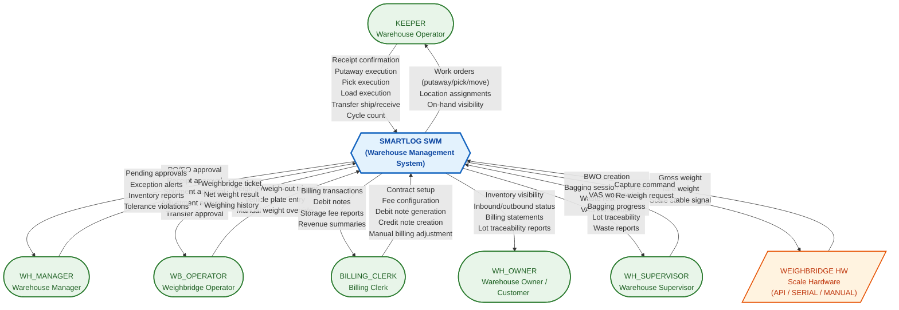

# System-Level Data Flow Diagram (DFD Level 0) — Smartlog SWM

> **Implementation Notes (TASK 0 — EF Foundation):**
> - **Auth/Tenant**: `tenants` table NOT in this DB — managed by external TenantAdmin API. Auth entities (User, UserRole, SecurityGroup, etc.) reused from existing System schema, NOT tenant-scoped.
> - **Multi-Tenancy**: Hybrid model — DB-per-tenant (large) + Shared DB with tenant_id filtering (small). EF Core `TenantSaveChangesInterceptor` auto-sets tenant_id. No PostgreSQL RLS `SET LOCAL`.
> - **DB Schemas**: `system`, `cat` (master data), `ops` (operations), `inv` (inventory), `billing`, `logging`
> - **Base Classes**: `TenantEntity`, `TenantSoftDeletedEntity`, `AppendOnlyEntity` + `ITenantEntity` interface
> - **Enums**: Stored as strings via `.HasConversion<string>()`

> **Version:** 1.0 | **Date:** 2026-03-13
> **System:** Thoresen Vinama Logistics — Smart Warehouse Management (SWM)
> **Architecture:** Event-sourced inventory (invent_trans WRITE / on_hand READ), Multi-tenant (RLS), ~60 tables
> **Scope:** All 8 core modules, 6 external actors, 1 hardware interface

---

## Table of Contents

1. [Context Diagram (DFD Level -1)](#1-context-diagram)
2. [DFD Level 0 — Module Decomposition](#2-dfd-level-0)
3. [Module Summary Table](#3-module-summary-table)
4. [Cross-Module Data Flow Matrix](#4-cross-module-data-flow-matrix)
5. [Key Data Stores](#5-key-data-stores)
6. [Golden Rules](#6-golden-rules)
7. [Legend](#7-legend)

---

## 1. Context Diagram

The context diagram shows the Smartlog WMS as a single process interacting with all external actors. Every data flow crossing the system boundary is labeled.



---

## 2. DFD Level 0

The Level 0 diagram decomposes the SWM system into 8 core processes (modules), showing data flows between them and the shared data stores.

```mermaid
graph TB
    %% ════════════════════════════════════════════
    %% EXTERNAL ACTORS
    %% ════════════════════════════════════════════
    subgraph EXT ["External Actors"]
        direction TB
        KEEPER([KEEPER])
        WH_MGR([WH_MANAGER])
        WB_OP([WB_OPERATOR])
        BILLING_CLERK([BILLING_CLERK])
        WH_OWNER([WH_OWNER])
        WH_SUPER([WH_SUPERVISOR])
        WB_HW[/WEIGHBRIDGE HW/]
    end

    %% ════════════════════════════════════════════
    %% CORE PROCESSES (P1–P8)
    %% ════════════════════════════════════════════
    subgraph SWM ["SMARTLOG SWM — Level 0 Processes"]
        direction TB

        subgraph FOUNDATION ["Foundation Layer"]
            P1(("P1\nMaster Data\nManagement"))
        end

        subgraph INVENTORY_CORE ["Inventory Core"]
            P2(("P2\nInventory\nEngine"))
        end

        subgraph WEIGHING ["Weighing"]
            P3(("P3\nWeighbridge\nOperations"))
        end

        subgraph FLOW_MODULES ["Material Flow"]
            P4(("P4\nInbound\nFlow"))
            P5(("P5\nOutbound\nFlow"))
            P6(("P6\nTransfer"))
        end

        subgraph VALUE_ADD ["Value-Added Services"]
            P8(("P8\nVAS /\nBagging"))
        end

        subgraph FINANCIAL ["Financial"]
            P7(("P7\nBilling\nEngine"))
        end
    end

    %% ════════════════════════════════════════════
    %% DATA STORES
    %% ════════════════════════════════════════════
    subgraph DS ["Data Stores"]
        D1[(D1: invent_trans\nAppend-only ledger\nWRITE model)]
        D2[(D2: on_hand\nMaterialized\nREAD model)]
        D3[(D3: invent_dim\nDimension keys\ndim_hash)]
        D4[(D4: lot\nLot registry\ncross-warehouse)]
        D5[(D5: master_data\nowner, item, vendor\ncarrier, warehouse\nzone, location\nvehicle_type)]
        D6[(D6: weighbridge_log\n+ weighing_attempt)]
        D7[(D7: billing_data\ncontract, fee_type\nbilling_transaction\ndebit/credit_note)]
        D8[(D8: daily_storage\n_snapshot)]
        D9[(D9: work_header\n+ work_line)]
        D10[(D10: documents\nPO, SO, receipt\nshipment, transfer\nBWO)]
    end

    %% ════════════════════════════════════════════
    %% ACTOR → PROCESS FLOWS
    %% ════════════════════════════════════════════

    %% KEEPER
    KEEPER -- "Receipt confirmation\nPutaway/Pick/Load execution" --> P4
    KEEPER -- "Pick/Load/Ship execution" --> P5
    KEEPER -- "Ship at source\nReceive at dest" --> P6
    P4 -- "Work orders\nLocation assignments" --> KEEPER
    P5 -- "Pick/load work orders" --> KEEPER
    P6 -- "Transfer work orders" --> KEEPER

    %% WH_MANAGER
    WH_MGR -- "PO approval\nReceipt approval" --> P4
    WH_MGR -- "SO approval\nShipment approval" --> P5
    WH_MGR -- "Transfer approval" --> P6
    WH_MGR -- "Adjustment approval" --> P2

    %% WB_OPERATOR + HARDWARE
    WB_OP -- "Weigh-in/weigh-out trigger" --> P3
    WB_HW -- "Gross/tare weight\nStable signal" --> P3
    P3 -- "Weighbridge ticket\nNet weight" --> WB_OP

    %% BILLING_CLERK
    BILLING_CLERK -- "Contract setup\nFee config\nDebit/credit note" --> P7
    P7 -- "Billing transactions\nDebit notes\nRevenue reports" --> BILLING_CLERK

    %% WH_OWNER
    P2 -- "Inventory visibility\nLot traceability" --> WH_OWNER
    P7 -- "Billing statements" --> WH_OWNER

    %% WH_SUPERVISOR
    WH_SUPER -- "BWO creation\nBagging progress\nWaste recording" --> P8
    P8 -- "VAS work orders\nLot traceability\nWaste reports" --> WH_SUPER

    %% ════════════════════════════════════════════
    %% PROCESS → DATA STORE FLOWS
    %% ════════════════════════════════════════════

    %% P1: Master Data
    P1 -- "CRUD master entities" --> D5
    D5 -- "Ref data (item, owner,\nwarehouse, location...)" --> P1

    %% P2: Inventory Engine
    D1 -- "SUM(transactions)\nasync materialization" --> P2
    P2 -- "Materialized on_hand" --> D2
    P2 -- "Adjustment InventTrans\n(stage=PHYSICAL)" --> D1
    D3 -- "Dimension lookup" --> P2
    D4 -- "Lot registry" --> P2

    %% P3: Weighbridge
    P3 -- "weighbridge_log\nweighing_attempt" --> D6
    D6 -- "Historical weights" --> P3

    %% P4: Inbound
    P4 -- "PO, receipt\ndocuments" --> D10
    P4 -- "InventTrans\nEXPECTED → PHYSICAL" --> D1
    P4 -- "New lot registration" --> D4
    P4 -- "New dimension keys" --> D3
    P4 -- "Putaway work orders" --> D9
    D5 -- "item, owner,\nwarehouse, location" --> P4
    D10 -- "PO/receipt data" --> P4

    %% P5: Outbound
    P5 -- "SO, shipment\ndocuments" --> D10
    P5 -- "InventTrans\nALLOCATED → PICKED\n→ LOADED → DEDUCTED" --> D1
    P5 -- "Pick/load work orders" --> D9
    D2 -- "Available on_hand\nfor FIFO allocation" --> P5
    D5 -- "item, owner,\nwarehouse, location" --> P5
    D10 -- "SO/shipment data" --> P5

    %% P6: Transfer
    P6 -- "Transfer header/line\ndocuments" --> D10
    P6 -- "InventTrans\nSHIPPED(src) →\nIN_TRANSIT →\nPHYSICAL(dest)" --> D1
    D2 -- "Source on_hand\nfor allocation" --> P6
    D5 -- "Source/dest\nwarehouse, location" --> P6

    %% P7: Billing
    D8 -- "Daily storage snapshot\n(from on_hand EOD)" --> P7
    P7 -- "Billing transactions\nDebit/credit notes" --> D7
    D7 -- "Contract, fee config\nRate cards" --> P7
    D5 -- "owner, item,\nvehicle_type" --> P7

    %% P8: VAS/Bagging
    P8 -- "BWO, bagging_progress" --> D10
    P8 -- "InventTrans ISSUE\n(bulk consumption)\nInventTrans RECEIPT\n(bagged production)" --> D1
    P8 -- "New lot\n(source_lot_id traceability)" --> D4
    D2 -- "Bulk on_hand\nfor consumption" --> P8
    D5 -- "item (bulk + bagged),\nowner, location" --> P8

    %% ════════════════════════════════════════════
    %% CROSS-PROCESS FLOWS
    %% ════════════════════════════════════════════

    %% Master Data → All
    P1 -. "Reference data\n(owner, item, location,\nwarehouse, zone, vendor,\ncarrier, vehicle_type)" .-> P2
    P1 -. "Reference data" .-> P3
    P1 -. "Reference data" .-> P4
    P1 -. "Reference data" .-> P5
    P1 -. "Reference data" .-> P6
    P1 -. "Reference data" .-> P7
    P1 -. "Reference data" .-> P8

    %% Weighbridge → Inbound/Outbound
    P3 -- "net_weight\n(receipt weighing)" --> P4
    P3 -- "net_weight\n(shipping weighing)" --> P5

    %% Inbound/Outbound/Transfer/VAS → Inventory Engine (via invent_trans)
    P4 -. "Triggers async\non_hand materialization" .-> P2
    P5 -. "Triggers async\non_hand materialization" .-> P2
    P6 -. "Triggers async\non_hand materialization" .-> P2
    P8 -. "Triggers async\non_hand materialization" .-> P2

    %% Inbound/Outbound/VAS → Billing (auto-capture fees)
    P4 -- "Inbound fee events\n(handling, weighing)" --> P7
    P5 -- "Outbound fee events\n(handling, weighing,\ntransportation)" --> P7
    P8 -- "VAS fee events\n(bagging service)" --> P7

    %% Inventory → Billing (daily snapshot)
    P2 -- "EOD snapshot\n→ daily_storage_snapshot" --> D8

    %% ════════════════════════════════════════════
    %% STYLING
    %% ════════════════════════════════════════════
    classDef process fill:#E3F2FD,stroke:#1565C0,stroke-width:2px,color:#0D47A1
    classDef actor fill:#E8F5E9,stroke:#2E7D32,stroke-width:2px,color:#1B5E20
    classDef hardware fill:#FFF3E0,stroke:#E65100,stroke-width:2px,color:#BF360C
    classDef datastore fill:#F3E5F5,stroke:#6A1B9A,stroke-width:2px,color:#4A148C
    classDef subgraphStyle fill:#FAFAFA,stroke:#BDBDBD

    class P1,P2,P3,P4,P5,P6,P7,P8 process
    class KEEPER,WH_MGR,WB_OP,BILLING_CLERK,WH_OWNER,WH_SUPER actor
    class WB_HW hardware
    class D1,D2,D3,D4,D5,D6,D7,D8,D9,D10 datastore
```



---

## 3. Module Summary Table

| # | Module (Process) | Key Inputs | Key Outputs | Primary Data Stores | External Actors |
|---|-----------------|------------|-------------|-------------------|-----------------|
| **P1** | **Master Data Management** | CRUD requests from all users | Validated reference data | D5: master_data (owner, item, vendor, carrier, warehouse, zone, location, lot, vehicle_type, uom) | All (indirectly) |
| **P2** | **Inventory Engine** | invent_trans records (from P4/P5/P6/P8), Adjustment requests | Materialized on_hand, Daily storage snapshot, Inventory reports | D1: invent_trans (WRITE), D2: on_hand (READ), D3: invent_dim, D4: lot | WH_MANAGER (approvals), WH_OWNER (visibility) |
| **P3** | **Weighbridge Operations** | Weigh-in/weigh-out triggers, Scale hardware data (gross/tare), Vehicle plate | Weighbridge ticket, Net weight (to P4/P5), Weighing history | D6: weighbridge_log, weighing_attempt | WB_OPERATOR, WEIGHBRIDGE HW |
| **P4** | **Inbound Flow** | PO, Receipt data, Net weight (from P3), Approval (from WH_MGR) | InventTrans (EXPECTED->PHYSICAL), Putaway work orders, New lot registration, Fee events (to P7) | D1: invent_trans, D4: lot, D9: work_header/line, D10: PO/receipt | KEEPER, WH_MANAGER |
| **P5** | **Outbound Flow** | SO, Shipment order, On_hand (FIFO allocation), Net weight (from P3) | InventTrans (ALLOCATED->PICKED->LOADED->DEDUCTED), Pick/load work orders, Fee events (to P7) | D1: invent_trans, D2: on_hand, D9: work_header/line, D10: SO/shipment, allocation_record | KEEPER, WH_MANAGER |
| **P6** | **Transfer** | Transfer order, Source on_hand, Approval (from WH_MGR) | InventTrans (SHIPPED->IN_TRANSIT->PHYSICAL at dest), Transfer work orders, Loss records | D1: invent_trans, D2: on_hand, D10: transfer_header/line | KEEPER, WH_MANAGER |
| **P7** | **Billing Engine** | Daily storage snapshot (from P2), Fee events (from P4/P5/P8), Contract/fee config | Billing transactions, Debit notes, Credit notes, Revenue reports | D7: billing_data, D8: daily_storage_snapshot | BILLING_CLERK, WH_OWNER |
| **P8** | **VAS / Bagging** | BWO creation, Bulk on_hand, Bagging progress input | InventTrans ISSUE (consumption) + RECEIPT (production), New lot (with source_lot_id), Waste records, Fee events (to P7) | D1: invent_trans, D4: lot, D10: BWO/bagging_progress | WH_SUPERVISOR |

---

## 4. Cross-Module Data Flow Matrix

The matrix below shows which module **sends** data (rows) to which module **receives** data (columns). Each cell describes the data exchanged.

| FROM \ TO | P1 Master Data | P2 Inventory | P3 Weighbridge | P4 Inbound | P5 Outbound | P6 Transfer | P7 Billing | P8 VAS |
|-----------|---------------|-------------|---------------|-----------|------------|-----------|-----------|--------|
| **P1 Master Data** | -- | Ref data (item, owner, uom) | Ref data (vehicle_type) | Ref data (item, owner, vendor, warehouse, location, lot) | Ref data (item, owner, carrier, warehouse, location) | Ref data (warehouse, location, item, owner) | Ref data (owner, item, vehicle_type, uom) | Ref data (item, owner, location) |
| **P2 Inventory** | -- | -- | -- | -- | on_hand (available qty for FIFO allocation) | on_hand (source qty for allocation) | daily_storage_snapshot (EOD on_hand) | on_hand (bulk qty for consumption) |
| **P3 Weighbridge** | -- | -- | -- | net_weight (receipt) | net_weight (shipping) | -- | -- | -- |
| **P4 Inbound** | -- | invent_trans (EXPECTED, PHYSICAL, putaway location change) | -- | -- | -- | -- | Fee events (handling, weighing fees) | -- |
| **P5 Outbound** | -- | invent_trans (ALLOCATED, PICKED, LOADED, DEDUCTED) | -- | -- | -- | -- | Fee events (handling, weighing, transport fees) | -- |
| **P6 Transfer** | -- | invent_trans (SHIPPED, IN_TRANSIT, PHYSICAL at dest, loss deduction) | -- | -- | -- | -- | -- (IN_TRANSIT excluded from billing) | -- |
| **P7 Billing** | -- | -- | -- | -- | -- | -- | -- | -- |
| **P8 VAS** | -- | invent_trans (ISSUE for bulk consumption, RECEIPT for bagged production) | -- | -- | -- | -- | Fee events (bagging service fees) | -- |

### Reading the Matrix

- **Rows** = sending module (data producer)
- **Columns** = receiving module (data consumer)
- **`--`** = no direct data flow
- All inventory-modifying modules (P4, P5, P6, P8) write to `invent_trans`, which P2 asynchronously materializes to `on_hand`
- P7 (Billing) is a **pure consumer** -- it receives data but sends none to other modules
- P1 (Master Data) is a **pure provider** -- all modules depend on it for reference data

---

## 5. Key Data Stores

| Store ID | Name | Type | Description | Written By | Read By |
|----------|------|------|-------------|-----------|---------|
| D1 | `invent_trans` | Append-only ledger (WRITE model) | Every inventory change is an immutable transaction record. Fields: trans_type, stage, qty, invent_dim_id, lot_id, reference_id. Supports full rebuild of on_hand. | P4, P5, P6, P8, P2 (adjustments) | P2 (materialization) |
| D2 | `on_hand` | Materialized view (READ model) | Current inventory by item + invent_dim (location, owner, status, lot). Async-materialized from D1. Used for allocation, visibility, billing snapshots. | P2 (async from D1) | P5, P6, P7 (via D8), P8, WH_OWNER |
| D3 | `invent_dim` | Dimension registry | Unique combinations of (site, warehouse, location, owner, status, lot_id). Uses `dim_hash` for dedup. | P4, P5, P6, P8 | P2, P4, P5, P6, P8 |
| D4 | `lot` | Lot registry | Cross-warehouse lot tracking. Configurable hash attributes. `source_lot_id` for VAS traceability. | P4 (receipt), P8 (bagged production) | P2, P4, P5, P6, P8 |
| D5 | Master data tables | Reference tables | owner, item, vendor, carrier, warehouse, zone, location, vehicle_type, uom, uom_conversion, reason_code | P1 | All modules |
| D6 | `weighbridge_log` + `weighing_attempt` | Ticket-based | Each truck visit = 1 log (weigh-in + weigh-out). Each scale reading = 1 attempt (supports retry, audit). | P3 | P3, P4, P5 |
| D7 | Billing tables | Transactional | fee_type, billing_condition, billing_contract, contract_fee_line, billing_transaction, debit_note, debit_note_line, day_type_config, calendar_detail | P7 | P7, BILLING_CLERK |
| D8 | `daily_storage_snapshot` | EOD snapshot | End-of-day on_hand snapshot for storage fee calculation. IN_TRANSIT inventory excluded. | P2 (EOD job) | P7 |
| D9 | `work_header` + `work_line` | Work orders | Putaway, pick, move work. Self-claim model. Steps: PICK/PUT/MOVE. | P4, P5, P6 | KEEPER |
| D10 | Document tables | Transactional | PO, inbound_receipt/line, sale_order, shipment_order/line, allocation_record, transfer_header/line, bagging_work_order, bagging_progress | P4, P5, P6, P8 | P4, P5, P6, P8 |

### Tenant Isolation

All data stores enforce `tenant_id UUID NOT NULL` with PostgreSQL Row-Level Security (RLS). Every query is automatically filtered by `tenant_id` extracted from the JWT token.

---

## 6. Golden Rules

These architectural invariants govern ALL data flows in the system:

| # | Rule | Impact on Data Flow |
|---|------|-------------------|
| **RULE 1** | **Event-sourced inventory.** `invent_trans` = WRITE model (append-only). `on_hand` = READ model (async materialized). on_hand is rebuildable from SUM(invent_trans) at any time. | P4/P5/P6/P8 write to invent_trans. P2 materializes to on_hand. No module writes directly to on_hand. |
| **RULE 2** | **Tenant isolation.** `tenant_id` on ALL ~60 tables. RLS enforced. Every unique constraint includes tenant_id. | All data flows are scoped to a single tenant. Cross-tenant data flow is impossible by design. |
| **RULE 3** | **Lot traceability preserved across all operations.** `lot_id` in `invent_dim`. Lot auto-merge (same hash) / auto-split (different hash). VAS creates new lot with `source_lot_id`. | Lot flows end-to-end: Receipt (P4) -> Putaway -> Pick -> Ship (P5) / Transfer (P6) / Bagging (P8). |
| **RULE 4** | **Location accuracy.** on_hand reflects physical location at ALL times. Every physical move (putaway, pick, load) creates an invent_trans with location change. | No "floating" inventory. Putaway (P4), Pick (P5), Load (P5), Transfer ship/receive (P6) all record location changes. |
| **RULE 5** | **Concurrency.** Append-only writes to invent_trans. Advisory locks for allocation. No UPDATE on invent_trans. | FIFO allocation (P5) uses advisory locks. Multiple operators can write invent_trans concurrently without conflicts. |

---

## 7. Legend

### Diagram Symbols

| Symbol | Meaning |
|--------|---------|
| `(( ))` | **Process** — A module/subsystem that transforms data |
| `([  ])` | **External Actor** — A person or role outside the system boundary |
| `[/ /]` | **Hardware Interface** — External hardware device |
| `[( )]` | **Data Store** — Persistent storage (database table or group) |
| `-->` (solid arrow) | **Primary data flow** — Direct, synchronous data exchange |
| `-.->` (dashed arrow) | **Secondary/indirect flow** — Async materialization, reference data lookup, event trigger |
| Arrow labels | Describe the data content flowing along that path |

### Color Coding

| Color | Element |
|-------|---------|
| Blue (`#E3F2FD`) | Processes (P1-P8) |
| Green (`#E8F5E9`) | Human actors (KEEPER, WH_MANAGER, etc.) |
| Orange (`#FFF3E0`) | Hardware interfaces (WEIGHBRIDGE HW) |
| Purple (`#F3E5F5`) | Data stores (D1-D10) |

### Module ID Mapping

| ID | Module | DB Schema |
|----|--------|-----------|
| P1 | Master Data Management | `cat` (catalog) |
| P2 | Inventory Engine | `ops` (operations) |
| P3 | Weighbridge Operations | `ops` |
| P4 | Inbound Flow | `ops` |
| P5 | Outbound Flow | `ops` |
| P6 | Transfer | `ops` |
| P7 | Billing Engine | `ops` |
| P8 | VAS / Bagging | `ops` |

---

## Appendix: Lot Traceability Flow (End-to-End)

This trace shows how lot identity is preserved across all modules:

```
Receipt (P4)                    Putaway (P4)              Pick (P5)
┌─────────────┐                ┌──────────────┐          ┌──────────────┐
│ Vendor delivers              │ KEEPER moves  │          │ FIFO allocates│
│ → New lot created            │ RECV → BIN-A  │          │ lot from      │
│ → lot_id in invent_dim       │ → InventTrans │          │ on_hand       │
│ → InventTrans PHYSICAL       │   loc change  │          │ → InventTrans │
└──────┬──────┘                └──────┬───────┘          │   ALLOCATED   │
       │                              │                   └──────┬───────┘
       ▼                              ▼                          │
  lot_id=LOT001                  lot_id=LOT001                   ▼
  loc=RECV-DOCK                  loc=BIN-A                  lot_id=LOT001
                                                            loc=BIN-A

Load (P5)                     Ship (P5)                    OR Transfer (P6)
┌──────────────┐              ┌──────────────┐             ┌──────────────┐
│ KEEPER loads  │              │ Truck departs │             │ Ship at source│
│ BIN-A → STAGE │              │ STAGE → SHIP  │             │ → IN_TRANSIT  │
│ → InventTrans │              │ → InventTrans │             │ Recv at dest  │
│   loc change  │              │   DEDUCTED    │             │ → PHYSICAL    │
└──────┬───────┘              └──────┬───────┘             └──────┬───────┘
       ▼                             ▼                            ▼
  lot_id=LOT001                 lot_id=LOT001                lot_id=LOT001
  loc=STAGE                     (inventory gone)             loc=DEST-BIN

OR VAS/Bagging (P8)
┌──────────────────────────┐
│ BWO: consume bulk LOT001 │
│ → InventTrans ISSUE      │
│ Produce bagged LOT002    │
│ → InventTrans RECEIPT    │
│ LOT002.source_lot_id     │
│   = LOT001               │
└──────────────────────────┘
```
