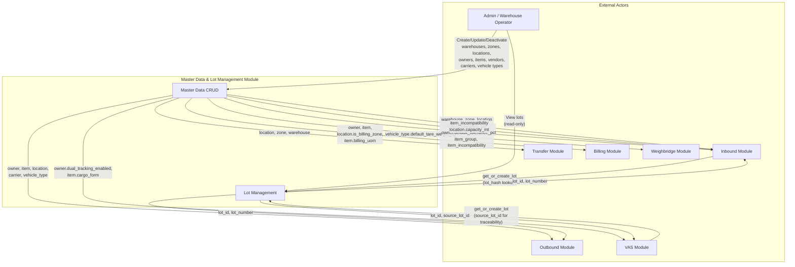
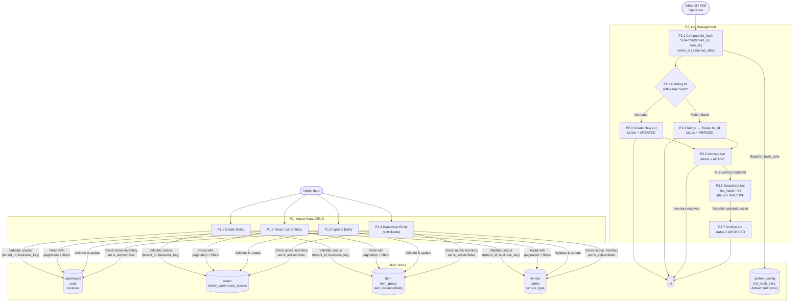
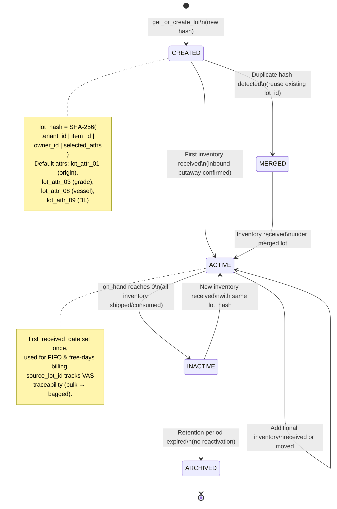

# 01 - Master Data & Lot Management: Data Flow Diagram

> **Implementation Notes (TASK 0):**
> - `system_config` table is a separate entity from `AppConfig` — both exist. `SystemConfig` is tenant-scoped (TenantEntity), `AppConfig` is system-level (BaseSoftDeletedEntity).
> - Master data entities use `TenantSoftDeletedEntity` base class (auto soft-delete filter).
> - Schema: `cat` (DatabaseConstants.Schemas.MasterData)

> Module scope: 12 master-data entities + lot lifecycle management.
> All other modules (Inbound, Outbound, Transfer, Billing, VAS) consume master data defined here.

---

## 1. Context Diagram

High-level view showing the Master Data module and its external interactions.



---

## 2. Process Flow Diagram

CRUD operations for all master entities and the Lot lifecycle.



---

## 3. Lot Lifecycle State Machine



---

## 4. Data Flow Table

### 4.1 Master Data CRUD

| Step | Process | Input | Output | API Endpoint | Validation / Business Rule |
|------|---------|-------|--------|--------------|---------------------------|
| 1a | Create warehouse | `{ code, type, max_capacity_mt, has_weighbridge }` | `warehouse` record | `POST /api/warehouses` | BR-001: Unique `(tenant_id, code)`. Type in `[COVERED, OPEN_YARD, BONDED]` |
| 1b | Create zone | `{ code, warehouse_id, zone_type, is_billing_zone }` | `zone` record | `POST /api/zones` | BR-001: Unique `(tenant_id, code)`. `warehouse_id` must exist and be active |
| 1c | Create location | `{ code, warehouse_id, zone_id, location_type, capacity_mt, is_mixed_owner, is_mixed_item }` | `location` record | `POST /api/locations` | BR-001: Unique `(tenant_id, code)`. `location_type` in `[RECEIVING, STORAGE, STAGING, SHIPPING, DAMAGE, TRANSIT, VAS]`. BR-005: `capacity_mt > 0` |
| 1d | Create owner | `{ storerkey, owner_type, dual_tracking_enabled, default_tolerance_pct }` | `owner` record | `POST /api/owners` | BR-001: Unique `(tenant_id, storerkey)`. `owner_type` in `[CUSTOMER, INTERNAL, CONSIGNED]` |
| 1e | Assign owner warehouse access | `{ owner_id, warehouse_id }` | `owner_warehouse_access` record | `POST /api/owners/{id}/warehouses` | Both owner and warehouse must be active |
| 1f | Create item | `{ sku, owner_id, item_group_id, cargo_form, is_catch_weight, tolerance_pct, bag_shell_weight, billing_uom }` | `item` record | `POST /api/items` | BR-001: Unique `(tenant_id, sku)`. `cargo_form` in `[BULK_LOOSE, BULK_JUMBO, BAGGED_25, BAGGED_50, BAGGED_1000, LIQUID]`. `billing_uom` defaults to `MT` |
| 1g | Create item group | `{ code, preferred_zone }` | `item_group` record | `POST /api/item-groups` | BR-001: Unique `(tenant_id, code)` |
| 1h | Create incompatibility rule | `{ group_a_id, group_b_id }` | `item_incompatibility` record | `POST /api/item-incompatibilities` | BR-006: Both groups must exist. Pair must be unique (order-independent) |
| 1i | Create vendor | `{ storerkey, company, supplier_group }` | `vendor` record | `POST /api/vendors` | BR-001: Unique `(tenant_id, storerkey)` |
| 1j | Create carrier | `{ storerkey, company, mode_of_delivery, default_vehicle_type }` | `carrier` record | `POST /api/carriers` | BR-001: Unique `(tenant_id, storerkey)` |
| 1k | Create vehicle type | `{ code, default_tare_weight_kg, max_payload_kg }` | `vehicle_type` record | `POST /api/vehicle-types` | BR-001: Unique `(tenant_id, code)`. `max_payload_kg > 0` |
| 2 | List entities | Query params: `page, pageSize, search, filters, sort` | Paginated list | `GET /api/{entities}` | Filters support `is_active`, entity-specific fields |
| 3 | Get entity by ID | `{id}` path param | Single entity | `GET /api/{entities}/{id}` | 404 if not found |
| 4 | Update entity | `{id}` + update payload | Updated entity | `PUT /api/{entities}/{id}` | BR-001: Cannot change business key to conflict with existing |
| 5 | Soft delete | `{id}` path param | `is_active = false` | `DELETE /api/{entities}/{id}` | BR-002: Soft delete only. BR-003: Cannot deactivate owner with `on_hand > 0`. BR-004: Cannot deactivate item with `on_hand > 0` |

### 4.2 Lot Management

| Step | Process | Input | Output | API / Internal Service | Validation / Notes |
|------|---------|-------|--------|----------------------|---------------------|
| L1 | Compute lot hash | `{ tenant_id, item_id, owner_id, lot_attr_01..12 }` + `system_config.lot_hash_attrs` | `lot_hash` (SHA-256 hex) | Internal: `LotService.ComputeHash()` | Default attrs: `lot_attr_01` (origin), `lot_attr_03` (grade), `lot_attr_08` (vessel), `lot_attr_09` (BL). Configurable per tenant |
| L2 | Lookup existing lot | `lot_hash` | Existing `lot` or null | Internal: `LotRepository.FindByHash()` | Cross-warehouse: hash does NOT include `warehouse_id` |
| L3 | Create new lot | `{ lot_number, item_id, owner_id, lot_attr_01..12, lot_hash, source_lot_id? }` | New `lot` record (status=CREATED) | Internal: `LotService.GetOrCreate()` | `lot_number` generated. `source_lot_id` set for VAS traceability |
| L4 | Merge lot | Existing `lot_id` matched by hash | Reused `lot_id` (status=MERGED) | Internal: `LotService.GetOrCreate()` | No new record created; caller receives existing `lot_id` |
| L5 | Activate lot | `lot_id` + first inventory receipt | `lot.status = ACTIVE`, `first_received_date` set | Internal: triggered by Inbound putaway | `first_received_date` used for FIFO ordering and free-days billing calculation |
| L6 | Deactivate lot | `lot_id` when `on_hand = 0` | `lot.status = INACTIVE` | Internal: triggered by inventory depletion | Can be reactivated if new inventory arrives with same hash |
| L7 | Archive lot | `lot_id` after retention period | `lot.status = ARCHIVED` | Internal: background job / manual | Terminal state. No reactivation possible |
| L8 | View lots | Query params: `page, pageSize, owner_id, item_id, status, search` | Paginated lot list | `GET /api/lots` | Read-only for operators. Includes `lot_attr_01..12`, status, `first_received_date` |
| L9 | Get lot by ID | `{id}` path param | Single lot with full attributes | `GET /api/lots/{id}` | Includes `source_lot_id` chain for VAS traceability |

---

## 5. Frontend Guide

### 5.1 UI Screens

| Screen | Route | Purpose | Key Components |
|--------|-------|---------|---------------|
| **Warehouse Setup** | `/master/warehouses` | Manage warehouses with nested zones and locations | Hierarchical tree view: Warehouse > Zone > Location. Inline create/edit forms. Capacity visualization per location |
| **Warehouse Detail** | `/master/warehouses/:id` | View/edit single warehouse with zones and locations | Tab layout: Details, Zones, Locations map. Zone and location CRUD within context |
| **Owner Management** | `/master/owners` | Manage owners and warehouse access | Owner list with filters (type, status). Detail panel with warehouse access M:N assignment |
| **Owner Detail** | `/master/owners/:id` | Edit owner, manage warehouse access | Form fields + warehouse access checklist. Warning banner if `dual_tracking_enabled` |
| **Item Catalog** | `/master/items` | Manage items, groups, incompatibilities | Tabbed view: Items list, Item Groups, Incompatibility Rules. Group filter + cargo form filter |
| **Item Detail** | `/master/items/:id` | Edit item with group and tolerance config | Form with cargo_form dropdown, tolerance_pct input, catch_weight toggle, bag_shell_weight (conditional) |
| **Vendor Directory** | `/master/vendors` | Manage vendor records | Standard CRUD table with search and supplier_group filter |
| **Carrier Directory** | `/master/carriers` | Manage carrier records | Standard CRUD table with mode_of_delivery filter. Link to default vehicle type |
| **Vehicle Type Config** | `/master/vehicle-types` | Manage vehicle type definitions | Table with tare weight and max payload. Used by Weighbridge module |
| **Lot Viewer** | `/master/lots` | Read-only view of all lots | Filterable table: owner, item, status, date range. Detail drawer showing all lot_attr fields and source chain |

### 5.2 API Calls per Screen

| Screen | Load (on mount) | User Actions |
|--------|-----------------|-------------|
| Warehouse Setup | `GET /api/warehouses?include=zones,locations` | Create: `POST /api/warehouses`, `POST /api/zones`, `POST /api/locations`. Edit: `PUT /api/{entity}/{id}`. Deactivate: `DELETE /api/{entity}/{id}` |
| Owner Management | `GET /api/owners`, `GET /api/warehouses` (for access picker) | Create: `POST /api/owners`. Assign access: `POST /api/owners/{id}/warehouses`. Remove access: `DELETE /api/owners/{id}/warehouses/{wh_id}` |
| Item Catalog | `GET /api/items`, `GET /api/item-groups`, `GET /api/item-incompatibilities` | Create/Edit/Deactivate items, groups. Add incompatibility: `POST /api/item-incompatibilities` |
| Vendor Directory | `GET /api/vendors` | CRUD: `POST`, `PUT`, `DELETE /api/vendors/{id}` |
| Carrier Directory | `GET /api/carriers`, `GET /api/vehicle-types` (for default picker) | CRUD: `POST`, `PUT`, `DELETE /api/carriers/{id}` |
| Vehicle Type Config | `GET /api/vehicle-types` | CRUD: `POST`, `PUT`, `DELETE /api/vehicle-types/{id}` |
| Lot Viewer | `GET /api/lots?page=1&pageSize=20` | Filter/search only. Drill-down: `GET /api/lots/{id}` |

### 5.3 UI Validation (client-side)

| Field | Rule |
|-------|------|
| All `code` / `storerkey` fields | Required, alphanumeric + dash/underscore, max 50 chars |
| `capacity_mt`, `max_capacity_mt` | Required, positive number |
| `tolerance_pct` | Optional, 0-100 range |
| `default_tare_weight_kg`, `max_payload_kg` | Required, positive number |
| `bag_shell_weight` | Required only when `cargo_form` is `BAGGED_*` |
| `warehouse_id`, `zone_id`, `owner_id`, `item_group_id` | Required FK selection from dropdown |

---

## 6. Backend Guide

### 6.1 Commands (Write Operations)

| Command | Handler | Validation | Side Effects |
|---------|---------|------------|-------------|
| `CreateWarehouseCommand` | `CreateWarehouseHandler` | Unique `(tenant_id, code)`. Type enum check. `max_capacity_mt > 0` | Audit log entry |
| `CreateZoneCommand` | `CreateZoneHandler` | Unique `(tenant_id, code)`. FK `warehouse_id` active | Audit log entry |
| `CreateLocationCommand` | `CreateLocationHandler` | Unique `(tenant_id, code)`. FK `warehouse_id`, `zone_id` active. `location_type` enum. `capacity_mt > 0` | Audit log entry |
| `CreateOwnerCommand` | `CreateOwnerHandler` | Unique `(tenant_id, storerkey)`. `owner_type` enum | Audit log entry |
| `AssignOwnerWarehouseCommand` | `AssignOwnerWarehouseHandler` | Both owner and warehouse active. No duplicate assignment | - |
| `CreateItemCommand` | `CreateItemHandler` | Unique `(tenant_id, sku)`. FK `owner_id`, `item_group_id` active. `cargo_form` enum. `bag_shell_weight` required for `BAGGED_*` forms | Audit log entry |
| `CreateItemGroupCommand` | `CreateItemGroupHandler` | Unique `(tenant_id, code)` | - |
| `CreateItemIncompatibilityCommand` | `CreateItemIncompatibilityHandler` | Both groups exist. No duplicate pair (normalize: `min(a,b), max(a,b)`) | - |
| `CreateVendorCommand` | `CreateVendorHandler` | Unique `(tenant_id, storerkey)` | Audit log entry |
| `CreateCarrierCommand` | `CreateCarrierHandler` | Unique `(tenant_id, storerkey)`. FK `default_vehicle_type` if provided | Audit log entry |
| `CreateVehicleTypeCommand` | `CreateVehicleTypeHandler` | Unique `(tenant_id, code)`. `max_payload_kg > 0` | Audit log entry |
| `UpdateXxxCommand` | `UpdateXxxHandler` | Same as create + entity must exist + no business-key collision | Audit log entry |
| `DeactivateXxxCommand` | `DeactivateXxxHandler` | Entity must exist and be active. BR-003/BR-004: Check `on_hand > 0` for owner/item | Sets `is_active = false`. Audit log entry |
| `GetOrCreateLotCommand` | `GetOrCreateLotHandler` | Computes `lot_hash`. Validates `item_id`, `owner_id` active | Creates or returns existing lot. Sets `first_received_date` on first activation |

### 6.2 Queries (Read Operations)

| Query | Handler | Returns | Filters |
|-------|---------|---------|---------|
| `ListWarehousesQuery` | `ListWarehousesHandler` | Paginated `WarehouseDto[]` | `type`, `is_active`, `search` (code, name) |
| `GetWarehouseByIdQuery` | `GetWarehouseByIdHandler` | `WarehouseDetailDto` (includes zones, locations) | - |
| `ListZonesQuery` | `ListZonesHandler` | Paginated `ZoneDto[]` | `warehouse_id`, `zone_type`, `is_active` |
| `ListLocationsQuery` | `ListLocationsHandler` | Paginated `LocationDto[]` | `warehouse_id`, `zone_id`, `location_type`, `is_active` |
| `ListOwnersQuery` | `ListOwnersHandler` | Paginated `OwnerDto[]` | `owner_type`, `is_active`, `search` |
| `GetOwnerByIdQuery` | `GetOwnerByIdHandler` | `OwnerDetailDto` (includes warehouse access list) | - |
| `ListItemsQuery` | `ListItemsHandler` | Paginated `ItemDto[]` | `owner_id`, `item_group_id`, `cargo_form`, `is_active`, `search` |
| `GetItemByIdQuery` | `GetItemByIdHandler` | `ItemDetailDto` (includes group, incompatibilities) | - |
| `ListItemGroupsQuery` | `ListItemGroupsHandler` | Paginated `ItemGroupDto[]` | `is_active`, `search` |
| `ListItemIncompatibilitiesQuery` | `ListItemIncompatibilitiesHandler` | `ItemIncompatibilityDto[]` | `group_id` (either side) |
| `ListVendorsQuery` | `ListVendorsHandler` | Paginated `VendorDto[]` | `supplier_group`, `is_active`, `search` |
| `ListCarriersQuery` | `ListCarriersHandler` | Paginated `CarrierDto[]` | `mode_of_delivery`, `is_active`, `search` |
| `ListVehicleTypesQuery` | `ListVehicleTypesHandler` | Paginated `VehicleTypeDto[]` | `is_active`, `search` |
| `ListLotsQuery` | `ListLotsHandler` | Paginated `LotDto[]` | `owner_id`, `item_id`, `status`, `date_range`, `search` |
| `GetLotByIdQuery` | `GetLotByIdHandler` | `LotDetailDto` (includes source chain, all attrs) | - |

### 6.3 Validation Rules Summary

| Rule ID | Rule | Applies To | Error Code |
|---------|------|-----------|------------|
| BR-001 | Unique `(tenant_id, business_key)` for all entities | All create/update commands | `DUPLICATE_BUSINESS_KEY` |
| BR-002 | Soft delete only, no hard delete | All delete commands | N/A (enforced by design) |
| BR-003 | Cannot deactivate owner with active inventory (`on_hand > 0`) | `DeactivateOwnerCommand` | `OWNER_HAS_ACTIVE_INVENTORY` |
| BR-004 | Cannot deactivate item with active inventory (`on_hand > 0`) | `DeactivateItemCommand` | `ITEM_HAS_ACTIVE_INVENTORY` |
| BR-005 | Location `capacity_mt` must be validated before putaway | Consumed by Inbound module at putaway time | `LOCATION_CAPACITY_EXCEEDED` |
| BR-006 | `item_incompatibility` prevents co-storage at same location | Consumed by Inbound module at location assignment | `INCOMPATIBLE_ITEMS_AT_LOCATION` |

### 6.4 Tolerance Resolution Chain

When validating inbound weight tolerance, the system resolves the applicable tolerance percentage in this order:

```
item.tolerance_pct (if set, non-null)
  └── fallback → owner.default_tolerance_pct (if set, non-null)
        └── fallback → system_config.default_tolerance_pct
```

### 6.5 Cross-Module Data Consumption

| Consuming Module | Master Data Used | Purpose |
|------------------|-----------------|---------|
| **Inbound** | `item.tolerance_pct`, `owner.default_tolerance_pct` | Weight tolerance validation |
| **Inbound** | `location.location_type = RECEIVING` | Valid receiving locations |
| **Inbound** | `item_incompatibility` | Location assignment validation |
| **Inbound** | `location.capacity_mt` | Capacity check before putaway |
| **Inbound** | `LotService.GetOrCreate()` | Lot assignment during receiving |
| **Weighbridge** | `vehicle_type.default_tare_weight_kg` | Pre-fill tare weight |
| **Outbound** | `location.location_type = STAGING/SHIPPING` | Valid staging/shipping locations |
| **Outbound** | `lot.first_received_date` | FIFO allocation ordering |
| **VAS** | `owner.dual_tracking_enabled` | Dual-tracking mode for bagging operations |
| **VAS** | `item.cargo_form` | Determines applicable VAS operations |
| **VAS** | `LotService.GetOrCreate()` with `source_lot_id` | Traceability: bagged lot links to source bulk lot |
| **Billing** | `location.is_billing_zone` (via zone) | Determine billable storage |
| **Billing** | `item.billing_uom` (default: MT) | Billing unit of measure |
| **Billing** | `lot.first_received_date` | Free-days calculation start date |
| **Transfer** | `location.location_type` | Valid source/destination location types |
