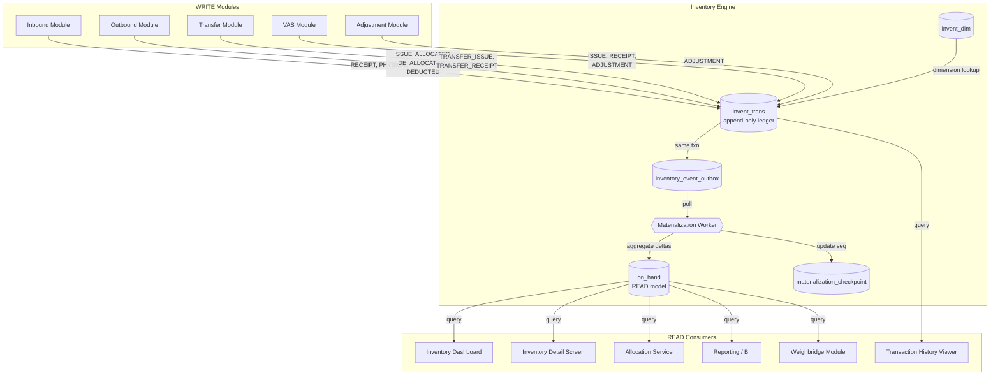
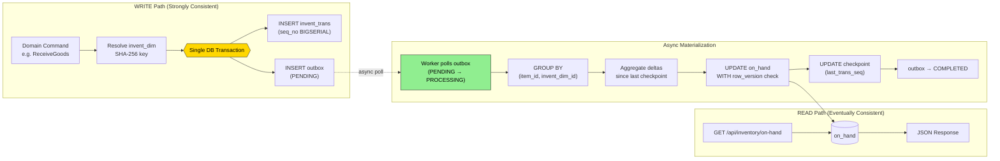
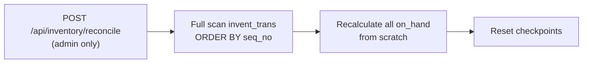
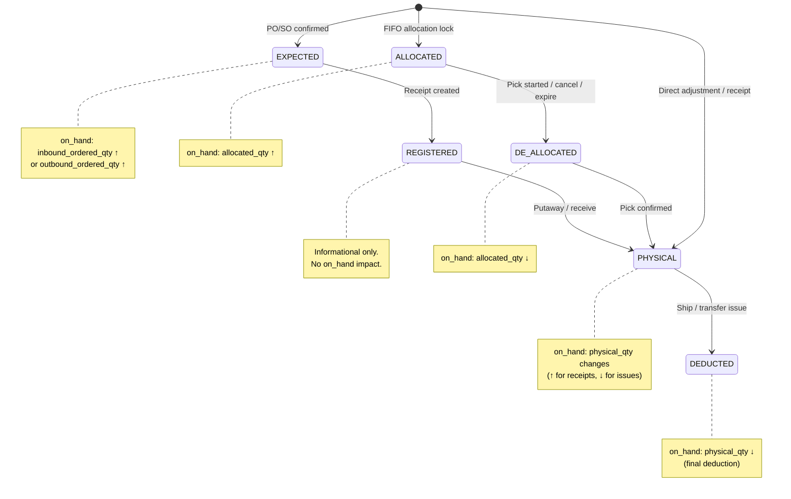
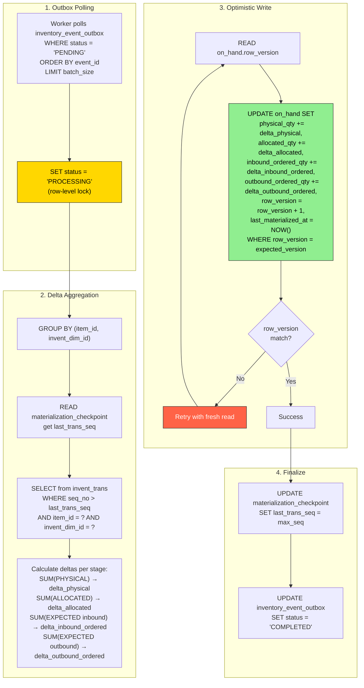
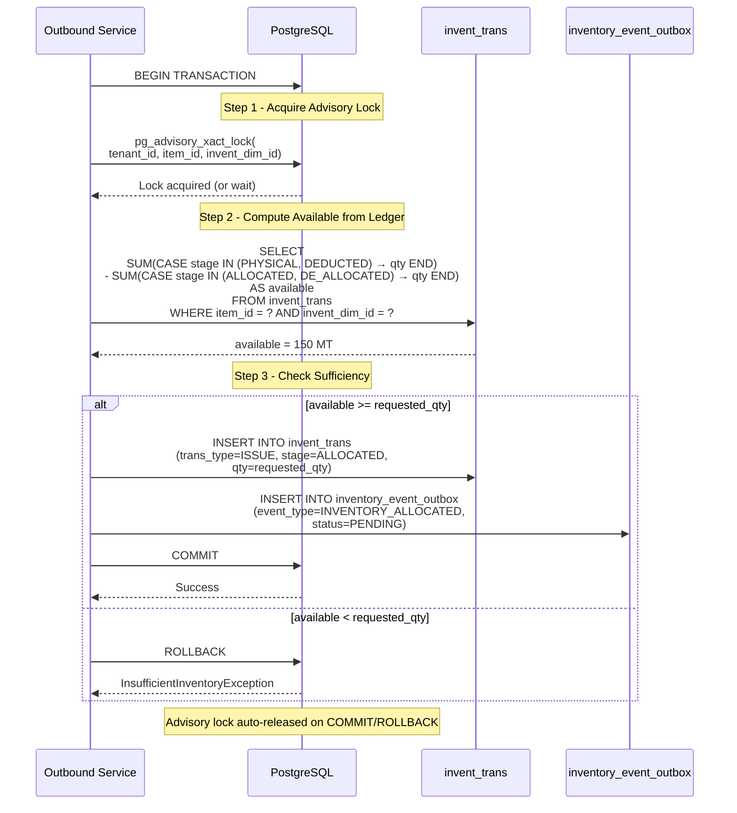

# 02 - Inventory Engine Data Flow

> **Implementation Notes (TASK 0):**
> - `InventTrans` uses `AppendOnlyEntity` base class (Id, TenantId, CreatedTime, CreatedBy — no update/delete).
> - `OnHand` and `InventDim` use `TenantEntity` base class.
> - Schema: `inv` (DatabaseConstants.Schemas.Inventory)
> - `MaterializationCheckpoint` has composite PK: (TenantId, ItemId, InventDimId)

> **Golden Rule**: ALL inventory changes flow through `invent_trans` -- no direct `on_hand` updates, ever.

---

## 1. Context Diagram

Shows the Inventory Engine as the central hub with all modules that write or read inventory data.



---

## 2. Event-Sourced Architecture Diagram

The system follows an event-sourced pattern: WRITE path is append-only to `invent_trans`, then async materialization produces the `on_hand` READ model.



### Disaster Recovery: Full Rebuild



---

## 3. InventTrans Stage Flow

State diagram showing the lifecycle stages of inventory transactions and their `on_hand` impact.



### Stage-to-on_hand Mapping (Quick Reference)

| Stage | on_hand Field Affected | Direction | Triggered When |
|-------|----------------------|-----------|----------------|
| `EXPECTED` | `inbound_ordered_qty` or `outbound_ordered_qty` | +/- | PO/SO confirmed |
| `REGISTERED` | _(none -- informational)_ | -- | Receipt document created |
| `ALLOCATED` | `allocated_qty` | + | FIFO allocation lock acquired |
| `DE_ALLOCATED` | `allocated_qty` | - | Pick started, cancel, or allocation expired |
| `PHYSICAL` | `physical_qty` | +/- | Receipt, putaway, pick, load, adjust |
| `DEDUCTED` | `physical_qty` | - | Ship confirm, transfer issue |

---

## 4. Transaction Type Matrix

Which module creates which `trans_type` + `stage` combinations.

| Module | Operation | trans_type | stage | on_hand Impact | Notes |
|--------|-----------|-----------|-------|----------------|-------|
| **Inbound** | PO confirmed | `RECEIPT` | `EXPECTED` | `inbound_ordered_qty` + | Ordered qty reserved |
| **Inbound** | Receipt created | `RECEIPT` | `REGISTERED` | _(none)_ | Informational |
| **Inbound** | Goods received | `RECEIPT` | `PHYSICAL` | `physical_qty` + at RECV loc | `inbound_ordered_qty` - |
| **Inbound** | Putaway | `RECEIPT` | `PHYSICAL` | `physical_qty` - at RECV, + at STORAGE | Location pair |
| **Outbound** | SO approved | `ISSUE` | `EXPECTED` | `outbound_ordered_qty` + | Demand registered |
| **Outbound** | Allocation | `ISSUE` | `ALLOCATED` | `allocated_qty` + | Advisory lock held |
| **Outbound** | Pick started | `ISSUE` | `DE_ALLOCATED` | `allocated_qty` - | Allocation released |
| **Outbound** | Pick confirmed | `ISSUE` | `PHYSICAL` | `physical_qty` - at STORAGE, + at STAGING | Location pair |
| **Outbound** | Load | `ISSUE` | `PHYSICAL` | `physical_qty` - at STAGING, + at SHIPPING | Location pair |
| **Outbound** | Ship confirm | `ISSUE` | `DEDUCTED` | `physical_qty` - at SHIPPING | Final deduction |
| **Transfer** | Transfer ship | `TRANSFER_ISSUE` | `DEDUCTED` | `physical_qty` - at source | Source warehouse |
| **Transfer** | Transfer receive | `TRANSFER_RECEIPT` | `PHYSICAL` | `physical_qty` + at destination | Destination warehouse |
| **Transfer** | Transit loss | `ADJUSTMENT` | `PHYSICAL` | _(correction)_ | Discrepancy handling |
| **VAS** | Bulk consumed | `ISSUE` | `DEDUCTED` | `physical_qty` - | Raw material consumed |
| **VAS** | Bagged produced | `RECEIPT` | `PHYSICAL` | `physical_qty` + | Finished goods created |
| **VAS** | Waste/loss | `ADJUSTMENT` | `PHYSICAL` | `physical_qty` - | Production waste |
| **Adjustment** | Manual correction | `ADJUSTMENT` | `PHYSICAL` | `physical_qty` +/- | Requires approval workflow |
| **Adjustment** | Status change | `STATUS_CHANGE` | `PHYSICAL` | `physical_qty` +/- across statuses | e.g. AVAILABLE -> DAMAGED |

---

## 5. on_hand Materialization Flow

Detailed flow of the async worker that transforms `invent_trans` events into the `on_hand` READ model.



### Materialization Guarantees

| Property | Mechanism |
|----------|-----------|
| **Idempotency** | `external_id` on `invent_trans` prevents duplicate inserts |
| **Ordering** | `seq_no BIGSERIAL` ensures strict ordering within a tenant |
| **At-least-once delivery** | Outbox pattern with status transitions `PENDING -> PROCESSING -> COMPLETED/FAILED` |
| **Concurrency safety** | `row_version` optimistic locking on `on_hand` prevents lost updates |
| **Checkpoint resumption** | `materialization_checkpoint.last_trans_seq` allows worker restart without reprocessing |
| **Full rebuild** | Admin endpoint recalculates all `on_hand` from `invent_trans` (disaster recovery) |

---

## 6. Allocation Concurrency Diagram

Allocation requires **strong consistency** -- it bypasses the eventual-consistency READ model and computes directly from `invent_trans`.



### Why Advisory Lock Instead of on_hand?

| Approach | Problem |
|----------|---------|
| Check `on_hand` then allocate | **Race condition**: on_hand is eventually consistent, two allocations could both see "enough" |
| `SELECT FOR UPDATE` on `on_hand` | Table-level contention, blocks reads |
| **Advisory lock + compute from ledger** | Lock is scoped to (tenant, item, dim); computation from source of truth; no read blocking |

### FIFO Allocation Order

The allocation service selects inventory in FIFO order based on `posted_at` of the `PHYSICAL` stage entries:

```
ORDER BY invent_trans.posted_at ASC
WHERE stage = 'PHYSICAL'
  AND trans_type = 'RECEIPT'
```

---

## 7. Data Flow Table

Detailed per-operation data flow showing source, target, and the exact inventory impact.

### 7.1 Inbound Operations

| # | Operation | Trigger | invent_trans INSERT | on_hand Impact | Outbox Event |
|---|-----------|---------|-------------------|----------------|--------------|
| 1 | PO Confirmed | PO approval | `trans_type=RECEIPT, stage=EXPECTED, qty=+ordered_qty` | `inbound_ordered_qty` + | `PO_CONFIRMED` |
| 2 | Receipt Created | GRN creation | `trans_type=RECEIPT, stage=REGISTERED, qty=+received_qty` | _(none)_ | `RECEIPT_CREATED` |
| 3 | Goods Received | Weighbridge confirm | `trans_type=RECEIPT, stage=PHYSICAL, qty=+received_qty` at RECV location | `physical_qty` + (RECV), `inbound_ordered_qty` - | `GOODS_RECEIVED` |
| 4 | Putaway | Putaway confirm | Two entries: `PHYSICAL, qty=-putaway_qty` at RECV + `PHYSICAL, qty=+putaway_qty` at STORAGE | `physical_qty` - (RECV), + (STORAGE) | `PUTAWAY_COMPLETED` |

### 7.2 Outbound Operations

| # | Operation | Trigger | invent_trans INSERT | on_hand Impact | Outbox Event |
|---|-----------|---------|-------------------|----------------|--------------|
| 5 | SO Approved | SO approval | `trans_type=ISSUE, stage=EXPECTED, qty=+ordered_qty` | `outbound_ordered_qty` + | `SO_APPROVED` |
| 6 | Allocation | Allocation service | `trans_type=ISSUE, stage=ALLOCATED, qty=+alloc_qty` | `allocated_qty` + | `INVENTORY_ALLOCATED` |
| 7 | Pick Start | Wave release | `trans_type=ISSUE, stage=DE_ALLOCATED, qty=+pick_qty` | `allocated_qty` - | `PICK_STARTED` |
| 8 | Pick Confirm | Picker confirm | Two entries: `PHYSICAL, qty=-pick_qty` at STORAGE + `PHYSICAL, qty=+pick_qty` at STAGING | `physical_qty` - (STORAGE), + (STAGING) | `PICK_CONFIRMED` |
| 9 | Load | Loading confirm | Two entries: `PHYSICAL, qty=-load_qty` at STAGING + `PHYSICAL, qty=+load_qty` at SHIPPING | `physical_qty` - (STAGING), + (SHIPPING) | `LOAD_COMPLETED` |
| 10 | Ship Confirm | Ship out | `trans_type=ISSUE, stage=DEDUCTED, qty=+ship_qty` at SHIPPING | `physical_qty` - (SHIPPING), `outbound_ordered_qty` - | `SHIPMENT_CONFIRMED` |

### 7.3 Transfer Operations

| # | Operation | Trigger | invent_trans INSERT | on_hand Impact | Outbox Event |
|---|-----------|---------|-------------------|----------------|--------------|
| 11 | Transfer Ship | Transfer out | `trans_type=TRANSFER_ISSUE, stage=DEDUCTED, qty=+qty` | `physical_qty` - (source WH) | `TRANSFER_SHIPPED` |
| 12 | Transfer Receive | Transfer in | `trans_type=TRANSFER_RECEIPT, stage=PHYSICAL, qty=+qty` | `physical_qty` + (dest WH) | `TRANSFER_RECEIVED` |
| 13 | Transit Loss | Discrepancy | `trans_type=ADJUSTMENT, stage=PHYSICAL, qty=-loss_qty` | `physical_qty` correction | `TRANSFER_LOSS` |

### 7.4 VAS Operations

| # | Operation | Trigger | invent_trans INSERT | on_hand Impact | Outbox Event |
|---|-----------|---------|-------------------|----------------|--------------|
| 14 | Bulk Consumed | VAS start | `trans_type=ISSUE, stage=DEDUCTED, qty=+consumed_qty` | `physical_qty` - (bulk item) | `VAS_CONSUMED` |
| 15 | Bagged Produced | VAS complete | `trans_type=RECEIPT, stage=PHYSICAL, qty=+produced_qty` | `physical_qty` + (bagged item) | `VAS_PRODUCED` |
| 16 | Production Waste | VAS reconcile | `trans_type=ADJUSTMENT, stage=PHYSICAL, qty=-waste_qty` | `physical_qty` - | `VAS_WASTE` |

### 7.5 Adjustment Operations

| # | Operation | Trigger | invent_trans INSERT | on_hand Impact | Outbox Event |
|---|-----------|---------|-------------------|----------------|--------------|
| 17 | Manual Adjust (+) | Approved adjustment | `trans_type=ADJUSTMENT, stage=PHYSICAL, qty=+adj_qty` | `physical_qty` + | `ADJUSTMENT_APPLIED` |
| 18 | Manual Adjust (-) | Approved adjustment | `trans_type=ADJUSTMENT, stage=PHYSICAL, qty=-adj_qty` | `physical_qty` - | `ADJUSTMENT_APPLIED` |
| 19 | Status Change | Status update | `trans_type=STATUS_CHANGE, stage=PHYSICAL` (two entries: -old_dim, +new_dim) | `physical_qty` - (old status dim), + (new status dim) | `STATUS_CHANGED` |

---

## 8. Frontend Guide

### 8.1 Inventory Screens

| Screen | Data Source | Key Queries | Refresh Strategy |
|--------|------------|-------------|------------------|
| **Inventory Dashboard** | `on_hand` | Aggregated by warehouse, owner, item | Poll every 30s or WebSocket push |
| **Inventory Detail** | `on_hand` | Per location, lot, inventory status | On-demand with pull-to-refresh |
| **Transaction History** | `invent_trans` | Filtered by item, date range, trans_type | Paginated, on-demand |
| **Adjustment Form** | `inventory_adjustment` | Current adjustment + approval status | Real-time during workflow |

### 8.2 on_hand Query Patterns

```typescript
// Dashboard: summary by warehouse
GET /api/inventory/on-hand?group_by=warehouse_id&item_id={id}
// Response shape:
{
  data: [{
    warehouse_id: string,
    warehouse_name: string,
    physical_qty: number,
    physical_qty_mt: number,
    reserved_qty: number,
    allocated_qty: number,
    available_qty: number,        // physical - allocated - reserved
    inbound_ordered_qty: number,
    outbound_ordered_qty: number
  }]
}

// Detail: per location/lot
GET /api/inventory/on-hand?warehouse_id={wh}&item_id={id}&group_by=location_id,lot_id
// Response includes invent_dim breakdown

// Transaction history: paginated
GET /api/inventory/transactions?item_id={id}&from_date={d}&to_date={d}&trans_type=RECEIPT&page=1&page_size=50
// Response shape:
{
  data: [{
    seq_no: number,
    trans_type: string,
    stage: string,
    qty: number,
    qty_mt: number,
    reference_type: string,     // e.g. "INBOUND_ORDER"
    reference_id: string,
    posted_at: string,
    location_name: string,
    lot_id: string | null,
    is_nominal: boolean
  }],
  pagination: { page, page_size, total_count }
}
```

### 8.3 Adjustment Workflow UI

```
┌─────────────┐     ┌──────────────┐     ┌──────────────┐     ┌──────────────┐
│  DRAFT      │────>│  SUBMITTED   │────>│  APPROVED    │────>│  APPLIED     │
│  (editable) │     │  (pending)   │     │  (auto-post) │     │  (done)      │
└─────────────┘     └──────────────┘     └──────────────┘     └──────────────┘
                           │
                           v
                    ┌──────────────┐
                    │  REJECTED    │
                    │  (reason)    │
                    └──────────────┘
```

- **Adjustment Form** fields: item, warehouse, location, lot (optional), qty change, reason code, notes
- On `APPROVED`: backend auto-posts `invent_trans` with `trans_type=ADJUSTMENT, stage=PHYSICAL`
- UI should show `on_hand` before/after preview using current `on_hand` + pending adjustment qty

### 8.4 Inventory Status Colors

| Status | Color | Meaning |
|--------|-------|---------|
| `AVAILABLE` | Green | Normal, allocatable inventory |
| `DAMAGED` | Red | Cannot be allocated |
| `BLOCKED` | Orange | Held for inspection/QC |
| `IN_TRANSIT` | Blue | Between warehouses |

---

## 9. Backend Guide

### 9.1 InventTrans Posting Pattern

Every inventory mutation follows the same pattern: insert into `invent_trans` and `inventory_event_outbox` in a single transaction.

```csharp
// Canonical posting pattern - used by ALL modules
public class InventTransService
{
    public async Task PostAsync(PostInventTransCommand cmd, CancellationToken ct)
    {
        // 1. Resolve or create invent_dim
        var dimId = await _inventDimService.ResolveAsync(new InventDimKey(
            cmd.SiteId,
            cmd.WarehouseId,
            cmd.LocationId,
            cmd.OwnerId,
            cmd.InventoryStatus,
            cmd.LotId
        ), ct);
        // invent_dim.id = SHA-256(site_id|warehouse_id|location_id|owner_id|status|lot_id)

        // 2. Begin transaction (unit of work)
        await using var transaction = await _unitOfWork.BeginTransactionAsync(ct);

        // 3. Insert invent_trans (append-only, NEVER update/delete)
        var trans = new InventTrans
        {
            ExternalId = cmd.IdempotencyKey,     // prevents duplicate processing
            BatchId = cmd.BatchId,                // groups related entries
            ItemId = cmd.ItemId,
            InventDimId = dimId,
            TransType = cmd.TransType,            // RECEIPT, ISSUE, ADJUSTMENT, etc.
            Stage = cmd.Stage,                    // EXPECTED, PHYSICAL, ALLOCATED, etc.
            Qty = cmd.Qty,
            QtyMt = cmd.QtyMt,
            ReferenceType = cmd.ReferenceType,    // e.g. "INBOUND_ORDER"
            ReferenceId = cmd.ReferenceId,
            PostedAt = _clock.UtcNow,
            IsNominal = cmd.IsNominal             // true for informational entries
        };
        _dbContext.InventTrans.Add(trans);

        // 4. Insert outbox event (same transaction)
        var outboxEvent = new InventoryEventOutbox
        {
            TenantId = cmd.TenantId,
            BatchId = cmd.BatchId,
            EventType = cmd.EventType,
            Payload = JsonSerializer.Serialize(new {
                trans.ItemId,
                trans.InventDimId,
                trans.TransType,
                trans.Stage,
                trans.Qty,
                trans.QtyMt
            }),
            Status = OutboxStatus.PENDING
        };
        _dbContext.InventoryEventOutbox.Add(outboxEvent);

        // 5. Commit atomically
        await _unitOfWork.SaveChangesAsync(ct);
        await transaction.CommitAsync(ct);
    }
}
```

### 9.2 Location Pair Pattern

Operations that move inventory between locations (putaway, pick, load) insert **two** `invent_trans` entries in the same batch:

```csharp
// Example: Putaway (RECV → STORAGE)
var batchId = Guid.NewGuid();

// Entry 1: Decrease at source
await _inventTransService.PostAsync(new PostInventTransCommand
{
    BatchId = batchId,
    ItemId = itemId,
    LocationId = recvLocationId,         // source
    TransType = TransType.RECEIPT,
    Stage = Stage.PHYSICAL,
    Qty = -putawayQty,                   // negative = decrease
    QtyMt = -putawayQtyMt,
    ReferenceType = "INBOUND_ORDER",
    ReferenceId = inboundOrderId,
    EventType = "PUTAWAY_COMPLETED"
}, ct);

// Entry 2: Increase at destination
await _inventTransService.PostAsync(new PostInventTransCommand
{
    BatchId = batchId,
    ItemId = itemId,
    LocationId = storageLocationId,      // destination
    TransType = TransType.RECEIPT,
    Stage = Stage.PHYSICAL,
    Qty = +putawayQty,                   // positive = increase
    QtyMt = +putawayQtyMt,
    ReferenceType = "INBOUND_ORDER",
    ReferenceId = inboundOrderId,
    EventType = "PUTAWAY_COMPLETED"
}, ct);
// Both entries share the same batch_id for traceability
```

### 9.3 Materialization Worker

Background service that processes the outbox and updates `on_hand`.

```csharp
public class MaterializationWorker : BackgroundService
{
    protected override async Task ExecuteAsync(CancellationToken ct)
    {
        while (!ct.IsCancellationRequested)
        {
            // 1. Poll pending outbox events
            var events = await _outboxRepo.GetPendingAsync(batchSize: 100, ct);
            if (!events.Any())
            {
                await Task.Delay(TimeSpan.FromMilliseconds(500), ct);
                continue;
            }

            // 2. Mark as PROCESSING
            await _outboxRepo.MarkProcessingAsync(events.Select(e => e.EventId), ct);

            // 3. Group by (item_id, invent_dim_id) for efficient aggregation
            var groups = events
                .SelectMany(e => JsonSerializer.Deserialize<InventoryEventPayload>(e.Payload))
                .GroupBy(p => (p.ItemId, p.InventDimId));

            foreach (var group in groups)
            {
                await MaterializeGroupAsync(group.Key, ct);
            }

            // 4. Mark as COMPLETED
            await _outboxRepo.MarkCompletedAsync(events.Select(e => e.EventId), ct);
        }
    }

    private async Task MaterializeGroupAsync(
        (Guid ItemId, Guid InventDimId) key, CancellationToken ct)
    {
        // Read checkpoint
        var checkpoint = await _checkpointRepo.GetAsync(
            key.ItemId, key.InventDimId, ct);
        var lastSeq = checkpoint?.LastTransSeq ?? 0;

        // Aggregate deltas from invent_trans since last checkpoint
        var deltas = await _inventTransRepo.AggregateDeltasAsync(
            key.ItemId, key.InventDimId, lastSeq, ct);

        // Optimistic update with row_version
        var success = false;
        while (!success)
        {
            var onHand = await _onHandRepo.GetAsync(
                key.ItemId, key.InventDimId, ct);

            if (onHand == null)
            {
                onHand = new OnHand
                {
                    ItemId = key.ItemId,
                    InventDimId = key.InventDimId
                };
                _dbContext.OnHand.Add(onHand);
            }

            onHand.PhysicalQty += deltas.PhysicalDelta;
            onHand.AllocatedQty += deltas.AllocatedDelta;
            onHand.InboundOrderedQty += deltas.InboundOrderedDelta;
            onHand.OutboundOrderedQty += deltas.OutboundOrderedDelta;
            onHand.LastMaterializedAt = _clock.UtcNow;
            // row_version incremented by EF Core concurrency token

            try
            {
                await _dbContext.SaveChangesAsync(ct);
                success = true;
            }
            catch (DbUpdateConcurrencyException)
            {
                // Retry with fresh read
                _dbContext.Entry(onHand).Reload();
            }
        }

        // Update checkpoint
        await _checkpointRepo.UpsertAsync(
            key.ItemId, key.InventDimId, deltas.MaxSeqNo, ct);
    }
}
```

### 9.4 Allocation Service

```csharp
public class AllocationService
{
    public async Task<AllocationResult> AllocateAsync(
        AllocateCommand cmd, CancellationToken ct)
    {
        await using var transaction = await _unitOfWork.BeginTransactionAsync(ct);

        // 1. Advisory lock scoped to (tenant, item, dim)
        await _dbContext.Database.ExecuteSqlRawAsync(
            "SELECT pg_advisory_xact_lock({0}, {1})",
            HashCombine(cmd.TenantId, cmd.ItemId),
            cmd.InventDimId.GetHashCode(),
            ct);

        // 2. Compute available directly from invent_trans (NOT on_hand)
        var available = await _inventTransRepo.ComputeAvailableAsync(
            cmd.ItemId, cmd.InventDimId, ct);
        // available = SUM(PHYSICAL + DEDUCTED) - SUM(ALLOCATED + DE_ALLOCATED)

        if (available < cmd.RequestedQty)
        {
            await transaction.RollbackAsync(ct);
            return AllocationResult.InsufficientInventory(available);
        }

        // 3. Post ALLOCATED invent_trans
        await _inventTransService.PostAsync(new PostInventTransCommand
        {
            ItemId = cmd.ItemId,
            InventDimId = cmd.InventDimId,
            TransType = TransType.ISSUE,
            Stage = Stage.ALLOCATED,
            Qty = cmd.RequestedQty,
            QtyMt = cmd.RequestedQtyMt,
            ReferenceType = "SALES_ORDER",
            ReferenceId = cmd.SalesOrderId,
            EventType = "INVENTORY_ALLOCATED"
        }, ct);

        await transaction.CommitAsync(ct);
        return AllocationResult.Success(cmd.RequestedQty);
    }
}
```

### 9.5 Partitioning Strategy

```sql
-- invent_trans: RANGE partition by (tenant_id, posted_at) monthly
CREATE TABLE invent_trans (
    seq_no      BIGSERIAL,
    tenant_id   UUID NOT NULL,
    posted_at   TIMESTAMPTZ NOT NULL,
    -- ... other columns
) PARTITION BY RANGE (tenant_id, posted_at);

-- Create monthly partitions
CREATE TABLE invent_trans_t1_2026_03
    PARTITION OF invent_trans
    FOR VALUES FROM ('tenant-1-uuid', '2026-03-01') TO ('tenant-1-uuid', '2026-04-01');

-- on_hand: LIST partition by tenant_id
CREATE TABLE on_hand (
    item_id         UUID NOT NULL,
    invent_dim_id   UUID NOT NULL,
    tenant_id       UUID NOT NULL,
    -- ... qty columns
) PARTITION BY LIST (tenant_id);

-- Outbox: retention policy (purge COMPLETED after 7 days)
DELETE FROM inventory_event_outbox
WHERE status = 'COMPLETED'
  AND created_at < NOW() - INTERVAL '7 days';
```

### 9.6 Key Indexes

```sql
-- invent_trans: primary query patterns
CREATE INDEX ix_invent_trans_item_dim_seq
    ON invent_trans (item_id, invent_dim_id, seq_no);

CREATE UNIQUE INDEX ix_invent_trans_external_id
    ON invent_trans (external_id);  -- idempotency

CREATE INDEX ix_invent_trans_reference
    ON invent_trans (reference_type, reference_id);

-- on_hand: dashboard and detail queries
CREATE INDEX ix_on_hand_item_dim
    ON on_hand (item_id, invent_dim_id);

-- outbox: worker polling
CREATE INDEX ix_outbox_status_pending
    ON inventory_event_outbox (status, event_id)
    WHERE status = 'PENDING';

-- checkpoint: worker lookup
CREATE UNIQUE INDEX ix_checkpoint_item_dim
    ON materialization_checkpoint (tenant_id, item_id, invent_dim_id);
```
