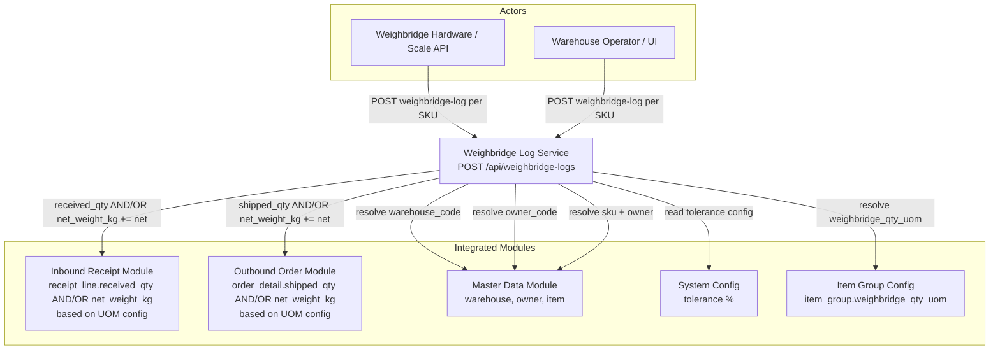
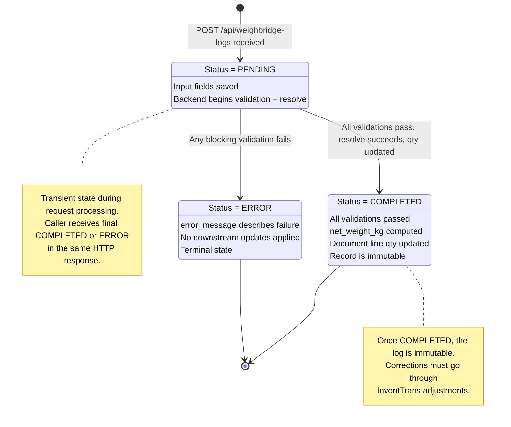
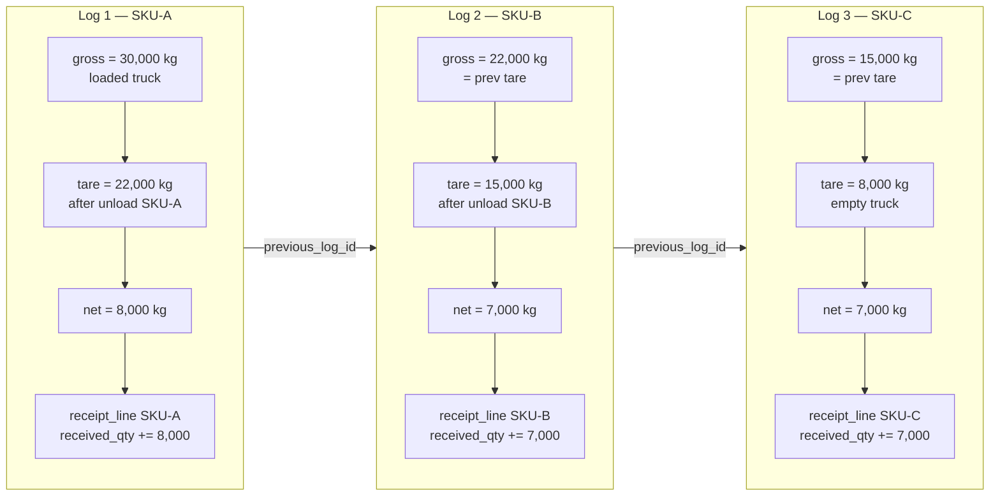
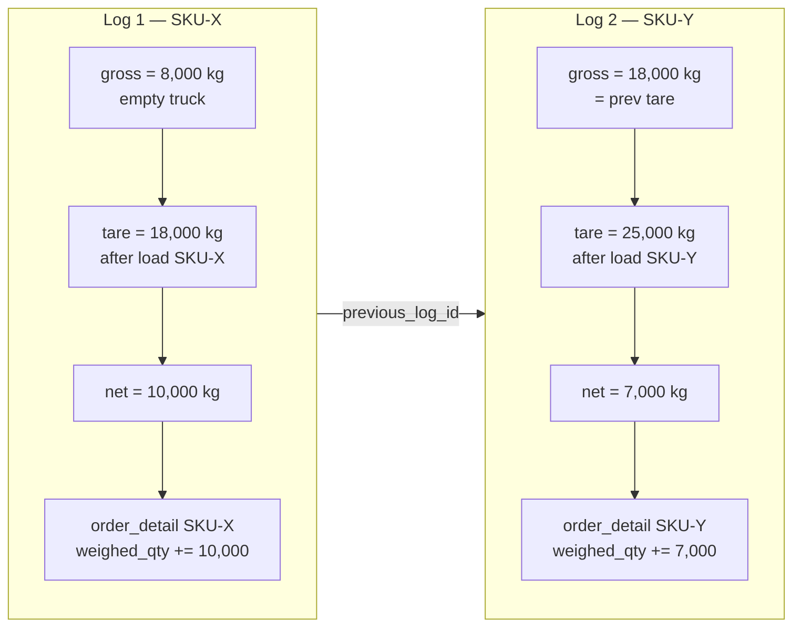

# Data Flow Diagram: Weighbridge Operations (v5)

> **Module**: Weighbridge (Phase 3)
> **Version**: 5.0
> **Date**: 2026-03-13
> **Schema**: `ops`
> **Breaking Change**: Per-line weighing model replaces per-session model. `weighing_attempt` table removed.
> **v5 Change**: UOM-based weighbridge update logic. Quantity fields (`received_qty`/`shipped_qty`) are only updated when `line.uom` matches `item_group.weighbridge_qty_uom`; otherwise only `net_weight_kg` is updated on the document line.

---

## 1. Context Diagram

High-level view of the Weighbridge module, its actors, and integrated modules.



---

## 2. Process Flow Diagram

Complete flow from API call to COMPLETED or ERROR status.

```mermaid
flowchart TD
    START([POST /api/weighbridge-logs<br/>Input: document_number, sku,<br/>gross_weight_kg, tare_weight_kg,<br/>vehicle_plate, warehouse_code,<br/>owner_code, type?]) --> V_BASIC

    V_BASIC{V1: gross > 0<br/>AND tare > 0?}
    V_BASIC -- No --> ERR1[ERROR: INVALID_WEIGHT]
    V_BASIC -- Yes --> V_NET

    V_NET{V2: gross ≠ tare?}
    V_NET -- No --> ERR2[ERROR: NET_WEIGHT_ZERO]
    V_NET -- Yes --> AUTO_TYPE

    AUTO_TYPE{Type provided?}
    AUTO_TYPE -- Yes --> USE_TYPE[Use provided type]
    AUTO_TYPE -- No --> DETECT_TYPE{gross > tare?}
    DETECT_TYPE -- Yes --> SET_INBOUND[type = INBOUND]
    DETECT_TYPE -- No --> SET_OUTBOUND[type = OUTBOUND]

    USE_TYPE --> COMPUTE
    SET_INBOUND --> COMPUTE
    SET_OUTBOUND --> COMPUTE

    COMPUTE[Compute net_weight_kg<br/>= |gross - tare|]

    COMPUTE --> RESOLVE_WH{V3: warehouse_code<br/>exists?}
    RESOLVE_WH -- No --> ERR3[ERROR: WAREHOUSE_NOT_FOUND]
    RESOLVE_WH -- Yes --> RESOLVE_OWNER{V4: owner_code<br/>exists?}

    RESOLVE_OWNER -- No --> ERR4[ERROR: OWNER_NOT_FOUND]
    RESOLVE_OWNER -- Yes --> RESOLVE_ITEM{V5: sku exists<br/>for owner?}

    RESOLVE_ITEM -- No --> ERR5[ERROR: ITEM_NOT_FOUND]
    RESOLVE_ITEM -- Yes --> RESOLVE_DOC{V6: document_number<br/>exists for warehouse?}

    RESOLVE_DOC -- No --> ERR6[ERROR: DOCUMENT_NOT_FOUND]
    RESOLVE_DOC -- Yes --> RESOLVE_LINE{V7: SKU in<br/>document lines?}

    RESOLVE_LINE -- No --> ERR7[ERROR: LINE_NOT_FOUND]
    RESOLVE_LINE -- Yes --> CHECK_VEHICLE{V8: vehicle_plate<br/>matches document?}

    CHECK_VEHICLE -- No --> ERR8[ERROR: VEHICLE_MISMATCH]
    CHECK_VEHICLE -- Yes --> CASCADE_CHECK

    CASCADE_CHECK[Find previous log<br/>same document_number + vehicle_plate]
    CASCADE_CHECK --> HAS_PREV{Previous log<br/>exists?}

    HAS_PREV -- Yes --> CHAIN_VALID{V10: gross ≈ prev.tare<br/>within ±50kg?}
    HAS_PREV -- No --> SET_SEQ1[sequence_no = 1<br/>previous_log_id = null]

    CHAIN_VALID -- No --> WARN_CHAIN[WARNING: CHAIN_WEIGHT_MISMATCH<br/>non-blocking]
    CHAIN_VALID -- Yes --> SET_SEQ_N[sequence_no = prev.sequence_no + 1<br/>previous_log_id = prev.log_id]
    WARN_CHAIN --> SET_SEQ_N

    SET_SEQ1 --> RESOLVE_UOM
    SET_SEQ_N --> RESOLVE_UOM

    RESOLVE_UOM[Resolve item_group.weighbridge_qty_uom]
    RESOLVE_UOM --> CHECK_UOM{line.uom =<br/>weighbridge_qty_uom?}

    CHECK_UOM -- Yes UOM match --> UOM_MATCH_DIR{Direction?}
    UOM_MATCH_DIR -- INBOUND --> UPD_INB_BOTH[receipt_line.received_qty += net_weight_kg<br/>receipt_line.net_weight_kg += net_weight_kg]
    UOM_MATCH_DIR -- OUTBOUND --> UPD_OUT_BOTH[order_detail.shipped_qty += net_weight_kg<br/>order_detail.net_weight_kg += net_weight_kg]

    CHECK_UOM -- No UOM mismatch --> UOM_MISMATCH_DIR{Direction?}
    UOM_MISMATCH_DIR -- INBOUND --> UPD_INB_NET[receipt_line.net_weight_kg<br/>+= net_weight_kg only]
    UOM_MISMATCH_DIR -- OUTBOUND --> UPD_OUT_NET[order_detail.net_weight_kg<br/>+= net_weight_kg only]

    UPD_INB_BOTH --> TOLERANCE
    UPD_OUT_BOTH --> TOLERANCE
    UPD_INB_NET --> TOLERANCE
    UPD_OUT_NET --> TOLERANCE

    TOLERANCE{V11: Running SUM net<br/>vs expected_qty<br/>exceeds tolerance %?}
    TOLERANCE -- Yes --> WARN_TOL[WARNING: TOLERANCE_EXCEEDED<br/>non-blocking]
    TOLERANCE -- No --> COMPLETE

    WARN_TOL --> COMPLETE
    COMPLETE[Status = COMPLETED<br/>Return log_number, type,<br/>net_weight_kg, running_total_kg,<br/>tolerance_status, chain info]

    ERR1 --> ERROR_END[Status = ERROR<br/>error_message populated]
    ERR2 --> ERROR_END
    ERR3 --> ERROR_END
    ERR4 --> ERROR_END
    ERR5 --> ERROR_END
    ERR6 --> ERROR_END
    ERR7 --> ERROR_END
    ERR8 --> ERROR_END
```

---

## 3. State Machine Diagram

Lifecycle states of a `weighbridge_log` record.



---

## 4. Cascading Weighing Diagram

Multi-SKU weighing chains showing how a single vehicle unloads/loads multiple SKUs via cascading logs.

### 4a. Inbound Cascading (3 SKUs)



### 4b. Outbound Cascading (2 SKUs)



### Chain Integrity Rule

Each subsequent log's `gross_weight_kg` must equal the previous log's `tare_weight_kg` within a **±50 kg** tolerance. If violated, a non-blocking `CHAIN_WEIGHT_MISMATCH` warning is attached but the log is still processed.

---

## 5. Data Flow Table

### Step 1: Receive API Request and Validate Basic Fields

| Aspect | Detail |
|--------|--------|
| **Input** | `document_number`, `sku`, `gross_weight_kg`, `tare_weight_kg`, `vehicle_plate`, `warehouse_code`, `owner_code`, `type` (optional), `notes` (optional) |
| **Process** | V1: gross > 0 AND tare > 0. V2: gross != tare. |
| **Output** | Validated raw input or ERROR (INVALID_WEIGHT / NET_WEIGHT_ZERO) |
| **Data Store** | INSERT `weighbridge_log` with status=PENDING |

### Step 2: Auto-Detect Type and Compute Net Weight

| Aspect | Detail |
|--------|--------|
| **Input** | Validated gross_weight_kg, tare_weight_kg, type (optional) |
| **Process** | If type not provided: gross > tare -> INBOUND, gross < tare -> OUTBOUND. Compute net_weight_kg = \|gross - tare\|. |
| **Output** | Resolved type (INBOUND/OUTBOUND), net_weight_kg |
| **Data Store** | UPDATE `weighbridge_log` SET type, net_weight_kg |

### Step 3: Resolve Business Keys to Internal IDs

| Aspect | Detail |
|--------|--------|
| **Input** | warehouse_code, owner_code, sku |
| **Process** | V3: warehouse_code -> resolved_warehouse_id. V4: owner_code -> resolved_owner_id. V5: sku + owner -> resolved_item_id. V6: document_number -> inbound_receipt / order_header (by type + warehouse). V7: item_id in document lines. V8: vehicle_plate matches document. |
| **Output** | Resolved IDs (warehouse_id, owner_id, item_id, receipt_line_id or order_detail_id) or ERROR |
| **Data Store** | UPDATE `weighbridge_log` SET resolved_warehouse_id, resolved_owner_id, resolved_item_id, resolved_receipt_line_id / resolved_order_detail_id |

### Step 4: Cascading Chain Check

| Aspect | Detail |
|--------|--------|
| **Input** | document_number, vehicle_plate, gross_weight_kg |
| **Process** | Find latest `weighbridge_log` with same document_number + vehicle_plate. If found: V10 check gross ~= prev.tare (±50 kg). Set sequence_no = prev.sequence_no + 1, previous_log_id = prev.log_id. If not found: sequence_no = 1, previous_log_id = null. |
| **Output** | sequence_no, previous_log_id, chain warning (if applicable) |
| **Data Store** | UPDATE `weighbridge_log` SET sequence_no, previous_log_id |

### Step 5: Update Document Line Quantity and/or Net Weight

| Aspect | Detail |
|--------|--------|
| **Input** | Resolved receipt_line_id or order_detail_id, net_weight_kg, line.uom |
| **Process** | Resolve `item.item_group.weighbridge_qty_uom`. **IF** `line.uom = weighbridge_qty_uom`: INBOUND: `receipt_line.received_qty += net_weight_kg` AND `receipt_line.net_weight_kg += net_weight_kg`. OUTBOUND: `order_detail.shipped_qty += net_weight_kg` AND `order_detail.net_weight_kg += net_weight_kg`. **ELSE** (UOM mismatch): INBOUND: `receipt_line.net_weight_kg += net_weight_kg` only. OUTBOUND: `order_detail.net_weight_kg += net_weight_kg` only. |
| **Output** | Updated line quantity and/or net weight |
| **Data Store** | UPDATE `receipt_line` or `order_detail` (`received_qty`/`shipped_qty` AND/OR `net_weight_kg` based on UOM config) |

### Step 6: Tolerance Check

| Aspect | Detail |
|--------|--------|
| **Input** | Document line expected_qty, running SUM of net_weight_kg across all logs for this line |
| **Process** | Tolerance ALWAYS uses `net_weight_kg`: `SUM(line.net_weight_kg)` vs expected net weight (regardless of UOM config). V11: If SUM(net_weight_kg) > expected_qty * (1 + tolerance%), attach warning TOLERANCE_EXCEEDED. Non-blocking. |
| **Output** | tolerance_status (OK / WARNING), running_total_kg |
| **Data Store** | No mutation. Computed at read time. |

### Step 7: Complete

| Aspect | Detail |
|--------|--------|
| **Input** | All prior steps passed |
| **Process** | Set status = COMPLETED. Generate log_number = WB-YYYYMMDD-SEQ. |
| **Output** | `WeighbridgeLogDto` with log_number, type, net_weight_kg, running_total_kg, tolerance_status, chain info (sequence_no, previous_log_id) |
| **Data Store** | UPDATE `weighbridge_log` SET status=COMPLETED, log_number |

---

## 6. Frontend Guide

### Screen Inventory

| Screen | Route | Purpose |
|--------|-------|---------|
| Weighbridge Log List | `/weighbridge` | All logs with search, filter by document, vehicle, status |
| New Weighbridge Log | `/weighbridge/new` | Form to submit a single weighing (1 SKU per submission) |
| Weighbridge Log Detail | `/weighbridge/logs/{id}` | Full detail of one log including chain info |
| Chain View | `/weighbridge/chain/{document_number}/{vehicle_plate}` | All logs in a cascading chain for one vehicle+document |
| Weighbridge Master | `/master-data/weighbridges` | CRUD for weighbridge configuration |

### New Weighbridge Log Screen

```
+------------------------------------------------------------------+
|  New Weighbridge Log                                              |
+------------------------------------------------------------------+
|                                                                    |
|  Document Number: [______________]   Vehicle Plate: [__________]  |
|  Warehouse:       [______________]   Owner:         [__________]  |
|  SKU:             [______________]   Type:     [Auto-detect  v]   |
|                                                                    |
|  +--------------------------------------------+                   |
|  |        WEIGHT INPUT                         |                   |
|  |                                             |                   |
|  |  Gross Weight (kg): [__________]            |                   |
|  |  Tare Weight (kg):  [__________]            |                   |
|  |                                             |                   |
|  |  Net Weight:  -- (computed after submit)    |                   |
|  +--------------------------------------------+                   |
|                                                                    |
|  Notes: [________________________________________]                |
|                                                                    |
|  [Submit Weighing]                                                |
+------------------------------------------------------------------+
```

### Chain View Screen

```
+------------------------------------------------------------------+
|  Chain: DOC-20260313-001 | Vehicle: 51C-12345                     |
|  Type: INBOUND | Total Net: 22,000 kg                             |
+------------------------------------------------------------------+
|  #  | Log Number           | SKU   | Gross    | Tare     | Net    |
|  1  | WB-20260313-000042   | SKU-A | 30,000   | 22,000   | 8,000  |
|  2  | WB-20260313-000043   | SKU-B | 22,000   | 15,000   | 7,000  |
|  3  | WB-20260313-000044   | SKU-C | 15,000   | 8,000    | 7,000  |
+------------------------------------------------------------------+
|  Chain Integrity: OK                                               |
|  Tolerance Status: OK (22,000 / 25,000 expected = 88%)            |
+------------------------------------------------------------------+
```

### Key Frontend Behaviors

1. **Single API Call Per SKU**
   - Each form submission is one POST /api/weighbridge-logs
   - Frontend shows computed net_weight_kg and chain info in the response
   - No multi-step session -- one request, one response

2. **Auto-Detect Type Indicator**
   - If type dropdown is "Auto-detect", show resolved type in the response
   - Visual indicator: INBOUND = blue tag, OUTBOUND = orange tag

3. **Chain Awareness**
   - After submitting a log, if response shows sequence_no > 1, display chain context
   - Link to chain view for full cascading overview
   - Show warning banner if CHAIN_WEIGHT_MISMATCH warning returned

4. **Tolerance Warning**
   - If response includes tolerance_status = WARNING, show amber banner
   - Text: "Running total (X kg) exceeds expected quantity (Y kg) by Z%. Verify weights."

5. **Hardware Integration**
   - Weighbridge hardware can POST directly to the same endpoint
   - UI can pre-fill gross/tare from hardware via WebSocket or polling
   - integration_mode on weighbridge master determines capture method

6. **Error Handling**
   - If response status = ERROR, display error_message prominently
   - Map error codes to user-friendly messages (e.g., ITEM_NOT_FOUND -> "SKU not found for this owner")

---

## 7. Backend Guide

### API Endpoint

Single endpoint for all weighbridge operations. Shared by UI and hardware integrations.

| Method | Endpoint | Command | Description |
|--------|----------|---------|-------------|
| POST | `/api/weighbridge-logs` | `CreateWeighbridgeLogCommand` | Create and process a single weighing log (1 per SKU) |
| GET | `/api/weighbridge-logs` | `GetWeighbridgeLogsQuery` | List/search logs with filters |
| GET | `/api/weighbridge-logs/{id}` | `GetWeighbridgeLogQuery` | Single log detail |
| GET | `/api/weighbridge-logs/chain` | `GetChainQuery` | Get all logs in a chain (by document_number + vehicle_plate) |

### CreateWeighbridgeLogCommand

```
Input:
  document_number   (required) — inbound receipt number or order number
  sku               (required) — item SKU code
  gross_weight_kg   (required) — decimal > 0
  tare_weight_kg    (required) — decimal > 0
  vehicle_plate     (required) — vehicle license plate
  warehouse_code    (required) — warehouse code
  owner_code        (required) — owner/customer code
  type              (optional) — INBOUND or OUTBOUND (auto-detect if omitted)
  notes             (optional) — free text

Output:
  log_id, log_number, type, net_weight_kg, running_total_kg,
  tolerance_status, sequence_no, previous_log_id,
  status (COMPLETED / ERROR), error_message (if ERROR),
  warnings[] (CHAIN_WEIGHT_MISMATCH, TOLERANCE_EXCEEDED)
```

### Validation Rules

| # | Rule | Error Code | Blocking? |
|---|------|------------|-----------|
| V1 | gross_weight_kg > 0 AND tare_weight_kg > 0 | INVALID_WEIGHT | Yes |
| V2 | gross_weight_kg != tare_weight_kg | NET_WEIGHT_ZERO | Yes |
| V3 | warehouse_code resolves to existing warehouse | WAREHOUSE_NOT_FOUND | Yes |
| V4 | owner_code resolves to existing owner | OWNER_NOT_FOUND | Yes |
| V5 | sku exists for resolved owner | ITEM_NOT_FOUND | Yes |
| V6 | document_number exists for resolved warehouse (receipt or order) | DOCUMENT_NOT_FOUND | Yes |
| V7 | resolved item_id found in document lines | LINE_NOT_FOUND | Yes |
| V8 | vehicle_plate matches document's vehicle | VEHICLE_MISMATCH | Yes |
| V9 | Auto-detect type: gross > tare -> INBOUND, gross < tare -> OUTBOUND | NET_WEIGHT_ZERO | Yes (only when gross = tare) |
| V10 | Cascading chain: gross ~= previous_log.tare (±50 kg) | CHAIN_WEIGHT_MISMATCH | No (warning) |
| V11 | Running total SUM(net) vs line expected_qty exceeds tolerance % | TOLERANCE_EXCEEDED | No (warning) |

### Backend Processing Pipeline (in order)

```
1. Validate basic fields (V1, V2)
2. Auto-detect type if not provided (V9)
3. Compute net_weight_kg = |gross - tare|
4. Resolve warehouse_code -> warehouse_id (V3)
5. Resolve owner_code -> owner_id (V4)
6. Resolve sku + owner -> item_id (V5)
7. Resolve document_number -> receipt/order for warehouse (V6)
8. Find item_id in document lines -> receipt_line_id / order_detail_id (V7)
9. Validate vehicle_plate matches document (V8)
10. Find previous log (same document_number + vehicle_plate, latest by sequence_no)
    - If found: validate cascading (V10), set previous_log_id, sequence_no = prev + 1
    - If not found: sequence_no = 1, previous_log_id = null
11. Resolve item_group.weighbridge_qty_uom for the item
12. Update document line quantity and/or net weight (UOM branching):
    - IF line.uom = weighbridge_qty_uom (UOM match):
      - INBOUND: receipt_line.received_qty += net_weight_kg AND receipt_line.net_weight_kg += net_weight_kg
      - OUTBOUND: order_detail.shipped_qty += net_weight_kg AND order_detail.net_weight_kg += net_weight_kg
    - ELSE (UOM mismatch):
      - INBOUND: receipt_line.net_weight_kg += net_weight_kg only
      - OUTBOUND: order_detail.net_weight_kg += net_weight_kg only
13. Running tolerance check (V11): SUM(net_weight_kg) across all logs for this line vs expected_qty (always uses net_weight_kg regardless of UOM)
14. Generate log_number = WB-YYYYMMDD-SEQ
15. Set status = COMPLETED
16. Return response with log details, chain info, and any warnings
```

### Data Model

#### weighbridge (master table, unchanged)

| Column | Type | Description |
|--------|------|-------------|
| id | UUID | PK |
| code | VARCHAR | Unique weighbridge code |
| warehouse_id | UUID | FK to warehouse |
| max_capacity_kg | DECIMAL | Maximum scale capacity |
| min_weight_kg | DECIMAL | Minimum readable weight |
| scale_division_kg | DECIMAL | Scale precision |
| integration_mode | ENUM | API, SERIAL, MANUAL, MIXED |

#### weighbridge_log (completely redesigned)

| Column | Type | Description |
|--------|------|-------------|
| log_id | UUID | PK |
| tenant_id | UUID | Tenant FK |
| log_number | VARCHAR | Auto: WB-YYYYMMDD-SEQ |
| **Input fields** | | |
| type | ENUM | INBOUND / OUTBOUND (optional on input, resolved by backend) |
| document_number | VARCHAR | Receipt number or order number |
| sku | VARCHAR | Item SKU code |
| gross_weight_kg | DECIMAL | Gross weight from scale/input |
| tare_weight_kg | DECIMAL | Tare weight from scale/input |
| vehicle_plate | VARCHAR | Vehicle license plate |
| warehouse_code | VARCHAR | Warehouse code (input) |
| owner_code | VARCHAR | Owner code (input) |
| notes | TEXT | Free text notes |
| **Computed** | | |
| net_weight_kg | DECIMAL | = \|gross_weight_kg - tare_weight_kg\| |
| **Cascading** | | |
| previous_log_id | UUID | FK self-reference, nullable |
| sequence_no | INT | Position in chain (1-based) |
| **Resolved** | | |
| resolved_warehouse_id | UUID | FK to warehouse |
| resolved_owner_id | UUID | FK to owner |
| resolved_item_id | UUID | FK to item |
| resolved_receipt_line_id | UUID | FK to receipt_line, nullable (INBOUND only) |
| resolved_order_detail_id | UUID | FK to order_detail, nullable (OUTBOUND only) |
| **Status** | | |
| status | ENUM | PENDING -> COMPLETED / ERROR |
| error_message | VARCHAR | Error description when status = ERROR |
| created_at | DATETIME | Record creation timestamp |

#### weighing_attempt — REMOVED

The `weighing_attempt` table is removed in v4. The per-line log model (N logs per document, 1 per SKU) replaces the previous session-based approach with max 3 attempts.

### Entity Relationships

```
weighbridge (master)

weighbridge_log
  |-- self-reference via previous_log_id (cascading chain)
  |-- N:1 --> warehouse (via resolved_warehouse_id)
  |-- N:1 --> owner (via resolved_owner_id)
  |-- N:1 --> item (via resolved_item_id)
  |-- N:1 --> receipt_line (via resolved_receipt_line_id, INBOUND)
  |-- N:1 --> order_detail (via resolved_order_detail_id, OUTBOUND)

inbound_receipt
  |-- 1:N --> receipt_line (has uom, received_qty, net_weight_kg)
                |-- 0:N --> weighbridge_log (received_qty AND/OR net_weight_kg updated by logs based on UOM config)

order_header
  |-- 1:N --> order_detail (has uom, shipped_qty, net_weight_kg)
                |-- 0:N --> weighbridge_log (shipped_qty AND/OR net_weight_kg updated by logs based on UOM config)
```

### Integration with Other Modules

#### Inbound Receipt Integration

```
On COMPLETED (INBOUND):
  1. Resolve document_number -> inbound_receipt (for resolved_warehouse_id)
  2. Find receipt_line where item_id = resolved_item_id
  3. Resolve item.item_group.weighbridge_qty_uom
  4. IF receipt_line.uom = weighbridge_qty_uom:
       receipt_line.received_qty += weighbridge_log.net_weight_kg
       receipt_line.net_weight_kg += weighbridge_log.net_weight_kg
     ELSE:
       receipt_line.net_weight_kg += weighbridge_log.net_weight_kg (only)
  5. Store resolved_receipt_line_id on the log
```

#### Outbound Order Integration

```
On COMPLETED (OUTBOUND):
  1. Resolve document_number -> order_header (for resolved_warehouse_id)
  2. Find order_detail where item_id = resolved_item_id
  3. Resolve item.item_group.weighbridge_qty_uom
  4. IF order_detail.uom = weighbridge_qty_uom:
       order_detail.shipped_qty += weighbridge_log.net_weight_kg
       order_detail.net_weight_kg += weighbridge_log.net_weight_kg
     ELSE:
       order_detail.net_weight_kg += weighbridge_log.net_weight_kg (only)
  5. Store resolved_order_detail_id on the log
```

#### Post-Completion Corrections

```
COMPLETED records are IMMUTABLE.
Any weight corrections must go through:
  InventTrans adjustment (reason_code required)
  This creates a separate adjustment record, not modifying the weighbridge_log.
```
