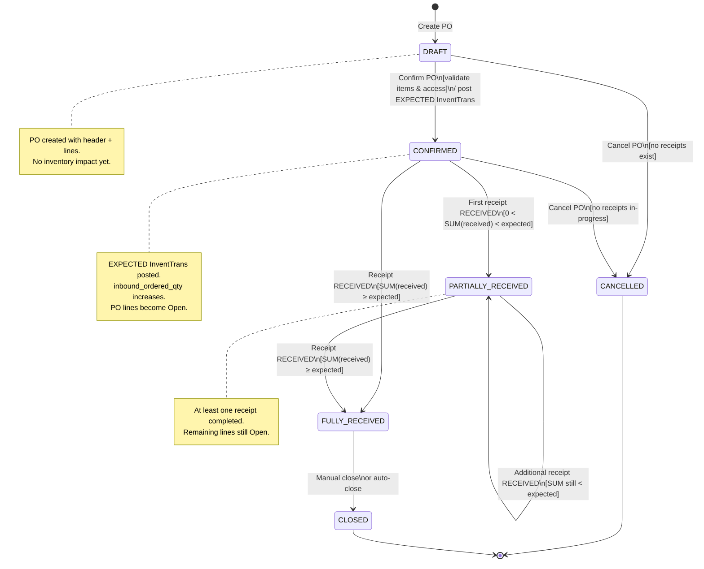
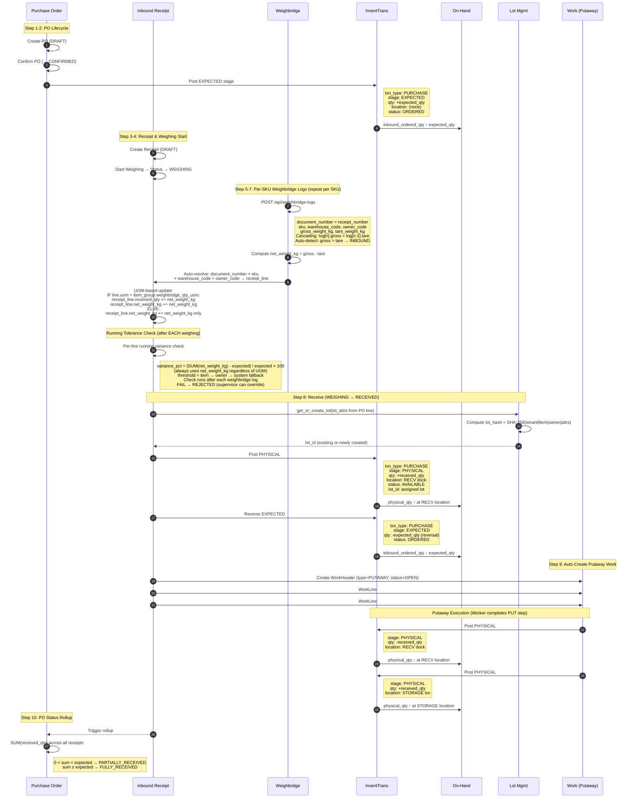

# Data Flow Diagram: Inbound Flow Module

> **Module**: Phase 4 — Inbound Flow
> **Version**: 2.0 (New Weighbridge Model — 1:N per-SKU logs)
> **Date**: 2026-03-13
> **Scope**: Purchase Order creation through Putaway completion

---

## 1. Context Diagram

High-level view of the Inbound Flow module, its actors, and connected modules.

```mermaid
graph TB
    %% Actors
    PLANNER([📋 Warehouse Planner])
    DRIVER([🚛 Truck Driver])
    WBOP([⚖️ Weighbridge Operator])
    DOCKWORKER([🏗️ Dock Worker])
    SUPERVISOR([👔 Supervisor])
    PUTWORKER([📦 Putaway Worker])

    %% Core Module
    INBOUND[["🔷 INBOUND FLOW MODULE\n─────────────────\nPO Management\nReceipt Processing\nWeighing Integration\nTolerance Checking\nLot Assignment\nPutaway Generation"]]

    %% Connected Modules
    CATALOG[(Catalog Module\nItems, UOM, Owners, Vendors)]
    WEIGHBRIDGE[(Weighbridge Module\nWeighbridge Logs (1:N per receipt)\nPer-SKU Gross/Tare/Net)]
    INVENTORY[(Inventory Module\nInventTrans\nOn-Hand)]
    LOT[(Lot Management\nLot Creation/Merge\nLot Attributes)]
    WAREHOUSE[(Warehouse Module\nLocations, Zones\nWork Headers/Lines)]
    AUDIT[(Audit Module\nAudit Logs\nChange Tracking)]

    %% Actor Interactions
    PLANNER -- "Create/Confirm PO\nReview receipts" --> INBOUND
    DRIVER -- "Vehicle info\nArrive/Depart" --> INBOUND
    WBOP -- "Record per-SKU weights\nvia POST /api/weighbridge-logs" --> INBOUND
    DOCKWORKER -- "Unload truck\nAssist weighing per SKU" --> INBOUND
    SUPERVISOR -- "Tolerance override\nApprove/Reject" --> INBOUND
    PUTWORKER -- "Execute putaway\nConfirm placement" --> INBOUND

    %% Module Interactions
    INBOUND <-- "Item validation\nOwner/Vendor lookup" --> CATALOG
    INBOUND <-- "N weighbridge_logs per receipt\ndocument_number = receipt_number\nauto-resolve → receipt_line\nUOM-based update:\n  uom=KG: received_qty + net_weight_kg\n  uom≠KG: net_weight_kg only" --> WEIGHBRIDGE
    INBOUND -- "Post InventTrans\nUpdate on-hand" --> INVENTORY
    INBOUND <-- "get_or_create_lot\nLot hash matching" --> LOT
    INBOUND -- "Create putaway work\nAssign locations" --> WAREHOUSE
    INBOUND -- "Log state changes\nTrack amendments" --> AUDIT

    %% Styling
    style INBOUND fill:#1a73e8,stroke:#0d47a1,color:#fff,stroke-width:3px
    style CATALOG fill:#e8f5e9,stroke:#2e7d32
    style WEIGHBRIDGE fill:#fff3e0,stroke:#e65100
    style INVENTORY fill:#e3f2fd,stroke:#1565c0
    style LOT fill:#f3e5f5,stroke:#6a1b9a
    style WAREHOUSE fill:#fce4ec,stroke:#b71c1c
    style AUDIT fill:#f5f5f5,stroke:#616161
```

---

## 2. Process Flow Diagram

End-to-end process from Purchase Order creation through Putaway completion.

```mermaid
flowchart TD
    START((Start)) --> CREATE_PO

    subgraph PO_MGMT["Purchase Order Management"]
        CREATE_PO["1. Create PO\n(DRAFT)\n─────────────\nOwner, Vendor, Warehouse\nItems + expected_qty\nVessel/BL info as lot attrs"]
        CONFIRM_PO["2. Confirm PO\n(DRAFT → CONFIRMED)\n─────────────\nValidate items & access\nPost InventTrans: EXPECTED\n+expected_qty → inbound_ordered_qty ↑"]

        CREATE_PO --> CONFIRM_PO
    end

    subgraph RECEIPT_MGMT["Receipt Processing"]
        CREATE_RECEIPT["3. Create Receipt\n(DRAFT)\n─────────────\nSelect PO, vehicle plate\nDriver info\n1 receipt = 1 vehicle trip"]
        START_WEIGHING["4. Start Weighing\n(DRAFT → WEIGHING)\n─────────────\nReceipt enters WEIGHING status\nWeighbridge logs recorded\nvia POST /api/weighbridge-logs"]

        CREATE_RECEIPT --> START_WEIGHING
    end

    subgraph WEIGHING["Weighbridge Operations (Per-SKU)"]
        WB_LOG["5. Record Weighbridge Log\n(1 log per receipt line/SKU)\n─────────────\nPOST /api/weighbridge-logs\ndocument_number = receipt_number\nsku, warehouse_code, owner_code\ngross_weight_kg, tare_weight_kg\n─────────────\nCascading: log[n].gross = log[n-1].tare\nAuto-detect: gross > tare → INBOUND"]
        AUTO_RESOLVE["6. Auto-Resolve & UOM-Based Update\n─────────────\ndocument_number + sku +\nwarehouse_code + owner_code\n→ receipt_line\n─────────────\nIF line.uom = item_group.weighbridge_qty_uom:\n  receipt_line.received_qty += net_weight_kg\n  receipt_line.net_weight_kg += net_weight_kg\nELSE:\n  receipt_line.net_weight_kg += net_weight_kg only"]
        TOLERANCE_PER["7. Running Tolerance Check\n(after EACH weighing)\n─────────────\nvariance_pct =\n|SUM(net_weight_kg) - expected|\n/ expected × 100\n(always uses net_weight_kg)\n─────────────\nThreshold fallback:\nitem → owner → system"]

        WB_LOG --> AUTO_RESOLVE --> TOLERANCE_PER
        TOLERANCE_PER -- "More SKUs\nto weigh" --> WB_LOG
    end

    subgraph VALIDATION["Final Validation & Receiving"]
        RECEIVE["8. Receive\n(WEIGHING → RECEIVED)\n─────────────\nAll lines weighed\nTolerance OK (running)\nLot assignment\nPost InventTrans:\n  PHYSICAL +received_qty\n  EXPECTED -expected_qty reversed"]
        REJECT["REJECTED\n─────────────\nRunning tolerance exceeded\nSupervisor review required"]
        OVERRIDE["Override Tolerance\n─────────────\nSupervisor approval\nwith reason_code"]

        TOLERANCE_PER -- "All lines done\nwithin tolerance" --> RECEIVE
        TOLERANCE_PER -- "Exceeds\ntolerance" --> REJECT
        REJECT -- "Supervisor\noverride" --> OVERRIDE
        OVERRIDE --> RECEIVE
    end

    subgraph PUTAWAY["Putaway Generation"]
        CREATE_WORK["9. Auto-Create Putaway Work\n─────────────\nWorkHeader: type=PUTAWAY\nstatus=OPEN\n─────────────\nLine #1: RECEIVE from RECV dock\nLine #2: PUT to STORAGE location"]
        EXECUTE_PUT["Execute Putaway\n─────────────\nWorker claims task\nInventTrans pair:\n  PHYSICAL -qty at RECV\n  PHYSICAL +qty at STORAGE"]
        PO_ROLLUP["10. PO Status Rollup\n─────────────\nSUM(received_qty) across receipts\n0 < sum < expected → PARTIALLY_RECEIVED\nsum ≥ expected → FULLY_RECEIVED"]

        RECEIVE --> CREATE_WORK
        RECEIVE --> PO_ROLLUP
        CREATE_WORK --> EXECUTE_PUT
    end

    CONFIRM_PO --> CREATE_RECEIPT
    EXECUTE_PUT --> DONE((End))
    PO_ROLLUP --> DONE

    %% Styling
    style START fill:#4caf50,stroke:#2e7d32,color:#fff
    style DONE fill:#4caf50,stroke:#2e7d32,color:#fff
    style TOLERANCE fill:#ff9800,stroke:#e65100,color:#fff
    style REJECT fill:#f44336,stroke:#b71c1c,color:#fff
    style RECEIVE fill:#2196f3,stroke:#1565c0,color:#fff
    style OVERRIDE fill:#ff9800,stroke:#e65100,color:#fff
```



---

## 3. State Machine Diagrams

### 3.1 Purchase Order Status



### 3.2 Inbound Receipt Status

```mermaid
stateDiagram-v2
    [*] --> DRAFT: Create Receipt

    DRAFT --> WEIGHING: Start Weighing\n/ receipt enters weighing mode

    WEIGHING --> WEIGHING: Weighbridge log recorded\n/ per-SKU: POST /api/weighbridge-logs\n/ auto-resolve receipt_line\n/ UOM-based: uom=KG → received_qty + net_weight_kg; uom≠KG → net_weight_kg only\n/ running tolerance check (uses net_weight_kg)

    WEIGHING --> RECEIVED: All lines weighed & tolerance OK\nor Supervisor Override\n/ assign lots\n/ post PHYSICAL InventTrans\n/ reverse EXPECTED InventTrans\n/ create putaway work

    WEIGHING --> REJECTED: Running tolerance exceeded\n[no supervisor override]

    REJECTED --> RECEIVED: Supervisor Override\nwith reason_code\n/ assign lots & post InventTrans

    DRAFT --> CANCELLED: Cancel Receipt\n[before weighing starts]

    RECEIVED --> [*]
    REJECTED --> [*]
    CANCELLED --> [*]

    note right of WEIGHING
        N weighbridge_logs recorded (1 per SKU).
        Each log: document_number = receipt_number.
        Auto-resolves to receipt_line via
        sku + warehouse_code + owner_code.
        Cascading: log[n].gross = log[n-1].tare.
        UOM-based update:
          IF line.uom = item_group.weighbridge_qty_uom:
            received_qty += net_weight_kg
          ELSE: net_weight_kg only (no received_qty update).
        net_weight_kg always accumulated.
        Running tolerance check after each log
        (always uses net_weight_kg).
    end note

    note right of RECEIVED
        Inventory physically received.
        received_qty = qty from weighbridge
        when UOM matches (line.uom = item_group.weighbridge_qty_uom);
        net_weight_kg = SUM(weighbridge_log.net_weight) always.
        Putaway work auto-created.
        PO rollup recalculated.
    end note
```



---

## 4. InventTrans Posting Diagram

Sequence diagram showing the exact inventory transactions posted at each step.



---

## 5. Data Flow Table

Detailed data flow at each step: inputs, outputs, API endpoints, and data store changes.

| Step | Action | Input | Output | API Endpoint | Data Store Changes |
|------|--------|-------|--------|-------------|-------------------|
| **1** | Create PO | owner_id, vendor_id, warehouse_id, po_type (VESSEL/CUSTOMER), lines[ ] with item_id, expected_qty_kg, lot_attr_01..12 | po_number (auto-generated), PO id | `POST /api/purchase-orders` | **INSERT** `purchase_order` (status=DRAFT) + `purchase_order_line` rows |
| **2** | Confirm PO | po_id | Updated PO (status=CONFIRMED) | `PUT /api/purchase-orders/{id}/confirm` | **UPDATE** `purchase_order.status` → CONFIRMED. **INSERT** `invent_trans` per line: stage=EXPECTED, +expected_qty. **UPDATE** on_hand: inbound_ordered_qty ↑ |
| **3** | Create Receipt | po_id, vehicle_plate, driver_name, driver_id_number | receipt_number (auto-generated), receipt id | `POST /api/inbound-receipts` | **INSERT** `inbound_receipt` (status=DRAFT) + `inbound_receipt_line` rows (from PO lines) |
| **4** | Start Weighing | receipt_id | Updated receipt (status=WEIGHING) | `PUT /api/inbound-receipts/{id}/start-weighing` | **UPDATE** `inbound_receipt.status` → WEIGHING |
| **5** | Record Weighbridge Log (per SKU) | document_number (=receipt_number), sku, warehouse_code, owner_code, gross_weight_kg, tare_weight_kg | weighbridge_log_id, net_weight_kg, updated receipt_line | `POST /api/weighbridge-logs` | **INSERT** `weighbridge_log` (document_number=receipt_number, direction=auto-detect INBOUND when gross>tare). Auto-resolve receipt_line via document_number + sku + warehouse_code + owner_code. **UOM-based update**: IF line.uom = item_group.weighbridge_qty_uom: **UPDATE** `inbound_receipt_line.received_qty_kg` += net_weight_kg AND `inbound_receipt_line.net_weight_kg` += net_weight_kg; ELSE: **UPDATE** `inbound_receipt_line.net_weight_kg` += net_weight_kg only (received_qty_kg unchanged). Cascading: log[n].gross = log[n-1].tare for multi-SKU. |
| **6** | Running Tolerance Check | (auto after each weighbridge log) | Pass/Fail per line, variance_pct | (Internal to weighbridge-log creation) | No direct store changes. Evaluated per line after each weighing: `variance_pct = \|SUM(net_weight_kg) - expected\| / expected * 100` (always uses net_weight_kg regardless of UOM) checked against threshold cascade: item → owner → system_config. **FAIL** → receipt status → REJECTED |
| **7a** | Receive (pass) | receipt_id | lot_id(s), InventTrans records, putaway work_id | `PUT /api/inbound-receipts/{id}/receive` | See detail below |
| **7b** | Reject (fail) | receipt_id, rejection_reason | Updated receipt (REJECTED) | `PUT /api/inbound-receipts/{id}/reject` | **UPDATE** `inbound_receipt.status` → REJECTED |
| **7c** | Override Tolerance | receipt_id, reason_code, supervisor_id | Updated receipt, proceeds to receive | `PUT /api/inbound-receipts/{id}/override-tolerance` | **INSERT** `audit_log` (override record). Then proceeds to step 7a |
| **8** | Auto-Create Putaway | (triggered by receive) | work_header_id, work_line records | (Internal — triggered after receive) | **INSERT** `work_header` (type=PUTAWAY, status=OPEN, ref=receipt_id). **INSERT** `work_line` #1 (RECEIVE from RECV dock). **INSERT** `work_line` #2 (PUT to STORAGE location) |
| **9** | PO Rollup | (triggered by receive) | Updated PO status | (Internal — triggered after receive) | **UPDATE** `purchase_order.status` based on SUM(received_qty) vs expected_qty |

### Step 7a Detail — Receive Data Store Changes

| Sub-step | Table | Operation | Details |
|----------|-------|-----------|---------|
| Lot Assignment | `lot` | INSERT or SELECT | Compute `lot_hash = SHA-256(tenant_id \| item_id \| owner_id \| selected attrs)`. If matching hash exists, reuse lot_id. Otherwise INSERT new lot with `first_received_date = NOW()` |
| InventTrans #1 | `invent_trans` | INSERT | stage=PHYSICAL, qty=+received_qty (where received_qty = SUM(weighbridge_log.net_weight_kg) for this line), location=RECV, status=AVAILABLE, lot_id=assigned |
| InventTrans #2 | `invent_trans` | INSERT | stage=EXPECTED, qty=-expected_qty (reversal of step 2 posting) |
| On-Hand | `on_hand` | UPDATE | physical_qty ↑ at RECV location; inbound_ordered_qty ↓ |
| Receipt | `inbound_receipt` | UPDATE | status → RECEIVED |
| Receipt Lines | `inbound_receipt_line` | UPDATE | lot_id populated per line. received_qty already accumulated from weighbridge logs |

---

## 6. Frontend Guide

### 6.1 Screens Overview

| Screen | Route (suggested) | Purpose |
|--------|-------------------|---------|
| PO List | `/purchase-orders` | Filterable list of all POs with status badges |
| PO Create/Edit | `/purchase-orders/new` | Form to create PO with header + line items |
| PO Detail | `/purchase-orders/:id` | View PO details, lines, linked receipts, status timeline |
| Receipt Create | `/inbound-receipts/new?poId=:id` | Create receipt for a PO, enter vehicle info |
| Receipt Detail | `/inbound-receipts/:id` | View receipt status, weighing progress, line details |
| Weighing Progress | `/inbound-receipts/:id/weighing` | Real-time weighing UI linked to weighbridge |
| Tolerance Review | `/inbound-receipts/:id/tolerance` | Variance display per line, approve/reject/override actions |
| Putaway Task List | `/putaway-tasks` | Worker-facing list of open putaway tasks, self-claim |
| Receipt History | `/inbound-receipts` | Searchable receipt history with filters |

### 6.2 PO Create/Edit Form

**Header Fields:**
| Field | Type | Required | Notes |
|-------|------|----------|-------|
| PO Type | Select (VESSEL, CUSTOMER, TRUCK, BARGE) | Yes | Determines required fields |
| Owner | Autocomplete (owner lookup) | Yes | Filters warehouse options |
| Vendor | Autocomplete (vendor lookup) | Yes | — |
| Warehouse | Select (filtered by owner access) | Yes | — |
| Supplier DO Number | Text | Conditional | Required when PO Type = TRUCK |
| Vessel Name | Text | No | Lot attr for VESSEL type |
| BL Number | Text | No | Lot attr for VESSEL type |
| Remarks | Textarea | No | — |

**Line Items (repeating group):**
| Field | Type | Required | Notes |
|-------|------|----------|-------|
| Item | Autocomplete (item lookup) | Yes | Validates item exists in catalog |
| Expected Qty (kg) | Number (decimal) | Yes | Must be > 0 |
| UOM | Select | Yes | Defaults to KG |
| Lot Attr 01-12 | Text | No | Reference attributes (vessel, BL, grade, etc.) |
| Remark | Text | No | Per-line notes |

**API Calls:**
- `GET /api/catalog/owners` — Owner dropdown
- `GET /api/catalog/vendors` — Vendor dropdown
- `GET /api/catalog/items?search=` — Item autocomplete
- `GET /api/warehouses?ownerId=` — Warehouse dropdown (filtered)
- `POST /api/purchase-orders` — Submit PO creation

### 6.3 Receipt Create Form

| Field | Type | Required | Notes |
|-------|------|----------|-------|
| Purchase Order | Autocomplete (PO lookup, status=CONFIRMED+) | Yes | Shows po_number, vendor, open qty |
| Vehicle Plate | Text | Yes | Truck license plate |
| Driver Name | Text | No | — |
| Driver ID | Text | No | — |
| Remarks | Textarea | No | — |

**API Calls:**
- `GET /api/purchase-orders?status=CONFIRMED,PARTIALLY_RECEIVED` — PO lookup
- `POST /api/inbound-receipts` — Submit receipt creation

### 6.4 Weighing Progress Screen

| Component | Data Source | Behavior |
|-----------|-----------|----------|
| Receipt Info Card | `GET /api/inbound-receipts/:id` | Shows receipt number, PO, vehicle plate |
| Receipt Lines Table | `GET /api/inbound-receipts/:id` (lines) | Shows each SKU line: expected_qty, received_qty (running total), variance_pct |
| Weighbridge Log List | `GET /api/weighbridge-logs?documentNumber=:receiptNumber` | All weighbridge logs linked to this receipt (1:N), showing gross/tare/net per log |
| Record Weighing Button | Opens form → `POST /api/weighbridge-logs` | Creates new weighbridge_log. Fields: sku (dropdown from receipt lines), gross_weight_kg, tare_weight_kg. document_number auto-filled from receipt_number. Cascading hint: pre-fills gross from previous log's tare |
| Running Tolerance Badge | Computed per line | Green (within tolerance), Yellow (approaching), Red (exceeds) — updates after each log |
| Net Weight Per Log | Computed | gross_weight_kg - tare_weight_kg per individual log |
| Cumulative Weight Per SKU | Computed | SUM(net_weight_kg) across all logs for each SKU/receipt_line |

### 6.5 Tolerance Review Screen

| Component | Data Source | Behavior |
|-----------|-----------|----------|
| Receipt Line Table | Receipt lines from `GET /api/inbound-receipts/:id` | Shows expected_qty, received_qty (=SUM of weighbridge net weights), variance_pct per line |
| Weighbridge Log Detail | `GET /api/weighbridge-logs?documentNumber=:receiptNumber` | Expandable: shows individual weighbridge logs per line for audit |
| Variance Badge | Computed (running, updated after each weighing) | Green (within tolerance), Red (exceeds) |
| Threshold Display | `item.tolerance_pct_inbound` or fallback | Shows which threshold was applied |
| Approve Button | `PUT /api/inbound-receipts/:id/receive` | Visible when all lines weighed and within tolerance |
| Reject Button | `PUT /api/inbound-receipts/:id/reject` | Visible when any line exceeds tolerance |
| Override Button | `PUT /api/inbound-receipts/:id/override-tolerance` | Visible to SUPERVISOR role only; requires reason_code |
| Reason Code | Select | Required for override | Predefined list of override reasons |

### 6.6 Putaway Task List

| Component | Data Source | Behavior |
|-----------|-----------|----------|
| Task Table | `GET /api/work-headers?type=PUTAWAY&status=OPEN` | Filterable by warehouse, priority |
| Claim Button | `PUT /api/work-headers/:id/claim` | Worker self-assigns task |
| Task Detail | `GET /api/work-headers/:id` | Shows RECEIVE location → PUT location |
| Complete Step | `PUT /api/work-lines/:id/complete` | Mark each step done; posts InventTrans on PUT step |

---

## 7. Backend Guide

### 7.1 Commands (Write Operations)

| Command | Handler | Input DTO | Key Logic |
|---------|---------|-----------|-----------|
| `CreatePurchaseOrderCommand` | `CreatePurchaseOrderHandler` | `{ poType, ownerId, vendorId, warehouseId, supplierDoNumber?, lines[{ itemId, expectedQtyKg, uomCode, lotAttr01..12 }] }` | Validate owner-warehouse access. Auto-generate po_number. Insert PO header + lines. Status = DRAFT. |
| `ConfirmPurchaseOrderCommand` | `ConfirmPurchaseOrderHandler` | `{ poId }` | Validate PO is DRAFT. Validate all items exist. Post EXPECTED InventTrans per line (+expected_qty). Set approved_by, approved_at. Status → CONFIRMED. |
| `CreateInboundReceiptCommand` | `CreateInboundReceiptHandler` | `{ poId, vehiclePlate, driverName?, driverIdNumber? }` | Validate PO is CONFIRMED or PARTIALLY_RECEIVED. Auto-generate receipt_number. Create receipt lines from PO open lines. Status = DRAFT. |
| `StartWeighingCommand` | `StartWeighingHandler` | `{ receiptId }` | Validate receipt is DRAFT. Status → WEIGHING. No weighbridge_log created here — logs are recorded separately via POST /api/weighbridge-logs. |
| `CreateWeighbridgeLogCommand` | `CreateWeighbridgeLogHandler` | `{ documentNumber, sku, warehouseCode, ownerCode, grossWeightKg, tareWeightKg }` | Shared API: `POST /api/weighbridge-logs`. Auto-detect direction (gross > tare → INBOUND). Compute net_weight_kg. Auto-resolve: document_number + sku + warehouse_code + owner_code → receipt_line. **UOM check**: IF line.uom = item_group.weighbridge_qty_uom → update receipt_line.received_qty += net_weight_kg AND receipt_line.net_weight_kg += net_weight_kg; ELSE → update receipt_line.net_weight_kg += net_weight_kg only. Cascading: log[n].gross = log[n-1].tare for multi-SKU. Run tolerance check per line (always uses net_weight_kg). |
| `ReceiveInboundReceiptCommand` | `ReceiveInboundReceiptHandler` | `{ receiptId }` | **Core handler** — see detailed flow below. |
| `RejectInboundReceiptCommand` | `RejectInboundReceiptHandler` | `{ receiptId, rejectionReason }` | Validate receipt is WEIGHING or tolerance exceeded. Status → REJECTED. Log to audit. |
| `OverrideToleranceCommand` | `OverrideToleranceHandler` | `{ receiptId, reasonCode, supervisorNotes? }` | Validate caller has SUPERVISOR role. Log override to audit. Proceed to ReceiveInboundReceiptCommand. |
| `CancelPurchaseOrderCommand` | `CancelPurchaseOrderHandler` | `{ poId, reason }` | Validate no in-progress receipts. Reverse any EXPECTED InventTrans. Status → CANCELLED. |

### 7.2 Queries (Read Operations)

| Query | Handler | Output DTO | Notes |
|-------|---------|-----------|-------|
| `GetPurchaseOrdersQuery` | `GetPurchaseOrdersHandler` | Paged list of PO summaries | Filters: status, owner, vendor, warehouse, date range |
| `GetPurchaseOrderByIdQuery` | `GetPurchaseOrderByIdHandler` | PO detail with lines and receipt summary | Includes computed fields: total_received, open_qty |
| `GetPurchaseOrderReceiptsQuery` | `GetPurchaseOrderReceiptsHandler` | List of receipts for a PO | `GET /api/purchase-orders/{id}/receipts` |
| `GetInboundReceiptsQuery` | `GetInboundReceiptsHandler` | Paged list of receipt summaries | Filters: status, PO number, date range |
| `GetInboundReceiptByIdQuery` | `GetInboundReceiptByIdHandler` | Receipt detail with lines, weighbridge data, tolerance results | — |
| `GetPutawayTasksQuery` | `GetPutawayTasksHandler` | Open putaway work headers | Filters: warehouse, status, assigned worker |

### 7.3 ReceiveInboundReceipt — Detailed Flow

This is the most critical command handler. It orchestrates lot assignment, InventTrans posting, putaway work creation, and PO rollup.

```
ReceiveInboundReceiptHandler.Handle(command):
│
├─ 1. VALIDATE
│   ├─ Receipt.Status == WEIGHING
│   ├─ All lines have net_weight_kg > 0 (accumulated from weighbridge logs)
│   ├─ net_weight_kg per line = SUM(weighbridge_log.net_weight_kg) where document_number + sku match
│   ├─ received_qty per line: populated only when line.uom = item_group.weighbridge_qty_uom
│   └─ Running tolerance check passes for all lines (or override exists) — uses net_weight_kg
│
├─ 2. LOT ASSIGNMENT (per receipt line)
│   ├─ Read lot_attrs from linked PO line (lot_attr_01..12)
│   ├─ Compute lot_hash = SHA-256(tenant_id | item_id | owner_id | selected_attrs)
│   ├─ Query: SELECT lot WHERE lot_hash = computed_hash
│   ├─ IF existing lot found:
│   │   └─ Reuse lot_id (merge into existing lot)
│   └─ ELSE:
│       └─ INSERT new lot (first_received_date = UTC_NOW)
│       └─ Return new lot_id
│
├─ 3. POST INVENTTRANS (per receipt line)
│   ├─ Transaction #1 — PHYSICAL Receipt:
│   │   ├─ txn_type: PURCHASE
│   │   ├─ stage: PHYSICAL
│   │   ├─ qty: +received_qty_kg
│   │   ├─ location_id: RECV dock location
│   │   ├─ inventory_status: AVAILABLE
│   │   ├─ lot_id: from step 2
│   │   └─ reference: receipt_id, receipt_line_id
│   │
│   └─ Transaction #2 — Reverse EXPECTED:
│       ├─ txn_type: PURCHASE
│       ├─ stage: EXPECTED
│       ├─ qty: -expected_qty_kg (reversal)
│       └─ reference: po_id, po_line_id
│
├─ 4. UPDATE ON-HAND
│   ├─ physical_qty += received_qty at (warehouse, RECV location, item, lot, AVAILABLE)
│   └─ inbound_ordered_qty -= expected_qty at (warehouse, item)
│
├─ 5. UPDATE RECEIPT
│   ├─ receipt.status → RECEIVED
│   └─ receipt_line.lot_id = assigned lot_id
│
├─ 6. AUTO-CREATE PUTAWAY WORK
│   ├─ Determine target STORAGE location:
│   │   ├─ Check zone rules for item
│   │   ├─ Check location capacity
│   │   └─ Check item_incompatibility constraints
│   ├─ INSERT work_header (type=PUTAWAY, status=OPEN, reference_id=receipt_id)
│   ├─ INSERT work_line #1 (step=RECEIVE, location=RECV dock)
│   └─ INSERT work_line #2 (step=PUT, location=target STORAGE)
│
├─ 7. PO STATUS ROLLUP
│   ├─ total_received = SUM(all receipt_lines.received_qty for this PO line)
│   ├─ UPDATE po_line.received_qty_kg = total_received
│   ├─ IF 0 < total_received < expected → po_line.status = PARTIALLY_RECEIVED
│   ├─ IF total_received >= expected → po_line.status = FULLY_RECEIVED
│   └─ Rollup PO header status from line statuses:
│       ├─ ANY line PARTIALLY_RECEIVED → PO = PARTIALLY_RECEIVED
│       ├─ ALL lines FULLY_RECEIVED → PO = FULLY_RECEIVED
│       └─ Mix of states → PO = PARTIALLY_RECEIVED
│
└─ 8. PUBLISH DOMAIN EVENTS
    ├─ InboundReceiptReceivedEvent (for audit, notifications)
    ├─ InventTransPostedEvent (for on-hand recalc)
    └─ PutawayWorkCreatedEvent (for worker notification)
```

### 7.4 Tolerance Check Logic (Running — After Each Weighing)

```
CheckToleranceRunning(receiptLine):
│
├─ expected = receiptLine.expected_qty_kg
├─ received = receiptLine.net_weight_kg
│   (running total: accumulated from SUM of weighbridge_log.net_weight_kg
│    where document_number = receipt_number AND sku = line.sku)
│   NOTE: Always uses net_weight_kg for tolerance, regardless of UOM.
│         received_qty_kg is only updated when line.uom = item_group.weighbridge_qty_uom.
├─ variance = ABS(received - expected)
├─ variance_pct = (variance / expected) * 100
│
├─ Resolve threshold (cascade):
│   ├─ 1st: item.tolerance_pct_inbound (if set)
│   ├─ 2nd: owner.default_tolerance_pct (if set)
│   └─ 3rd: system_config.default_inbound_tolerance_pct
│
├─ IF variance_pct <= threshold:
│   └─ RETURN PASS
├─ ELSE:
│   └─ RETURN FAIL (variance_pct, threshold)
│
Note: This check runs after EACH weighbridge log is recorded,
not as a batch check at the end. If any line exceeds tolerance
during weighing, the receipt can be immediately flagged.
```

### 7.5 Putaway InventTrans at Work Completion

When a putaway worker completes the PUT work line, the system posts a paired InventTrans to move inventory from RECV to STORAGE:

```
CompletePutawayStep(workLine):
│
├─ InventTrans #3 — Move out of RECV:
│   ├─ stage: PHYSICAL
│   ├─ qty: -received_qty_kg
│   ├─ location: RECV dock
│   ├─ lot_id: (preserved from receipt)
│   └─ inventory_status: AVAILABLE
│
├─ InventTrans #4 — Move into STORAGE:
│   ├─ stage: PHYSICAL
│   ├─ qty: +received_qty_kg
│   ├─ location: target STORAGE location
│   ├─ lot_id: (preserved from receipt)
│   └─ inventory_status: AVAILABLE
│
├─ UPDATE on_hand:
│   ├─ physical_qty -= qty at RECV location
│   └─ physical_qty += qty at STORAGE location
│
└─ UPDATE work_header.status → COMPLETED (if all lines done)
```

### 7.6 Key Domain Events

| Event | Published By | Subscribers |
|-------|-------------|-------------|
| `PurchaseOrderConfirmedEvent` | ConfirmPurchaseOrderHandler | InventTrans posting, audit log |
| `InboundReceiptReceivedEvent` | ReceiveInboundReceiptHandler | PO rollup, audit log, notifications |
| `InventTransPostedEvent` | InventTransService | On-hand recalculation |
| `PutawayWorkCreatedEvent` | ReceiveInboundReceiptHandler | Worker notification, dashboard update |
| `PutawayWorkCompletedEvent` | CompletePutawayStepHandler | InventTrans posting (RECV → STORAGE), audit |
| `WeighbridgeLogRecordedEvent` | CreateWeighbridgeLogHandler | Receipt line update, running tolerance check |
| `ToleranceExceededEvent` | CreateWeighbridgeLogHandler | Supervisor notification |
| `ToleranceOverriddenEvent` | OverrideToleranceHandler | Audit log |
