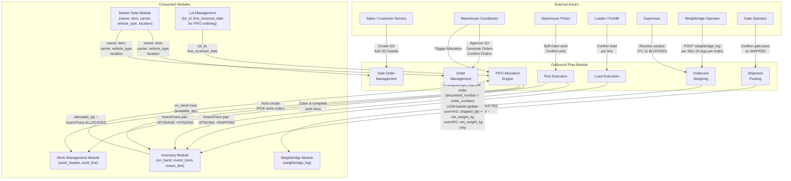
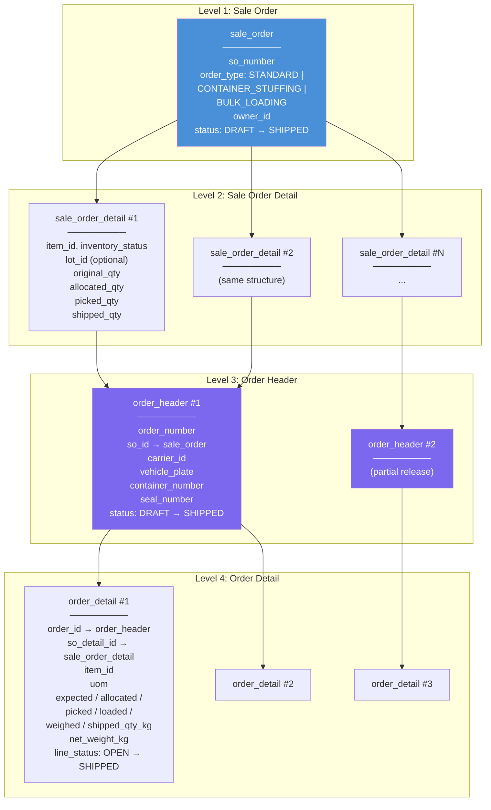
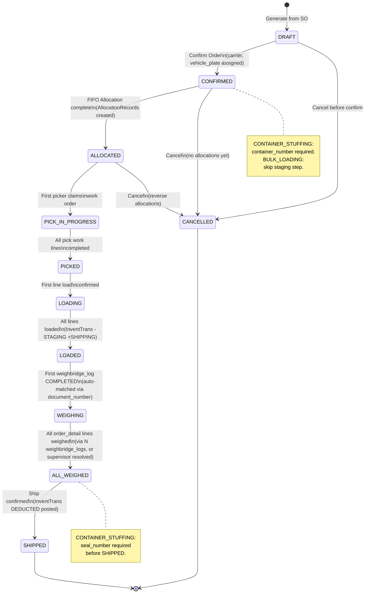
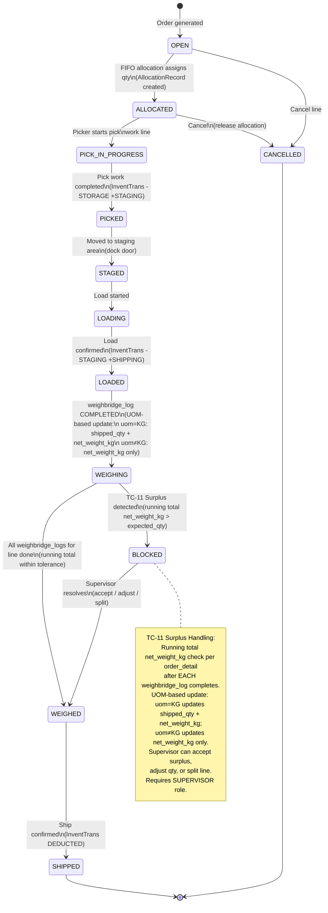
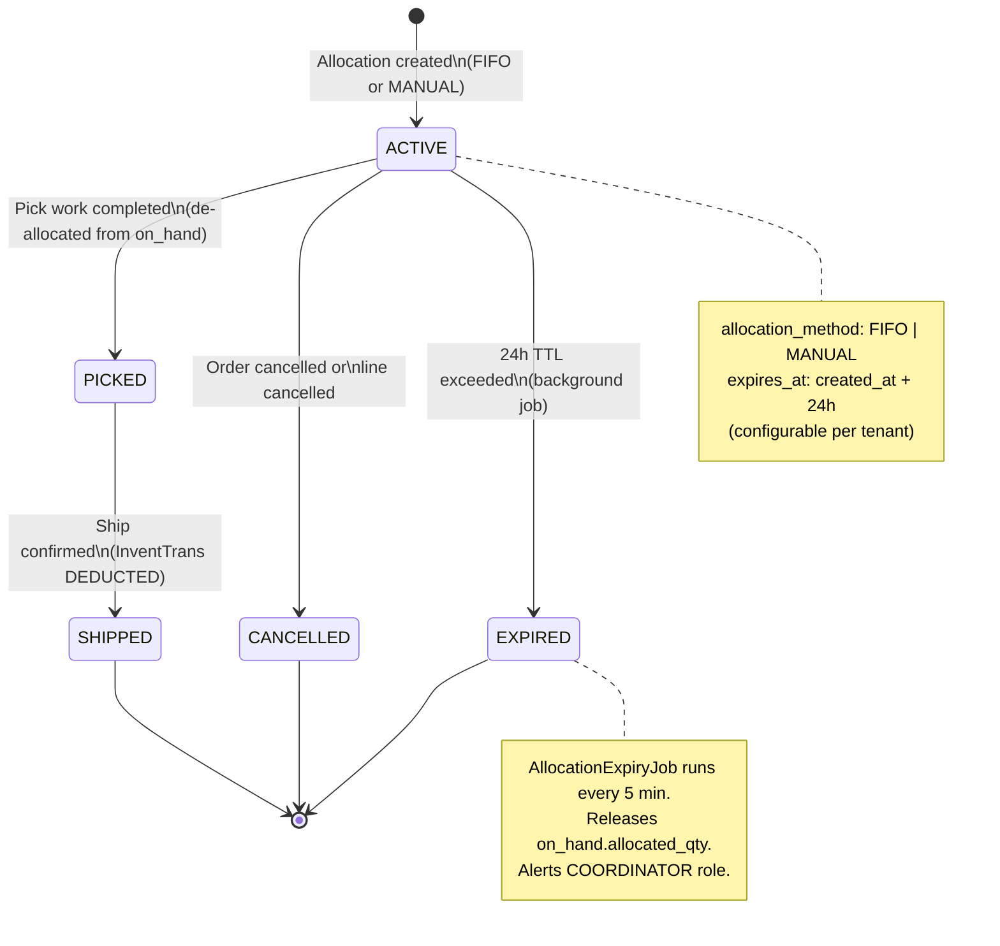
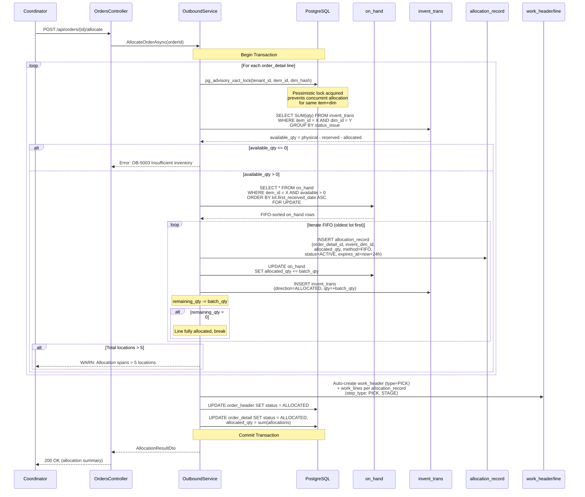
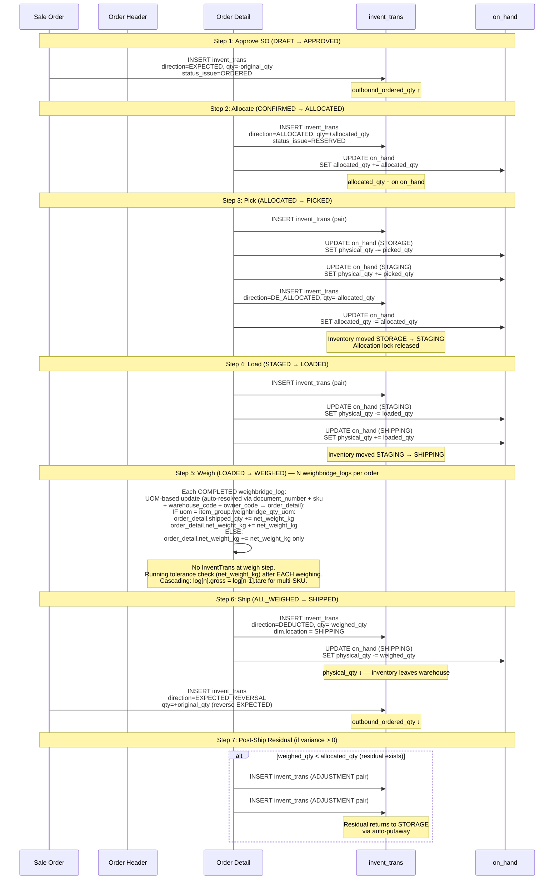

# 05 - Outbound Flow: Data Flow Diagram

> Module scope: Full outbound lifecycle from Sale Order (SO) creation through shipment with InventTrans DEDUCTED posting.
> Covers a 4-level document hierarchy (SO > SO Detail > Order Header > Order Detail), FIFO allocation engine with pessimistic locking, pick/stage/load work execution, outbound weighbridge integration, and post-ship residual handling.

---

## 1. Context Diagram

High-level view showing the Outbound module and its external interactions.

---

## 2. Process Flow Diagram

End-to-end outbound process from SO creation to shipment.

```mermaid
flowchart TD
    subgraph "P1: Sale Order Management"
        P1_1["P1.1 Create SO\n(DRAFT)"]
        P1_2["P1.2 Add SO Detail Lines\n(item, qty, lot optional)"]
        P1_3["P1.3 Approve SO\n(DRAFT → APPROVED)"]
    end

    subgraph "P2: Order Generation"
        P2_1["P2.1 Generate Order\nfrom SO"]
        P2_2{"P2.2 Order Type?"}
        P2_3["P2.3 STANDARD\n(normal flow)"]
        P2_4["P2.4 CONTAINER_STUFFING\n(container_number required)"]
        P2_5["P2.5 BULK_LOADING\n(skip staging)"]
        P2_6["P2.6 Confirm Order\n(DRAFT → CONFIRMED)\ncarrier, vehicle info"]
    end

    subgraph "P3: FIFO Allocation"
        P3_1["P3.1 pg_advisory_xact_lock\nper (tenant, item, dim)"]
        P3_2["P3.2 Compute available_qty\nfrom invent_trans"]
        P3_3["P3.3 Iterate by oldest\nlot.first_received_date"]
        P3_4["P3.4 Create AllocationRecord\nper on_hand batch"]
        P3_5{"P3.5 Warn if\n> 5 locations?"}
        P3_6["P3.6 Update allocated_qty\non on_hand & order_detail"]
        P3_7["P3.7 Auto-create PICK\nwork orders"]
    end

    subgraph "P4: Pick Execution"
        P4_1["P4.1 Worker self-claims\nwork order"]
        P4_2["P4.2 Execute PICK lines\n(STORAGE → STAGING)"]
        P4_3["P4.3 InventTrans pair:\n-STORAGE +STAGING"]
        P4_4["P4.4 De-allocate:\nallocated_qty ↓"]
    end

    subgraph "P5: Load Execution"
        P5_1["P5.1 Per-line load\nconfirmation"]
        P5_2["P5.2 InventTrans pair:\n-STAGING +SHIPPING"]
        P5_3["P5.3 Complete Loading\n(LOADING → LOADED)"]
    end

    subgraph "P6: Outbound Weighing (N logs per order)"
        P6_1["P6.1 POST /api/weighbridge-logs\n(document_number=order_number, sku, weights)"]
        P6_0["P6.1a Auto-resolve:\ndocument_number + sku +\nwarehouse_code + owner_code\n→ order_detail"]
        P6_1b["P6.1b Auto-detect type:\ngross < tare → OUTBOUND"]
        P6_1c["P6.1c Cascading weighing:\nlog[n].gross = log[n-1].tare\n(multi-SKU loading)"]
        P6_2{"P6.2 Running tolerance check:\nnet_weight_kg > expected_qty\nafter EACH weighing?"}
        P6_3["P6.3 UOM-Based Update\nIF uom = item_group.weighbridge_qty_uom:\n  order_detail.shipped_qty += net_weight_kg\n  order_detail.net_weight_kg += net_weight_kg\nELSE:\n  order_detail.net_weight_kg += net_weight_kg only"]
        P6_4["P6.4 Surplus: line → BLOCKED\n(TC-11 running total check)"]
        P6_5["P6.5 All lines weighed\n(ALL_WEIGHED)"]
    end

    subgraph "P7: Shipment"
        P7_1["P7.1 Negative inventory check\n(hard block)"]
        P7_2["P7.2 InventTrans DEDUCTED\n(-shipped_qty)"]
        P7_3["P7.3 Reverse EXPECTED\n(outbound_ordered_qty ↓)"]
        P7_4["P7.4 AllocationRecord → SHIPPED"]
        P7_5["P7.5 SO Detail rollup\n(shipped_qty ↑)"]
        P7_6["P7.6 Order → SHIPPED"]
    end

    subgraph "P8: Post-Ship Residual"
        P8_1["P8.1 Detect variance\n(allocated - weighed > 0)"]
        P8_2["P8.2 InventTrans ADJUSTMENT:\nSHIPPING → STAGING"]
        P8_3["P8.3 Auto-putaway\nSTAGING → STORAGE"]
    end

    subgraph "Data Stores"
        DS1[("sale_order\nsale_order_detail")]
        DS2[("order_header\norder_detail")]
        DS3[("allocation_record")]
        DS4[("invent_trans\non_hand\ninvent_dim")]
        DS5[("work_header\nwork_line")]
        DS6[("weighbridge_log")]
    end

    %% SO Flow
    SALES_INPUT(["Sales Input"]) --> P1_1
    P1_1 --> DS1
    P1_1 --> P1_2
    P1_2 --> DS1
    P1_2 --> P1_3
    P1_3 -- "InventTrans: EXPECTED\n-qty (outbound_ordered_qty ↑)" --> DS4
    P1_3 --> P2_1

    %% Order Generation
    P2_1 --> P2_2
    P2_2 -- "STANDARD" --> P2_3
    P2_2 -- "CONTAINER_STUFFING" --> P2_4
    P2_2 -- "BULK_LOADING" --> P2_5
    P2_3 & P2_4 & P2_5 --> P2_6
    P2_6 --> DS2

    %% Allocation
    P2_6 --> P3_1
    P3_1 --> P3_2
    P3_2 -- "Read invent_trans" --> DS4
    P3_2 --> P3_3
    P3_3 --> P3_4
    P3_4 --> DS3
    P3_4 --> P3_5
    P3_5 -- "Yes: warn coordinator" --> P3_6
    P3_5 -- "No" --> P3_6
    P3_6 -- "InventTrans: ALLOCATED\n+qty (allocated_qty ↑)" --> DS4
    P3_6 --> P3_7
    P3_7 --> DS5

    %% Pick
    P3_7 --> P4_1
    P4_1 --> DS5
    P4_1 --> P4_2
    P4_2 --> P4_3
    P4_3 --> DS4
    P4_3 --> P4_4
    P4_4 -- "De-allocate: allocated_qty ↓" --> DS4

    %% Load
    P4_4 --> P5_1
    P5_1 --> P5_2
    P5_2 --> DS4
    P5_2 --> P5_3
    P5_3 --> DS2

    %% Weigh (N weighbridge_logs per order, 1 per order_detail/SKU)
    P5_3 --> P6_1
    P6_1 --> P6_0
    P6_0 --> P6_1b
    P6_1b --> P6_1c
    P6_1c --> DS6
    P6_1c --> P6_2
    P6_2 -- "No surplus (running total OK)" --> P6_3
    P6_2 -- "Surplus detected (running total)" --> P6_4
    P6_3 -- "auto-update order_detail.weighed_qty" --> DS2
    P6_3 --> P6_5
    P6_4 -- "Supervisor resolves" --> P6_3
    P6_5 --> DS2

    %% Ship
    P6_5 --> P7_1
    P7_1 --> P7_2
    P7_2 --> DS4
    P7_2 --> P7_3
    P7_3 --> DS4
    P7_3 --> P7_4
    P7_4 --> DS3
    P7_4 --> P7_5
    P7_5 --> DS1
    P7_5 --> P7_6
    P7_6 --> DS2

    %% Post-Ship Residual
    P7_6 --> P8_1
    P8_1 -- "Variance > 0" --> P8_2
    P8_2 --> DS4
    P8_2 --> P8_3
    P8_3 --> DS4
```

---

## 3. 4-Level Document Hierarchy

**Relationships:**
- 1 SO has many SO Details (line items the customer ordered)
- 1 SO can generate 1..N Order Headers (partial release supported)
- 1 Order Header has many Order Details (each maps back to an SO Detail)
- SO Detail `allocated_qty`, `picked_qty`, `shipped_qty` are denormalized rollups from Order Details

---

## 4. State Machine Diagrams

### 4.1 Sale Order Status

```mermaid
stateDiagram-v2
    [*] --> DRAFT : Create SO

    DRAFT --> APPROVED : Approve SO\n(InventTrans EXPECTED posted)
    DRAFT --> CANCELLED : Cancel SO\n(no orders generated)

    APPROVED --> PARTIALLY_RELEASED : Some SO Details\nreleased to Orders
    APPROVED --> FULLY_RELEASED : All SO Details\nreleased to Orders
    APPROVED --> CANCELLED : Cancel SO\n(reverse EXPECTED)

    PARTIALLY_RELEASED --> FULLY_RELEASED : Remaining details\nreleased

    FULLY_RELEASED --> SHIPPED : All Orders SHIPPED\n(all order_details shipped)

    SHIPPED --> CLOSED : Admin close\n(post-ship reconciliation done)

    CANCELLED --> [*]
    CLOSED --> [*]

    note right of APPROVED
        InventTrans EXPECTED posted:
        outbound_ordered_qty incremented
        for each SO Detail line.
    end note

    note right of SHIPPED
        SO status rolls up from
        SO Detail statuses.
        Daily reconciliation job
        verifies rollup accuracy.
    end note
```

### 4.2 Order Header Status

### 4.3 Order Detail (Line) Status

### 4.4 Allocation Record Status

---

## 5. FIFO Allocation Flow

---

## 6. InventTrans Posting Diagram

---

## 7. Data Flow Table

### 7.1 Sale Order Management

| Step | Process | Input | Output | API Endpoint | Validation / Business Rule |
|------|---------|-------|--------|--------------|---------------------------|
| 1 | Create SO | `{ so_number, order_type, owner_id, lines[] }` | `sale_order` (DRAFT) | `POST /api/sale-orders` | Unique `(tenant_id, so_number)`. `order_type` in `[STANDARD, CONTAINER_STUFFING, BULK_LOADING]`. `owner_id` must be active |
| 2 | Add/Update SO Detail | `{ item_id, inventory_status, lot_id?, original_qty, lot_attr_01..12? }` | `sale_order_detail` record | Inline with SO create/update | `item_id` must belong to SO `owner_id`. `original_qty > 0` |
| 3 | Approve SO | `{ id }` | SO status → APPROVED | `POST /api/sale-orders/{id}/approve` | SO must be DRAFT. At least 1 detail line. InventTrans EXPECTED posted per line |
| 4 | Cancel SO | `{ id, reason }` | SO status → CANCELLED | `POST /api/sale-orders/{id}/cancel` | Only DRAFT or APPROVED (no orders generated). If APPROVED, reverse EXPECTED InventTrans |

### 7.2 Order Generation & Confirmation

| Step | Process | Input | Output | API Endpoint | Validation / Business Rule |
|------|---------|-------|--------|--------------|---------------------------|
| 5 | Generate Order from SO | `{ so_id, so_detail_ids[], order_type? }` | `order_header` + `order_detail[]` (DRAFT) | `POST /api/orders/generate` | SO must be APPROVED. SO Details must not already be fully released. Partial release allowed |
| 6 | Confirm Order | `{ carrier_id, vehicle_plate, container_number?, seal_number? }` | Order status → CONFIRMED | `PUT /api/orders/{id}/confirm` | Order must be DRAFT. `carrier_id` active. CONTAINER_STUFFING requires `container_number`. Vehicle plate required |

### 7.3 FIFO Allocation

| Step | Process | Input | Output | API Endpoint | Validation / Business Rule |
|------|---------|-------|--------|--------------|---------------------------|
| 7 | Allocate Order | `{ order_id }` | AllocationRecords created. Order → ALLOCATED | `POST /api/orders/{id}/allocate` | Order must be CONFIRMED. `pg_advisory_xact_lock(tenant, item, dim)`. Available computed from `invent_trans` NOT `on_hand`. FIFO by `lot.first_received_date`. Warn if > 5 locations. Auto-create PICK work orders. Allocation expires 24h (configurable) |

### 7.4 Pick & Stage

| Step | Process | Input | Output | API Endpoint | Validation / Business Rule |
|------|---------|-------|--------|--------------|---------------------------|
| 8a | Claim pick work | `{ work_id, worker_id }` | Work assigned to worker | `POST /api/work/{id}/claim` | Work must be OPEN. Worker self-claim (no double assignment) |
| 8b | Complete pick line | `{ work_line_id, actual_qty }` | PICK line done. InventTrans pair posted | `PUT /api/work/{id}/lines/{lineId}/complete` | InventTrans: -STORAGE +STAGING (PHYSICAL). De-allocate: `allocated_qty ↓` on `on_hand`. AllocationRecord status → PICKED |
| 9 | Stage (move to dock) | Implicit with pick completion | Order Detail → STAGED | (Part of pick workflow) | BULK_LOADING may skip staging step |

### 7.5 Loading

| Step | Process | Input | Output | API Endpoint | Validation / Business Rule |
|------|---------|-------|--------|--------------|---------------------------|
| 10 | Complete Loading | `{ order_id, line_confirmations[] }` | Order → LOADED. InventTrans pairs posted | `PUT /api/orders/{id}/complete-loading` | Per-line confirmation. InventTrans: -STAGING +SHIPPING (PHYSICAL). All lines must be loaded. CONTAINER_STUFFING: `seal_number` required before SHIPPED |

### 7.6 Outbound Weighing

| Step | Process | Input | Output | API Endpoint | Validation / Business Rule |
|------|---------|-------|--------|--------------|---------------------------|
| 11a | Create weighbridge log (per SKU) | `{ document_number, sku, warehouse_code, owner_code, gross_weight, tare_weight, vehicle_plate, ... }` | `weighbridge_log` created. Auto-resolves → `order_detail`. UOM-based update: if `uom = item_group.weighbridge_qty_uom` → `order_detail.shipped_qty += net_weight_kg` AND `order_detail.net_weight_kg += net_weight_kg`; if `uom ≠ item_group.weighbridge_qty_uom` → `order_detail.net_weight_kg += net_weight_kg` only | `POST /api/weighbridge-logs` (shared endpoint) | N logs per order (1 per order_detail/SKU). Auto-resolve: `document_number` + `sku` + `warehouse_code` + `owner_code` → `order_detail`. Auto-detect type: `gross < tare` → OUTBOUND. Cascading weighing: `log[n].gross = log[n-1].tare` for multi-SKU loading. Flexible line order naturally supported (each log is per-line, any order). Running tolerance check after EACH weighing: if running `net_weight_kg > expected_qty` → TC-11 surplus → line BLOCKED |
| 11b | Handle surplus (TC-11) | `{ resolution: ACCEPT/ADJUST/SPLIT, adjusted_qty? }` | BLOCKED → WEIGHED | `POST /api/orders/{id}/details/{detailId}/handle-surplus` | Requires SUPERVISOR role. Running total check per `order_detail` after each weighing. Accept: keep surplus qty. Adjust: override to expected. Split: create new line for delta |
| 11c | All weighed | (automatic) | Order → ALL_WEIGHED | (triggered after last order_detail line reaches WEIGHED) | All `order_detail` lines must be WEIGHED status. Checked after each weighbridge_log completion |

### 7.7 Shipment & Post-Ship

| Step | Process | Input | Output | API Endpoint | Validation / Business Rule |
|------|---------|-------|--------|--------------|---------------------------|
| 12 | Ship Order | `{ order_id }` | Order → SHIPPED. InventTrans DEDUCTED posted | `PUT /api/orders/{id}/ship` | Order must be ALL_WEIGHED. CONTAINER_STUFFING: `seal_number` required. Negative inventory check: `on_hand.physical_qty - weighed_qty >= 0` (hard block, error OB-5013). InventTrans DEDUCTED: `qty = -weighed_qty`. Reverse EXPECTED InventTrans. AllocationRecord → SHIPPED. SO Detail rollup: `shipped_qty ↑`. Print DO, Gate Pass, GDN |
| 13 | Post-ship residual | (automatic if variance) | InventTrans ADJUSTMENT pairs | (background / automatic) | If `allocated_qty - weighed_qty > 0`: move residual SHIPPING → STAGING → STORAGE via InventTrans ADJUSTMENT pairs. Auto-putaway to original or available STORAGE location |

---

## 8. Frontend Guide

### 8.1 UI Screens

| Screen | Route | Purpose | Key Components |
|--------|-------|---------|---------------|
| **SO List** | `/outbound/sale-orders` | Browse and manage sale orders | Filterable table: owner, status, date range. Bulk approve action for DRAFT SOs |
| **SO Detail** | `/outbound/sale-orders/:id` | View/edit SO with detail lines | Header info + editable line items table. Approve button (DRAFT only). Generate Order button (APPROVED). Status badge with rollup progress |
| **Order List** | `/outbound/orders` | Browse all orders with status tracking | Filterable table: SO number, status, carrier, vehicle plate. Color-coded status badges. Quick actions per status |
| **Order Detail** | `/outbound/orders/:id` | Full order lifecycle management | Tab layout: Details, Lines, Allocations, Work Orders, Weighing. Action buttons change per status (Confirm, Allocate, Complete Loading, Ship) |
| **Allocation Summary** | `/outbound/orders/:id/allocations` | View allocation breakdown | Per-line allocation records with lot, location, qty, expiry countdown. Warning banner if > 5 locations |
| **Pick Dashboard** | `/outbound/pick` | Worker pick queue | Self-claim available work orders. Active pick with line-by-line confirmation. Location guidance (from → to) |
| **Loading Console** | `/outbound/orders/:id/loading` | Per-line load confirmation | Checklist of order details to confirm loaded. Dock door assignment. CONTAINER_STUFFING: container/seal fields |
| **Weighing Console** | `/outbound/orders/:id/weighing` | View weighbridge logs per order, monitor running totals | Displays N weighbridge_logs linked via `document_number = order_number`. Each log auto-updates `order_detail.weighed_qty += net_weight_kg`. Flexible line order naturally supported (per-SKU logs, any order). Cascading weighing indicator. Running tolerance check per line. TC-11: Surplus alert with supervisor resolve dialog |
| **Ship Confirmation** | `/outbound/orders/:id/ship` | Final ship review and confirm | Summary of all weighed lines. Negative inventory pre-check display. Seal number validation (CONTAINER_STUFFING). Print buttons: DO, Gate Pass, GDN |

### 8.2 API Calls per Screen

| Screen | Load (on mount) | User Actions |
|--------|-----------------|-------------|
| SO List | `GET /api/sale-orders?page=1&pageSize=20&status=&owner_id=` | Approve: `POST /api/sale-orders/{id}/approve`. Cancel: `POST /api/sale-orders/{id}/cancel` |
| SO Detail | `GET /api/sale-orders/{id}` (includes details). `GET /api/owners` (dropdown). `GET /api/items?owner_id=X` (line items) | Create/update lines: inline edit. Approve: `POST /api/sale-orders/{id}/approve`. Generate: `POST /api/orders/generate` |
| Order List | `GET /api/orders?page=1&pageSize=20&status=&so_id=` | Navigate to detail on row click |
| Order Detail | `GET /api/orders/{id}` (includes details, allocations). `GET /api/carriers` (confirm form). | Confirm: `PUT /api/orders/{id}/confirm`. Allocate: `POST /api/orders/{id}/allocate`. Complete Loading: `PUT /api/orders/{id}/complete-loading`. Ship: `PUT /api/orders/{id}/ship` |
| Pick Dashboard | `GET /api/work?type=PICK&status=OPEN` (available). `GET /api/work?assigned_to=me&status=IN_PROGRESS` (active) | Claim: `POST /api/work/{id}/claim`. Complete line: `PUT /api/work/{id}/lines/{lineId}/complete` |
| Weighing Console | `GET /api/orders/{id}` (order details with line statuses). `GET /api/weighbridge-logs?document_number={order_number}` (all logs for this order) | Logs created via shared endpoint: `POST /api/weighbridge-logs`. Handle surplus: `POST /api/orders/{id}/details/{detailId}/handle-surplus` |

### 8.3 UI Validation (client-side)

| Field | Rule |
|-------|------|
| `so_number` | Required, alphanumeric + dash, max 50 chars |
| `original_qty` (SO Detail) | Required, positive number, max 6 decimal places |
| `carrier_id`, `vehicle_plate` | Required at confirm step |
| `container_number` | Required when `order_type = CONTAINER_STUFFING` |
| `seal_number` | Required before SHIPPED when `order_type = CONTAINER_STUFFING` |
| `gross_weight`, `tare_weight` | Required on weighbridge_log. `net_weight_kg = gross - tare`. Auto-detect: `gross < tare` → OUTBOUND. Warn if running total deviates > 5% from expected |
| `resolution` (surplus) | Required: `ACCEPT`, `ADJUST`, or `SPLIT`. `adjusted_qty` required if `ADJUST` |

### 8.4 Status-Driven UI Behavior

| Order Status | Visible Actions | Disabled Fields |
|--------------|----------------|-----------------|
| DRAFT | Confirm, Cancel | Lines editable |
| CONFIRMED | Allocate, Cancel | Lines read-only, carrier/vehicle editable |
| ALLOCATED | (auto-progresses to pick) | All read-only |
| PICK_IN_PROGRESS | View pick progress | All read-only |
| PICKED | (auto or manual stage) | All read-only |
| LOADING | Complete Loading | Load confirmation checkboxes |
| LOADED | Start Weighing | All read-only |
| WEIGHING | View weighbridge logs, Handle Surplus | Logs created via `POST /api/weighbridge-logs` (shared). Running total per line displayed |
| ALL_WEIGHED | Ship | Seal number (CONTAINER_STUFFING) |
| SHIPPED | Print documents | All read-only, print buttons enabled |

---

## 9. Backend Guide

### 9.1 Commands (Write Operations)

| Command | Handler | Validation | Side Effects |
|---------|---------|------------|-------------|
| `CreateSaleOrderCommand` | `CreateSaleOrderHandler` | Unique `(tenant_id, so_number)`. `owner_id` active. `order_type` enum. At least 1 detail line | Audit log. SO created as DRAFT |
| `ApproveSaleOrderCommand` | `ApproveSaleOrderHandler` | SO must be DRAFT. Has detail lines | InventTrans EXPECTED posted per line (`outbound_ordered_qty ↑`). SO → APPROVED. Audit log |
| `CancelSaleOrderCommand` | `CancelSaleOrderHandler` | DRAFT or APPROVED only. No generated orders (or all orders cancelled) | If APPROVED: reverse EXPECTED InventTrans. SO → CANCELLED. Audit log |
| `GenerateOrderCommand` | `GenerateOrderHandler` | SO must be APPROVED. Selected SO Details not fully released | Creates `order_header` (DRAFT) + `order_detail` per selected line. SO → PARTIALLY_RELEASED or FULLY_RELEASED |
| `ConfirmOrderCommand` | `ConfirmOrderHandler` | Order must be DRAFT. `carrier_id` active. `vehicle_plate` required. CONTAINER_STUFFING: `container_number` required | Order → CONFIRMED. Audit log |
| `AllocateOrderCommand` | `AllocateOrderHandler` | Order must be CONFIRMED. Sufficient available inventory | `pg_advisory_xact_lock`. FIFO allocation. Creates `AllocationRecord` per batch. InventTrans ALLOCATED. Auto-create PICK work orders. Order → ALLOCATED |
| `ClaimPickWorkCommand` | `ClaimPickWorkHandler` | Work must be OPEN. No double assignment | Work assigned to worker. Work → IN_PROGRESS. Order → PICK_IN_PROGRESS (if first claim) |
| `CompletePickLineCommand` | `CompletePickLineHandler` | Work line must be IN_PROGRESS. `actual_qty > 0` | InventTrans pair: -STORAGE +STAGING. De-allocate `on_hand.allocated_qty`. AllocationRecord → PICKED. Order Detail → PICKED (when all pick lines done) |
| `CompleteLoadingCommand` | `CompleteLoadingHandler` | Order must be PICKED/LOADING. All lines confirmed | InventTrans pair: -STAGING +SHIPPING per line. Order → LOADED |
| `CreateWeighbridgeLogCommand` | `CreateWeighbridgeLogHandler` | `document_number` + `sku` + `warehouse_code` + `owner_code` must resolve to valid `order_detail`. `gross_weight > 0`, `tare_weight > 0`. Auto-detect: `gross < tare` → OUTBOUND | Shared endpoint: `POST /api/weighbridge-logs`. N logs per order (1 per order_detail/SKU). Auto-resolves to `order_detail`. UOM-based update: if `uom = item_group.weighbridge_qty_uom` → `order_detail.shipped_qty += net_weight_kg` AND `order_detail.net_weight_kg += net_weight_kg`; if `uom ≠ weighbridge_qty_uom` → `order_detail.net_weight_kg += net_weight_kg` only. Cascading: `log[n].gross = log[n-1].tare` for multi-SKU. Running tolerance check (net_weight_kg) after EACH weighing. If running surplus → BLOCKED (TC-11). Order → WEIGHING or ALL_WEIGHED |
| `HandleSurplusCommand` | `HandleSurplusHandler` | Order Detail must be BLOCKED. Requires SUPERVISOR role | Resolution: ACCEPT/ADJUST/SPLIT. Line → WEIGHED. Audit log with resolution reason |
| `ShipOrderCommand` | `ShipOrderHandler` | Order must be ALL_WEIGHED. CONTAINER_STUFFING: `seal_number` required. Negative inventory check passes | InventTrans DEDUCTED per line (`qty = -weighed_qty`). Reverse EXPECTED. `on_hand.physical_qty ↓`. AllocationRecord → SHIPPED. SO Detail rollup (`shipped_qty ↑`). SO status rollup. Post-ship residual handling |

### 9.2 Queries (Read Operations)

| Query | Handler | Returns | Filters |
|-------|---------|---------|---------|
| `ListSaleOrdersQuery` | `ListSaleOrdersHandler` | Paginated `SaleOrderDto[]` | `owner_id`, `status`, `order_type`, `date_range`, `search` (so_number) |
| `GetSaleOrderByIdQuery` | `GetSaleOrderByIdHandler` | `SaleOrderDetailDto` (includes SO Details with rollup qtys) | - |
| `ListOrdersQuery` | `ListOrdersHandler` | Paginated `OrderDto[]` | `so_id`, `status`, `carrier_id`, `date_range`, `search` (order_number, vehicle_plate) |
| `GetOrderByIdQuery` | `GetOrderByIdHandler` | `OrderDetailDto` (includes details, allocations, work status) | - |
| `GetAllocationSummaryQuery` | `GetAllocationSummaryHandler` | `AllocationSummaryDto[]` per order | `order_id` |
| `ListPickWorkQuery` | `ListPickWorkHandler` | Paginated `WorkHeaderDto[]` | `status`, `assigned_to`, `work_type=PICK` |
| `GetOrderWeighingStatusQuery` | `GetOrderWeighingStatusHandler` | `WeighingStatusDto` (per-line weigh status with running totals from N weighbridge_logs) | `order_id` |
| `ListWeighbridgeLogsQuery` | `ListWeighbridgeLogsHandler` | Paginated `WeighbridgeLogDto[]` (all logs for an order) | `document_number` (= order_number) |

### 9.3 Validation Rules Summary

| Rule ID | Rule | Applies To | Error Code |
|---------|------|-----------|------------|
| OB-5001 | SO must be DRAFT to approve | `ApproveSaleOrderCommand` | `SO_INVALID_STATUS_FOR_APPROVE` |
| OB-5002 | Order must be CONFIRMED to allocate | `AllocateOrderCommand` | `ORDER_INVALID_STATUS_FOR_ALLOCATE` |
| OB-5003 | Insufficient available inventory for allocation | `AllocateOrderCommand` | `INSUFFICIENT_AVAILABLE_INVENTORY` |
| OB-5004 | Allocation spans > 5 locations | `AllocateOrderCommand` | `ALLOCATION_HIGH_LOCATION_COUNT` (warning, not block) |
| OB-5005 | Work order already claimed | `ClaimPickWorkCommand` | `WORK_ALREADY_CLAIMED` |
| OB-5006 | `document_number` + `sku` + `warehouse_code` + `owner_code` must resolve to valid order_detail. Order must be LOADED/WEIGHING | `CreateWeighbridgeLogCommand` | `ORDER_INVALID_STATUS_FOR_WEIGH` |
| OB-5007 | Running surplus detected (running net_weight_kg > expected_qty after EACH weighing) | `CreateWeighbridgeLogCommand` | `WEIGH_SURPLUS_DETECTED` (TC-11) |
| OB-5008 | Supervisor role required for surplus resolve | `HandleSurplusCommand` | `INSUFFICIENT_PERMISSION_SUPERVISOR` |
| OB-5009 | Order must be ALL_WEIGHED to ship | `ShipOrderCommand` | `ORDER_INVALID_STATUS_FOR_SHIP` |
| OB-5010 | CONTAINER_STUFFING requires seal_number at ship | `ShipOrderCommand` | `SEAL_NUMBER_REQUIRED` |
| OB-5011 | CONTAINER_STUFFING requires container_number at confirm | `ConfirmOrderCommand` | `CONTAINER_NUMBER_REQUIRED` |
| OB-5012 | Allocation expired (24h TTL) | `AllocationExpiryJob` | `ALLOCATION_EXPIRED` |
| OB-5013 | Negative inventory on DEDUCTED posting | `ShipOrderCommand` | `NEGATIVE_INVENTORY_BLOCKED` |

> **Note:** `sale_order_detail` (and `order_detail`) includes `net_weight_kg` and `uom` fields. The `uom` field is compared against `item_group.weighbridge_qty_uom` to determine UOM-based weighbridge update behavior: when UOM matches (e.g., KG), both `shipped_qty` and `net_weight_kg` are updated; when UOM does not match, only `net_weight_kg` is updated.

### 9.4 Background Jobs

| Job | Schedule | Logic | Side Effects |
|-----|----------|-------|-------------|
| `AllocationExpiryJob` | Every 5 min | Find `allocation_record` WHERE `status = ACTIVE AND expires_at < NOW()`. De-allocate: `on_hand.allocated_qty -= expired_qty`. Set `allocation_record.status = EXPIRED` | Alert COORDINATOR. Order Detail may revert to OPEN if all allocations expired |
| `SoDetailReconciliationJob` | Daily 02:00 | Recalculate `sale_order_detail.{allocated_qty, picked_qty, shipped_qty}` from `order_detail` aggregates | Log discrepancies. Auto-correct rollup values. Audit trail |

### 9.5 Domain Events

| Event | Raised By | Consumers |
|-------|-----------|-----------|
| `SaleOrderApprovedEvent` | `ApproveSaleOrderHandler` | InventTrans EXPECTED posting |
| `OrderAllocatedEvent` | `AllocateOrderHandler` | Work order auto-creation |
| `PickCompletedEvent` | `CompletePickLineHandler` | De-allocation, order status rollup |
| `LoadingCompletedEvent` | `CompleteLoadingHandler` | Order status update |
| `WeighbridgeLogCompletedEvent` | `CreateWeighbridgeLogHandler` | UOM-based update: if `uom = item_group.weighbridge_qty_uom` → `shipped_qty + net_weight_kg`; else `net_weight_kg` only. Running TC-11 surplus check (net_weight_kg), order status rollup |
| `OrderShippedEvent` | `ShipOrderHandler` | InventTrans DEDUCTED, SO rollup, document generation, post-ship residual |
| `AllocationExpiredEvent` | `AllocationExpiryJob` | COORDINATOR notification, order status revert |
