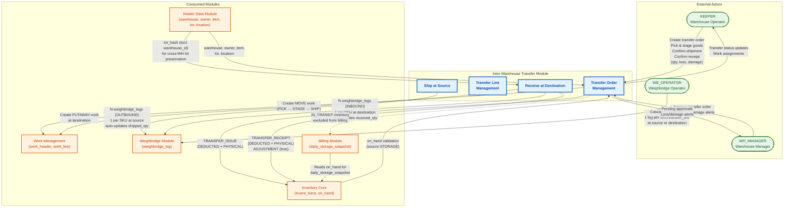
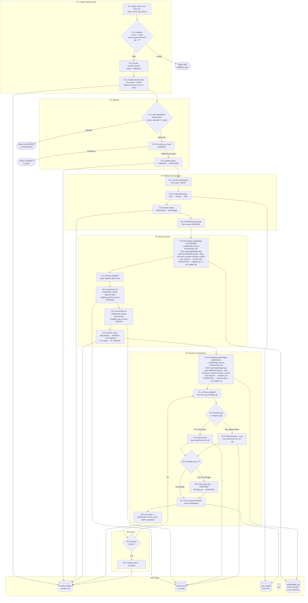
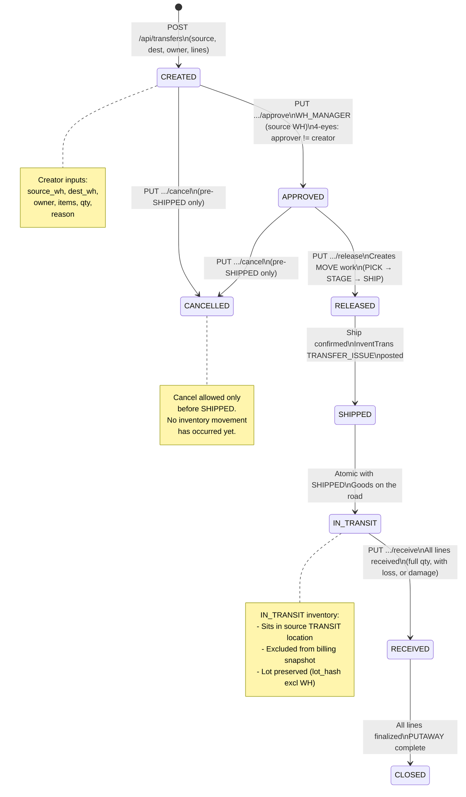
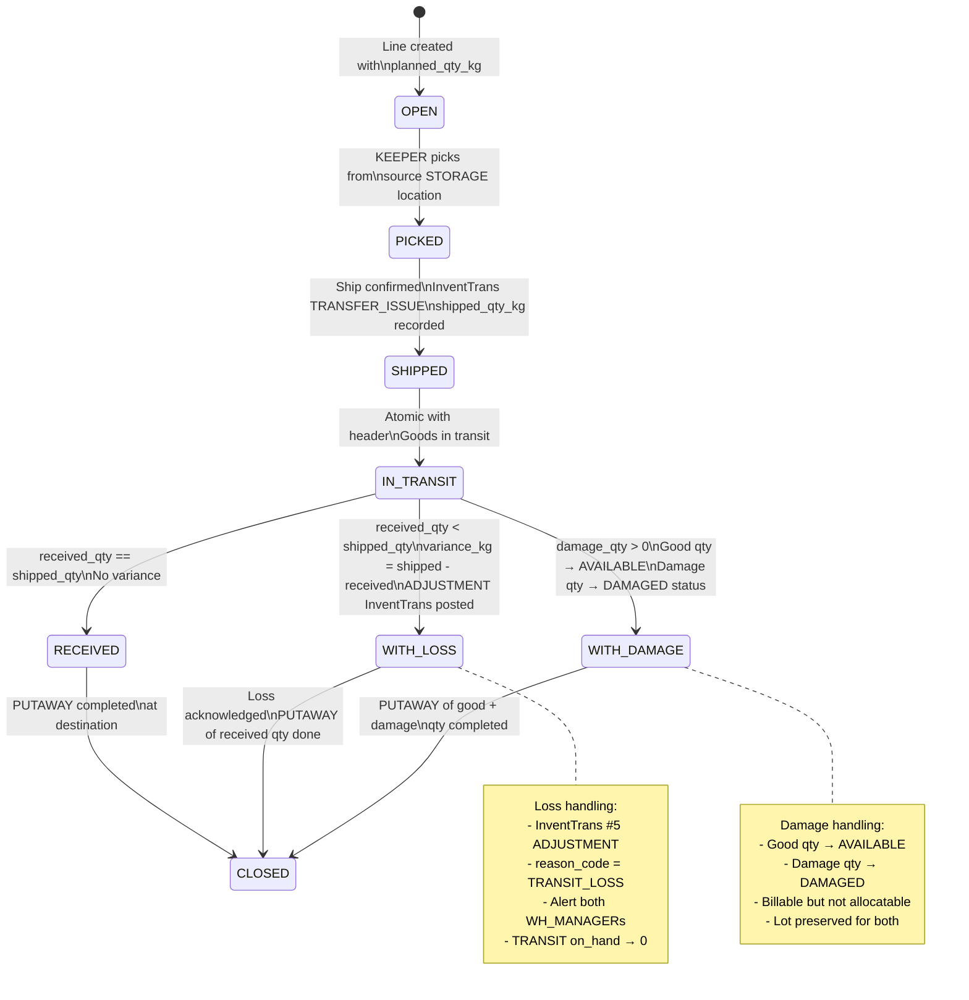
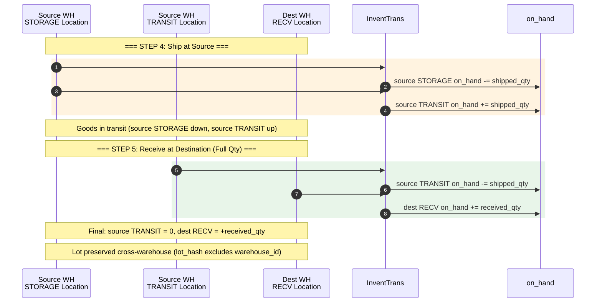
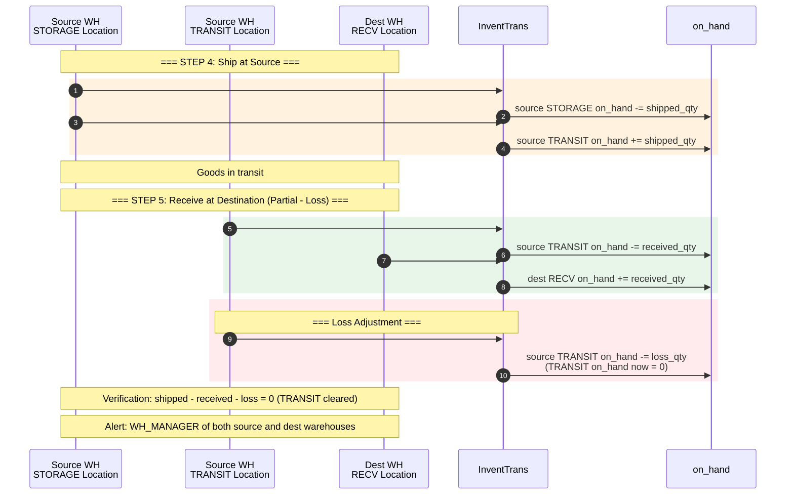
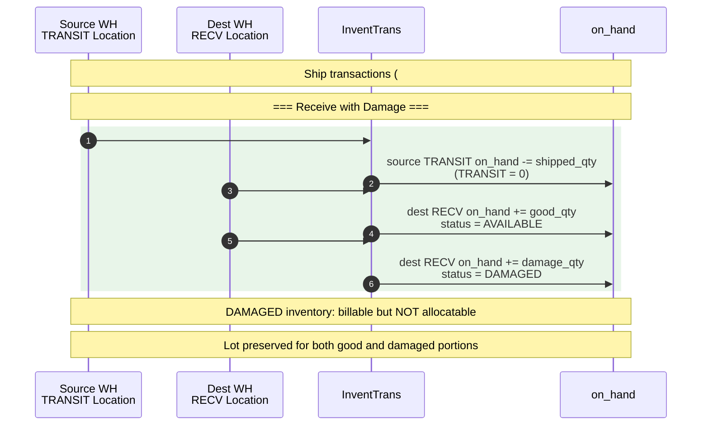

# 06 - Inter-Warehouse Transfer: Data Flow Diagram

> Module scope: Inter-warehouse transfer of inventory with full traceability, transit tracking, and loss/damage handling.
> Tables: `transfer_header`, `transfer_line`, `work_header`, `work_line` (reused MOVE type), `invent_trans`, `on_hand`, `weighbridge_log`.
> Integration: Inventory Core (InventTrans), Weighbridge (N logs per transfer, 1 per SKU), Work Management (MOVE), Billing (TRANSIT excluded).

---

## Table of Contents

1. [Context Diagram](#1-context-diagram)
2. [Process Flow Diagram](#2-process-flow-diagram)
3. [State Machine Diagrams](#3-state-machine-diagrams)
4. [InventTrans Posting Diagram](#4-inventtrans-posting-diagram)
5. [Inventory Balance Verification](#5-inventory-balance-verification)
6. [Data Flow Table](#6-data-flow-table)
7. [Frontend Guide](#7-frontend-guide)
8. [Backend Guide](#8-backend-guide)

---

## 1. Context Diagram

High-level view showing the Transfer module and its external interactions.

---

## 2. Process Flow Diagram

End-to-end process: Create, Approve, Release, Ship, In-Transit, Receive, Close.

---

## 3. State Machine Diagrams

### 3.1 Transfer Header Status

### 3.2 Transfer Line Status

---

## 4. InventTrans Posting Diagram

### 4.1 Full Receive (received_qty == shipped_qty)

### 4.2 Partial Receive with Transit Loss (received_qty < shipped_qty)

### 4.3 Receive with Damage (damage_qty > 0)

---

## 5. Inventory Balance Verification

### 5.1 Balance at Each Step (Example: shipped = 1000 kg, received = 950 kg, loss = 50 kg)

| Step | Event | Source STORAGE | Source TRANSIT | Dest RECV | System Total | Notes |
|------|-------|---------------|----------------|-----------|-------------|-------|
| 0 | Before transfer | 1000 | 0 | 0 | **1000** | Initial state |
| 1 | Create / Approve / Release | 1000 | 0 | 0 | **1000** | No inventory movement yet |
| 2 | Ship (#1 + #2) | **0** | **1000** | 0 | **1000** | STORAGE -1000, TRANSIT +1000 |
| 3a | Receive - receipt (#3 + #4) | 0 | **50** | **950** | **1000** | TRANSIT -950, RECV +950 |
| 3b | Receive - loss adj (#5) | 0 | **0** | 950 | **950** | TRANSIT -50 (TRANSIT_LOSS) |
| 4 | Final state | **0** | **0** | **950** | **950** | Loss = 50 kg (physical reality) |

### 5.2 Balance Invariants

| Invariant | Formula | Expected |
|-----------|---------|----------|
| TRANSIT clears to zero | `shipped_qty - received_qty - loss_qty` | `= 0` |
| Source STORAGE reduction | `original_on_hand - shipped_qty` | Matches post-ship on_hand |
| Dest RECV addition | `received_qty` | Matches post-receive on_hand |
| System total change | `post_total - pre_total` | `= -loss_qty` (physical loss) |
| Billing exclusion | IN_TRANSIT inventory | Not in `daily_storage_snapshot` |

### 5.3 Full Receive (No Loss) Example: shipped = received = 1000 kg

| Step | Event | Source STORAGE | Source TRANSIT | Dest RECV | System Total |
|------|-------|---------------|----------------|-----------|-------------|
| 0 | Before transfer | 1000 | 0 | 0 | **1000** |
| 1 | Ship (#1 + #2) | **0** | **1000** | 0 | **1000** |
| 2 | Receive (#3 + #4) | 0 | **0** | **1000** | **1000** |

System total preserved: no loss.

---

## 6. Data Flow Table

### 6.1 Transfer Order Lifecycle

| Step | Process | Input | Output | API Endpoint | Validation / Business Rule |
|------|---------|-------|--------|--------------|---------------------------|
| 1 | Create Transfer Order | `{ source_warehouse_id, dest_warehouse_id, owner_id, transfer_reason, lines: [{ item_id, lot_id?, planned_qty_kg }] }` | `transfer_header` (CREATED) + `transfer_line[]` (OPEN) | `POST /api/transfers` | BR-T01: `source_wh != dest_wh`. BR-T02: owner has `owner_warehouse_access` to both warehouses. BR-T03: `planned_qty_kg > 0`. Optional: `lot_id` specified or FIFO selection |
| 2 | Approve Transfer | `{ transfer_id }` | Header status CREATED -> APPROVED | `PUT /api/transfers/{id}/approve` | BR-T04: Caller has WH_MANAGER role for source warehouse. BR-T05: `approver != creator` (4-eyes principle). BR-T06: Re-check `on_hand >= planned_qty` for each line at source STORAGE |
| 3 | Release for Execution | `{ transfer_id }` | Header APPROVED -> RELEASED. Creates `work_header` (MOVE) + `work_line[]` (PICK, STAGE, SHIP) | `PUT /api/transfers/{id}/release` | Work steps created: PICK from source STORAGE, STAGE to staging area, SHIP to shipping dock |
| 4a | Weighbridge at Source (cascading) | `{ document_number: transfer_number, sku, warehouse_code, owner_code, type: OUTBOUND, gross_weight_kg, tare_weight_kg }` per SKU | `weighbridge_log` (COMPLETED). Auto-resolves document_number + sku + warehouse_code + owner_code -> transfer_line. Each COMPLETED log -> `transfer_line.shipped_qty += net_weight_kg` | `POST /api/weighbridge-logs` | N logs per transfer (1 per transfer_line/SKU). OUTBOUND type: gross < tare (loading goods onto truck). Cascading: weigh each SKU separately. Links via `document_number = transfer_number` |
| 4b | Ship at Source | `{ transfer_id }` | Header RELEASED -> SHIPPED -> IN_TRANSIT. Lines -> IN_TRANSIT. InventTrans #1 + #2 posted | `PUT /api/transfers/{id}/ship` | BR-T07: `shipped_qty > 0` (accumulated from weighbridge logs). BR-T08: Two atomic InventTrans posted (TRANSFER_ISSUE DEDUCTED + PHYSICAL) per line |
| 5a | Weighbridge at Destination (cascading) | `{ document_number: transfer_number, sku, warehouse_code, owner_code, type: INBOUND, gross_weight_kg, tare_weight_kg }` per SKU | `weighbridge_log` (COMPLETED). Auto-resolves document_number + sku + warehouse_code + owner_code -> transfer_line. Each COMPLETED log -> `transfer_line.received_qty += net_weight_kg` | `POST /api/weighbridge-logs` | N logs per transfer (1 per transfer_line/SKU). INBOUND type: gross > tare (unloading goods from truck). Cascading: weigh each SKU separately. Links via `document_number = transfer_number` |
| 5b | Receive (Full) | `{ transfer_id, lines: [{ line_id }] }` where `received == shipped` | Lines -> RECEIVED. InventTrans #3 + #4 posted. PUTAWAY work created at dest | `PUT /api/transfers/{id}/receive` | BR-T09: `received_qty == shipped_qty` (received_qty accumulated from weighbridge logs). InventTrans TRANSFER_RECEIPT (DEDUCTED from TRANSIT + PHYSICAL to RECV). Lot preserved cross-WH (`lot_hash` excludes `warehouse_id`) |
| 5c | Receive (with Loss) | `{ transfer_id, lines: [{ line_id }] }` where `received < shipped` | Lines -> WITH_LOSS. InventTrans #3 + #4 + #5 posted. `variance_kg` recorded | `PUT /api/transfers/{id}/receive` | BR-T10: `received_qty < shipped_qty`. #5 ADJUSTMENT (PHYSICAL) for `-loss_qty` from source TRANSIT with `reason_code = TRANSIT_LOSS`. BR-T11: Alert WH_MANAGER of both warehouses |
| 5d | Receive (with Damage) | `{ transfer_id, lines: [{ line_id, damage_qty }] }` where `damage_qty > 0` | Lines -> WITH_DAMAGE. Good qty -> AVAILABLE, Damage qty -> DAMAGED | `PUT /api/transfers/{id}/receive` | BR-T12: `good_qty + damage_qty == received_qty`. Damage qty: billable but not allocatable. Lot preserved for both portions |
| 6 | Cancel | `{ transfer_id, reason }` | Header -> CANCELLED | `PUT /api/transfers/{id}/cancel` | BR-T13: Cancel allowed only before SHIPPED (CREATED, APPROVED, RELEASED). No inventory movement to reverse |

### 6.2 InventTrans Detail

| Txn # | Step | trans_type | physical_status | qty_kg | Location Type | Warehouse | Effect on on_hand |
|-------|------|-----------|----------------|--------|--------------|-----------|------------------|
| #1 | Ship | TRANSFER_ISSUE | DEDUCTED | -shipped_qty | STORAGE | Source | STORAGE -= shipped_qty |
| #2 | Ship | TRANSFER_ISSUE | PHYSICAL | +shipped_qty | TRANSIT | Source | TRANSIT += shipped_qty |
| #3 | Receive | TRANSFER_RECEIPT | DEDUCTED | -received_qty | TRANSIT | Source | TRANSIT -= received_qty |
| #4 | Receive | TRANSFER_RECEIPT | PHYSICAL | +received_qty | RECV | Dest | RECV += received_qty |
| #5 | Receive (loss only) | ADJUSTMENT | PHYSICAL | -loss_qty | TRANSIT | Source | TRANSIT -= loss_qty (to zero) |

---

## 7. Frontend Guide

### 7.1 UI Screens

| Screen | Route | Purpose | Key Components |
|--------|-------|---------|---------------|
| **Transfer Order List** | `/transfers` | View all transfer orders with filters | DataTable with status badge, source/dest WH, owner, created date. Filter by status, warehouse, owner, date range |
| **Create Transfer Order** | `/transfers/create` | Create new transfer with line items | Form: source WH picker, dest WH picker, owner dropdown, reason input. Lines: item selector (with lot picker or FIFO), qty input. Real-time on_hand check |
| **Transfer Detail** | `/transfers/:id` | View transfer with full line detail and history | Header info card, line items table (planned/shipped/received/variance), status timeline, InventTrans audit trail, linked weighbridge logs (N per transfer, 1 per SKU) |
| **Transfer Approval** | `/transfers/:id/approve` | WH_MANAGER approves pending transfers | Approval form with on_hand availability display. Approve/Reject buttons. 4-eyes check (approver != creator shown) |
| **Ship Confirmation** | `/transfers/:id/ship` | Confirm shipment at source warehouse | Cascading weighbridge UI: weigh each SKU separately via `POST /api/weighbridge-logs` (type=OUTBOUND). Each COMPLETED log auto-updates transfer_line.shipped_qty += net_weight_kg. Progress tracker shows weighed/total lines. Confirm button posts TRANSFER_ISSUE |
| **Receive Confirmation** | `/transfers/:id/receive` | Confirm receipt at destination with variance recording | Cascading weighbridge UI: weigh each SKU separately via `POST /api/weighbridge-logs` (type=INBOUND). Each COMPLETED log auto-updates transfer_line.received_qty += net_weight_kg. Progress tracker shows weighed/total lines. Variance auto-calculated (received vs shipped). Loss/damage reason capture. Summary panel showing balance impact |
| **Transfer History** | `/transfers/history` | Historical view of completed/cancelled transfers | Read-only list with full audit. Filter by date range, status (CLOSED, CANCELLED), warehouse, owner |

### 7.2 API Calls per Screen

| Screen | Load (on mount) | User Actions |
|--------|-----------------|-------------|
| Transfer Order List | `GET /api/transfers?page=1&pageSize=20&status=&warehouse_id=&owner_id=` | Navigate to detail: `GET /api/transfers/{id}` |
| Create Transfer Order | `GET /api/warehouses`, `GET /api/owners`, `GET /api/items?owner_id=`, `GET /api/on-hand?warehouse_id=&item_id=` (real-time check) | Submit: `POST /api/transfers` |
| Transfer Detail | `GET /api/transfers/{id}?include=lines,inventTrans,weighbridgeLogs` | Status-dependent action buttons |
| Transfer Approval | `GET /api/transfers/{id}`, `GET /api/on-hand?warehouse_id={source}&item_id=` (per line) | Approve: `PUT /api/transfers/{id}/approve`. Reject: `PUT /api/transfers/{id}/cancel` |
| Ship Confirmation | `GET /api/transfers/{id}` (show lines to weigh) | Weigh each SKU: `POST /api/weighbridge-logs` (type=OUTBOUND, document_number=transfer_number, per SKU). Each COMPLETED log auto-updates shipped_qty. Confirm: `PUT /api/transfers/{id}/ship` |
| Receive Confirmation | `GET /api/transfers/{id}` (show shipped_qty per line) | Weigh each SKU: `POST /api/weighbridge-logs` (type=INBOUND, document_number=transfer_number, per SKU). Each COMPLETED log auto-updates received_qty. Confirm: `PUT /api/transfers/{id}/receive` with `{ lines: [{ line_id, damage_qty? }] }` |

### 7.3 UI Validation (client-side)

| Field | Rule |
|-------|------|
| `source_warehouse_id` | Required. Cannot equal `dest_warehouse_id` |
| `dest_warehouse_id` | Required. Cannot equal `source_warehouse_id` |
| `owner_id` | Required. Must have access to both selected warehouses |
| `planned_qty_kg` | Required. Positive number > 0 |
| `shipped_qty_kg` | Required. Positive number > 0. Default = `planned_qty_kg` |
| `received_qty_kg` | Required. Positive number >= 0. Must be <= `shipped_qty_kg` |
| `damage_qty` | Optional. >= 0. Must be <= `received_qty_kg` |
| `transfer_reason` | Required. Free text, max 500 chars |
| `item_id` per line | Required. Must exist and be active for the selected owner |
| `lot_id` per line | Optional. If specified, must belong to selected item at source WH |

### 7.4 Status-Dependent UI Actions

| Current Status | Available Actions | Button | Visible To |
|---------------|-------------------|--------|-----------|
| CREATED | Approve, Cancel | `Approve` / `Cancel` | WH_MANAGER (source) |
| APPROVED | Release, Cancel | `Release` / `Cancel` | KEEPER / WH_MANAGER |
| RELEASED | Ship | `Confirm Shipment` | KEEPER (source) |
| IN_TRANSIT | Receive | `Confirm Receipt` | KEEPER (dest) |
| RECEIVED | (auto-close) | - | - |
| CLOSED | (read-only) | - | All |
| CANCELLED | (read-only) | - | All |

---

## 8. Backend Guide

### 8.1 Commands (Write Operations)

| Command | Handler | Validation | Side Effects |
|---------|---------|------------|-------------|
| `CreateTransferCommand` | `CreateTransferHandler` | BR-T01: `source_wh != dest_wh`. BR-T02: Owner access to both WH. BR-T03: `qty > 0` per line. Items active and owned by `owner_id`. Optional lot validation | Creates `transfer_header` (CREATED, generates transfer_number) + `transfer_line[]` (OPEN). Audit log |
| `ApproveTransferCommand` | `ApproveTransferHandler` | BR-T04: Caller is WH_MANAGER of source WH. BR-T05: `approver_id != created_by`. BR-T06: `on_hand >= planned_qty` per line at source STORAGE | Updates header CREATED -> APPROVED. Audit log |
| `ReleaseTransferCommand` | `ReleaseTransferHandler` | Header must be APPROVED | Creates `work_header` (type=MOVE) + `work_line[]` (PICK, STAGE, SHIP). Header APPROVED -> RELEASED. Audit log |
| `ShipTransferCommand` | `ShipTransferHandler` | Header must be RELEASED. BR-T07: `shipped_qty > 0` per line (accumulated from weighbridge logs). On_hand sufficient at source STORAGE | Posts InventTrans #1 (TRANSFER_ISSUE DEDUCTED) + #2 (TRANSFER_ISSUE PHYSICAL). Updates header -> IN_TRANSIT, lines -> IN_TRANSIT. Weighbridge logs already linked via document_number = transfer_number. Audit log |
| `ReceiveTransferCommand` | `ReceiveTransferHandler` | Header must be IN_TRANSIT. `received_qty >= 0` (accumulated from weighbridge logs). `damage_qty >= 0`. `damage_qty <= received_qty` | Posts InventTrans #3 + #4. If loss: #5 ADJUSTMENT. Creates PUTAWAY work at dest. Updates line status (RECEIVED / WITH_LOSS / WITH_DAMAGE). If all lines done: header -> RECEIVED -> CLOSED. Weighbridge logs already linked via document_number = transfer_number. Audit log. Loss alert to WH_MANAGERs |
| `CancelTransferCommand` | `CancelTransferHandler` | BR-T13: Status must be CREATED, APPROVED, or RELEASED. No inventory posted yet | Header -> CANCELLED. Cancel any open work. Audit log |

### 8.2 Queries (Read Operations)

| Query | Handler | Returns | Filters |
|-------|---------|---------|---------|
| `ListTransfersQuery` | `ListTransfersHandler` | Paginated `TransferHeaderDto[]` | `status`, `source_warehouse_id`, `dest_warehouse_id`, `owner_id`, `date_range`, `search` (transfer_number) |
| `GetTransferByIdQuery` | `GetTransferByIdHandler` | `TransferDetailDto` (header + lines + inventTrans + work + weighbridge_logs[]) | - |
| `GetTransferHistoryQuery` | `GetTransferHistoryHandler` | Paginated `TransferHeaderDto[]` (CLOSED/CANCELLED) | `date_range`, `warehouse_id`, `owner_id` |

### 8.3 Validation Rules Summary

| Rule ID | Rule | Applies To | Error Code |
|---------|------|-----------|------------|
| BR-T01 | Source warehouse must not equal destination warehouse | `CreateTransferCommand` | `SAME_SOURCE_DEST_WAREHOUSE` |
| BR-T02 | Owner must have `owner_warehouse_access` to both source and destination warehouses | `CreateTransferCommand` | `OWNER_NO_WAREHOUSE_ACCESS` |
| BR-T03 | `planned_qty_kg` must be > 0 for each line | `CreateTransferCommand` | `INVALID_QUANTITY` |
| BR-T04 | Approver must hold WH_MANAGER role for the source warehouse | `ApproveTransferCommand` | `INSUFFICIENT_ROLE` |
| BR-T05 | Approver must not be the same user as the creator (4-eyes principle) | `ApproveTransferCommand` | `FOUR_EYES_VIOLATION` |
| BR-T06 | Source warehouse must have sufficient `on_hand` (>= planned_qty) in STORAGE locations per line | `ApproveTransferCommand` | `INSUFFICIENT_ON_HAND` |
| BR-T07 | `shipped_qty_kg` must be > 0 for each line (accumulated from OUTBOUND weighbridge logs) | `ShipTransferCommand` | `INVALID_SHIPPED_QUANTITY` |
| BR-T08 | Ship must atomically post both TRANSFER_ISSUE transactions (#1 DEDUCTED + #2 PHYSICAL) | `ShipTransferCommand` | N/A (enforced by transaction scope) |
| BR-T09 | Full receive: `received_qty == shipped_qty` implies line status = RECEIVED | `ReceiveTransferCommand` | N/A (auto-determined) |
| BR-T10 | Transit loss: `received_qty < shipped_qty` triggers ADJUSTMENT InventTrans (#5) with `reason_code = TRANSIT_LOSS` | `ReceiveTransferCommand` | N/A (auto-determined) |
| BR-T11 | Transit loss must trigger alert to WH_MANAGER of both source and destination warehouses | `ReceiveTransferCommand` | N/A (side effect) |
| BR-T12 | `good_qty + damage_qty` must equal `received_qty`; damage inventory gets DAMAGED status (billable, not allocatable) | `ReceiveTransferCommand` | `DAMAGE_QTY_MISMATCH` |
| BR-T13 | Cancel allowed only in pre-SHIPPED states (CREATED, APPROVED, RELEASED) | `CancelTransferCommand` | `CANNOT_CANCEL_AFTER_SHIP` |

### 8.4 Cross-Module Integration

| Integration Point | Module | Direction | Details |
|-------------------|--------|-----------|---------|
| On-hand validation | Inventory Core | Transfer reads | Check `on_hand >= planned_qty` at source STORAGE during approve |
| InventTrans posting | Inventory Core | Transfer writes | 4-5 InventTrans records per complete transfer (TRANSFER_ISSUE x2, TRANSFER_RECEIPT x2, optional ADJUSTMENT) |
| Lot preservation | Master Data (Lot) | Transfer reads | `lot_hash` excludes `warehouse_id`, enabling same lot to exist at both source and dest warehouse |
| MOVE work creation | Work Management | Transfer writes | Creates `work_header` (type=MOVE) with PICK -> STAGE -> SHIP steps at source; PUTAWAY work at dest after receive |
| Weighbridge | Weighbridge Module | Weighbridge writes -> Transfer | N `weighbridge_log` records per transfer (1 per transfer_line/SKU). Linked via `document_number = transfer_number`. Each log auto-resolves: document_number + sku + warehouse_code + owner_code -> transfer_line. OUTBOUND at source (shipped_qty += net_weight_kg), INBOUND at destination (received_qty += net_weight_kg). API: `POST /api/weighbridge-logs` (shared endpoint) |
| Billing exclusion | Billing Module | Billing reads | Inventory with IN_TRANSIT status at TRANSIT location is excluded from `daily_storage_snapshot` (not billable during transit) |
| Loss alerting | Notification | Transfer writes | Transit loss triggers alert to WH_MANAGER of both warehouses with loss details and reason code |

### 8.5 Database Transaction Boundaries

| Operation | Transaction Scope | Reason |
|-----------|------------------|--------|
| Weighbridge (per SKU) | Single DB transaction per weighbridge_log: resolve transfer_line + update shipped_qty or received_qty += net_weight_kg | Each log independently resolves and updates its transfer_line; cascading approach (1 log per SKU) |
| Ship | Single DB transaction wrapping: InventTrans #1 + #2 + header/line status update | Atomic: either both STORAGE deducted and TRANSIT credited, or neither. shipped_qty already accumulated from OUTBOUND weighbridge logs |
| Receive (full) | Single DB transaction wrapping: InventTrans #3 + #4 + header/line status + PUTAWAY work creation | Atomic: TRANSIT cleared and RECV credited together. received_qty already accumulated from INBOUND weighbridge logs |
| Receive (with loss) | Single DB transaction wrapping: InventTrans #3 + #4 + #5 + header/line status + PUTAWAY work | Atomic: ensures TRANSIT location always clears to zero |
| Cancel | Single DB transaction: header status + cancel open work lines | No inventory to reverse; only status changes |
