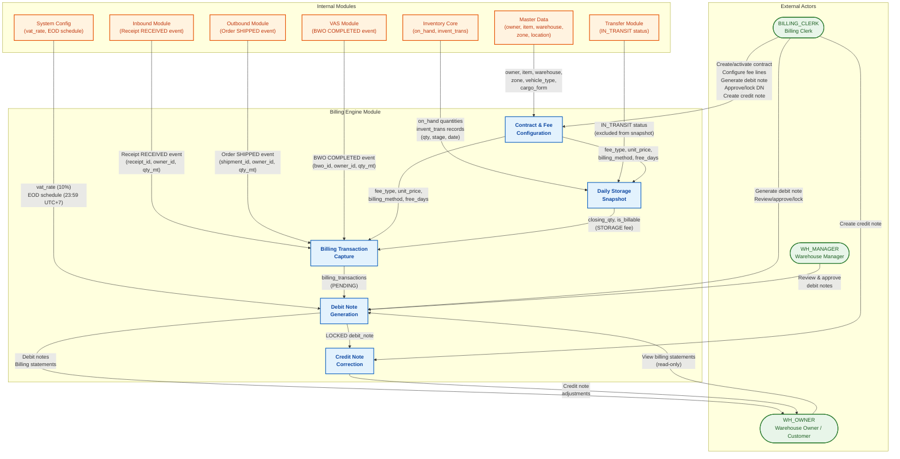
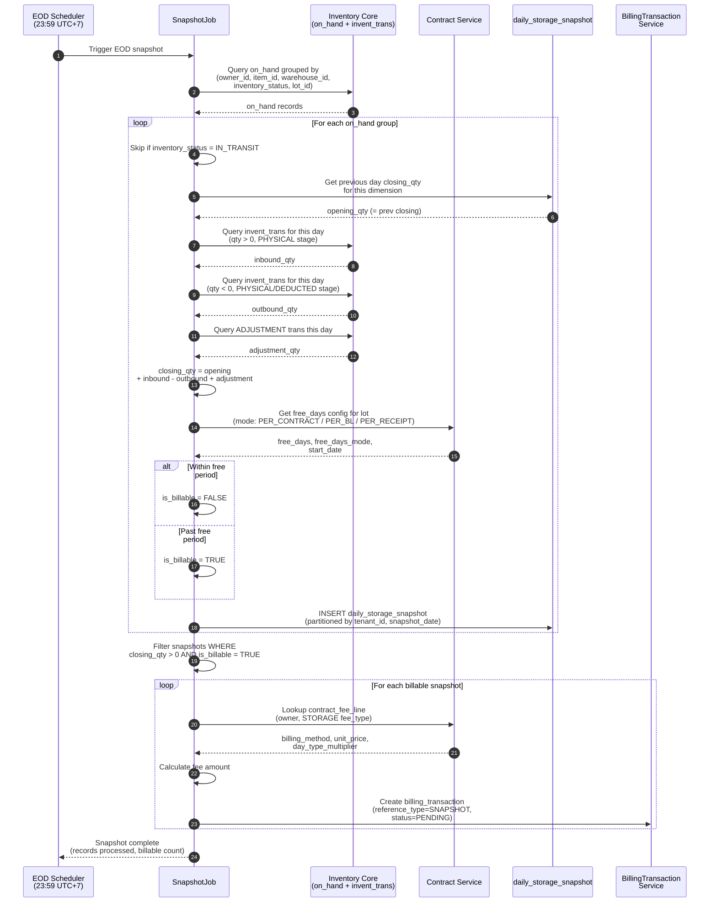
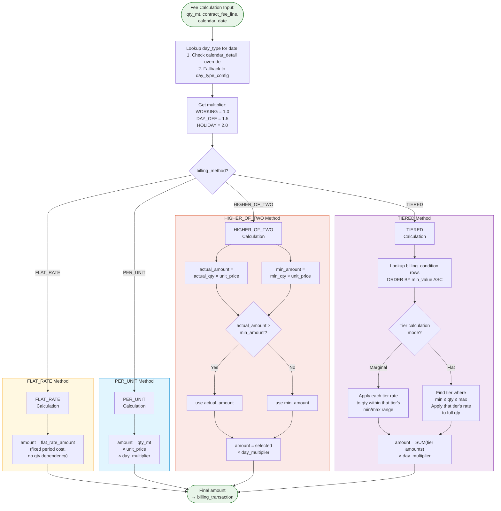
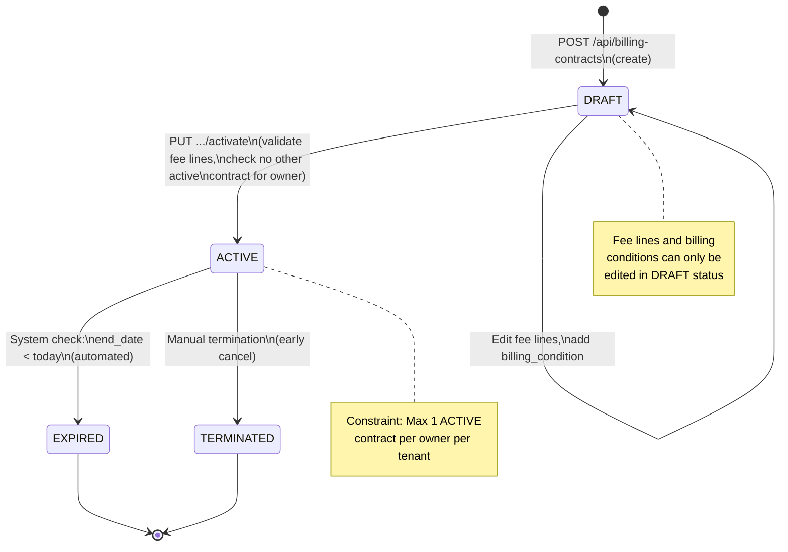
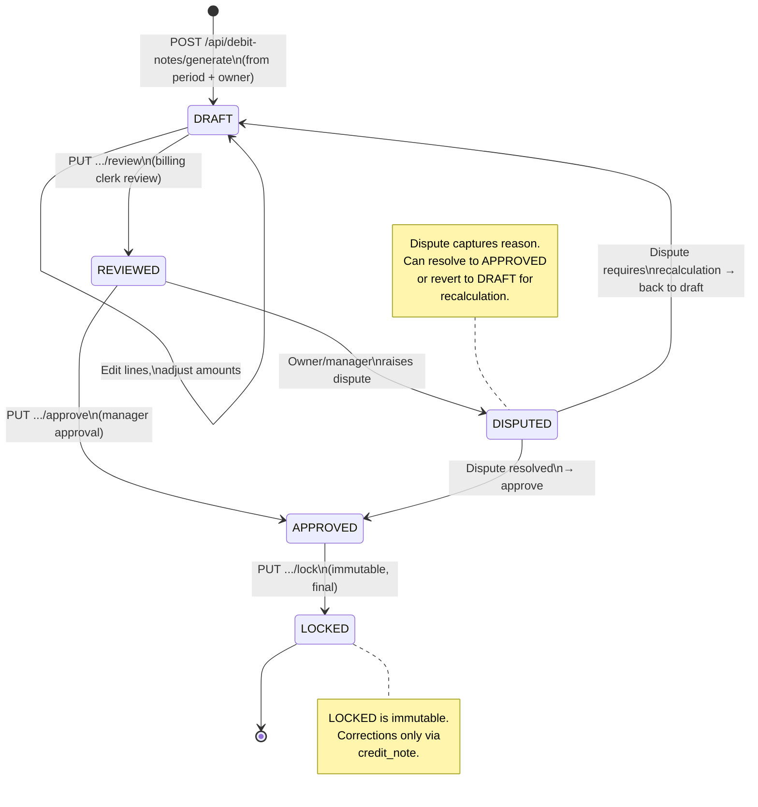
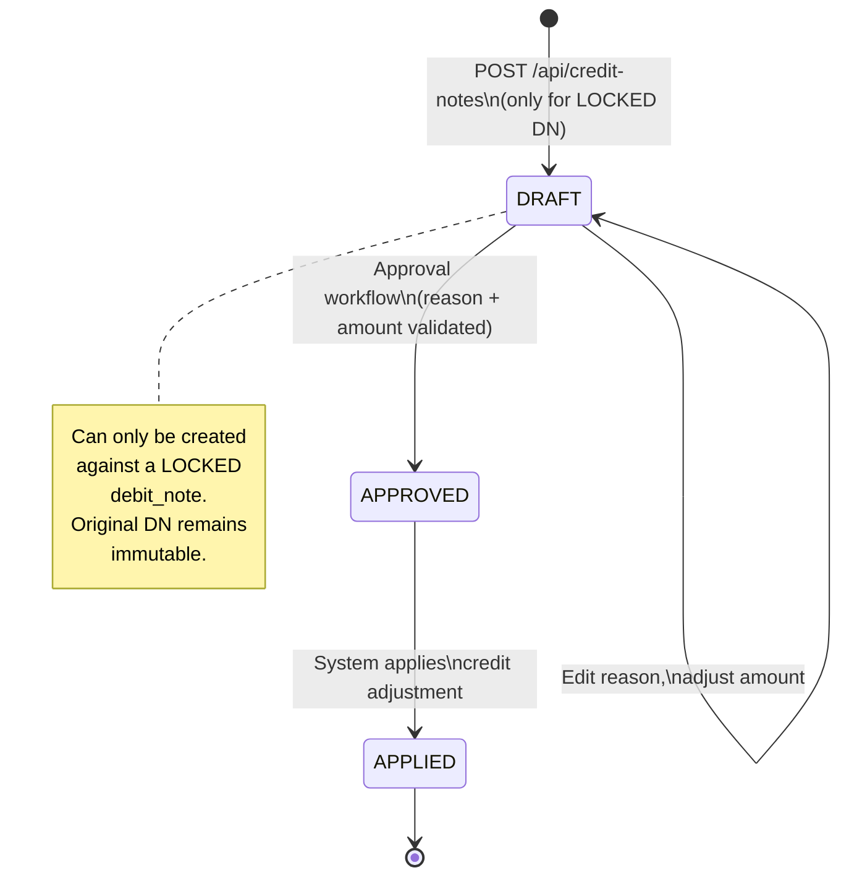

# 07 - Billing Engine: Data Flow Diagram

> **Implementation Notes (TASK 0):**
> - `BillingTransaction` uses `AppendOnlyEntity` base class (append-only).
> - Other billing entities use `TenantEntity` base class.
> - Schema: `billing` (DatabaseConstants.Schemas.Billing)

> Module scope: 11 tables covering billing contracts, fee calculation, daily storage snapshots, debit notes, and credit notes.
> The Billing Engine transforms warehouse activity into financial records through automated event capture and configurable fee schedules.

---

## Table of Contents

1. [Context Diagram](#1-context-diagram)
2. [Process Flow Diagram](#2-process-flow-diagram)
3. [Daily Storage Snapshot Flow](#3-daily-storage-snapshot-flow)
4. [Fee Calculation Methods](#4-fee-calculation-methods)
5. [State Machine Diagrams](#5-state-machine-diagrams)
6. [Auto-Capture Triggers](#6-auto-capture-triggers)
7. [Data Flow Table](#7-data-flow-table)
8. [Frontend Guide](#8-frontend-guide)
9. [Backend Guide](#9-backend-guide)

---

## 1. Context Diagram

High-level view showing the Billing Engine module and all external data sources it interacts with.



---

## 2. Process Flow Diagram

End-to-end billing pipeline: Snapshot → Fee Calculation → Billing Transaction → Debit Note → Credit Note.

```mermaid
flowchart TD
    subgraph "P1: Daily Storage Snapshot (EOD 23:59 UTC+7)"
        P1_1["P1.1 Query on_hand\ngrouped by (owner_id, item_id,\nwarehouse_id, inventory_status, lot_id)"]
        P1_2{"P1.2 Status =\nIN_TRANSIT?"}
        P1_3["P1.3 Calculate dimensions:\nopening = prev closing\ninbound = SUM(trans qty > 0, PHYSICAL)\noutbound = SUM(trans qty < 0, PHYSICAL/DEDUCTED)\nadjustment = ADJUSTMENT trans\nclosing = opening + inbound - outbound + adjustment"]
        P1_4{"P1.4 Within\nfree days?"}
        P1_5["P1.5 Mark is_billable = FALSE"]
        P1_6["P1.6 Mark is_billable = TRUE"]
        P1_7["P1.7 Insert daily_storage_snapshot\n(partitioned by tenant_id, snapshot_date)"]
    end

    subgraph "P2: Fee Calculation"
        P2_1["P2.1 Lookup contract_fee_line\nfor owner × fee_type"]
        P2_2{"P2.2 billing_method?"}
        P2_3["P2.3 FLAT_RATE\namount = flat_rate_amount"]
        P2_4["P2.4 PER_UNIT\namount = qty × unit_price × day_multiplier"]
        P2_5["P2.5 HIGHER_OF_TWO\namount = MAX(actual_qty, min_qty)\n× unit_price × day_multiplier"]
        P2_6["P2.6 TIERED\nlookup billing_condition tiers\napply marginal/flat rate"]
        P2_7["P2.7 Apply day_type_multiplier\n(WORKING=1.0 / DAY_OFF=1.5 / HOLIDAY=2.0)"]
    end

    subgraph "P3: Billing Transaction Capture"
        P3_1["P3.1 Create billing_transaction\nstatus = PENDING"]
        P3_2["P3.2 Store reference_type + reference_id\n(SNAPSHOT / RECEIPT / SHIPMENT / BAGGING)"]
    end

    subgraph "P4: Debit Note Generation (Monthly)"
        P4_1["P4.1 Select owner + billing period"]
        P4_2["P4.2 Query billing_transaction\nWHERE status=PENDING\nAND debit_note_id IS NULL\nAND within period"]
        P4_3["P4.3 Group by fee_type\n→ aggregate into debit_note_line"]
        P4_4["P4.4 Calculate totals:\nsubtotal + VAT (10%) = total_amount"]
        P4_5["P4.5 Create debit_note\nstatus = DRAFT"]
    end

    subgraph "P5: Debit Note Workflow"
        P5_1["P5.1 DRAFT"]
        P5_2["P5.2 REVIEWED"]
        P5_3{"P5.3 Disputed?"}
        P5_4["P5.4 DISPUTED\n→ resolve"]
        P5_5["P5.5 APPROVED"]
        P5_6["P5.6 LOCKED\n(immutable)"]
    end

    subgraph "P6: Credit Note (Corrections)"
        P6_1{"P6.1 DN status\n= LOCKED?"}
        P6_2["P6.2 Create credit_note\nreason + adjustment_amount\nstatus = DRAFT"]
        P6_3["P6.3 Approve credit_note\nstatus = APPROVED → APPLIED"]
        P6_4["P6.4 Original DN\nremains immutable"]
    end

    subgraph "Data Stores"
        DS1[("daily_storage_snapshot")]
        DS2[("billing_transaction")]
        DS3[("debit_note\ndebit_note_line")]
        DS4[("credit_note")]
        DS5[("billing_contract\ncontract_fee_line\nbilling_condition")]
        DS6[("fee_type\nday_type_config\ncalendar_detail")]
    end

    %% P1 flow
    P1_1 --> P1_2
    P1_2 -- "Yes → Exclude" --> P1_7
    P1_2 -- "No" --> P1_3
    P1_3 --> P1_4
    P1_4 -- "Yes" --> P1_5
    P1_4 -- "No" --> P1_6
    P1_5 --> P1_7
    P1_6 --> P1_7
    P1_7 --> DS1

    %% P1 → P2
    DS1 -- "closing_qty, is_billable" --> P2_1
    DS5 -- "fee_line config" --> P2_1
    DS6 -- "day_type_multiplier" --> P2_7
    P2_1 --> P2_2
    P2_2 -- "FLAT_RATE" --> P2_3
    P2_2 -- "PER_UNIT" --> P2_4
    P2_2 -- "HIGHER_OF_TWO" --> P2_5
    P2_2 -- "TIERED" --> P2_6
    P2_3 --> P2_7
    P2_4 --> P2_7
    P2_5 --> P2_7
    P2_6 --> P2_7

    %% P2 → P3
    P2_7 --> P3_1
    P3_1 --> P3_2
    P3_2 --> DS2

    %% P3 → P4
    DS2 -- "PENDING transactions" --> P4_2
    P4_1 --> P4_2
    P4_2 --> P4_3
    P4_3 --> P4_4
    P4_4 --> P4_5
    P4_5 --> DS3

    %% P4 → P5
    DS3 --> P5_1
    P5_1 --> P5_2
    P5_2 --> P5_3
    P5_3 -- "Yes" --> P5_4
    P5_4 --> P5_5
    P5_3 -- "No" --> P5_5
    P5_5 --> P5_6

    %% P5 → P6
    P5_6 --> P6_1
    P6_1 -- "Yes" --> P6_2
    P6_1 -- "No → Reject" --> P6_1
    P6_2 --> P6_3
    P6_3 --> P6_4
    P6_3 --> DS4
```



---

## 3. Daily Storage Snapshot Flow

Sequence diagram for the End-Of-Day (23:59 UTC+7) automated snapshot job.



---

## 4. Fee Calculation Methods

Decision flowchart for the four billing methods supported by `contract_fee_line.billing_method`.



---

## 5. State Machine Diagrams

### 5.1 Billing Contract Lifecycle



### 5.2 Debit Note Lifecycle



### 5.3 Credit Note Lifecycle



---

## 6. Auto-Capture Triggers

Events that automatically create `billing_transaction` records.

| # | Fee Group | Trigger Event | Source Module | reference_type | reference_id | Qty Source | Timing |
|---|-----------|--------------|--------------|----------------|-------------|-----------|--------|
| 1 | **STORAGE** | EOD snapshot job | Inventory Core | `SNAPSHOT` | `daily_storage_snapshot.id` | `closing_qty_mt` (where `is_billable = TRUE`) | Daily, 23:59 UTC+7 |
| 2 | **HANDLING_IN** | Receipt status → `RECEIVED` | Inbound | `RECEIPT` | `receipt.id` | `receipt_line.received_qty_mt` | On event |
| 3 | **HANDLING_OUT** | Order status → `SHIPPED` | Outbound | `SHIPMENT` | `shipment.id` | `shipment_line.shipped_qty_mt` | On event |
| 4 | **BAGGING** | BWO status → `COMPLETED` | VAS | `BAGGING` | `bagging_work_order.id` | `bwo.output_qty_mt` | On event |
| 5 | **CONTAINER_STUFFING** | Stuffing order completed | Outbound / VAS | `STUFFING` | `stuffing_order.id` | `stuffing_line.qty_mt` | On event |
| 6 | **OTHER** | Manual entry by billing clerk | Billing | `MANUAL` | `null` | Manual input | On demand |

**Calculation Formula (all auto-captured):**

```
amount = qty_mt × unit_price × day_type_multiplier
```

Where `day_type_multiplier` is resolved from `calendar_detail` (override) or `day_type_config` (default) for the transaction date.

---

## 7. Data Flow Table

Comprehensive data flow across all billing processes.

| # | Source | Destination | Data Elements | Trigger | Direction |
|---|--------|-------------|---------------|---------|-----------|
| 1 | `on_hand` | `daily_storage_snapshot` | owner_id, item_id, warehouse_id, inventory_status, lot_id, qty | EOD job (23:59) | Read |
| 2 | `invent_trans` | `daily_storage_snapshot` | qty, stage, trans_date, direction | EOD job (23:59) | Read |
| 3 | `daily_storage_snapshot` (prev day) | `daily_storage_snapshot` (today) | closing_qty → opening_qty | EOD job | Read |
| 4 | `contract_fee_line` | Fee Calculation | billing_method, unit_price, free_days, free_days_mode | On calculation | Read |
| 5 | `billing_condition` | Fee Calculation (TIERED) | min_value, max_value, unit, tier_price | TIERED method only | Read |
| 6 | `day_type_config` | Fee Calculation | day_type, multiplier | On calculation | Read |
| 7 | `calendar_detail` | Fee Calculation | calendar_date, day_type (override) | On calculation | Read |
| 8 | `fee_type` | `contract_fee_line` | code, fee_group | Contract setup | Read |
| 9 | Fee Calculation | `billing_transaction` | owner_id, contract_id, fee_type, qty, amount, reference_type/id | Auto-capture event | Write |
| 10 | `billing_transaction` | `debit_note_line` | fee_type, qty, unit_price, amount (aggregated) | DN generation | Read → Write |
| 11 | `debit_note_line` | `debit_note` | subtotal, vat_amount, total_amount | DN generation | Write |
| 12 | `system_config` | `debit_note` | vat_rate (default 10%) | DN generation | Read |
| 13 | `debit_note` (LOCKED) | `credit_note` | debit_note_id, original amounts | CN creation | Read |
| 14 | `billing_contract` | `contract_fee_line` | contract_id, owner_id, status | Contract setup | Parent |
| 15 | Inbound (Receipt RECEIVED) | `billing_transaction` | receipt_id, owner_id, qty_mt | Event | Write |
| 16 | Outbound (Order SHIPPED) | `billing_transaction` | shipment_id, owner_id, qty_mt | Event | Write |
| 17 | VAS (BWO COMPLETED) | `billing_transaction` | bwo_id, owner_id, qty_mt | Event | Write |

---

## 8. Frontend Guide

### Screen Inventory

| # | Screen | Route | Primary Entity | Key Actions |
|---|--------|-------|---------------|-------------|
| 1 | Contract Management | `/billing/contracts` | `billing_contract` | List, Create (DRAFT), Activate, View details |
| 2 | Contract Detail / Fee Lines | `/billing/contracts/:id` | `contract_fee_line`, `billing_condition` | Add/edit fee lines, configure tiers, activate contract |
| 3 | Fee Type Configuration | `/billing/fee-types` | `fee_type` | CRUD fee types by group |
| 4 | Day Type Configuration | `/billing/day-types` | `day_type_config` | Configure multipliers for WORKING/DAY_OFF/HOLIDAY |
| 5 | Calendar Management | `/billing/calendar` | `calendar_detail` | Set day type overrides per date (holidays, special days) |
| 6 | Daily Snapshot Viewer | `/billing/snapshots` | `daily_storage_snapshot` | Filter by owner, date range; view qty breakdown per dimension |
| 7 | Billing Transaction List | `/billing/transactions` | `billing_transaction` | Search/filter by owner, fee_type, status, date range |
| 8 | Debit Note List | `/billing/debit-notes` | `debit_note` | List all DNs with status filter |
| 9 | Debit Note Generation Wizard | `/billing/debit-notes/generate` | `debit_note`, `debit_note_line` | Step 1: Select owner + period → Step 2: Preview lines → Step 3: Generate |
| 10 | Debit Note Detail | `/billing/debit-notes/:id` | `debit_note`, `debit_note_line` | View lines, Review, Approve, Lock workflow actions |
| 11 | Credit Note Creation | `/billing/credit-notes/new` | `credit_note` | Select LOCKED DN, enter reason + amount, submit |
| 12 | Credit Note List | `/billing/credit-notes` | `credit_note` | List all CNs with status filter |
| 13 | Billing Dashboard | `/billing/dashboard` | Aggregated views | Revenue summary, pending vs invoiced, owner breakdown |

### UX Patterns

- **Contract activation**: Validate at least one fee line exists before allowing ACTIVE transition. Show warning if another active contract exists for the same owner.
- **Debit Note wizard**: 3-step wizard (Select → Preview → Generate). Preview step shows grouped fee lines with amounts before committing.
- **Status badges**: Color-coded badges for all state machines (DRAFT=gray, ACTIVE/REVIEWED=blue, APPROVED=green, LOCKED=purple, EXPIRED/TERMINATED=red).
- **Snapshot viewer**: Calendar heatmap showing billable vs non-billable days per owner. Click a date to see dimension-level breakdown.
- **Immutability indicators**: LOCKED debit notes show a lock icon with all fields read-only. "Create Credit Note" button appears only for LOCKED DNs.

### API Calls by Screen

| Screen | API Endpoint | Method | Purpose |
|--------|-------------|--------|---------|
| Contract Management | `/api/billing-contracts` | GET | List contracts |
| Contract Management | `/api/billing-contracts` | POST | Create DRAFT contract |
| Contract Detail | `/api/billing-contracts/{id}` | GET | Contract with fee lines |
| Contract Detail | `/api/billing-contracts/{id}/activate` | PUT | Transition to ACTIVE |
| Contract Detail | `/api/billing-contracts/{id}/fee-lines` | POST/PUT/DELETE | Manage fee lines |
| Billing Transactions | `/api/billing-transactions/search` | POST | Search with filters |
| DN Generation | `/api/debit-notes/generate` | POST | Generate from period + owner |
| DN Detail | `/api/debit-notes/{id}` | GET | DN with lines |
| DN Detail | `/api/debit-notes/{id}/review` | PUT | Transition to REVIEWED |
| DN Detail | `/api/debit-notes/{id}/approve` | PUT | Transition to APPROVED |
| DN Detail | `/api/debit-notes/{id}/lock` | PUT | Transition to LOCKED |
| Credit Note | `/api/credit-notes` | POST | Create CN for LOCKED DN |
| Credit Note | `/api/credit-notes` | GET | List credit notes |

---

## 9. Backend Guide

### Domain Layer

| Entity | Key Fields | Invariants |
|--------|-----------|------------|
| `BillingContract` | owner_id, start_date, end_date, status | Max 1 ACTIVE per owner per tenant. Fee lines only editable in DRAFT. |
| `ContractFeeLine` | contract_id, fee_type, billing_method, unit_price, free_days, free_days_mode | Per zone/vehicle_type/cargo_form specificity. |
| `BillingCondition` | contract_fee_line_id, min_value, max_value, unit | Tiers must not overlap. Used only with TIERED billing_method. |
| `FeeType` | code, fee_group | Groups: STORAGE, HANDLING_IN, HANDLING_OUT, BAGGING, CONTAINER_STUFFING, OTHER. |
| `DayTypeConfig` | day_type, multiplier | WORKING=1.0, DAY_OFF=1.5, HOLIDAY=2.0. |
| `CalendarDetail` | calendar_date, day_type | Override for specific dates. Falls back to DayTypeConfig. |
| `DailyStorageSnapshot` | snapshot_date, owner_id, item_id, warehouse_id, inventory_status, lot_id | Partitioned by (tenant_id, snapshot_date). Immutable after creation. |
| `BillingTransaction` | owner_id, contract_id, fee_type, qty, amount, reference_type, reference_id, status | Status: PENDING → INVOICED (when linked to DN). |
| `DebitNote` | dn_number, owner_id, period_from, period_to, total_amount, vat_amount, status | LOCKED is immutable. Status transitions enforced by domain. |
| `DebitNoteLine` | debit_note_id, fee_type, qty, unit_price, amount | Aggregated from billing_transactions. |
| `CreditNote` | debit_note_id, amount, reason, status | Only for LOCKED debit notes. Original DN remains immutable. |

### CQRS Command / Query Split

**Commands:**

| Command | Handler | Side Effects |
|---------|---------|-------------|
| `CreateBillingContractCommand` | Creates DRAFT contract | — |
| `ActivateContractCommand` | Validates fee lines, checks uniqueness, transitions to ACTIVE | Domain event: `ContractActivated` |
| `AddContractFeeLineCommand` | Adds fee line to DRAFT contract | — |
| `RunDailySnapshotCommand` | EOD job: creates snapshot records + STORAGE billing transactions | Domain events: `SnapshotCompleted`, `BillingTransactionCreated` |
| `CaptureHandlingInFeeCommand` | Creates HANDLING_IN billing_transaction | Triggered by `ReceiptReceivedEvent` |
| `CaptureHandlingOutFeeCommand` | Creates HANDLING_OUT billing_transaction | Triggered by `OrderShippedEvent` |
| `CaptureBaggingFeeCommand` | Creates BAGGING billing_transaction | Triggered by `BwoCompletedEvent` |
| `GenerateDebitNoteCommand` | Aggregates PENDING transactions into DN + lines | Transitions transactions to INVOICED |
| `ReviewDebitNoteCommand` | DRAFT → REVIEWED | — |
| `ApproveDebitNoteCommand` | REVIEWED/DISPUTED → APPROVED | — |
| `LockDebitNoteCommand` | APPROVED → LOCKED | Domain event: `DebitNoteLocked` |
| `CreateCreditNoteCommand` | Creates CN for LOCKED DN | Validates DN is LOCKED |

**Queries:**

| Query | Returns |
|-------|---------|
| `GetBillingContractQuery` | Contract with fee lines and conditions |
| `SearchBillingTransactionsQuery` | Paginated transactions with filters (owner, fee_type, status, date range) |
| `GetDailySnapshotQuery` | Snapshot records for owner + date range |
| `GetDebitNoteQuery` | DN with lines, linked credit notes |
| `ListDebitNotesQuery` | Paginated DN list with status filter |
| `ListCreditNotesQuery` | Paginated CN list |
| `BillingDashboardQuery` | Aggregated revenue, pending amounts, owner breakdown |

### Event Handlers (Cross-Module Integration)

```
ReceiptReceivedEvent     → CaptureHandlingInFeeHandler     → billing_transaction (HANDLING_IN)
OrderShippedEvent        → CaptureHandlingOutFeeHandler     → billing_transaction (HANDLING_OUT)
BwoCompletedEvent        → CaptureBaggingFeeHandler         → billing_transaction (BAGGING)
EOD Scheduler (23:59)    → RunDailySnapshotHandler          → daily_storage_snapshot + billing_transaction (STORAGE)
ContractEndDateReached   → ExpireContractHandler            → billing_contract (EXPIRED)
```

### Fee Calculation Service

```
IFeeCalculationService
├── CalculateFlatRate(feeLine) → amount
├── CalculatePerUnit(feeLine, qty, dayMultiplier) → amount
├── CalculateHigherOfTwo(feeLine, actualQty, dayMultiplier) → amount
├── CalculateTiered(feeLine, qty, conditions, dayMultiplier) → amount
└── ResolveDayMultiplier(date) → multiplier
    ├── Check calendar_detail for date override
    └── Fallback to day_type_config
```

### Free Days Logic

```
IFreeDaysService
├── IsWithinFreePeriod(lot, contractFeeLine) → bool
│   ├── PER_CONTRACT: contract.start_date + free_days
│   ├── PER_BL: lot.first_received_date (grouped by BL number) + free_days
│   └── PER_RECEIPT: lot.first_received_date + free_days
└── GetFreeDaysRemaining(lot, contractFeeLine) → int
```

### Database Partitioning

The `daily_storage_snapshot` table is partitioned by `(tenant_id, snapshot_date)` for query performance. This is critical because:
- Each tenant generates thousands of snapshot rows per day.
- Queries always filter by tenant_id (RLS) and snapshot_date range.
- Partition pruning ensures only relevant partitions are scanned.

### Scheduled Jobs

| Job | Schedule | Description |
|-----|----------|-------------|
| `DailyStorageSnapshotJob` | 23:59 UTC+7 daily | Runs EOD snapshot + STORAGE fee capture |
| `ContractExpirationJob` | 00:01 UTC+7 daily | Checks and expires contracts past end_date |
