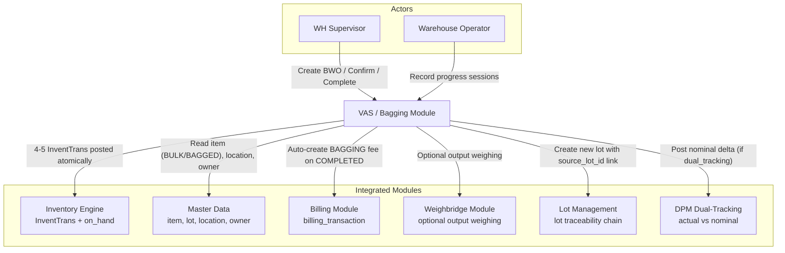
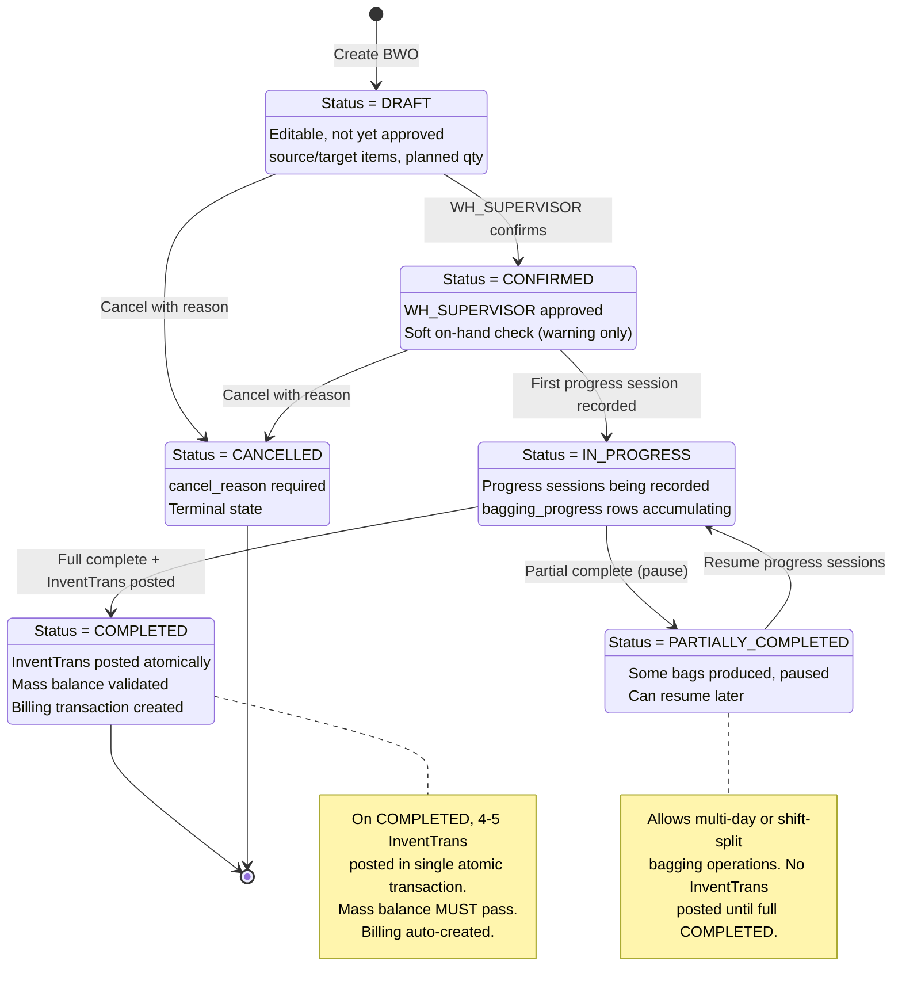
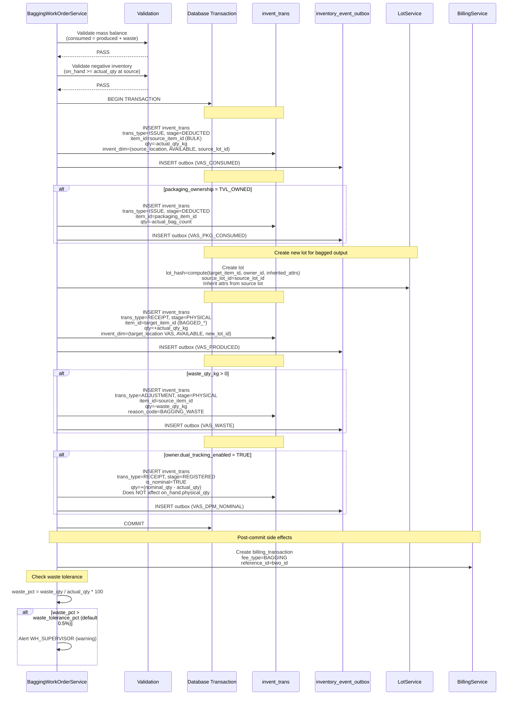
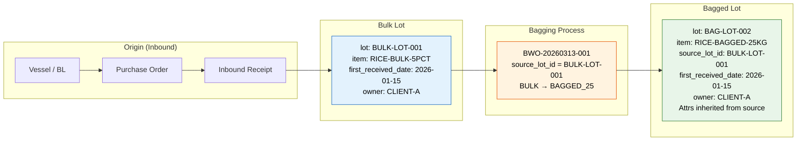
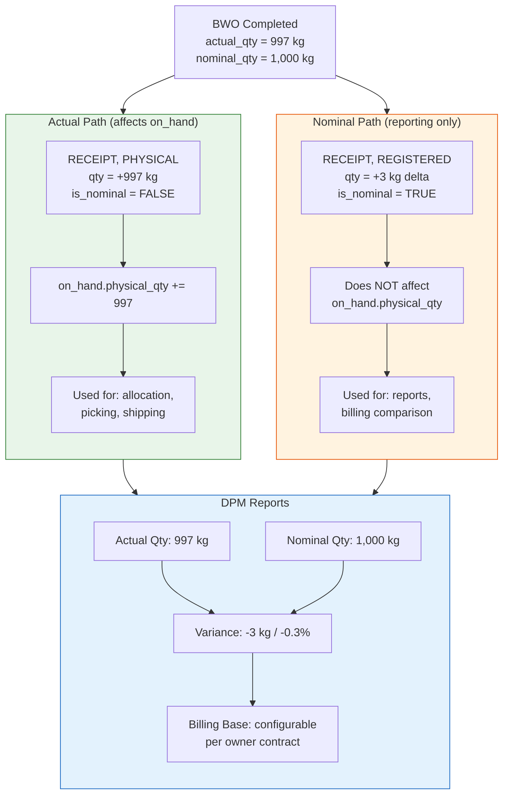

# Data Flow Diagram: VAS / Bagging Operations

> **Module**: VAS - Bagging (Phase 5+)
> **Version**: 1.0
> **Date**: 2026-03-13
> **Schema**: `ops`

---

## 1. Context Diagram

High-level view of the VAS/Bagging module, its actors, and integrated modules.



---

## 2. Process Flow Diagram

Complete BWO lifecycle from creation through completion.

```mermaid
flowchart TD
    START([Bagging request received]) --> CREATE

    CREATE[1. Create BWO<br/>status = DRAFT]
    CREATE --> VALIDATE_CREATE{source_item is BULK?<br/>target_item is BAGGED_*?<br/>locations valid?}
    VALIDATE_CREATE -- No --> ERR_CREATE[Return validation error]
    VALIDATE_CREATE -- Yes --> CHECK_PKG{packaging_ownership<br/>= TVL_OWNED?}
    CHECK_PKG -- Yes --> SET_PKG[Set packaging_item_id<br/>TVL supplies bags]
    CHECK_PKG -- No --> SKIP_PKG[No packaging tracking<br/>CLIENT supplies bags]
    SET_PKG --> DRAFT_CREATED
    SKIP_PKG --> DRAFT_CREATED
    DRAFT_CREATED[BWO created<br/>bwo_number = BWO-YYYYMMDD-SEQ<br/>status = DRAFT]

    DRAFT_CREATED --> CONFIRM[2. Confirm BWO]
    CONFIRM --> CHECK_ONHAND{on_hand.physical_qty<br/>>= planned_qty<br/>at source dim?}
    CHECK_ONHAND -- No --> WARN_LOW[Soft warning:<br/>insufficient on-hand<br/>NOT a hard block]
    CHECK_ONHAND -- Yes --> CONFIRMED
    WARN_LOW --> CONFIRMED
    CONFIRMED[status = CONFIRMED<br/>WH_SUPERVISOR approved]

    CONFIRMED --> PROGRESS[3. Record Progress Sessions]
    PROGRESS --> FIRST_SESSION{First session?}
    FIRST_SESSION -- Yes --> SET_IP[status = IN_PROGRESS]
    FIRST_SESSION -- No --> RECORD
    SET_IP --> RECORD
    RECORD[Record bagging_progress:<br/>bags_this_session, weight_this_session<br/>start_time, end_time]
    RECORD --> CHECK_OT{end_time ><br/>warehouse.operating_hours_end?}
    CHECK_OT -- Yes --> OT_FLAG[is_overtime = TRUE]
    CHECK_OT -- No --> OT_NORMAL[is_overtime = FALSE]
    OT_FLAG --> MORE_SESSIONS
    OT_NORMAL --> MORE_SESSIONS
    MORE_SESSIONS{More sessions<br/>needed?}
    MORE_SESSIONS -- Yes --> PROGRESS
    MORE_SESSIONS -- No --> DECIDE_COMPLETE

    DECIDE_COMPLETE{Fully complete<br/>or partial?}
    DECIDE_COMPLETE -- Partial --> PARTIAL[status = PARTIALLY_COMPLETED<br/>Can resume later]
    PARTIAL --> PROGRESS
    DECIDE_COMPLETE -- Full --> COMPLETE

    COMPLETE[4. Complete BWO]
    COMPLETE --> INPUT_ACTUALS[Input: actual_qty_kg,<br/>actual_bag_count, waste_qty_kg]
    INPUT_ACTUALS --> MASS_BAL{Mass Balance Check:<br/>consumed = produced + waste?}
    MASS_BAL -- Fail --> ERR_MASS[HARD BLOCK:<br/>Mass balance violation]
    MASS_BAL -- Pass --> NEG_CHECK{Negative Inventory Check:<br/>on_hand.physical_qty >=<br/>actual_qty_kg at source dim?}
    NEG_CHECK -- Fail --> ERR_NEG[HARD BLOCK:<br/>Insufficient inventory]
    NEG_CHECK -- Pass --> POST_TRANS[Post 4-5 InventTrans<br/>atomically]

    POST_TRANS --> CHECK_WASTE{waste_pct ><br/>waste_tolerance_pct?}
    CHECK_WASTE -- Yes --> WASTE_ALERT[Alert WH_SUPERVISOR<br/>warning, not block]
    CHECK_WASTE -- No --> BILLING_POST
    WASTE_ALERT --> BILLING_POST
    BILLING_POST[Auto-create billing_transaction<br/>fee_type = BAGGING]
    BILLING_POST --> DONE[status = COMPLETED]

    DONE --> END_STATE([BWO completed])

    %% Cancel path
    DRAFT_CREATED --> CANCEL
    CONFIRMED --> CANCEL
    CANCEL[Cancel BWO<br/>status = CANCELLED<br/>cancel_reason required]
    CANCEL --> END_CANCEL([BWO cancelled])
```



---

## 3. State Machine Diagram

Lifecycle states of a `bagging_work_order` record.



---

## 4. InventTrans Posting Diagram

All 4-5 transactions posted atomically when BWO transitions to COMPLETED.



---

## 5. Mass Balance Diagram

Visual representation of the mass balance constraint enforced at completion.

```
                    ┌─────────────────────────────────────────────────────┐
                    │              MASS BALANCE EQUATION                  │
                    │                                                     │
                    │    actual_consumed = actual_produced + waste         │
                    │                                                     │
                    │    (HARD BLOCK if equation does not balance)        │
                    └─────────────────────────────────────────────────────┘

    ┌──────────────────────┐         ┌──────────────────────┐
    │   INPUT (Consumed)   │         │  OUTPUT (Produced)   │
    │                      │         │                      │
    │  Source: BULK item   │         │  Target: BAGGED_*    │
    │  Qty: actual_qty_kg  │         │  Qty: actual_qty_kg  │
    │                      │    =    │       - waste_qty_kg │
    │  Location: STORAGE   │         │  Location: VAS       │
    │  Lot: source_lot_id  │         │  Lot: new_lot_id     │
    │                      │         │                      │
    └──────────┬───────────┘         └──────────┬───────────┘
               │                                │
               │         ┌──────────────┐       │
               │         │    WASTE     │       │
               └────────>│              │<──────┘
                         │  waste_qty_kg│
                         │  reason_code:│
                         │  BAGGING_    │
                         │  WASTE       │
                         └──────────────┘

    Example:
    ┌──────────────────────────────────────────────────────────┐
    │  Consumed:  1,000 kg BULK                                │
    │  Produced:    997 kg BAGGED_25 (39 bags x 25 kg + 22 kg)│
    │  Waste:         3 kg (0.3%)                              │
    │  Balance:   1,000 = 997 + 3  ✓ PASS                     │
    └──────────────────────────────────────────────────────────┘

    InventTrans Impact:
    ┌──────────────────────────────────────────────────────────┐
    │  #1 ISSUE BULK:        -1,000 kg  (physical_qty ↓)      │
    │  #2 ISSUE Packaging:      -40 pcs (physical_qty ↓)      │
    │  #3 RECEIPT BAGGED:      +997 kg  (physical_qty ↑)      │
    │  #4 ADJUSTMENT Waste:      -3 kg  (physical_qty ↓)      │
    │  ─────────────────────────────────────────────────       │
    │  Net physical change:   -1,000 + 997 + (-3) = 0  ✓      │
    │  (Inventory is conserved)                                │
    └──────────────────────────────────────────────────────────┘
```

---

## 6. Lot Traceability Flow

Full traceability chain from bagged lot back to original vessel/BL.



### Lot Creation Details

```
New Lot Computation:
  lot_hash = SHA-256(target_item_id | owner_id | inherited_attr_1 | ... | inherited_attr_n)

Inherited Attributes (from source lot):
  - origin_country
  - grade
  - crop_year
  - quality_parameters
  - first_received_date  (UNCHANGED — preserves FIFO ordering)

New Attributes:
  - source_lot_id = source_lot.id  (traceability link)
  - item_id = target_item_id       (BAGGED_* type)

Traceability Chain Query:
  SELECT bagged_lot.*, source_lot.*, receipt.*, po.*
  FROM lot bagged_lot
  JOIN lot source_lot ON source_lot.id = bagged_lot.source_lot_id
  JOIN inbound_receipt receipt ON receipt.lot_id = source_lot.id
  JOIN purchase_order po ON po.id = receipt.purchase_order_id
  WHERE bagged_lot.id = @bagged_lot_id
```

---

## 7. DPM Dual-Tracking Diagram

Actual vs nominal inventory paths when `owner.dual_tracking_enabled = TRUE`.



### DPM Billing Logic

```
if owner.billing_base = ACTUAL:
    billing_qty = actual_qty_kg         (997 kg)
elif owner.billing_base = NOMINAL:
    billing_qty = nominal_qty_kg        (1,000 kg)

billing_transaction:
    fee_type = BAGGING
    qty = billing_qty
    reference_type = BAGGING_WORK_ORDER
    reference_id = bwo_id
```

---

## 8. Data Flow Table

Step-by-step data flow showing inputs, processing, outputs, and data store mutations.

### Step 1: Create BWO (DRAFT)

| Aspect | Detail |
|--------|--------|
| **Input** | `source_item_id` (BULK type), `target_item_id` (BAGGED_25/50/1000), `planned_qty_kg`, `planned_bag_count`, `source_location_id` (STORAGE type), `target_location_id` (VAS type), `owner_id`, optional: `source_lot_id`, `packaging_item_id`, `packaging_ownership` (TVL_OWNED/CLIENT) |
| **Process** | Validate source_item.item_type = BULK. Validate target_item.item_type in (BAGGED_25, BAGGED_50, BAGGED_1000). Validate source_location.type = STORAGE, target_location.type = VAS. If packaging_ownership = TVL_OWNED, packaging_item_id required. Generate `bwo_number` = `BWO-{YYYYMMDD}-{SEQ:6}`. |
| **Output** | `BaggingWorkOrderDto` with `bwo_number`, `status=DRAFT` |
| **Data Store** | INSERT `bagging_work_order` (status=DRAFT) |

### Step 2: Confirm BWO (DRAFT to CONFIRMED)

| Aspect | Detail |
|--------|--------|
| **Input** | `bwo_id` |
| **Process** | Validate status = DRAFT. Soft check: query on_hand.physical_qty at (source_item_id, source_location, AVAILABLE, source_lot_id). If on_hand < planned_qty, attach WARNING (not hard block). WH_SUPERVISOR role required. |
| **Output** | Updated `BaggingWorkOrderDto` with `status=CONFIRMED`, optional on-hand warning |
| **Data Store** | UPDATE `bagging_work_order` SET status=CONFIRMED, confirmed_at=NOW(), confirmed_by=user_id |

### Step 3: Record Progress (IN_PROGRESS)

| Aspect | Detail |
|--------|--------|
| **Input** | `bwo_id`, `bags_this_session`, `weight_this_session_kg`, `start_time`, `end_time` |
| **Process** | If first session: transition status CONFIRMED to IN_PROGRESS. Calculate `session_number` = MAX(session_number) + 1. Determine `is_overtime`: if end_time > warehouse.operating_hours_end then TRUE. Accumulate running totals on parent BWO. |
| **Output** | `BaggingProgressDto` with session details, OT indicator |
| **Data Store** | INSERT `bagging_progress` (bwo_id, session_number, bags_this_session, weight_this_session, start_time, end_time, is_overtime). UPDATE `bagging_work_order` SET status=IN_PROGRESS (if first session). |

### Step 4: Partial Complete (optional)

| Aspect | Detail |
|--------|--------|
| **Input** | `bwo_id` |
| **Process** | Validate status = IN_PROGRESS. No InventTrans posted. BWO can be resumed later. |
| **Output** | Updated `BaggingWorkOrderDto` with `status=PARTIALLY_COMPLETED` |
| **Data Store** | UPDATE `bagging_work_order` SET status=PARTIALLY_COMPLETED |

### Step 5: Complete BWO (IN_PROGRESS to COMPLETED)

| Aspect | Detail |
|--------|--------|
| **Input** | `bwo_id`, `actual_qty_kg`, `actual_bag_count`, `waste_qty_kg` |
| **Process** | **Mass balance validation** (hard block): actual_qty_kg = (actual_qty_kg - waste_qty_kg) + waste_qty_kg. **Negative inventory check** (hard block): on_hand.physical_qty >= actual_qty_kg at source invent_dim. Post 4-5 InventTrans atomically (see Section 4). Create new lot with source_lot_id link. Calculate waste_pct: if > waste_tolerance_pct (0.5%), alert WH_SUPERVISOR. Auto-create billing_transaction (fee_type=BAGGING). If owner.dual_tracking_enabled, post nominal delta. |
| **Output** | Final `BaggingWorkOrderDto` with `status=COMPLETED`, `completed_at`, list of posted InventTrans IDs |
| **Data Store** | INSERT 4-5 `invent_trans` entries + `inventory_event_outbox` entries (single transaction). INSERT `lot` (new bagged lot). INSERT `billing_transaction`. UPDATE `bagging_work_order` SET status=COMPLETED, actual_qty_kg, actual_bag_count, waste_qty_kg, completed_at. |

### Step 6: Cancel BWO

| Aspect | Detail |
|--------|--------|
| **Input** | `bwo_id`, `cancel_reason` |
| **Process** | Validate status is not COMPLETED. Record cancellation reason. No InventTrans reversal needed (transactions only posted at COMPLETED). |
| **Output** | Updated `BaggingWorkOrderDto` with `status=CANCELLED` |
| **Data Store** | UPDATE `bagging_work_order` SET status=CANCELLED, cancel_reason, cancelled_at=NOW() |

---

## 9. Frontend Guide

### Screen Inventory

| Screen | Route | Purpose |
|--------|-------|---------|
| BWO List | `/vas/bagging` | List all BWOs with status filter, search |
| BWO Create Form | `/vas/bagging/new` | Create new BWO (source item, target item, qty, bags) |
| BWO Detail | `/vas/bagging/{id}` | View BWO details, current status, progress history |
| BWO Confirm | `/vas/bagging/{id}/confirm` | Confirm BWO with on-hand availability display |
| Progress Recording | `/vas/bagging/{id}/progress` | Record bagging session (bags, weight, time, OT) |
| Complete Form | `/vas/bagging/{id}/complete` | Input actuals, waste, mass balance validation |
| Lot Traceability | `/vas/bagging/{id}/traceability` | Source lot to bagged lot chain view |
| DPM Report | `/vas/bagging/dpm-report` | Actual vs nominal comparison across BWOs |

### BWO List Screen

```
+------------------------------------------------------------------+
|  VAS - Bagging Work Orders                          [+ New BWO]  |
+------------------------------------------------------------------+
|  Filter: [All Statuses v]  [Owner v]  [Date Range]  [Search...] |
+------------------------------------------------------------------+
|  BWO #          | Owner     | Source Item      | Target Item     |
|  Status         | Planned   | Actual           | Waste           |
+------------------------------------------------------------------+
|  BWO-20260313-001 | CLIENT-A | RICE-BULK-5PCT | RICE-BAG-25KG  |
|  IN_PROGRESS      | 1,000 kg | 620 kg (62%)   | --              |
|  [View] [Record Progress]                                        |
+------------------------------------------------------------------+
|  BWO-20260312-003 | CLIENT-B | SUGAR-BULK     | SUGAR-BAG-50KG |
|  COMPLETED        | 5,000 kg | 4,985 kg       | 15 kg (0.3%)   |
|  [View] [Traceability]                                           |
+------------------------------------------------------------------+
```

### BWO Create Form

```
+------------------------------------------------------------------+
|  Create Bagging Work Order                                        |
+------------------------------------------------------------------+
|                                                                    |
|  Owner:           [CLIENT-A                    v]                 |
|                                                                    |
|  Source Item:      [RICE-BULK-5PCT             v]  Type: BULK     |
|  Source Location:  [WH51-STORAGE-A01           v]  Type: STORAGE  |
|  Source Lot:       [LOT-2026-001               v]  (optional)     |
|                                                                    |
|  Target Item:      [RICE-BAGGED-25KG           v]  Type: BAGGED  |
|  Target Location:  [WH51-VAS-01               v]  Type: VAS      |
|                                                                    |
|  Planned Qty (kg): [1,000    ]                                    |
|  Planned Bags:     [40       ]   (auto-calc: 1000/25 = 40)       |
|                                                                    |
|  Packaging:        (o) Client-supplied  ( ) TVL-owned             |
|  Packaging Item:   [-- disabled --]                               |
|                                                                    |
|  [Cancel]                                           [Create BWO]  |
+------------------------------------------------------------------+
```

### Progress Recording Form

```
+------------------------------------------------------------------+
|  Record Bagging Progress                                          |
|  BWO: BWO-20260313-001  |  Status: IN_PROGRESS                  |
+------------------------------------------------------------------+
|  Running Total: 620 kg / 1,000 kg  |  25 bags / 40 bags (62%)   |
|  Sessions: 3                                                      |
+------------------------------------------------------------------+
|                                                                    |
|  Session #4                                                       |
|  Bags Completed:    [10      ]                                    |
|  Weight (kg):       [250.0   ]                                    |
|  Start Time:        [2026-03-13 14:00]                            |
|  End Time:          [2026-03-13 17:30]                            |
|                                                                    |
|  ! Overtime Indicator: YES (ends after 17:00)                    |
|                                                                    |
|  [Cancel]                                      [Save Progress]    |
+------------------------------------------------------------------+
|  Session History                                                  |
|  #  | Bags | Weight  | Start  | End    | OT  | Duration          |
|  3  | 8    | 200 kg  | 08:00  | 12:00  | No  | 4h 00m            |
|  2  | 9    | 225 kg  | 14:00  | 18:30  | Yes | 4h 30m            |
|  1  | 8    | 195 kg  | 08:00  | 11:30  | No  | 3h 30m            |
+------------------------------------------------------------------+
```

### Complete Form

```
+------------------------------------------------------------------+
|  Complete Bagging Work Order                                      |
|  BWO: BWO-20260313-001  |  Status: IN_PROGRESS                  |
+------------------------------------------------------------------+
|  Planned: 1,000 kg / 40 bags                                     |
+------------------------------------------------------------------+
|                                                                    |
|  Actual Qty (kg):     [997.0     ]                                |
|  Actual Bag Count:    [39        ]  + partial: 22 kg             |
|  Waste (kg):          [3.0       ]                                |
|                                                                    |
|  ┌──────────────────────────────────────────────┐                 |
|  │  Mass Balance Check:                          │                 |
|  │  Consumed:  1,000.0 kg                        │                 |
|  │  Produced:    997.0 kg                        │                 |
|  │  Waste:         3.0 kg                        │                 |
|  │  Balance:   997.0 + 3.0 = 1,000.0  ✓ PASS    │                 |
|  └──────────────────────────────────────────────┘                 |
|                                                                    |
|  Waste %: 0.30%  (tolerance: 0.50%)  ✓ Within tolerance          |
|                                                                    |
|  [Cancel]                                     [Complete BWO]      |
+------------------------------------------------------------------+
```

### Key Frontend Behaviors

1. **Auto-Calculate Bag Count**
   - When target item selected, read `bag_weight_kg` from item master (e.g., 25, 50, 1000)
   - Auto-calculate: `planned_bag_count = FLOOR(planned_qty_kg / bag_weight_kg)`
   - Allow manual override of bag count

2. **Mass Balance Real-Time Validation**
   - As user inputs actual_qty and waste_qty, compute balance in real-time
   - Show green checkmark when balanced, red X when not
   - Disable "Complete BWO" button until mass balance passes

3. **Progress Bar**
   - Show progress based on accumulated weight vs planned qty
   - Color: green (< 80%), amber (80-99%), blue (100%+)
   - Show both weight progress and bag count progress

4. **Overtime Indicator**
   - Auto-detect based on `end_time` vs `warehouse.operating_hours_end`
   - Show amber badge "OT" next to sessions flagged as overtime
   - Summary at BWO level: total OT hours

5. **On-Hand Availability Display**
   - On confirm screen, show current on_hand for source item at source location
   - If on_hand < planned_qty: amber warning banner (non-blocking)
   - If on_hand = 0: red warning banner

6. **State-Driven UI**
   - `DRAFT`: all fields editable, show [Confirm] and [Cancel]
   - `CONFIRMED`: read-only header, show [Record Progress] and [Cancel]
   - `IN_PROGRESS`: show progress recording, [Complete], [Partial Complete], [Cancel]
   - `PARTIALLY_COMPLETED`: show [Resume] to go back to IN_PROGRESS
   - `COMPLETED`: read-only, show summary, lot traceability link, DPM report link
   - `CANCELLED`: read-only with cancellation reason

---

## 10. Backend Guide

### API Endpoints

| Method | Endpoint | Command/Query | Status Transition |
|--------|----------|---------------|-------------------|
| POST | `/api/bagging-work-orders` | `CreateBaggingWorkOrderCommand` | -- --> DRAFT |
| PUT | `/api/bagging-work-orders/{id}/confirm` | `ConfirmBaggingWorkOrderCommand` | DRAFT --> CONFIRMED |
| POST | `/api/bagging-work-orders/{id}/progress` | `RecordBaggingProgressCommand` | CONFIRMED --> IN_PROGRESS (first session) |
| PUT | `/api/bagging-work-orders/{id}/complete` | `CompleteBaggingWorkOrderCommand` | IN_PROGRESS --> COMPLETED |
| PUT | `/api/bagging-work-orders/{id}/partial-complete` | `PartialCompleteBaggingWorkOrderCommand` | IN_PROGRESS --> PARTIALLY_COMPLETED |
| PUT | `/api/bagging-work-orders/{id}/cancel` | `CancelBaggingWorkOrderCommand` | DRAFT/CONFIRMED/IN_PROGRESS --> CANCELLED |
| GET | `/api/bagging-work-orders` | `GetBaggingWorkOrdersQuery` | -- |
| GET | `/api/bagging-work-orders/{id}` | `GetBaggingWorkOrderDetailQuery` | -- |
| GET | `/api/bagging-work-orders/{id}/progress` | `GetBaggingProgressQuery` | -- |
| GET | `/api/bagging-work-orders/{id}/traceability` | `GetLotTraceabilityQuery` | -- |

### Commands and Validation

#### CreateBaggingWorkOrderCommand

```
Input: SourceItemId, TargetItemId, OwnerId, SourceLocationId, TargetLocationId,
       PlannedQtyKg, PlannedBagCount, SourceLotId?, PackagingItemId?, PackagingOwnership
```

| Validation | Rule | Error Code |
|------------|------|------------|
| Source item exists and type = BULK | Required | BWO-4001 |
| Target item exists and type in (BAGGED_25, BAGGED_50, BAGGED_1000) | Required | BWO-4002 |
| Source location type = STORAGE | Required | BWO-4003 |
| Target location type = VAS | Required | BWO-4004 |
| Owner exists and is_active | Required | BWO-4005 |
| If packaging_ownership = TVL_OWNED, packaging_item_id required | Conditional | BWO-4006 |
| Planned qty > 0, planned bag count > 0 | Required | BWO-4007 |

#### ConfirmBaggingWorkOrderCommand

```
Input: BwoId
```

| Validation | Rule | Error Code |
|------------|------|------------|
| BWO exists and status = DRAFT | Required | BWO-4010 |
| User has WH_SUPERVISOR role | Required | BWO-4011 |
| On-hand >= planned_qty at source dim | Soft check (warning only) | (warning) |

#### RecordBaggingProgressCommand

```
Input: BwoId, BagsThisSession, WeightThisSessionKg, StartTime, EndTime
```

| Validation | Rule | Error Code |
|------------|------|------------|
| BWO exists and status in (CONFIRMED, IN_PROGRESS) | Required | BWO-4020 |
| Bags > 0, weight > 0 | Required | BWO-4021 |
| StartTime < EndTime | Required | BWO-4022 |
| No overlapping sessions for same BWO | Business rule | BWO-4023 |

#### CompleteBaggingWorkOrderCommand

```
Input: BwoId, ActualQtyKg, ActualBagCount, WasteQtyKg
```

| Validation | Rule | Error Code |
|------------|------|------------|
| BWO exists and status = IN_PROGRESS | Required | BWO-4030 |
| Mass balance: consumed = produced + waste | Hard block | BWO-4031 |
| Negative inventory: on_hand.physical_qty >= actual_qty_kg at source dim | Hard block | BWO-4032 |
| Actual qty > 0, actual bags > 0 | Required | BWO-4033 |
| Waste qty >= 0 | Required | BWO-4034 |

### Domain Service: IBaggingWorkOrderService

Key methods:

| Method | Responsibility |
|--------|---------------|
| `CreateAsync()` | Validate items/locations, generate bwo_number, status=DRAFT |
| `ConfirmAsync()` | Role check (WH_SUPERVISOR), soft on-hand check, status=CONFIRMED |
| `RecordProgressAsync()` | Create bagging_progress, auto-transition to IN_PROGRESS, OT calculation |
| `CompleteAsync()` | Mass balance validation, negative inventory check, post 4-5 InventTrans atomically, create lot, billing, waste alert |
| `PartialCompleteAsync()` | Transition to PARTIALLY_COMPLETED, no InventTrans |
| `CancelAsync()` | Validate not COMPLETED, record reason, status=CANCELLED |
| `ResumeAsync()` | Transition PARTIALLY_COMPLETED back to IN_PROGRESS |

### InventTrans Posting (Complete Flow)

```csharp
public async Task CompleteAsync(CompleteBaggingWorkOrderCommand cmd, CancellationToken ct)
{
    var bwo = await _bwoRepo.GetByIdAsync(cmd.BwoId, ct);

    // 1. Mass balance validation (HARD BLOCK)
    var consumed = cmd.ActualQtyKg;
    var produced = cmd.ActualQtyKg - cmd.WasteQtyKg;
    var waste = cmd.WasteQtyKg;
    if (consumed != produced + waste)
        throw new MassBalanceViolationException(consumed, produced, waste);

    // 2. Negative inventory check (HARD BLOCK)
    var onHand = await _onHandRepo.GetPhysicalQtyAsync(
        bwo.SourceItemId, bwo.SourceLocationId, bwo.SourceLotId, ct);
    if (onHand < cmd.ActualQtyKg)
        throw new InsufficientInventoryException(onHand, cmd.ActualQtyKg);

    // 3. Begin atomic transaction
    await using var transaction = await _unitOfWork.BeginTransactionAsync(ct);
    var batchId = Guid.NewGuid();

    // #1 ISSUE Bulk (DEDUCTED)
    await _inventTransService.PostAsync(new PostInventTransCommand
    {
        BatchId = batchId,
        ItemId = bwo.SourceItemId,
        LocationId = bwo.SourceLocationId,
        LotId = bwo.SourceLotId,
        OwnerId = bwo.OwnerId,
        InventoryStatus = InventoryStatus.AVAILABLE,
        TransType = TransType.ISSUE,
        Stage = Stage.DEDUCTED,
        Qty = -cmd.ActualQtyKg,
        ReferenceType = "BAGGING_WORK_ORDER",
        ReferenceId = bwo.Id,
        EventType = "VAS_CONSUMED"
    }, ct);

    // #2 ISSUE Packaging (DEDUCTED) — if TVL_OWNED
    if (bwo.PackagingOwnership == PackagingOwnership.TVL_OWNED)
    {
        await _inventTransService.PostAsync(new PostInventTransCommand
        {
            BatchId = batchId,
            ItemId = bwo.PackagingItemId!.Value,
            TransType = TransType.ISSUE,
            Stage = Stage.DEDUCTED,
            Qty = -cmd.ActualBagCount,
            ReferenceType = "BAGGING_WORK_ORDER",
            ReferenceId = bwo.Id,
            EventType = "VAS_PKG_CONSUMED"
        }, ct);
    }

    // Create new lot for bagged output
    var newLot = await _lotService.CreateBaggedLotAsync(new CreateBaggedLotCommand
    {
        SourceLotId = bwo.SourceLotId,
        TargetItemId = bwo.TargetItemId,
        OwnerId = bwo.OwnerId
        // Attributes inherited from source lot automatically
    }, ct);

    // #3 RECEIPT Bagged (PHYSICAL)
    await _inventTransService.PostAsync(new PostInventTransCommand
    {
        BatchId = batchId,
        ItemId = bwo.TargetItemId,
        LocationId = bwo.TargetLocationId,
        LotId = newLot.Id,
        OwnerId = bwo.OwnerId,
        InventoryStatus = InventoryStatus.AVAILABLE,
        TransType = TransType.RECEIPT,
        Stage = Stage.PHYSICAL,
        Qty = +produced,
        ReferenceType = "BAGGING_WORK_ORDER",
        ReferenceId = bwo.Id,
        EventType = "VAS_PRODUCED"
    }, ct);

    // #4 ADJUSTMENT Waste (PHYSICAL) — if waste > 0
    if (waste > 0)
    {
        await _inventTransService.PostAsync(new PostInventTransCommand
        {
            BatchId = batchId,
            ItemId = bwo.SourceItemId,
            LocationId = bwo.SourceLocationId,
            LotId = bwo.SourceLotId,
            OwnerId = bwo.OwnerId,
            InventoryStatus = InventoryStatus.AVAILABLE,
            TransType = TransType.ADJUSTMENT,
            Stage = Stage.PHYSICAL,
            Qty = -waste,
            ReasonCode = "BAGGING_WASTE",
            ReferenceType = "BAGGING_WORK_ORDER",
            ReferenceId = bwo.Id,
            EventType = "VAS_WASTE"
        }, ct);
    }

    // #5 DPM Nominal (REGISTERED) — if dual tracking enabled
    var owner = await _ownerRepo.GetByIdAsync(bwo.OwnerId, ct);
    if (owner.DualTrackingEnabled)
    {
        var nominalDelta = bwo.PlannedQtyKg - cmd.ActualQtyKg;
        if (nominalDelta != 0)
        {
            await _inventTransService.PostAsync(new PostInventTransCommand
            {
                BatchId = batchId,
                ItemId = bwo.TargetItemId,
                LocationId = bwo.TargetLocationId,
                LotId = newLot.Id,
                OwnerId = bwo.OwnerId,
                TransType = TransType.RECEIPT,
                Stage = Stage.REGISTERED,
                Qty = +nominalDelta,
                IsNominal = true,
                ReferenceType = "BAGGING_WORK_ORDER",
                ReferenceId = bwo.Id,
                EventType = "VAS_DPM_NOMINAL"
            }, ct);
        }
    }

    // Update BWO
    bwo.Status = BwoStatus.COMPLETED;
    bwo.ActualQtyKg = cmd.ActualQtyKg;
    bwo.ActualBagCount = cmd.ActualBagCount;
    bwo.WasteQtyKg = cmd.WasteQtyKg;
    bwo.CompletedAt = _clock.UtcNow;

    await _unitOfWork.SaveChangesAsync(ct);
    await transaction.CommitAsync(ct);

    // Post-commit: billing
    await _billingService.CreateTransactionAsync(new CreateBillingTransactionCommand
    {
        FeeType = "BAGGING",
        OwnerId = bwo.OwnerId,
        Qty = owner.DualTrackingEnabled && owner.BillingBase == BillingBase.NOMINAL
            ? bwo.PlannedQtyKg
            : cmd.ActualQtyKg,
        ReferenceType = "BAGGING_WORK_ORDER",
        ReferenceId = bwo.Id
    }, ct);

    // Post-commit: waste alert
    var wastePct = (waste / cmd.ActualQtyKg) * 100;
    if (wastePct > _config.WasteTolerancePct) // default 0.5%
    {
        await _alertService.NotifyAsync(
            AlertType.BAGGING_WASTE_EXCEEDED,
            Role.WH_SUPERVISOR,
            $"BWO {bwo.BwoNumber}: waste {wastePct:F2}% exceeds tolerance {_config.WasteTolerancePct}%",
            ct);
    }
}
```

### Integration with Other Modules

#### Inventory Engine Integration

```
On COMPLETED, posts 4-5 InventTrans in single atomic transaction.
All entries share the same batch_id for traceability.
Outbox events trigger materialization worker to update on_hand.

InventTrans entries:
  #1: ISSUE/DEDUCTED    → on_hand.physical_qty ↓ (bulk at source)
  #2: ISSUE/DEDUCTED    → on_hand.physical_qty ↓ (packaging, if TVL_OWNED)
  #3: RECEIPT/PHYSICAL   → on_hand.physical_qty ↑ (bagged at VAS)
  #4: ADJUSTMENT/PHYSICAL → on_hand.physical_qty ↓ (waste)
  #5: RECEIPT/REGISTERED → no on_hand impact (nominal, DPM only)
```

#### Master Data Dependencies

```
item:     source_item (type=BULK), target_item (type=BAGGED_*)
lot:      source_lot (existing), new bagged lot (created on complete)
location: source_location (type=STORAGE), target_location (type=VAS)
owner:    owner_id, dual_tracking_enabled, billing_base
```

#### Billing Integration

```
On COMPLETED: auto-create billing_transaction
  fee_type = BAGGING
  qty = actual_qty (or nominal_qty if billing_base=NOMINAL)
  reference_type = BAGGING_WORK_ORDER
  reference_id = bwo.id
```

#### Weighbridge Integration (Optional)

```
Optional weighing of bagged output for verification.
weighbridge_log.reference_type = BAGGING_WORK_ORDER
weighbridge_log.reference_id = bwo.id
```

### Entity Relationships

```
bagging_work_order
  |-- 1:N --> bagging_progress (session tracking)
  |-- N:1 --> item (source_item_id, BULK)
  |-- N:1 --> item (target_item_id, BAGGED_*)
  |-- N:1 --> item (packaging_item_id, optional)
  |-- N:1 --> lot (source_lot_id)
  |-- N:1 --> location (source_location_id, STORAGE)
  |-- N:1 --> location (target_location_id, VAS)
  |-- N:1 --> owner (owner_id)
  |-- 1:1 --> lot (created bagged lot, via invent_trans)
  |-- 1:N --> invent_trans (via reference_id, posted on COMPLETED)
  |-- 1:1 --> billing_transaction (auto-created on COMPLETED)
```

### Business Rules Summary

| Code | Rule | Type | Configurable |
|------|------|------|-------------|
| BR-VAS-001 | Mass balance: consumed = produced + waste | Hard block | No |
| BR-VAS-002 | Negative inventory check at completion | Hard block | No |
| BR-VAS-003 | Source item must be BULK type | Hard block | No |
| BR-VAS-004 | Target item must be BAGGED_* type | Hard block | No |
| BR-VAS-005 | Source location must be STORAGE type | Hard block | No |
| BR-VAS-006 | Target location must be VAS type | Hard block | No |
| BR-VAS-007 | Packaging item required when TVL_OWNED | Hard block | No |
| BR-VAS-008 | On-hand check at confirm | Soft (warning) | No |
| BR-VAS-009 | Waste tolerance alert (default 0.5%) | Non-blocking alert | Yes (waste_tolerance_pct) |
| BR-VAS-010 | Overtime detection via warehouse operating hours | Informational | Per warehouse |
| BR-VAS-011 | WH_SUPERVISOR role required for confirm | Hard block | No |
| BR-VAS-012 | Lot traceability: bagged lot must have source_lot_id | Hard block | No |
| BR-VAS-013 | DPM nominal posting only when dual_tracking_enabled | Conditional | Per owner |
