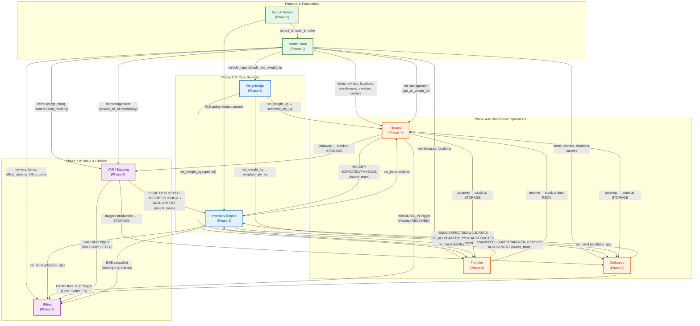
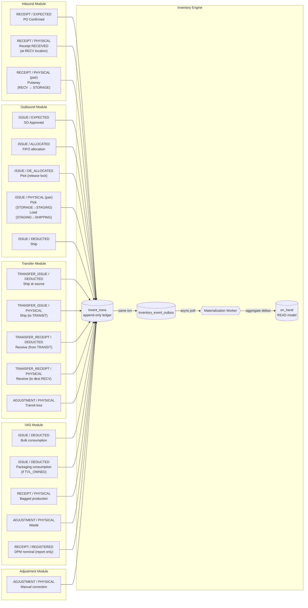
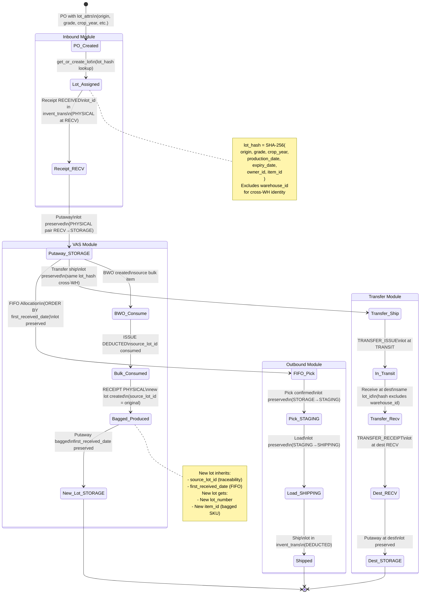
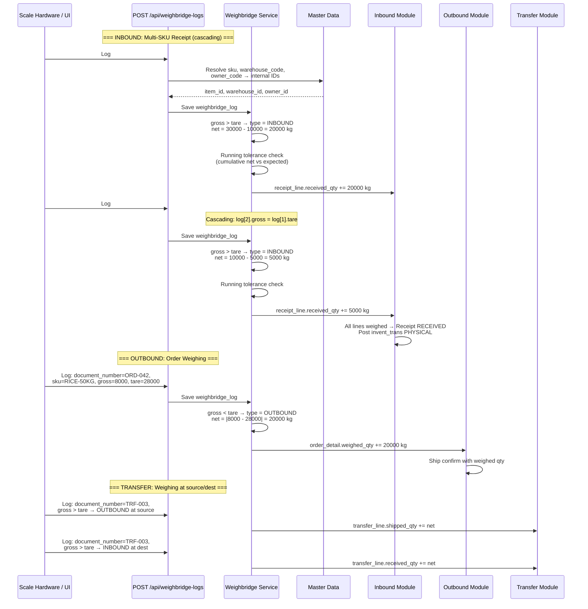
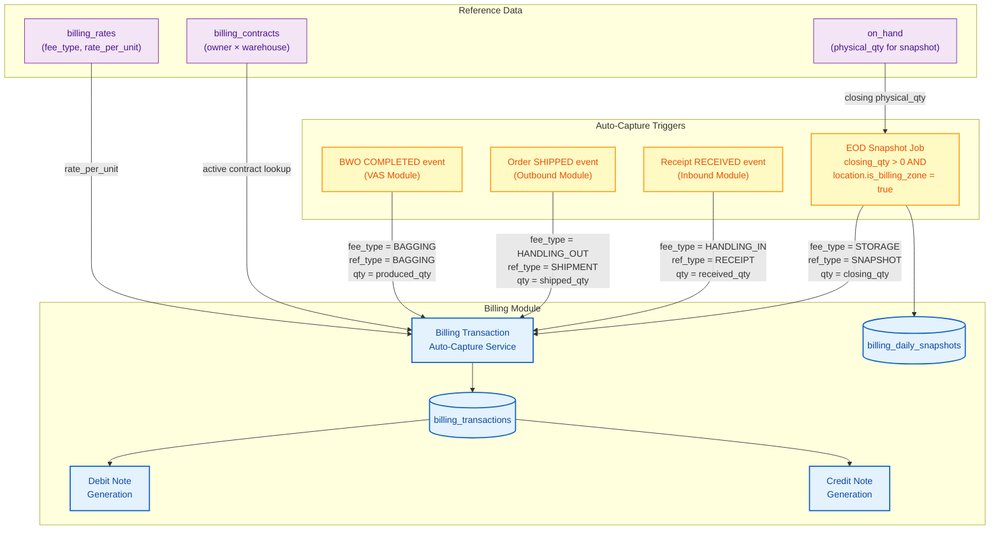
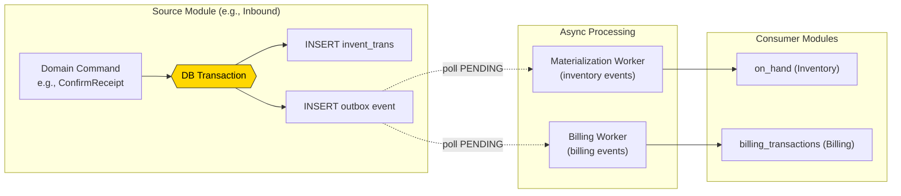

# 09 - Cross-Module Integration Data Flow

> **Implementation Notes (TASK 0 — EF Foundation):**
> - **Tenant Isolation**: EF Core `TenantSaveChangesInterceptor` + global query filters (not PostgreSQL RLS SET LOCAL)
> - **No Tenant Table**: tenant_id from JWT → `ICurrentUser.TenantId`. Tenant CRUD via external TenantAdmin API (Refit).
> - **Auth Entities Reused**: User, UserRole, SecurityGroup, UserGroup, UserRoleDependency, AppConfig, UserFormSetting from System schema
> - **Schema Mapping**: system, cat, ops, inv, billing, logging

> **Version:** 1.0 | **Date:** 2026-03-13
> **System:** Thoresen Vinama Logistics — Smart Warehouse Management (SWM)
> **Scope:** Integration flows across all 8 core modules — how data propagates from one module to another through shared entities (InventTrans, Lot, Weighbridge, Billing, Work Management)

---

## Table of Contents

1. [System Integration Map](#1-system-integration-map)
2. [InventTrans Integration](#2-inventtrans-integration)
3. [Lot Lifecycle Across Modules](#3-lot-lifecycle-across-modules)
4. [Weighbridge Integration Points](#4-weighbridge-integration-points)
5. [Billing Integration Points](#5-billing-integration-points)
6. [Work Management Integration](#6-work-management-integration)
7. [End-to-End Scenarios](#7-end-to-end-scenarios)
8. [Module Dependency Matrix](#8-module-dependency-matrix)
9. [API Integration Patterns](#9-api-integration-patterns)

---

## 1. System Integration Map

Shows all modules and the labeled data flows between them. The Inventory Engine sits at the center as the shared ledger — every module that moves, creates, or destroys stock writes through `invent_trans`.



---

## 2. InventTrans Integration

Every inventory mutation in the system flows through the `invent_trans` append-only ledger. This diagram shows which module writes which `trans_type` and `stage` combinations.



### InventTrans WRITE Model — Complete Reference

| Module | trans_type | stage | When | on_hand Impact |
|--------|-----------|-------|------|----------------|
| **Inbound** | `RECEIPT` | `EXPECTED` | PO Confirmed | `inbound_ordered_qty` + |
| **Inbound** | `RECEIPT` | `PHYSICAL` | Receipt RECEIVED | `physical_qty` + at RECV |
| **Inbound** | `RECEIPT` | `PHYSICAL` (pair) | Putaway (RECV → STORAGE) | `physical_qty` - RECV, + STORAGE |
| **Outbound** | `ISSUE` | `EXPECTED` | SO Approved | `outbound_ordered_qty` + |
| **Outbound** | `ISSUE` | `ALLOCATED` | FIFO allocation | `allocated_qty` + |
| **Outbound** | `ISSUE` | `DE_ALLOCATED` | Pick (release lock) | `allocated_qty` - |
| **Outbound** | `ISSUE` | `PHYSICAL` (pair) | Pick (STORAGE → STAGING), Load (STAGING → SHIPPING) | `physical_qty` location pair |
| **Outbound** | `ISSUE` | `DEDUCTED` | Ship | `physical_qty` - at SHIPPING |
| **Transfer** | `TRANSFER_ISSUE` | `DEDUCTED` | Ship at source | `physical_qty` - at source WH |
| **Transfer** | `TRANSFER_ISSUE` | `PHYSICAL` | Ship (to TRANSIT) | `physical_qty` + at TRANSIT |
| **Transfer** | `TRANSFER_RECEIPT` | `DEDUCTED` | Receive (from TRANSIT) | `physical_qty` - at TRANSIT |
| **Transfer** | `TRANSFER_RECEIPT` | `PHYSICAL` | Receive (to dest RECV) | `physical_qty` + at dest RECV |
| **Transfer** | `ADJUSTMENT` | `PHYSICAL` | Transit loss | `physical_qty` - (correction) |
| **VAS** | `ISSUE` | `DEDUCTED` | Bulk consumption | `physical_qty` - (bulk item) |
| **VAS** | `ISSUE` | `DEDUCTED` | Packaging consumption (if TVL_OWNED) | `physical_qty` - (packaging item) |
| **VAS** | `RECEIPT` | `PHYSICAL` | Bagged production | `physical_qty` + (bagged item) |
| **VAS** | `ADJUSTMENT` | `PHYSICAL` | Waste | `physical_qty` - (waste qty) |
| **VAS** | `RECEIPT` | `REGISTERED` | DPM nominal (report only) | _(none — informational)_ |
| **Adjustment** | `ADJUSTMENT` | `PHYSICAL` | Manual correction | `physical_qty` +/- |

---

## 3. Lot Lifecycle Across Modules

Tracks how a lot is created, preserved, and transformed as it flows through different modules. The `lot_hash` (SHA-256 of lot attributes excluding `warehouse_id`) ensures the same logical lot retains its identity across warehouses.



### Lot Preservation Rules

| Transition | Lot Behavior | Key Detail |
|-----------|-------------|-----------|
| PO → Receipt | `get_or_create_lot` by hash | Lot created or existing lot matched |
| Receipt → Putaway | Lot preserved | Same `lot_id` in both invent_trans entries |
| Putaway → Pick (FIFO) | Lot preserved | Allocation selects by `first_received_date ASC` |
| Pick → Load → Ship | Lot preserved | `lot_id` travels through all stages to final DEDUCTED |
| Transfer ship → receive | Same `lot_id` | Hash excludes `warehouse_id`, so same lot identity at destination |
| VAS (bulk → bagged) | New lot created | `source_lot_id` points to original for full traceability chain |
| VAS bagged → Outbound | New lot used | `first_received_date` preserved from source for correct FIFO ordering |

---

## 4. Weighbridge Integration Points

The Weighbridge module provides a **single unified API** (`POST /api/weighbridge-logs`) for recording vehicle weighing events. Each call creates one `weighbridge_log` row. A receipt or order may have **multiple weighbridge logs** (1:N), linked by `document_number` (a business key — not a FK). The system auto-detects direction (INBOUND vs OUTBOUND) based on weight comparison and auto-resolves business keys to internal IDs.



### Weighbridge Integration by Module

| Module | `document_number` Source | Auto-Detected Type | Condition | Data Updated |
|--------|------------------------|-------------------|-----------|-------------|
| **Inbound** | `receipt_number` | `INBOUND` | `gross > tare` | `receipt_line.received_qty += net` |
| **Outbound** | `order_number` | `OUTBOUND` | `gross < tare` | `order_detail.weighed_qty += net` |
| **Transfer** | `transfer_number` | `OUTBOUND` at source, `INBOUND` at dest | Direction per weighing | `transfer_line.shipped_qty += net` / `received_qty += net` |

### Key Design Principles

| Principle | Description |
|-----------|-------------|
| **1:N relationship** | One receipt/order can have N weighbridge_logs (e.g., multi-SKU cascading weighing) |
| **Business key linking** | Linked via `document_number` (not FK reference_id) — decoupled from entity lifecycle |
| **Single API endpoint** | `POST /api/weighbridge-logs` — shared for UI operators and scale hardware integration |
| **Auto-resolve** | Business keys (`document_number`, `sku`, `warehouse_code`, `owner_code`) resolved to internal IDs server-side |
| **Auto-detect direction** | `gross > tare` → INBOUND, `gross < tare` → OUTBOUND — no manual type selection |
| **Cascading weighing** | For multi-SKU: `log[n].gross = log[n-1].tare` (vehicle gets lighter as goods are unloaded) |
| **Running tolerance** | Tolerance checked cumulatively after each weighing, not just at session end |

### Tolerance Check Integration

```
POST /api/weighbridge-logs with gross_weight_kg, tare_weight_kg
    ↓
Auto-detect: gross > tare → INBOUND, gross < tare → OUTBOUND
    ↓
net_weight_kg = |gross - tare|
    ↓
Cumulative net = SUM(net) for all logs with same document_number + SKU
    ↓
Compare cumulative net with expected_qty from receipt_line / order_detail
    ↓
tolerance_pct = |cumulative_net - expected| / expected * 100
    ↓
If tolerance_pct <= item.tolerance_pct → AUTO ACCEPT
If tolerance_pct > item.tolerance_pct → REQUIRES APPROVAL (WH_MANAGER)
```

---

## 5. Billing Integration Points

Billing is the downstream financial module that auto-captures fee transactions triggered by events in operational modules. No manual billing entry is needed for standard fees.



### Billing Auto-Capture Summary

| Fee Type | Trigger Event | Reference Type | Source Module | Quantity Source | Timing |
|----------|--------------|----------------|--------------|----------------|--------|
| `STORAGE` | EOD snapshot job | `SNAPSHOT` | Billing (reads from Inventory `on_hand`) | `closing_qty` where `physical_qty > 0` AND `is_billing_zone = true` | Daily at EOD |
| `HANDLING_IN` | Receipt status → `RECEIVED` | `RECEIPT` | Inbound | `received_qty_kg` from receipt | On receipt confirmation |
| `HANDLING_OUT` | Order status → `SHIPPED` | `SHIPMENT` | Outbound | `shipped_qty_kg` from shipment | On ship confirmation |
| `BAGGING` | BWO status → `COMPLETED` | `BAGGING` | VAS | `produced_qty_kg` from BWO | On BWO completion |

### Billing Calculation Flow

```
Event arrives (e.g., Receipt RECEIVED)
    ↓
Lookup active billing_contract for (owner_id, warehouse_id)
    ↓
Lookup billing_rate for (contract_id, fee_type, item_group)
    ↓
amount = qty × rate_per_unit
    ↓
INSERT billing_transaction (fee_type, amount, reference_type, reference_id)
    ↓
Accumulate into debit_note at period end
```

---

## 6. Work Management Integration

Work orders drive physical warehouse operations. Each module creates specific work types with defined step sequences.

| work_type | Source Module | Steps | Location Flow | Worker Role |
|-----------|-------------|-------|--------------|-------------|
| `PUTAWAY` | Inbound | `RECEIVE` → `PUT` | RECV → STORAGE | KEEPER |
| `PICK` | Outbound | `PICK` → `STAGE` → `LOAD` | STORAGE → STAGING → SHIPPING | KEEPER |
| `MOVE` | Transfer | `PICK` → `STAGE` → `SHIP` | STORAGE → STAGING → SHIPPING (source WH) | KEEPER |

### Work Order Lifecycle

| Status | Meaning | Transitions |
|--------|---------|-------------|
| `CREATED` | Work order generated by system | → `ASSIGNED` |
| `ASSIGNED` | Assigned to worker | → `IN_PROGRESS` |
| `IN_PROGRESS` | Worker executing steps | → `COMPLETED`, → `CANCELLED` |
| `COMPLETED` | All steps done, invent_trans posted | Terminal |
| `CANCELLED` | Work cancelled before completion | Terminal (reversal if needed) |

### Work Step to InventTrans Mapping

| work_type | Step | invent_trans Posted | Location Change |
|-----------|------|-------------------|-----------------|
| `PUTAWAY` | `RECEIVE` | _(goods already at RECV from receipt)_ | — |
| `PUTAWAY` | `PUT` | `RECEIPT / PHYSICAL` pair | RECV → STORAGE |
| `PICK` | `PICK` | `ISSUE / DE_ALLOCATED` + `ISSUE / PHYSICAL` pair | STORAGE → STAGING |
| `PICK` | `STAGE` | _(staging confirmation)_ | At STAGING |
| `PICK` | `LOAD` | `ISSUE / PHYSICAL` pair | STAGING → SHIPPING |
| `MOVE` | `PICK` | _(pick from source location)_ | STORAGE → STAGING |
| `MOVE` | `STAGE` | _(staging at source WH)_ | At STAGING |
| `MOVE` | `SHIP` | `TRANSFER_ISSUE / DEDUCTED` | STAGING → out of source WH |

---

## 7. End-to-End Scenarios

### Scenario 1: Inbound to Storage

Complete flow from purchase order to goods stored and billed.

```
Step  Module        Action                          InventTrans                        on_hand Impact
───── ───────────── ─────────────────────────────── ────────────────────────────────── ──────────────────────────
1     Inbound       PO Created                      —                                  —
2     Inbound       PO Confirmed                    RECEIPT / EXPECTED (+ordered_qty)   inbound_ordered_qty +
3     Inbound       Receipt Created                 —                                  —
4     Weighbridge   POST /api/weighbridge-logs      —                                  —
                    (document_number=receipt_number,
                     sku, gross, tare)
                    Auto-detect: gross > tare
                     → type = INBOUND
5     Weighbridge   Auto-resolve business keys      —                                  —
                    → internal IDs
6     Weighbridge   net = |gross - tare|            —                                  —
                    Running tolerance check OK
                    receipt_line.received_qty += net
                    (repeat for each SKU line
                     with cascading weighing)
7     Master Data   get_or_create_lot (lot_hash)    —                                  —
8     Inbound       Receipt → RECEIVED              RECEIPT / PHYSICAL (+recv_qty)      physical_qty + at RECV
                                                                                       inbound_ordered_qty -
9     Inbound       Putaway work created (PUTAWAY)  —                                  —
10    Inbound       Worker picks from RECV          —                                  —
11    Inbound       PUT to STORAGE                  RECEIPT / PHYSICAL (pair)           physical_qty - RECV
                                                                                       physical_qty + STORAGE
12    Billing       EOD snapshot captures closing   —                                  —
13    Billing       HANDLING_IN fee auto-captured   —                                  —
```

**Module touchpoints:** Inbound → Weighbridge → Master Data (Lot) → Inventory Engine → Billing

---

### Scenario 2: Storage to Outbound Ship

Complete flow from sales order to goods shipped and billed.

```
Step  Module        Action                          InventTrans                        on_hand Impact
───── ───────────── ─────────────────────────────── ────────────────────────────────── ──────────────────────────
1     Outbound      SO Created                      —                                  —
2     Outbound      SO Approved                     ISSUE / EXPECTED (+ordered_qty)     outbound_ordered_qty +
3     Outbound      Order Generated                 —                                  —
4     Outbound      Order Confirmed                 —                                  —
5     Outbound      FIFO Allocation                 ISSUE / ALLOCATED (+alloc_qty)      allocated_qty +
                    (advisory lock on ledger)
6     Outbound      Pick work created (PICK)        —                                  —
7     Outbound      Worker picks STORAGE→STAGING    ISSUE / DE_ALLOCATED (+pick_qty)    allocated_qty -
                                                    ISSUE / PHYSICAL (pair)             physical_qty - STORAGE
                                                                                       physical_qty + STAGING
8     Outbound      Load STAGING→SHIPPING           ISSUE / PHYSICAL (pair)             physical_qty - STAGING
                                                                                       physical_qty + SHIPPING
9     Weighbridge   POST /api/weighbridge-logs      —                                  —
                    (document_number=order_number,
                     sku, gross, tare)
                    Auto-detect: gross < tare
                     → type = OUTBOUND
                    order_detail.weighed_qty += net
10    Outbound      Ship confirm                    ISSUE / DEDUCTED (+ship_qty)        physical_qty - SHIPPING
                                                                                       outbound_ordered_qty -
11    Billing       HANDLING_OUT fee auto-captured  —                                  —
12    Billing       EOD snapshot updated            —                                  —
```

**Module touchpoints:** Outbound → Inventory Engine (allocation) → Weighbridge → Billing

---

### Scenario 3: Bulk to Bagged to Ship

Complete flow from bulk commodity through VAS bagging to outbound shipment.

```
Step  Module        Action                          InventTrans                        on_hand Impact
───── ───────────── ─────────────────────────────── ────────────────────────────────── ──────────────────────────
      (Prerequisite: Bulk item in STORAGE from Inbound Scenario 1)

1     VAS           BWO created                     —                                  —
                    (source: bulk item,
                     target: bagged item)
2     VAS           BWO Confirmed                   —                                  —
3     VAS           Progress sessions recorded      —                                  —
4     VAS           BWO Completed:
                    a) Bulk consumed                 ISSUE / DEDUCTED (-consumed_qty)    physical_qty - (bulk)
                    b) Packaging consumed            ISSUE / DEDUCTED (-pkg_qty)         physical_qty - (packaging)
                       (if TVL_OWNED)
                    c) Bagged produced               RECEIPT / PHYSICAL (+produced_qty)  physical_qty + (bagged)
                    d) Waste recorded                ADJUSTMENT / PHYSICAL (-waste_qty)  physical_qty - (waste)
5     Master Data   New lot created                 —                                  —
                    (source_lot_id = original,
                     first_received_date preserved)
6     Inbound       Putaway bagged to STORAGE       RECEIPT / PHYSICAL (pair)           physical_qty - RECV
                                                                                       physical_qty + STORAGE
7     Billing       BAGGING fee auto-captured       —                                  —

      (Now bagged item available for outbound)

8     Outbound      SO for bagged item              —                                  —
9     Outbound      FIFO allocation                 ISSUE / ALLOCATED (+alloc_qty)      allocated_qty +
                    (uses preserved
                     first_received_date)
10    Outbound      Pick → Load → Ship              (see Scenario 2 steps 6-10)        (see Scenario 2)
11    Billing       HANDLING_OUT fee auto-captured  —                                  —
```

**Module touchpoints:** VAS → Master Data (Lot) → Inventory Engine → Inbound (putaway) → Outbound → Weighbridge → Billing

**Traceability chain:** `original_lot → source_lot_id on bagged lot → invent_trans references → shipment`

---

## 8. Module Dependency Matrix

Shows build-order dependencies (must be built before) and runtime data dependencies (reads data from).

### Build Order (Phase Dependencies)

| Module | Phase | Depends On (must exist first) |
|--------|-------|------------------------------|
| Auth & Tenant | 0 | — |
| Master Data | 1 | Auth (Phase 0) |
| Inventory Engine | 2 | Master Data (Phase 1) |
| Weighbridge | 3 | Master Data (Phase 1) |
| Inbound | 4 | Inventory (Phase 2), Weighbridge (Phase 3), Master Data (Phase 1) |
| Outbound | 5 | Inventory (Phase 2), Weighbridge (Phase 3), Master Data (Phase 1) |
| Transfer | 6 | Inventory (Phase 2), Weighbridge (Phase 3), Master Data (Phase 1) |
| Billing | 7 | Inventory (Phase 2), Master Data (Phase 1) |
| VAS | 8 | Inventory (Phase 2), Master Data (Phase 1) |

### Runtime Data Dependencies

| Module (Consumer) | Reads From | Data Consumed | Access Pattern |
|-------------------|-----------|---------------|----------------|
| **Inbound** | Master Data | items, owners, vendors, locations, warehouses, tolerance_pct | Lookup by ID |
| **Inbound** | Master Data (Lots) | `get_or_create_lot` by lot_hash | Upsert |
| **Inbound** | Weighbridge | weighbridge_logs by document_number (receipt_number), net_weight_kg → received_qty | 1:N lookup by document_number |
| **Outbound** | Inventory Engine | on_hand (available_qty for allocation) | Advisory lock + ledger query |
| **Outbound** | Master Data | items, owners, carriers, locations | Lookup by ID |
| **Outbound** | Weighbridge | weighbridge_logs by document_number (order_number), net_weight_kg → weighed_qty | 1:N lookup by document_number |
| **Transfer** | Inventory Engine | on_hand (physical_qty at source) | Query |
| **Transfer** | Master Data | warehouses, locations (source + dest) | Lookup by ID |
| **Transfer** | Weighbridge | weighbridge_logs by document_number (transfer_number), net_weight_kg → shipped/received_qty | 1:N lookup by document_number |
| **Billing** | Inventory Engine | on_hand (closing physical_qty for storage fees) | EOD batch query |
| **Billing** | Inbound | Receipt RECEIVED event (handling-in trigger) | Event |
| **Billing** | Outbound | Order SHIPPED event (handling-out trigger) | Event |
| **Billing** | VAS | BWO COMPLETED event (bagging trigger) | Event |
| **Billing** | Master Data | owner, item, location.is_billing_zone, item.billing_uom | Lookup by ID |
| **VAS** | Master Data | items (cargo_form), owners (dual_tracking_enabled) | Lookup by ID |
| **VAS** | Master Data (Lots) | `get_or_create_lot` with source_lot_id | Upsert |
| **VAS** | Inventory Engine | on_hand (bulk stock availability) | Query |

---

## 9. API Integration Patterns

### 9.1 Cross-Module Communication Pattern

All inter-module communication follows the **domain event via outbox** pattern. Modules do not call each other directly — they publish events through the `inventory_event_outbox` and billing event tables.



### 9.2 Shared API Endpoints Used Cross-Module

| Endpoint | Provider | Consumers | Purpose |
|----------|----------|-----------|---------|
| `GET /api/inventory/on-hand` | Inventory Engine | Outbound, Transfer, VAS, Billing, Dashboard | Query current stock levels |
| `GET /api/inventory/transactions` | Inventory Engine | All modules, Reporting | Transaction history and audit trail |
| `POST /api/inventory/invent-trans` | Inventory Engine | Inbound, Outbound, Transfer, VAS, Adjustment | Post inventory mutations (internal service call) |
| `GET /api/master-data/lots/{id}` | Master Data | All modules | Lot detail lookup |
| `POST /api/master-data/lots/get-or-create` | Master Data | Inbound, VAS | Lot upsert by hash |
| `GET /api/master-data/items/{id}` | Master Data | All modules | Item master lookup |
| `GET /api/master-data/locations/{id}` | Master Data | All modules | Location detail and zone info |
| `POST /api/weighbridge-logs` | Weighbridge | Scale hardware, UI, Inbound, Outbound, Transfer | Single endpoint for all weighing — auto-resolves business keys, auto-detects direction |
| `GET /api/weighbridge-logs?document_number={num}` | Weighbridge | Inbound, Outbound, Transfer | Retrieve all weighbridge logs for a document (1:N) |
| `GET /api/billing/contracts` | Billing | Billing UI | Active contract lookup |

### 9.3 Idempotency Pattern

Every cross-module write uses the `external_id` field on `invent_trans` to prevent duplicate processing:

```
external_id = "{source_module}_{operation}_{reference_id}_{sequence}"

Examples:
  "INBOUND_RECEIVE_REC-20260313-001_1"
  "OUTBOUND_SHIP_SHP-20260313-042_1"
  "VAS_CONSUME_BWO-20260313-005_BULK_1"
  "TRANSFER_SHIP_TRF-20260313-003_1"
```

If a retry posts the same `external_id`, the unique index rejects the duplicate — ensuring exactly-once semantics at the inventory ledger level.

### 9.4 Concurrency Control Summary

| Pattern | Used By | Mechanism | Scope |
|---------|---------|-----------|-------|
| **Advisory Lock** | Outbound allocation | `pg_advisory_xact_lock(tenant, item+dim)` | Per (item, invent_dim) |
| **Optimistic Concurrency** | Materialization worker | `row_version` on `on_hand` | Per on_hand row |
| **Outbox Ordering** | All writers | `seq_no BIGSERIAL` on invent_trans | Global per tenant |
| **Idempotency Key** | All writers | `external_id` unique index | Per transaction |
| **Weighbridge Log Append** | Weighbridge | Append-only weighbridge_logs per document_number; running tolerance check after each log | Per document_number + SKU |
