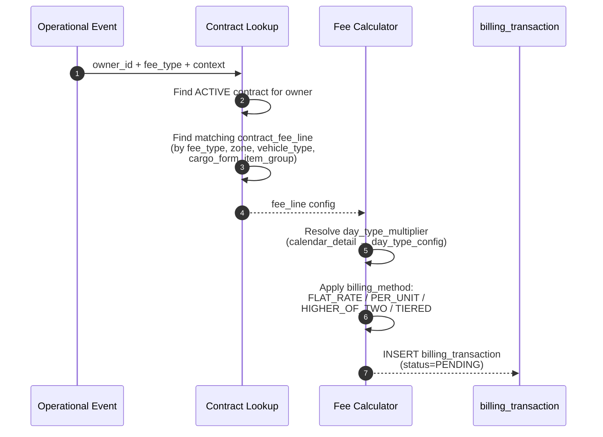

# Billing Module — Feature Specification

> **Version**: 2.0
> **Date**: 2026-03-19
> **Author**: BA Agent
> **Status**: DRAFT — PENDING REVIEW
> **Complexity**: HIGH
> **Reference**: Biểu mẫu phí tính Billing RV03, 07-billing-flow.md, phase-5-revenue-vas.md, database-diagram.md, cross-module-integration.md

---

## Table of Contents

1. [Overview](#1-overview)
2. [Fee Taxonomy — Danh mục phí từ RV03](#2-fee-taxonomy)
3. [Data Model](#3-data-model)
4. [Process Flows](#4-process-flows)
5. [Fee Calculation Engine](#5-fee-calculation-engine)
6. [Daily Storage Snapshot](#6-daily-storage-snapshot)
7. [Auto-Capture Triggers](#7-auto-capture-triggers)
8. [Manual Fee Entry](#8-manual-fee-entry)
9. [Debit Note Generation](#9-debit-note-generation)
10. [Credit Note — Corrections](#10-credit-note)
11. [State Machines](#11-state-machines)
12. [Business Rules](#12-business-rules)
13. [API Endpoints](#13-api-endpoints)
14. [Frontend Screens](#14-frontend-screens)
15. [Backend Implementation Guide](#15-backend-implementation-guide)
16. [Cross-Module Integration](#16-cross-module-integration)
17. [ENUM Definitions](#17-enum-definitions)
18. [Migration & Seeding](#18-migration-and-seeding)
19. [Edge Cases & Discussion](#19-edge-cases)
20. [Definition of Done](#20-definition-of-done)

---

## 1. Overview

### 1.1 Bối cảnh nghiệp vụ

Billing Module là module tài chính downstream của hệ thống SWM, chịu trách nhiệm chuyển đổi mọi hoạt động vận hành kho (nhập, xuất, lưu kho, đóng bao, dịch vụ bổ sung) thành các bản ghi tài chính. Module phục vụ 2 mục tiêu:

1. **Tự động ghi nhận phí** (auto-capture) dựa trên sự kiện vận hành — không cần nhập tay cho các phí chuẩn liên quan kho.
2. **Hỗ trợ nhập phí thủ công** (manual entry) cho các phí ngoài kho (vận chuyển, thủ tục hải quan, phí cảng) mà WMS không có dữ liệu nguồn.

Kết quả cuối cùng: **Debit Note (bảng kê phí)** gửi cho từng chủ hàng theo kỳ, chi tiết theo từng nhóm phí.

### 1.2 Phạm vi

| Trong scope | Ngoài scope |
|-------------|-------------|
| Billing Contract & Fee Configuration | Payment collection / AR |
| Fee Type Master Data (80+ loại phí từ RV03) | Integration với ERP kế toán |
| Daily Storage Snapshot (lưu kho theo tồn kho) | Hóa đơn VAT chính thức (invoice) |
| Auto-capture: Handling In, Handling Out, Bagging, Storage, Container Stuffing | Phí cảng biển (ngoài hệ thống WMS) |
| Manual fee entry (phí ngoài kho, phí khác) | |
| Debit Note generation & approval workflow | |
| Credit Note corrections | |
| Calendar & Day Type multiplier | |
| Free days logic (PER_CONTRACT / PER_BL / PER_RECEIPT) | |
| Billing Dashboard & Reports | |
| Per-customer fee applicability matrix | |

### 1.3 Key Stakeholders

| Role | Trách nhiệm trong Billing |
|------|---------------------------|
| BILLING_CLERK | Tạo/quản lý hợp đồng, nhập phí manual, generate debit note, review |
| WH_MANAGER | Approve debit note, resolve disputes |
| WH_OWNER (Chủ hàng) | Xem billing statement (read-only) |
| SYSTEM | Auto-capture phí từ events, EOD snapshot, contract expiration |

---

## 2. Fee Taxonomy — Danh mục phí từ RV03

### 2.1 Cấu trúc phân loại phí

Dựa trên biểu mẫu RV03, hệ thống phí được phân thành **4 nhóm chính** với **17 nhóm con** và **80+ loại phí chi tiết**.

### 2.2 Nhóm 1: Phí Lưu kho (STORAGE)

| Mã | Tên phí | Fee Group | Capture Mode | Công thức | Ghi chú |
|----|---------|-----------|-------------|-----------|---------|
| LK01 | Phí thuê kho theo diện tích | STORAGE_AREA | MANUAL | Đơn giá × Diện tích (m²) × Số tháng | Flat rate theo hợp đồng, không phụ thuộc tồn kho |
| LK02 | Phí lưu kho theo tồn kho | STORAGE_INVENTORY | AUTO | Đơn giá × Closing qty (MT) × Day multiplier | Tính hàng ngày từ EOD snapshot |
| LK03 | Phí lưu kho đặc biệt | STORAGE_SPECIAL | MANUAL | Đơn giá × Số lượng × Điều kiện đặc biệt | Hàng nguy hiểm, bảo quản đặc biệt |

### 2.3 Nhóm 2: Phí Nhập hàng (HANDLING_IN)

| Mã | Tên phí | Fee Sub-Group | Capture Mode | Công thức | Ghi chú |
|----|---------|--------------|-------------|-----------|---------|
| NH01 | Phí dỡ hàng từ tàu xuống xe | PORT_HANDLING | MANUAL | Đơn giá × SL theo Rorooc tàu | Sản lượng lấy từ cảng, ngoài WMS |
| NH02 | Phí sử dụng cẩu bờ dỡ hàng | PORT_HANDLING | MANUAL | Đơn giá × SL theo Rorooc tàu | Ngoài WMS |
| NH03 | Phí sang mạn Salan/tàu nhỏ (cập mạn tàu mẹ) | PORT_HANDLING | MANUAL | Đơn giá × SL hàng | Bắt buộc lấy SL từ cảng |
| NH04 | Phí sang mạn Salan/tàu nhỏ (PA cẩu bờ xe Platform) | PORT_HANDLING | MANUAL | Đơn giá × SL hàng | Ngoài WMS |
| NH05 | Phí dỡ hàng bao 25kg từ xe xuống kho | UNLOADING | AUTO | Đơn giá × SL hàng nhập kho | Trigger: Receipt RECEIVED |
| NH06 | Phí dỡ hàng bao 50kg từ xe xuống kho | UNLOADING | AUTO | Đơn giá × SL hàng nhập kho | Trigger: Receipt RECEIVED |
| NH07 | Phí dỡ hàng bao Jumbo từ xe xuống kho | UNLOADING | AUTO | Đơn giá × SL hàng nhập kho | Trigger: Receipt RECEIVED |
| NH08 | Phí rút hàng bao từ Container xuống kho | UNLOADING | MANUAL | Đơn giá × SL container | Tính theo container, không theo tấn |
| NH09 | Phí cân hàng nhập kho | INBOUND_WEIGHING | AUTO | Đơn giá × SL hàng nhập kho | Trigger: Receipt RECEIVED |
| NH10 | Phí vun hàng xá trong kho | STACKING | AUTO | Đơn giá × SL hàng nhập kho | 100% hàng xá đều phát sinh |
| NH11 | Phí phủ bạt hàng hóa | STACKING | MANUAL | Đơn giá × SL hàng nhập kho | Tùy theo yêu cầu khách hàng |
| NH12 | Phí vận chuyển hàng từ Cảng về kho (xe tải) | TRANSPORT | MANUAL | Đơn giá × SL hoặc theo chuyến | Tính theo cự ly/tuyến, WMS không tính được |
| NH13 | Phí vận chuyển hàng từ Cảng về kho | TRANSPORT | MANUAL | Đơn giá × SL hàng | Ngoài WMS |
| NH14 | Phí làm thủ tục hải quan nhập theo SL | CUSTOMS | MANUAL | Đơn giá × SL hàng | Chỉ khi công ty làm thủ tục |
| NH15 | Phí làm thủ tục hải quan nhập tối thiểu | CUSTOMS | MANUAL | Đơn giá tối thiểu × SL tờ khai | Có quy định tối thiểu |
| NH16 | Phí kiểm tra chất lượng | CUSTOMS | MANUAL | Đơn giá × SL tờ khai | Có tối thiểu cho 1 lần làm |
| NH17 | Phí xử lý giấy tờ nhập khẩu | CUSTOMS | MANUAL | Đơn giá × SL tờ khai | Ngoài WMS |
| NH18 | Phí khác bổ sung (nhập hàng) | OTHER_IN | MANUAL | Đơn giá × SL | Nhập theo phân quyền |

### 2.4 Nhóm 3: Phí Đóng bao (BAGGING / VAS)

| Mã | Tên phí | Fee Sub-Group | Capture Mode | Công thức | Ghi chú |
|----|---------|--------------|-------------|-----------|---------|
| ĐÓ01 | Phí đóng bao 25kg | BAGGING_STANDARD | AUTO | Đơn giá × SL thực hiện | Trigger: VWO COMPLETED |
| ĐÓ02 | Phí đóng bao 50kg | BAGGING_STANDARD | AUTO | Đơn giá × SL thực hiện | Trigger: VWO COMPLETED |
| ĐÓ03 | Phí đóng bao Jumbo | BAGGING_JUMBO | AUTO | Đơn giá × SL thực hiện | Trigger: VWO COMPLETED |
| ĐÓ04 | Phí đóng bao 40kg | BAGGING_STANDARD | AUTO | Đơn giá × SL thực hiện | Trigger: VWO COMPLETED |
| ĐÓ05 | Phí đóng bao khác | BAGGING_OTHER | AUTO | Đơn giá × SL thực hiện | Trigger: VWO COMPLETED |
| ĐÓ06 | Phí trộn hàng và đóng bao 50kg | MIXING_BAGGING | MANUAL | Đơn giá × SL thực hiện | Case Yara: trộn nhiều mã → NPK |
| ĐÓ07 | Phí trộn hàng và đóng bao 25kg | MIXING_BAGGING | MANUAL | Đơn giá × SL thực hiện | Công thức không cố định |
| ĐÓ08 | Phí dỡ hàng xá từ container và đóng bao 25kg | UNLOAD_BAGGING | MANUAL | Đơn giá × SL | Composite service |
| ĐÓ09 | Phí dỡ hàng xá từ container và đóng bao 50kg | UNLOAD_BAGGING | MANUAL | Đơn giá × SL | Composite service |
| ĐÓ10 | Phí dỡ hàng bao bigbag từ container và đóng bao 50kg | UNLOAD_BAGGING | MANUAL | Đơn giá × SL | Composite service |
| ĐÓ11 | Phí dỡ hàng bao bigbag từ container và đóng bao 25kg | UNLOAD_BAGGING | MANUAL | Đơn giá × SL | Composite service |
| ĐÓ12–ĐÓ19 | Phí rút dây PE đầu bao (nhiều loại, có/không PE) | MATERIAL_SERVICE | MANUAL | Đơn giá × SL | 8 biến thể theo loại bao và PE |
| ĐÓ20–ĐÓ22 | Phí rọc bao (50kg, Jumbo, 25kg) | MATERIAL_SERVICE | MANUAL | Đơn giá × SL | Dịch vụ bổ sung |
| ĐÓ23 | Phí sàng hàng | VAS_OTHER | MANUAL | Đơn giá × SL | Phí khác |
| ĐÓ24 | Phí ván gỗ, thép cửa container | VAS_OTHER | MANUAL | Đơn giá × SL container | |
| ĐÓ25 | Phí mua Pallet gỗ | VAS_OTHER | MANUAL | Đơn giá × SL tấn | |
| ĐÓ26 | Quần màng bao | VAS_OTHER | MANUAL | Đơn giá × SL tấn | |
| ĐÓ27 | Phí chọc hopper khi đóng bao | VAS_OTHER | MANUAL | Đơn giá × SL tấn | |
| ĐÓ28 | Phí cán hàng vón cục | VAS_OTHER | MANUAL | Đơn giá × SL tấn | |
| ĐÓ29 | Phí sơn vỏ bao | VAS_OTHER | MANUAL | Đơn giá × SL tấn | |
| ĐÓ30 | Phí dán tem/nhãn sản phẩm | VAS_OTHER | MANUAL | Đơn giá × SL tấn | |
| ĐÓ31 | Phí đóng date | VAS_OTHER | MANUAL | Đơn giá × SL tấn | |
| ĐÓ32–ĐÓ33 | Phí đập cục hàng bao (25kg, 50kg) | VAS_OTHER | MANUAL | Đơn giá × SL tấn | |
| ĐÓ34 | Phí đảo trộn hàng | VAS_OTHER | MANUAL | Đơn giá × SL tấn | |
| ĐÓ35 | Phí khác (đóng bao) | VAS_OTHER | MANUAL | Đơn giá × SL tấn | Có thể thêm bớt |

### 2.5 Nhóm 4: Phí Xuất hàng (HANDLING_OUT)

| Mã | Tên phí | Fee Sub-Group | Capture Mode | Công thức | Ghi chú |
|----|---------|--------------|-------------|-----------|---------|
| XU01 | Phí xếp hàng bao 50kg lên xe tải thường | LOADING | AUTO | Đơn giá × SL | Trigger: Order SHIPPED |
| XU02 | Phí xếp hàng bao 25kg lên xe tải thường | LOADING | AUTO | Đơn giá × SL | Trigger: Order SHIPPED |
| XU03 | Phí xếp hàng bao Jumbo lên xe tải thường | LOADING | AUTO | Đơn giá × SL | Trigger: Order SHIPPED |
| XU04 | Phí xếp hàng xá lên xe tải thường | LOADING | AUTO | Đơn giá × SL | Trigger: Order SHIPPED |
| XU05 | Phí xếp hàng xá lên xe Container | LOADING | AUTO | Đơn giá × SL | Trigger: Order SHIPPED |
| XU06 | Phí xếp hàng xá lên xe Bồn chứa | LOADING | AUTO | Đơn giá × SL | Trigger: Order SHIPPED |
| XU07–XU12 | Phí xếp hàng bao lên Container (20ft/40ft × 25/50/Jumbo) | CONTAINER_LOADING | AUTO | Đơn giá × SL cont hoặc tấn | Trigger: Order SHIPPED |
| XU13 | Phí kiểm đếm bao hàng xuất | TALLY | AUTO | Đơn giá × SL | Trigger: Order SHIPPED |
| XU14 | Phí cân hàng xuất | OUTBOUND_WEIGHING | AUTO | Đơn giá × SL | Trigger: Order SHIPPED |
| XU15 | Phí vận chuyển hàng từ kho ra Cảng | TRANSPORT | MANUAL | Đơn giá × SL | Có đơn giá cố định |
| XU16 | Phí vận chuyển hàng từ kho đến kho | TRANSPORT | MANUAL | Đơn giá × SL | |
| XU17 | Phí vận chuyển Container từ kho đến Cảng xuất | TRANSPORT | MANUAL | Đơn giá × SL | |
| XU18–XU21 | Phí xếp hàng xuống Salan/Tàu (nhiều loại) | PORT_HANDLING | MANUAL | Đơn giá × SL | Ngoài WMS |
| XU22–XU24 | Phí làm thủ tục hải quan xuất (theo tấn/cont/tối thiểu) | CUSTOMS | MANUAL | Đơn giá × SL | Ngoài WMS |
| XU25 | Phí sếp lát hàng bao dưới tàu/salan | PORT_HANDLING | MANUAL | Đơn giá × SL | |
| XU26 | Phí ván gỗ, thép cửa container (xuất) | CONTAINER_STUFFING | AUTO | Đơn giá × SL container | 100% đóng cont phát sinh |

### 2.6 Tổng kết Capture Mode

| Capture Mode | Số lượng phí | Mô tả |
|-------------|-------------|--------|
| **AUTO** | ~25 loại | System tự tạo billing_transaction khi event xảy ra |
| **MANUAL** | ~55 loại | Billing clerk nhập thủ công trên UI, thường là phí ngoài kho |

### 2.7 Customer Fee Applicability Matrix

Mỗi khách hàng chỉ áp dụng một tập con phí. Sheet "Masterdata" RV03 mô tả matrix này.

Hệ thống cần hỗ trợ: khi tạo Contract cho owner, billing clerk chọn các fee_type áp dụng từ master list → chỉ những fee_type được chọn mới generate billing_transaction.

---

## 3. Data Model

### 3.1 Entity Relationship Diagram

```
billing_contract (1) ──< (N) contract_fee_line
                                    │
                                    └──< (N) billing_condition  (tiered pricing)

fee_type (master)
day_type_config (master)
calendar_detail (master — date overrides)

billing_transaction (append-only) ── ref → SNAPSHOT / RECEIPT / SHIPMENT / VAS / STUFFING / MANUAL

daily_storage_snapshot (append-only, partitioned by tenant_id + snapshot_date)

debit_note (1) ──< (N) debit_note_line
                        │
debit_note (1) ──< (N) credit_note
```

### 3.2 `fee_type` — Master danh mục phí

| Field | Type | Nullable | Mô tả |
|-------|------|----------|--------|
| `id` | UUID | NO | PK |
| `tenant_id` | UUID | NO | Multi-tenancy |
| `code` | varchar(20) | NO | UNIQUE(tenant_id, code). VD: NH05, XU01, LK02 |
| `name` | varchar(200) | NO | Tên phí tiếng Việt |
| `name_en` | varchar(200) | YES | Tên phí tiếng Anh |
| `fee_group` | FeeGroup | NO | STORAGE / HANDLING_IN / HANDLING_OUT / BAGGING / CONTAINER_STUFFING / VAS_OTHER / OTHER |
| `fee_sub_group` | varchar(50) | YES | Sub-group: UNLOADING, LOADING, TALLY, CUSTOMS, TRANSPORT, etc. |
| `capture_mode` | CaptureMode | NO | AUTO / MANUAL |
| `default_formula` | varchar(500) | YES | Công thức tính mặc định (mô tả text) |
| `is_warehouse_related` | bool | NO | TRUE = phí liên quan vận hành kho, FALSE = phí ngoài kho |
| `billing_unit` | varchar(20) | NO | Đơn vị tính: MT, BAG, CONTAINER, TRIP, DECLARATION, FLAT |
| `sort_order` | int | NO | Thứ tự hiển thị |
| `is_active` | bool | NO | DEFAULT true |
| audit fields | | | created_at/by, updated_at/by |

**Seeding**: Seed 80+ fee_type records từ RV03 khi tạo tenant. Tenant có thể thêm/sửa/deactivate.

### 3.3 `billing_contract` — Hợp đồng billing

| Field | Type | Nullable | Mô tả |
|-------|------|----------|--------|
| `id` | UUID | NO | PK |
| `tenant_id` | UUID | NO | |
| `contract_number` | varchar(50) | NO | UNIQUE(tenant_id, contract_number), auto-gen |
| `owner_id` | UUID → owner | NO | Chủ hàng |
| `warehouse_id` | UUID → warehouse | YES | NULL = áp dụng tất cả kho. Có giá trị = chỉ áp dụng kho cụ thể |
| `start_date` | date | NO | Ngày hiệu lực |
| `end_date` | date | NO | Ngày hết hạn |
| `status` | ContractStatus | NO | DRAFT / ACTIVE / EXPIRED / TERMINATED |
| `notes` | varchar(1000) | YES | |
| audit fields | | | |

**Constraint**: Max 1 contract ACTIVE per (tenant_id, owner_id, warehouse_id). Nếu `warehouse_id` = NULL, không được có contract ACTIVE khác cho cùng owner ở bất kỳ warehouse.

### 3.4 `contract_fee_line` — Dòng phí trong hợp đồng

| Field | Type | Nullable | Mô tả |
|-------|------|----------|--------|
| `id` | UUID | NO | PK |
| `tenant_id` | UUID | NO | |
| `billing_contract_id` | UUID → billing_contract | NO | FK |
| `fee_type_id` | UUID → fee_type | NO | FK — loại phí áp dụng |
| `billing_method` | BillingMethod | NO | FLAT_RATE / PER_UNIT / HIGHER_OF_TWO / TIERED |
| `unit_price` | decimal(18,4) | YES | Đơn giá (NULL nếu FLAT_RATE hoặc TIERED) |
| `flat_rate_amount` | decimal(18,4) | YES | Phí cố định kỳ (chỉ dùng với FLAT_RATE / HIGHER_OF_TWO) |
| `min_qty` | decimal(18,3) | YES | Sản lượng tối thiểu (chỉ dùng với HIGHER_OF_TWO) |
| `free_days` | int | YES | Số ngày miễn phí (chỉ áp dụng cho STORAGE) |
| `free_days_mode` | FreeDaysMode | YES | PER_CONTRACT / PER_BL / PER_RECEIPT |
| `zone_id` | UUID → zone | YES | Phí theo zone cụ thể (NULL = tất cả) |
| `vehicle_type_id` | UUID → vehicle_type | YES | Phí theo loại xe (NULL = tất cả) |
| `cargo_form` | CargoForm | YES | Phí theo dạng hàng: BULK / BAGGED_25 / BAGGED_50 / JUMBO (NULL = tất cả) |
| `item_group_id` | UUID → item_group | YES | Phí theo nhóm hàng (NULL = tất cả) |
| `effective_from` | date | YES | Ngày có hiệu lực riêng (NULL = theo contract) |
| `effective_to` | date | YES | Ngày hết hiệu lực riêng |
| `is_active` | bool | NO | DEFAULT true |
| `notes` | varchar(500) | YES | |
| `sort_order` | int | NO | Thứ tự hiển thị |
| audit fields | | | |

**UNIQUE**: `(tenant_id, billing_contract_id, fee_type_id, zone_id, vehicle_type_id, cargo_form, item_group_id)` — cho phép cùng fee_type nhưng khác điều kiện.

**Rate lookup priority**: Khi tìm đơn giá cho 1 giao dịch, hệ thống match theo thứ tự specificity giảm dần:
1. Match cả zone + vehicle_type + cargo_form + item_group
2. Match zone + cargo_form + item_group (bỏ vehicle_type)
3. Match cargo_form + item_group
4. Match item_group only
5. Default (tất cả NULL)

### 3.5 `billing_condition` — Điều kiện bậc thang (TIERED)

| Field | Type | Nullable | Mô tả |
|-------|------|----------|--------|
| `id` | UUID | NO | PK |
| `tenant_id` | UUID | NO | |
| `contract_fee_line_id` | UUID → contract_fee_line | NO | FK |
| `min_value` | decimal(18,3) | NO | Cận dưới bậc thang |
| `max_value` | decimal(18,3) | YES | Cận trên bậc thang (NULL = unlimited) |
| `unit` | varchar(20) | NO | Đơn vị: MT, BAG, CONTAINER |
| `rate` | decimal(18,4) | NO | Đơn giá cho bậc thang này |
| `sort_order` | int | NO | Thứ tự bậc thang ASC |

**Constraint**: Tiers must not overlap. `min_value[n+1]` = `max_value[n]`.

### 3.6 `day_type_config` — Cấu hình hệ số ngày

| Field | Type | Nullable | Mô tả |
|-------|------|----------|--------|
| `id` | UUID | NO | PK |
| `tenant_id` | UUID | NO | |
| `day_type` | DayType | NO | WORKING / DAY_OFF / HOLIDAY |
| `multiplier` | decimal(5,2) | NO | WORKING=1.0, DAY_OFF=1.5, HOLIDAY=2.0 |
| `description` | varchar(200) | YES | |

### 3.7 `calendar_detail` — Override ngày cụ thể

| Field | Type | Nullable | Mô tả |
|-------|------|----------|--------|
| `id` | UUID | NO | PK |
| `tenant_id` | UUID | NO | |
| `calendar_date` | date | NO | UNIQUE(tenant_id, calendar_date) |
| `day_type` | DayType | NO | Override loại ngày |
| `description` | varchar(200) | YES | VD: "Tết Nguyên Đán", "Nghỉ bù" |

### 3.8 `daily_storage_snapshot` — Ảnh chụp tồn kho hàng ngày

| Field | Type | Nullable | Mô tả |
|-------|------|----------|--------|
| `id` | UUID | NO | PK |
| `tenant_id` | UUID | NO | |
| `snapshot_date` | date | NO | Ngày chụp |
| `owner_id` | UUID → owner | NO | |
| `item_id` | UUID → item | NO | |
| `warehouse_id` | UUID → warehouse | NO | |
| `inventory_status` | varchar(50) | NO | Status tồn kho |
| `lot_id` | UUID → lot | YES | Per lot |
| `opening_qty_mt` | decimal(18,3) | NO | = closing_qty ngày trước |
| `inbound_qty_mt` | decimal(18,3) | NO | SUM invent_trans qty > 0 (PHYSICAL) trong ngày |
| `outbound_qty_mt` | decimal(18,3) | NO | SUM invent_trans qty < 0 (PHYSICAL/DEDUCTED) trong ngày |
| `adjustment_qty_mt` | decimal(18,3) | NO | SUM ADJUSTMENT trans trong ngày |
| `closing_qty_mt` | decimal(18,3) | NO | = opening + inbound - outbound + adjustment |
| `is_billable` | bool | NO | FALSE nếu trong free days |
| `days_in_storage` | int | YES | Số ngày đã lưu kho (từ first_received_date của lot) |
| `free_days_remaining` | int | YES | Số ngày miễn phí còn lại |
| audit fields (created only) | | | Append-only |

**Partitioning**: BY RANGE (tenant_id, snapshot_date) — critical cho performance.
**UNIQUE**: `(tenant_id, snapshot_date, owner_id, item_id, warehouse_id, inventory_status, lot_id)`

### 3.9 `billing_transaction` — Giao dịch phí (Append-Only)

| Field | Type | Nullable | Mô tả |
|-------|------|----------|--------|
| `id` | UUID | NO | PK |
| `tenant_id` | UUID | NO | |
| `owner_id` | UUID → owner | NO | |
| `billing_contract_id` | UUID → billing_contract | NO | |
| `contract_fee_line_id` | UUID → contract_fee_line | NO | Fee line đã dùng để tính |
| `fee_type_id` | UUID → fee_type | NO | |
| `transaction_date` | date | NO | Ngày phát sinh |
| `qty` | decimal(18,3) | NO | Số lượng (MT, BAG, CONTAINER, TRIP...) |
| `unit_price` | decimal(18,4) | NO | Đơn giá đã áp dụng |
| `day_type_multiplier` | decimal(5,2) | NO | Hệ số ngày (1.0, 1.5, 2.0) |
| `amount` | decimal(18,4) | NO | = qty × unit_price × day_type_multiplier (hoặc theo billing_method) |
| `reference_type` | ReferenceType | NO | SNAPSHOT / RECEIPT / SHIPMENT / VAS / STUFFING / MANUAL |
| `reference_id` | UUID | YES | FK tới nguồn (NULL nếu MANUAL không có ref) |
| `reference_number` | varchar(100) | YES | Số chứng từ (receipt_number, order_number, vwo_number) |
| `description` | varchar(500) | YES | Mô tả chi tiết (manual entry) |
| `status` | BillingTransactionStatus | NO | PENDING / INVOICED |
| `debit_note_id` | UUID → debit_note | YES | NULL khi PENDING, set khi link vào DN |
| `warehouse_id` | UUID → warehouse | YES | Kho phát sinh |
| `created_time` | timestamp | NO | |
| `created_by` | varchar(200) | NO | |

**Append-Only**: Sử dụng `AppendOnlyEntity` base class. Không update, không delete. Corrections chỉ qua Credit Note.

### 3.10 `debit_note` — Bảng kê phí

| Field | Type | Nullable | Mô tả |
|-------|------|----------|--------|
| `id` | UUID | NO | PK |
| `tenant_id` | UUID | NO | |
| `dn_number` | varchar(50) | NO | UNIQUE(tenant_id, dn_number), auto-gen |
| `owner_id` | UUID → owner | NO | |
| `warehouse_id` | UUID → warehouse | YES | |
| `period_from` | date | NO | Bắt đầu kỳ billing |
| `period_to` | date | NO | Kết thúc kỳ billing |
| `subtotal` | decimal(18,4) | NO | Tổng trước VAT |
| `vat_rate` | decimal(5,2) | NO | % VAT (default 10%) |
| `vat_amount` | decimal(18,4) | NO | = subtotal × vat_rate / 100 |
| `total_amount` | decimal(18,4) | NO | = subtotal + vat_amount |
| `credit_note_total` | decimal(18,4) | NO | DEFAULT 0. Tổng credit notes đã applied |
| `net_amount` | decimal(18,4) | NO | = total_amount - credit_note_total |
| `status` | DebitNoteStatus | NO | DRAFT / REVIEWED / DISPUTED / APPROVED / LOCKED |
| `dispute_reason` | varchar(1000) | YES | Lý do dispute |
| `reviewed_by` | varchar(200) | YES | |
| `reviewed_at` | timestamp | YES | |
| `approved_by` | varchar(200) | YES | |
| `approved_at` | timestamp | YES | |
| `locked_by` | varchar(200) | YES | |
| `locked_at` | timestamp | YES | |
| `notes` | varchar(1000) | YES | |
| audit fields | | | |

### 3.11 `debit_note_line` — Chi tiết bảng kê

| Field | Type | Nullable | Mô tả |
|-------|------|----------|--------|
| `id` | UUID | NO | PK |
| `tenant_id` | UUID | NO | |
| `debit_note_id` | UUID → debit_note | NO | FK |
| `fee_type_id` | UUID → fee_type | NO | FK |
| `fee_group` | FeeGroup | NO | Copy từ fee_type.fee_group (denormalized for display) |
| `description` | varchar(500) | YES | Mô tả dòng phí |
| `qty` | decimal(18,3) | NO | Tổng SL aggregated |
| `unit` | varchar(20) | NO | Đơn vị |
| `unit_price` | decimal(18,4) | NO | Đơn giá bình quân |
| `amount` | decimal(18,4) | NO | Tổng tiền = SUM(billing_transaction.amount) cho fee_type này |
| `sort_order` | int | NO | Thứ tự hiển thị (theo fee_type.sort_order) |

### 3.12 `credit_note` — Điều chỉnh giảm

| Field | Type | Nullable | Mô tả |
|-------|------|----------|--------|
| `id` | UUID | NO | PK |
| `tenant_id` | UUID | NO | |
| `cn_number` | varchar(50) | NO | UNIQUE(tenant_id, cn_number), auto-gen |
| `debit_note_id` | UUID → debit_note | NO | FK — chỉ cho DN đã LOCKED |
| `amount` | decimal(18,4) | NO | Số tiền giảm |
| `reason` | varchar(1000) | NO | Lý do điều chỉnh |
| `status` | CreditNoteStatus | NO | DRAFT / APPROVED / APPLIED |
| `approved_by` | varchar(200) | YES | |
| `approved_at` | timestamp | YES | |
| `applied_at` | timestamp | YES | |
| audit fields | | | |

**Constraint**: `SUM(credit_note.amount) WHERE debit_note_id = X AND status IN (APPROVED, APPLIED)` ≤ `debit_note.total_amount`

---

## 4. Process Flows

### 4.1 End-to-End Billing Pipeline

```
[1] Contract Setup
    Owner ← → Billing Contract ← → Fee Lines ← → Billing Conditions
                    │
[2] Operational Events (auto-capture)
    Receipt RECEIVED ───┐
    Order SHIPPED   ────┤
    VWO COMPLETED   ────┤──→ Billing Transaction (PENDING)
    EOD Snapshot    ────┤
    Stuffing Done   ────┘
                    │
[3] Manual Fee Entry
    Billing Clerk ──────→ Billing Transaction (PENDING)
                    │
[4] Debit Note Generation (Monthly/On-demand)
    Select Owner + Period
    → Aggregate billing_transaction by fee_type
    → Generate debit_note + debit_note_lines
    → Mark transactions as INVOICED
                    │
[5] Approval Workflow
    DRAFT → REVIEWED → APPROVED → LOCKED
              ↕
           DISPUTED → (resolve) → APPROVED
                    │
[6] Credit Note (if correction needed)
    Only for LOCKED DN
    → Create credit_note (DRAFT → APPROVED → APPLIED)
    → Original DN immutable
```

### 4.2 Fee Auto-Capture Sequence



---

## 5. Fee Calculation Engine

### 5.1 Billing Methods

#### FLAT_RATE
```
amount = flat_rate_amount
```
Phí cố định theo kỳ, không phụ thuộc số lượng. Dùng cho phí thuê kho theo diện tích.

#### PER_UNIT
```
amount = qty × unit_price × day_type_multiplier
```
Phí theo đơn vị. Dùng cho đa số phí handling, bagging, weighing.

#### HIGHER_OF_TWO
```
actual_amount = actual_qty × unit_price
min_amount    = min_qty × unit_price
amount        = MAX(actual_amount, min_amount) × day_type_multiplier
```
Dùng khi có MOQ (minimum order quantity). Lấy giá trị lớn hơn giữa thực tế và tối thiểu.

#### TIERED
```
Lookup billing_condition tiers ORDER BY min_value ASC

Mode A — Marginal (bậc thang lũy tiến):
    For each tier: tier_amount = qty_in_tier × tier.rate
    amount = SUM(tier_amounts) × day_type_multiplier

Mode B — Flat (bậc thang toàn phần):
    Find tier where min ≤ qty ≤ max
    amount = qty × tier.rate × day_type_multiplier
```

### 5.2 Day Type Multiplier Resolution

```
Input: transaction_date

Step 1: Check calendar_detail for exact date override
    → If found: use that day_type

Step 2: Fallback to day_type_config
    → Determine weekday from date
    → Monday-Saturday = WORKING
    → Sunday = DAY_OFF
    (configurable per tenant)

Step 3: Get multiplier from day_type_config
    WORKING  = 1.0
    DAY_OFF  = 1.5
    HOLIDAY  = 2.0
```

### 5.3 Contract Fee Line Lookup (Rate Resolution)

Khi auto-capture event xảy ra, system cần tìm đúng `contract_fee_line` để lấy `unit_price`:

```
Input: owner_id, fee_type_id, warehouse_id, zone_id, vehicle_type_id, cargo_form, item_group_id, transaction_date

Step 1: Find ACTIVE billing_contract for (owner_id, warehouse_id)
    → If warehouse_id specific contract exists → use it
    → Else if global contract (warehouse_id = NULL) exists → use it
    → Else → NO CONTRACT → skip (log warning)

Step 2: Find contract_fee_line matching fee_type_id
    → Filter: is_active = true
    → Filter: effective_from ≤ transaction_date ≤ effective_to (or NULL)
    → Score each candidate by specificity:
        +4 if zone_id matches
        +3 if vehicle_type_id matches
        +2 if cargo_form matches
        +1 if item_group_id matches
    → Select candidate with highest score
    → Tie-break: most recently created

Step 3: Return fee_line with billing_method, unit_price, etc.
```

---

## 6. Daily Storage Snapshot

### 6.1 EOD Job — Chạy 23:59 UTC+7 hàng ngày

```
For each tenant:
    For each on_hand group (owner_id, item_id, warehouse_id, inventory_status, lot_id):
        1. Skip if inventory_status = IN_TRANSIT
        2. Skip if location.is_billing_zone = false

        3. Get previous day closing_qty → opening_qty
           (If first day → opening = 0)

        4. Query invent_trans for today:
           inbound_qty  = SUM(qty WHERE qty > 0 AND stage = PHYSICAL)
           outbound_qty = SUM(qty WHERE qty < 0 AND stage IN (PHYSICAL, DEDUCTED))
           adjustment   = SUM(qty WHERE trans_type = ADJUSTMENT)

        5. closing_qty = opening + inbound - |outbound| + adjustment

        6. Determine is_billable:
           → Find contract_fee_line for (owner, STORAGE fee_type)
           → Get free_days_mode:
               PER_CONTRACT: start_date = contract.start_date + free_days
               PER_BL:       start_date = lot.first_received_date (grouped by BL) + free_days
               PER_RECEIPT:  start_date = lot.first_received_date + free_days
           → If snapshot_date within free period → is_billable = FALSE
           → Else → is_billable = TRUE

        7. days_in_storage = snapshot_date - lot.first_received_date

        8. INSERT daily_storage_snapshot

    For each billable snapshot (closing_qty > 0 AND is_billable = TRUE):
        → Create billing_transaction (reference_type = SNAPSHOT)
        → Amount = closing_qty × unit_price × day_type_multiplier
```

### 6.2 Snapshot Rebuild

Admin có thể trigger rebuild snapshot cho 1 khoảng thời gian nếu phát hiện sai lệch:
- DELETE snapshots trong range
- Re-run snapshot logic
- Re-create billing_transactions cho STORAGE fee
- Chỉ áp dụng cho billing_transactions chưa INVOICED

---

## 7. Auto-Capture Triggers

### 7.1 Trigger Map

| # | Fee Group | Trigger Event | Source Module | reference_type | reference_id | Qty Source | Timing | Fee Type Codes (RV03) |
|---|-----------|--------------|--------------|----------------|-------------|-----------|--------|--------------------|
| 1 | STORAGE | EOD snapshot | Inventory Core | SNAPSHOT | daily_storage_snapshot.id | closing_qty_mt (billable) | Daily 23:59 | LK02 |
| 2 | HANDLING_IN (UNLOADING) | Receipt → RECEIVED | Inbound | RECEIPT | receipt.id | receipt_line.received_qty_mt | On event | NH05, NH06, NH07 |
| 3 | HANDLING_IN (WEIGHING) | Receipt → RECEIVED | Inbound | RECEIPT | receipt.id | receipt_line.received_qty_mt | On event | NH09 |
| 4 | HANDLING_IN (STACKING) | Receipt → RECEIVED (hàng xá) | Inbound | RECEIPT | receipt.id | receipt_line.received_qty_mt | On event | NH10 |
| 5 | HANDLING_OUT (LOADING) | Order → SHIPPED | Outbound | SHIPMENT | shipment/order.id | shipped_qty_mt | On event | XU01–XU12 |
| 6 | HANDLING_OUT (TALLY) | Order → SHIPPED | Outbound | SHIPMENT | shipment/order.id | shipped_qty_mt | On event | XU13 |
| 7 | HANDLING_OUT (WEIGHING) | Order → SHIPPED | Outbound | SHIPMENT | shipment/order.id | shipped_qty_mt | On event | XU14 |
| 8 | BAGGING | VWO → COMPLETED | VAS | VAS | vas_work_order.id | actual_qty_mt | On event | ĐÓ01–ĐÓ05 |
| 9 | CONTAINER_STUFFING | Container stuffing done | Outbound | STUFFING | stuffing_order.id | container count | On event | XU26 |

### 7.2 Multi-Fee per Event

Một event có thể trigger **nhiều billing_transactions**. Ví dụ khi Receipt RECEIVED:
- 1 transaction cho phí dỡ hàng (NH05/NH06/NH07) — dựa trên cargo_form
- 1 transaction cho phí cân nhập (NH09)
- 1 transaction cho phí vun hàng (NH10) — chỉ khi hàng xá

System loop qua tất cả contract_fee_lines có `capture_mode = AUTO` và match điều kiện → tạo billing_transaction cho mỗi fee_line.

### 7.3 Auto-Capture Idempotency

```
external_id = "{reference_type}_{reference_id}_{fee_type_id}"
```

UNIQUE constraint trên `(tenant_id, external_id)` ngăn duplicate khi retry event.

---

## 8. Manual Fee Entry

### 8.1 Use Cases

Phí manual chiếm ~55 loại trong RV03, bao gồm:
- Phí cảng biển (NH01-NH04): SL lấy từ cảng, ngoài WMS
- Phí vận chuyển (NH12-NH13, XU15-XU17): Tính theo tuyến đường, WMS không quản lý
- Phí thủ tục hải quan (NH14-NH17, XU22-XU24): Tính theo tờ khai
- Phí dịch vụ bổ sung đóng bao (ĐÓ06-ĐÓ35): Trộn hàng, rút dây PE, rọc bao, etc.
- Phí khác theo yêu cầu

### 8.2 Manual Entry Form

```
[Nhập phí thủ công]

Owner:          [dropdown]
Fee Type:       [dropdown — filtered by contract fee lines, capture_mode = MANUAL]
Transaction Date: [date picker]
Warehouse:      [dropdown — optional]

Quantity:       [___]  Unit: [auto from fee_type.billing_unit]
Unit Price:     [auto from contract_fee_line — editable override]
Day Multiplier: [auto from calendar — read-only]
Amount:         [auto-calculated — editable override]

Reference Number: [___]  (VD: biên bản, phiếu cân, tờ khai)
Description:    [___]

[+ Thêm dòng]  [Lưu]
```

### 8.3 Bulk Import

Support import từ Excel cho manual fees:
- Template chuẩn: Owner, Fee Type Code, Date, Qty, Unit Price, Amount, Reference, Description
- Validation: check contract exists, fee_type valid, amounts match formula
- Preview trước khi commit

### 8.4 Authorization

- Manual fee entry yêu cầu role BILLING_CLERK hoặc WH_MANAGER
- Một số fee_type sensitive (NH18, ĐÓ35) yêu cầu approval workflow riêng
- `fee_type.requires_approval` flag → nếu TRUE, manual entry vào status PENDING_APPROVAL trước khi chính thức

---

## 9. Debit Note Generation

### 9.1 Generation Wizard (3 Steps)

**Step 1 — Select Parameters:**
```
Owner:          [dropdown — required]
Warehouse:      [dropdown — optional, NULL = all]
Period From:    [date — required]
Period To:      [date — required]
Include Manual: [checkbox — default: true]
```

**Step 2 — Preview:**
```
System queries billing_transaction WHERE:
    owner_id = selected
    warehouse_id = selected (or all)
    transaction_date BETWEEN period_from AND period_to
    status = PENDING
    debit_note_id IS NULL

Group by fee_type → Show:
┌──────────────────────────────────┬──────┬────────┬────────────┐
│ Loại phí                         │ SL   │ Đơn giá│ Thành tiền │
├──────────────────────────────────┼──────┼────────┼────────────┤
│ [STORAGE] Phí lưu kho tồn kho   │ 1,200│ 15,000 │ 18,000,000 │
│ [HANDLING_IN] Phí dỡ hàng 50kg  │   450│  8,000 │  3,600,000 │
│ [HANDLING_IN] Phí cân nhập       │   450│  2,000 │    900,000 │
│ [HANDLING_OUT] Phí bốc xếp 50kg │   300│  9,000 │  2,700,000 │
│ [BAGGING] Phí đóng bao 50kg     │   200│ 12,000 │  2,400,000 │
│ [OTHER] Phí vận chuyển           │     5│250,000 │  1,250,000 │
├──────────────────────────────────┼──────┼────────┼────────────┤
│ Subtotal                         │      │        │ 28,850,000 │
│ VAT (10%)                        │      │        │  2,885,000 │
│ TOTAL                            │      │        │ 31,735,000 │
└──────────────────────────────────┴──────┴────────┴────────────┘
```

**Step 3 — Generate:**
- Create `debit_note` (status = DRAFT)
- Create `debit_note_line` per fee_type
- Update `billing_transaction.debit_note_id` = new DN id
- Update `billing_transaction.status` = INVOICED

### 9.2 Debit Note Grouping Logic

Debit Note lines được nhóm theo `fee_group` → `fee_type`:

```
NHÓM 1: PHÍ LƯU KHO
    ├── LK02: Phí lưu kho theo tồn kho    ── 18,000,000
    └── LK01: Phí thuê kho theo diện tích  ──  5,000,000

NHÓM 2: PHÍ NHẬP HÀNG
    ├── NH05: Phí dỡ hàng bao 50kg         ──  3,600,000
    ├── NH09: Phí cân hàng nhập             ──    900,000
    └── NH10: Phí vun hàng xá              ──  1,200,000

NHÓM 3: PHÍ XUẤT HÀNG
    ├── XU01: Phí bốc xếp bao 50kg         ──  2,700,000
    ├── XU13: Phí kiểm đếm                 ──    600,000
    └── XU14: Phí cân hàng xuất            ──    450,000

NHÓM 4: PHÍ ĐÓNG BAO
    ├── ĐÓ02: Phí đóng bao 50kg            ──  2,400,000
    └── ĐÓ03: Phí đóng bao Jumbo           ──  1,800,000

NHÓM 5: PHÍ KHÁC
    └── XU15: Phí vận chuyển               ──  1,250,000
```

### 9.3 VAT Calculation

```
vat_rate = system_config.vat_rate (default 10%)
vat_amount = subtotal × vat_rate / 100
total_amount = subtotal + vat_amount
```

---

## 10. Credit Note — Corrections

### 10.1 Quy tắc

- Chỉ tạo được Credit Note cho Debit Note đã **LOCKED**
- Original DN **immutable** — không sửa, không xóa
- Credit Note giảm `net_amount` của DN
- Tổng Credit Notes không được vượt quá `total_amount` của DN

### 10.2 Credit Note Flow

```
[Tạo Credit Note]
    → Select LOCKED Debit Note
    → Nhập: Amount (số tiền giảm), Reason (lý do)
    → Status = DRAFT

[Approve]
    → WH_MANAGER review → APPROVED
    → System update: debit_note.credit_note_total += amount
    → System update: debit_note.net_amount -= amount
    → Status = APPLIED
```

---

## 11. State Machines

### 11.1 Billing Contract

```
DRAFT ──[activate]──→ ACTIVE ──[end_date reached]──→ EXPIRED
  ↕ (edit)                  │
                            └──[manual terminate]──→ TERMINATED
```

**Rules:**
- Fee lines chỉ edit được khi DRAFT
- Activation yêu cầu ít nhất 1 fee_line
- Max 1 ACTIVE per (owner, warehouse)
- Auto-expire khi system_config.snapshot_time check daily

### 11.2 Debit Note

```
DRAFT ──[review]──→ REVIEWED ──[approve]──→ APPROVED ──[lock]──→ LOCKED
  ↕ (edit)              │                                            │
                        └──[dispute]──→ DISPUTED                     └── Credit Note only
                                           │
                                           ├──[resolve → approve]──→ APPROVED
                                           └──[resolve → recalc]──→ DRAFT
```

**Rules:**
- DRAFT: editable (add/remove lines, adjust amounts)
- REVIEWED: billing clerk đã xem xong
- DISPUTED: owner/manager phản đối, ghi lý do
- APPROVED: manager duyệt
- LOCKED: immutable, chỉ điều chỉnh qua Credit Note

### 11.3 Credit Note

```
DRAFT ──[approve]──→ APPROVED ──[apply]──→ APPLIED
  ↕ (edit)
```

---

## 12. Business Rules

### BR-BILL-001 — Append-Only BillingTransaction
- **Category**: Constraint
- **Description**: billing_transaction là append-only. Không UPDATE, không DELETE. Mọi điều chỉnh qua Credit Note.
- **Implementation**: Sử dụng `AppendOnlyEntity` base class.

### BR-BILL-002 — Daily Storage Snapshot Timing
- **Category**: Configuration
- **Description**: Snapshot chạy tại `system_config.snapshot_time` (default 23:59 UTC+7).
- **Trigger**: Scheduled job.

### BR-BILL-003 — Storage Fee Formula
- **Category**: Calculation
- **Description**: `amount = closing_qty_mt × unit_price × day_type_multiplier` cho mỗi ngày billable.

### BR-BILL-004 — Free Days Logic
- **Category**: Calculation
- **Description**: Ngày trong free period → `is_billable = FALSE`, phí lưu kho = 0.
- **Modes**:
  - PER_CONTRACT: đếm từ contract.start_date
  - PER_BL: đếm từ lot.first_received_date nhóm theo BL number (lot_attr_09)
  - PER_RECEIPT: đếm từ lot.first_received_date

### BR-BILL-005 — HIGHER_OF_TWO
- **Category**: Calculation
- **Description**: `MAX(flat_rate_amount, actual_qty × unit_price) × day_type_multiplier`

### BR-BILL-006 — DN Editable in DRAFT Only
- **Category**: Constraint
- **Description**: Debit Note lines chỉ chỉnh sửa được khi status = DRAFT.

### BR-BILL-007 — Credit Note for LOCKED DN Only
- **Category**: Constraint
- **Description**: Credit Note chỉ tạo được cho DN có status = LOCKED.

### BR-BILL-008 — VAT Rate from Config
- **Category**: Configuration
- **Description**: `vat_rate` lấy từ `system_config` (key: `billing.vat_rate`, default: 10).

### BR-BILL-009 — Contract Uniqueness
- **Category**: Constraint
- **Description**: Max 1 ACTIVE contract per (tenant_id, owner_id, warehouse_id).

### BR-BILL-010 — Fee Line Specificity Resolution
- **Category**: Calculation
- **Description**: Khi nhiều fee_line match 1 fee_type, chọn theo specificity score cao nhất (zone > vehicle_type > cargo_form > item_group).

### BR-BILL-011 — Multi-Fee per Event
- **Category**: Derivation
- **Description**: 1 operational event có thể tạo nhiều billing_transaction nếu match nhiều fee_line (VD: Receipt RECEIVED → phí dỡ + phí cân + phí vun).

### BR-BILL-012 — Snapshot Excludes IN_TRANSIT
- **Category**: Constraint
- **Description**: Hàng có inventory_status = IN_TRANSIT bị loại khỏi daily snapshot.

### BR-BILL-013 — Snapshot Only Billing Zones
- **Category**: Constraint
- **Description**: Chỉ tính phí lưu kho cho hàng ở location có `zone.is_billing_zone = TRUE`.

### BR-BILL-014 — Auto-Capture Requires Active Contract
- **Category**: Constraint
- **Description**: Auto-capture chỉ tạo billing_transaction khi owner có contract ACTIVE. Không có contract → skip, log warning.

### BR-BILL-015 — DN Generation Marks Transactions INVOICED
- **Category**: Derivation
- **Description**: Khi generate DN, billing_transactions được gắn `debit_note_id` và chuyển status từ PENDING → INVOICED.

### BR-BILL-016 — Credit Note Amount Cap
- **Category**: Constraint
- **Description**: SUM(credit_notes.amount) cho 1 DN không vượt quá DN.total_amount.

### BR-BILL-017 — Manual Fee Requires Reference
- **Category**: Validation
- **Description**: Manual fee entry yêu cầu ít nhất `reference_number` hoặc `description` không trống.

### BR-BILL-018 — Cargo Form Determines Fee Type
- **Category**: Derivation
- **Description**: Phí dỡ hàng (HANDLING_IN) và bốc xếp (HANDLING_OUT) áp đơn giá khác nhau theo cargo_form:
  - BULK → phí hàng xá
  - BAGGED_25 → phí bao 25kg
  - BAGGED_50 → phí bao 50kg
  - JUMBO → phí Jumbo

### BR-BILL-019 — Vehicle Type Affects Outbound Fee
- **Category**: Derivation
- **Description**: Phí bốc xếp xuất khác nhau theo loại xe:
  - XE_TAI (xe tải thường): XU01-XU04
  - CONTAINER_20FT: XU07, XU09, XU11
  - CONTAINER_40FT: XU08, XU10, XU12
  - BON_CHUA (bồn chứa): XU06

### BR-BILL-020 — Snapshot Immutable After Creation
- **Category**: Constraint
- **Description**: daily_storage_snapshot immutable sau khi tạo. Nếu cần sửa → rebuild (delete + re-create) chỉ cho transactions chưa INVOICED.

---

## 13. API Endpoints

### 13.1 Fee Type Management

```
GET    /api/fee-types                         ← List (DynamicGrid, filter: fee_group, capture_mode, is_active)
GET    /api/fee-types/lookup                  ← Dropdown data
GET    /api/fee-types/{id}                    ← Detail
POST   /api/fee-types                         ← Create
PUT    /api/fee-types/{id}                    ← Update
DELETE /api/fee-types/{id}                    ← Soft delete
```

### 13.2 Calendar & Day Type

```
GET    /api/day-type-configs                  ← List
PUT    /api/day-type-configs/{id}             ← Update multiplier
GET    /api/calendar-details                  ← List (filter: date range)
POST   /api/calendar-details                  ← Create override
PUT    /api/calendar-details/{id}             ← Update
DELETE /api/calendar-details/{id}             ← Delete
POST   /api/calendar-details/bulk             ← Bulk create (e.g., import holidays)
```

### 13.3 Billing Contract

```
GET    /api/billing-contracts                 ← List (filter: owner, status)
GET    /api/billing-contracts/lookup          ← Dropdown
GET    /api/billing-contracts/{id}            ← Detail (include fee lines + conditions)
POST   /api/billing-contracts                 ← Create DRAFT
PUT    /api/billing-contracts/{id}            ← Update (DRAFT only)
PUT    /api/billing-contracts/{id}/activate   ← Activate
PUT    /api/billing-contracts/{id}/terminate  ← Terminate
```

### 13.4 Contract Fee Lines

```
GET    /api/billing-contracts/{contractId}/fee-lines           ← List
POST   /api/billing-contracts/{contractId}/fee-lines           ← Add fee line
PUT    /api/billing-contracts/{contractId}/fee-lines/{id}      ← Update
DELETE /api/billing-contracts/{contractId}/fee-lines/{id}      ← Remove
```

### 13.5 Billing Conditions (Tiered Pricing)

```
GET    /api/contract-fee-lines/{feeLineId}/conditions          ← List tiers
POST   /api/contract-fee-lines/{feeLineId}/conditions          ← Add tier
PUT    /api/contract-fee-lines/{feeLineId}/conditions/{id}     ← Update tier
DELETE /api/contract-fee-lines/{feeLineId}/conditions/{id}     ← Remove tier
```

### 13.6 Billing Transactions

```
GET    /api/billing-transactions                               ← List (filter: owner, fee_type, status, date range)
POST   /api/billing-transactions/search                        ← Search with DynamicGrid
POST   /api/billing-transactions/manual                        ← Manual entry
POST   /api/billing-transactions/manual/bulk                   ← Bulk import
```

### 13.7 Daily Storage Snapshots

```
GET    /api/daily-storage-snapshots                            ← List (filter: owner, item, warehouse, date range)
POST   /api/daily-storage-snapshots/rebuild                    ← Rebuild for date range (admin)
GET    /api/daily-storage-snapshots/summary                    ← Summary by owner × date
```

### 13.8 Debit Notes

```
GET    /api/debit-notes                                        ← List (filter: owner, period, status)
GET    /api/debit-notes/{id}                                   ← Detail (include lines + linked credit notes)
POST   /api/debit-notes/generate                               ← Generate from owner + period
POST   /api/debit-notes/preview                                ← Preview before generate
PUT    /api/debit-notes/{id}                                   ← Update (DRAFT only)
PUT    /api/debit-notes/{id}/review                            ← → REVIEWED
PUT    /api/debit-notes/{id}/approve                           ← → APPROVED
PUT    /api/debit-notes/{id}/dispute                           ← → DISPUTED (with reason)
PUT    /api/debit-notes/{id}/lock                              ← → LOCKED
GET    /api/debit-notes/{id}/export                            ← Export to PDF/Excel
```

### 13.9 Credit Notes

```
GET    /api/credit-notes                                       ← List (filter: debit_note_id, status)
GET    /api/credit-notes/{id}                                  ← Detail
POST   /api/credit-notes                                       ← Create (for LOCKED DN)
PUT    /api/credit-notes/{id}/approve                          ← Approve → APPLIED
```

### 13.10 Reports & Dashboard

```
GET    /api/billing/dashboard                                  ← Overview: revenue, pending, top owners
GET    /api/billing/summary                                    ← Billing summary (owner × period × fee_group)
GET    /api/billing/storage-occupancy                          ← Storage occupancy from snapshots
GET    /api/billing/revenue-by-owner                           ← Revenue breakdown per owner
GET    /api/billing/revenue-by-fee-group                       ← Revenue breakdown per fee group
```

---

## 14. Frontend Screens

### 14.1 Screen Inventory

| # | Screen | Route | Primary Entity | Key Actions |
|---|--------|-------|---------------|-------------|
| 1 | Fee Type Management | `/billing/fee-types` | fee_type | CRUD, filter by group/capture_mode |
| 2 | Day Type Configuration | `/billing/day-types` | day_type_config | Edit multipliers |
| 3 | Calendar Management | `/billing/calendar` | calendar_detail | Calendar view, set overrides, import holidays |
| 4 | Contract List | `/billing/contracts` | billing_contract | List, Create, filter by owner/status |
| 5 | Contract Detail | `/billing/contracts/:id` | contract_fee_line, billing_condition | Manage fee lines, tiers, activate |
| 6 | Manual Fee Entry | `/billing/transactions/manual` | billing_transaction | Form entry, bulk import |
| 7 | Transaction List | `/billing/transactions` | billing_transaction | Search/filter, view all transactions |
| 8 | Snapshot Viewer | `/billing/snapshots` | daily_storage_snapshot | Calendar heatmap, dimension breakdown |
| 9 | Debit Note List | `/billing/debit-notes` | debit_note | List with status filter |
| 10 | DN Generation Wizard | `/billing/debit-notes/generate` | debit_note, debit_note_line | 3-step wizard |
| 11 | DN Detail | `/billing/debit-notes/:id` | debit_note, debit_note_line | View lines, workflow actions |
| 12 | Credit Note List | `/billing/credit-notes` | credit_note | List with status filter |
| 13 | Credit Note Create | `/billing/credit-notes/new` | credit_note | Select LOCKED DN, enter adjustment |
| 14 | Billing Dashboard | `/billing/dashboard` | Aggregated views | Revenue charts, owner breakdown |

### 14.2 UX Patterns

- **Contract activation**: Validate ≥1 fee line. Warning nếu đã có contract active cho cùng owner.
- **Fee line form**: Cascading dropdowns — chọn fee_type → auto-filter billing_method options. Nếu TIERED → show tier editor panel.
- **Calendar view**: Monthly calendar grid. Color-coded: WORKING=white, DAY_OFF=light blue, HOLIDAY=red. Click date → edit/create override.
- **Snapshot heatmap**: Rows = owners, columns = dates. Cell color = billable qty intensity. Click → dimension breakdown popup.
- **DN wizard Step 2 (Preview)**: Grouped table by fee_group → fee_type. Expandable rows showing individual transactions.
- **Status badges**: DRAFT=gray, ACTIVE/REVIEWED=blue, APPROVED=green, LOCKED=purple, EXPIRED/TERMINATED=red, DISPUTED=orange.
- **Immutability**: LOCKED DN hiển thị lock icon, all fields read-only. Button "Tạo Credit Note" chỉ hiện cho LOCKED.
- **Manual entry**: Autocomplete fee_type from contract. Auto-calculate amount. Allow override with warning.

---

## 15. Backend Implementation Guide

### 15.1 Project Structure

```
Application/Features/Billing/
├── FeeTypes/           ← Fee Type CRUD
├── DayTypes/           ← Day Type Config CRUD
├── Calendar/           ← Calendar Detail CRUD + bulk import
├── Contracts/          ← Billing Contract CRUD + Activate/Terminate
├── FeeLines/           ← Contract Fee Line CRUD
├── Conditions/         ← Billing Condition (tiers) CRUD
├── Transactions/       ← Billing Transaction query + manual entry
├── Snapshots/          ← Daily Storage Snapshot query + rebuild
├── Calculation/        ← Fee Calculation Service
├── AutoCapture/        ← Event handlers for auto-capture
├── DebitNotes/         ← DN generation, workflow, export
├── CreditNotes/        ← CN CRUD + approval
├── Reports/            ← Dashboard, summary queries
└── Jobs/               ← Scheduled jobs (snapshot, contract expiration)
```

### 15.2 Domain Layer — Key Services

```
IFeeCalculationService
├── CalculateFee(feeLine, qty, date) → amount
│   ├── CalculateFlatRate(feeLine) → amount
│   ├── CalculatePerUnit(feeLine, qty, dayMultiplier) → amount
│   ├── CalculateHigherOfTwo(feeLine, qty, dayMultiplier) → amount
│   └── CalculateTiered(feeLine, qty, conditions, dayMultiplier) → amount
├── ResolveDayMultiplier(date) → decimal
│   ├── Check calendar_detail for override
│   └── Fallback to day_type_config
└── ResolveFeeLine(ownerId, feeTypeId, context) → ContractFeeLine?
    └── Specificity scoring algorithm
```

```
IFreeDaysService
├── IsWithinFreePeriod(lot, contractFeeLine) → bool
│   ├── PER_CONTRACT: contract.start_date + free_days
│   ├── PER_BL: lot.first_received_date (group by BL) + free_days
│   └── PER_RECEIPT: lot.first_received_date + free_days
└── GetFreeDaysRemaining(lot, contractFeeLine) → int
```

```
ISnapshotService
├── RunDailySnapshot(tenantId, date) → SnapshotResult
├── RebuildSnapshots(tenantId, dateFrom, dateTo) → RebuildResult
└── GetSnapshotSummary(ownerId, dateRange) → SnapshotSummary
```

```
IBillingAutoCapture
├── OnReceiptReceived(ReceiptReceivedEvent) → List<BillingTransaction>
├── OnOrderShipped(OrderShippedEvent) → List<BillingTransaction>
├── OnVasCompleted(VasCompletedEvent) → List<BillingTransaction>
└── OnStuffingCompleted(StuffingCompletedEvent) → List<BillingTransaction>
```

```
IDebitNoteService
├── Preview(ownerId, warehouseId?, periodFrom, periodTo) → DebitNotePreview
├── Generate(ownerId, warehouseId?, periodFrom, periodTo) → DebitNote
├── Review(debitNoteId) → void
├── Approve(debitNoteId) → void
├── Dispute(debitNoteId, reason) → void
├── Lock(debitNoteId) → void
└── Export(debitNoteId, format) → byte[]
```

### 15.3 CQRS Commands & Queries

**Commands:**

| Command | Handler | Side Effects |
|---------|---------|-------------|
| `CreateBillingContractCommand` | Creates DRAFT contract | — |
| `ActivateContractCommand` | Validates → ACTIVE | Event: ContractActivated |
| `TerminateContractCommand` | → TERMINATED | Event: ContractTerminated |
| `AddContractFeeLineCommand` | Adds fee line (DRAFT only) | — |
| `UpdateContractFeeLineCommand` | Updates fee line (DRAFT only) | — |
| `CreateManualTransactionCommand` | Creates manual billing_transaction | Validation: contract exists, fee_type valid |
| `BulkImportTransactionsCommand` | Import from Excel | Validation + preview |
| `RunDailySnapshotCommand` | EOD job | Events: SnapshotCompleted, BillingTransactionsCreated |
| `CaptureHandlingInFeeCommand` | Receipt → billing_transaction(s) | Triggered by ReceiptReceivedEvent |
| `CaptureHandlingOutFeeCommand` | Ship → billing_transaction(s) | Triggered by OrderShippedEvent |
| `CaptureVasFeeCommand` | VWO → billing_transaction | Triggered by VasCompletedEvent |
| `GenerateDebitNoteCommand` | Aggregate → DN + lines | Transactions → INVOICED |
| `ReviewDebitNoteCommand` | DRAFT → REVIEWED | — |
| `ApproveDebitNoteCommand` | REVIEWED/DISPUTED → APPROVED | — |
| `DisputeDebitNoteCommand` | REVIEWED → DISPUTED | Store reason |
| `LockDebitNoteCommand` | APPROVED → LOCKED | Event: DebitNoteLocked |
| `CreateCreditNoteCommand` | Creates CN for LOCKED DN | Validate DN LOCKED, amount cap |
| `ApproveCreditNoteCommand` | APPROVED → APPLIED | Update DN net_amount |
| `RebuildSnapshotsCommand` | Admin rebuild | Delete + re-create |

**Queries:**

| Query | Returns |
|-------|---------|
| `GetBillingContractQuery` | Contract + fee lines + conditions |
| `ListBillingContractsQuery` | Paginated list |
| `SearchBillingTransactionsQuery` | DynamicGrid with filters |
| `GetDailySnapshotsQuery` | Snapshots by owner + date range |
| `GetSnapshotSummaryQuery` | Aggregated summary |
| `PreviewDebitNoteQuery` | Preview before generate |
| `GetDebitNoteQuery` | DN + lines + credit notes |
| `ListDebitNotesQuery` | Paginated list |
| `ListCreditNotesQuery` | Paginated list |
| `BillingDashboardQuery` | Revenue, pending, owner breakdown |
| `BillingSummaryQuery` | Owner × period × fee_group totals |
| `StorageOccupancyQuery` | Warehouse × date range occupancy |

### 15.4 Event Handlers (Cross-Module)

```
ReceiptReceivedEvent     → CaptureHandlingInFeeHandler
                           → Loop all AUTO fee_lines matching HANDLING_IN group
                           → Create billing_transaction per matching fee_line

OrderShippedEvent        → CaptureHandlingOutFeeHandler
                           → Loop all AUTO fee_lines matching HANDLING_OUT group
                           → Create billing_transaction per matching fee_line

VasCompletedEvent        → CaptureVasFeeHandler
                           → Create billing_transaction for BAGGING fee

StuffingCompletedEvent   → CaptureStuffingFeeHandler
                           → Create billing_transaction for CONTAINER_STUFFING fee

EOD Scheduler (23:59)    → RunDailySnapshotHandler
                           → Create daily_storage_snapshot records
                           → Create STORAGE billing_transactions

ContractEndDateReached   → ExpireContractHandler
                           → billing_contract → EXPIRED
```

### 15.5 Scheduled Jobs

| Job | Schedule | Description |
|-----|----------|-------------|
| `DailyStorageSnapshotJob` | 23:59 UTC+7 daily | EOD snapshot + STORAGE fee capture |
| `ContractExpirationJob` | 00:01 UTC+7 daily | Check and expire contracts past end_date |

### 15.6 Database Schema

```sql
-- Schema: billing
-- Tables: fee_type, day_type_config, calendar_detail,
--         billing_contract, contract_fee_line, billing_condition,
--         billing_transaction, daily_storage_snapshot,
--         debit_note, debit_note_line, credit_note
-- Total: 11 tables

-- Partitioning
CREATE TABLE billing.daily_storage_snapshot (...)
PARTITION BY RANGE (tenant_id, snapshot_date);

-- Key indexes
CREATE INDEX idx_bt_owner_date ON billing.billing_transaction(tenant_id, owner_id, transaction_date);
CREATE INDEX idx_bt_status ON billing.billing_transaction(tenant_id, status) WHERE status = 'PENDING';
CREATE INDEX idx_bt_debit_note ON billing.billing_transaction(tenant_id, debit_note_id);
CREATE INDEX idx_snapshot_owner_date ON billing.daily_storage_snapshot(tenant_id, owner_id, snapshot_date);
CREATE UNIQUE INDEX idx_bt_external_id ON billing.billing_transaction(tenant_id, external_id) WHERE external_id IS NOT NULL;
```

---

## 16. Cross-Module Integration

### 16.1 Data Dependencies

| Module | Data Read by Billing | Access Pattern |
|--------|---------------------|----------------|
| Inventory Core | on_hand (physical_qty for snapshot), invent_trans (qty movements) | EOD batch query |
| Inbound | Receipt RECEIVED event (owner_id, receipt_id, qty_mt, item details) | Domain event |
| Outbound | Order SHIPPED event (owner_id, shipment_id, qty_mt, vehicle_type, container) | Domain event |
| VAS | VWO COMPLETED event (owner_id, vwo_id, actual_qty, service_type) | Domain event |
| Master Data | owner, item (cargo_form), warehouse, zone (is_billing_zone), vehicle_type, item_group | Lookup by ID |
| System Config | vat_rate, snapshot_time | Config read |

### 16.2 Integration Pattern

Billing module sử dụng **domain event via outbox** pattern:
- Source module INSERT event vào outbox trong cùng DB transaction
- Billing Worker poll outbox, process events, create billing_transactions
- Idempotency via `external_id` unique constraint

### 16.3 No Direct Module Calls

Billing **KHÔNG gọi** trực tiếp API của module khác. Tất cả thông tin cần thiết đã có trong event payload:

```
ReceiptReceivedEvent {
    receipt_id, owner_id, warehouse_id,
    lines: [{item_id, qty_mt, cargo_form, item_group_id, zone_id}]
}

OrderShippedEvent {
    order_id, owner_id, warehouse_id, vehicle_type_id,
    lines: [{item_id, qty_mt, cargo_form, item_group_id, zone_id, container_count}]
}

VasCompletedEvent {
    vwo_id, owner_id, warehouse_id,
    service_type, actual_qty_mt, target_item_id
}
```

---

## 17. ENUM Definitions

```csharp
// Fee categorization
public enum FeeGroup
{
    STORAGE,            // Phí lưu kho
    HANDLING_IN,        // Phí nhập hàng
    HANDLING_OUT,       // Phí xuất hàng
    BAGGING,            // Phí đóng bao
    CONTAINER_STUFFING, // Phí đóng container
    VAS_OTHER,          // Phí VAS khác
    OTHER               // Phí khác (manual only)
}

// How fee is captured
public enum CaptureMode
{
    AUTO,   // System auto-capture từ events
    MANUAL  // Billing clerk nhập thủ công
}

// Contract status
public enum ContractStatus
{
    DRAFT,
    ACTIVE,
    EXPIRED,
    TERMINATED
}

// Billing calculation method
public enum BillingMethod
{
    FLAT_RATE,      // Phí cố định
    PER_UNIT,       // Phí theo đơn vị
    HIGHER_OF_TWO,  // Lấy giá trị lớn hơn
    TIERED          // Bậc thang
}

// Free days calculation mode
public enum FreeDaysMode
{
    PER_CONTRACT,  // Đếm từ ngày bắt đầu hợp đồng
    PER_BL,        // Đếm từ ngày nhận hàng theo BL
    PER_RECEIPT    // Đếm từ ngày nhận hàng theo receipt
}

// Day type for multiplier
public enum DayType
{
    WORKING,  // Ngày thường: 1.0
    DAY_OFF,  // Ngày nghỉ: 1.5
    HOLIDAY   // Ngày lễ: 2.0
}

// Billing transaction reference source
public enum BillingReferenceType
{
    SNAPSHOT,   // Daily storage snapshot
    RECEIPT,    // Inbound receipt
    SHIPMENT,   // Outbound shipment
    VAS,        // VAS work order
    STUFFING,   // Container stuffing
    MANUAL      // Manual entry
}

// Billing transaction status
public enum BillingTransactionStatus
{
    PENDING,   // Chưa gắn vào debit note
    INVOICED   // Đã gắn vào debit note
}

// Debit note lifecycle
public enum DebitNoteStatus
{
    DRAFT,
    REVIEWED,
    DISPUTED,
    APPROVED,
    LOCKED
}

// Credit note lifecycle
public enum CreditNoteStatus
{
    DRAFT,
    APPROVED,
    APPLIED
}
```

---

## 18. Migration & Seeding

### 18.1 New Tables (11)

| Table | Schema | Base Class | Note |
|-------|--------|-----------|------|
| fee_type | billing | TenantSoftDeletedEntity | Seeded from RV03 |
| day_type_config | billing | TenantEntity | Seeded: WORKING=1.0, DAY_OFF=1.5, HOLIDAY=2.0 |
| calendar_detail | billing | TenantEntity | |
| billing_contract | billing | TenantEntity | |
| contract_fee_line | billing | TenantEntity | |
| billing_condition | billing | TenantEntity | |
| billing_transaction | billing | AppendOnlyEntity | Append-only, external_id unique |
| daily_storage_snapshot | billing | AppendOnlyEntity | Partitioned by (tenant_id, snapshot_date) |
| debit_note | billing | TenantEntity | |
| debit_note_line | billing | TenantEntity | |
| credit_note | billing | TenantEntity | |

### 18.2 Fee Type Seed Data

Seed 80+ fee_type records từ RV03 "Các loại phí tổng hợp" sheet cho mỗi tenant mới:

```
NH01–NH18: 18 phí nhập hàng
ĐÓ01–ĐÓ35: 35 phí đóng bao
XU01–XU26: 26 phí xuất hàng
LK01–LK03: 3 phí lưu kho
```

### 18.3 System Config Seed

```
billing.vat_rate = 10
billing.snapshot_time = 23:59
billing.dn_number_format = DN-{YYYY}{MM}-{SEQ:4}
billing.cn_number_format = CN-{YYYY}{MM}-{SEQ:4}
```

---

## 19. Edge Cases & Discussion

### 19.1 Trường hợp mượn hàng (từ sheet Thảo luận RV03)

**Scenario**: Owner A mượn hàng Owner B, xuất trước ngày 21/10, hàng mượn về ngày 24/10.

**Giải pháp**: Đơn xuất tách thành 2 dòng: dòng từ tồn thực + dòng từ tồn mượn. Billing tính trên dòng tồn thực (ngày 21/10) và lượng xuất trả (ngày 24/10).

**Implementation**: Chưa trong scope Phase 1 billing. Ghi nhận cho Phase 2 enhancement. Tạm thời manual adjustment.

### 19.2 Đóng bao dư / thiếu

**Scenario**: Đóng bao thực tế khác với kế hoạch → tính billing dựa trên mã bao thực tế.

**Implementation**: Billing auto-capture lấy `actual_qty` từ VWO COMPLETED event, không dùng `planned_qty`. Fee type xác định bởi `target_item.cargo_form` (25kg/50kg/Jumbo).

### 19.3 Case trộn hàng Yara

**Scenario**: Nhiều mã NPK trộn → thành phẩm mới → đóng bao. Công thức không cố định.

**Implementation**: Người dùng tạo BOM mới trong VAS module cho mỗi lô. Billing capture auto khi VWO COMPLETED. Phí trộn (ĐÓ06, ĐÓ07) nhập manual vì quy trình trộn ngoài WMS.

### 19.4 Phí tính theo chuyến xe (không theo tấn)

**Scenario**: Phí vận chuyển (NH12, XU15-XU17) tính theo chuyến, không theo sản lượng.

**Implementation**: `fee_type.billing_unit = TRIP`. Manual entry: qty = số chuyến. Không auto-capture vì WMS không quản lý tuyến vận chuyển.

### 19.5 Phí cảng lấy sản lượng từ bên ngoài

**Scenario**: NH01-NH04 sản lượng lấy từ cảng biển, không từ WMS.

**Implementation**: Manual entry only. Billing clerk nhập qty từ chứng từ cảng. Reference_number = biên bản cảng.

### 19.6 Phí tối thiểu (Minimum Charge)

**Scenario**: NH15 "Phí hải quan tối thiểu" — có mức tối thiểu cho 1 lần làm thủ tục.

**Implementation**: Sử dụng HIGHER_OF_TWO billing method: `MAX(qty × unit_price, flat_rate_amount)`.

### 19.7 Multi-warehouse billing

**Scenario**: 1 owner sử dụng nhiều kho (TVL1, TVL2, BCC5) với đơn giá khác nhau per kho.

**Implementation**: Contract có `warehouse_id` field. Tạo nhiều contracts per owner nếu đơn giá khác nhau per warehouse. Hoặc 1 contract global + fee_line.zone_id phân biệt.

### 19.8 Concurrent DN Generation

**Scenario**: 2 billing clerks cùng generate DN cho cùng owner/period.

**Implementation**: Optimistic lock: billing_transaction.debit_note_id check NULL. Nếu đã gắn → reject second attempt. Wrap trong DB transaction.

---

## 20. Definition of Done

### Phase 1 — Core Setup (Sprint 1)
- [ ] Fee Type CRUD + seed 80+ phí từ RV03
- [ ] Day Type Config + Calendar Detail CRUD
- [ ] Billing Contract CRUD + Activate/Terminate lifecycle
- [ ] Contract Fee Line CRUD with specificity scoring
- [ ] Billing Condition (Tiered pricing) CRUD

### Phase 2 — Auto-Capture & Snapshot (Sprint 2)
- [ ] Daily Storage Snapshot job chạy đúng tại configured time
- [ ] Snapshot opening/closing/inbound/outbound/adjustment calculation chính xác
- [ ] Free days logic hoạt động đúng cho cả 3 modes
- [ ] Auto-capture HANDLING_IN khi Receipt RECEIVED (multi-fee per event)
- [ ] Auto-capture HANDLING_OUT khi Order SHIPPED (multi-fee, vehicle_type aware)
- [ ] Auto-capture BAGGING khi VWO COMPLETED
- [ ] Auto-capture CONTAINER_STUFFING khi stuffing done
- [ ] All 4 billing methods tính đúng: FLAT_RATE, PER_UNIT, HIGHER_OF_TWO, TIERED
- [ ] Day type multiplier resolve đúng từ calendar_detail → day_type_config
- [ ] Idempotency: duplicate events không tạo duplicate transactions

### Phase 3 — Manual Entry & DN (Sprint 3)
- [ ] Manual fee entry form hoạt động đúng
- [ ] Bulk import from Excel
- [ ] DN Generation Wizard (3-step: Select → Preview → Generate)
- [ ] DN lines grouped by fee_group → fee_type
- [ ] VAT calculation đúng
- [ ] DN status machine: DRAFT → REVIEWED → DISPUTED → APPROVED → LOCKED
- [ ] LOCKED DN immutable

### Phase 4 — Credit Note & Reports (Sprint 4)
- [ ] Credit Note CRUD cho LOCKED DN only
- [ ] CN amount cap validation
- [ ] Billing Dashboard với revenue summary
- [ ] Storage occupancy report từ snapshots
- [ ] DN export to PDF/Excel
- [ ] Billing summary report (owner × period × fee_group)

### Cross-Cutting
- [ ] All entities use correct base class (AppendOnlyEntity / TenantEntity)
- [ ] Schema = billing (DatabaseConstants.Schemas.Billing)
- [ ] Multi-tenancy enforced trên tất cả 11 tables
- [ ] Partitioning cho daily_storage_snapshot
- [ ] Integration tests cho all auto-capture triggers
- [ ] Performance test: snapshot job cho 100+ owners × 500+ items

---

## Approval

| Role | Người | Trạng thái | Ngày |
|------|-------|-----------|------|
| BA | BA Agent | SUBMITTED | 2026-03-19 |
| Product Owner | | PENDING | |
| Tech Lead | | PENDING | |
