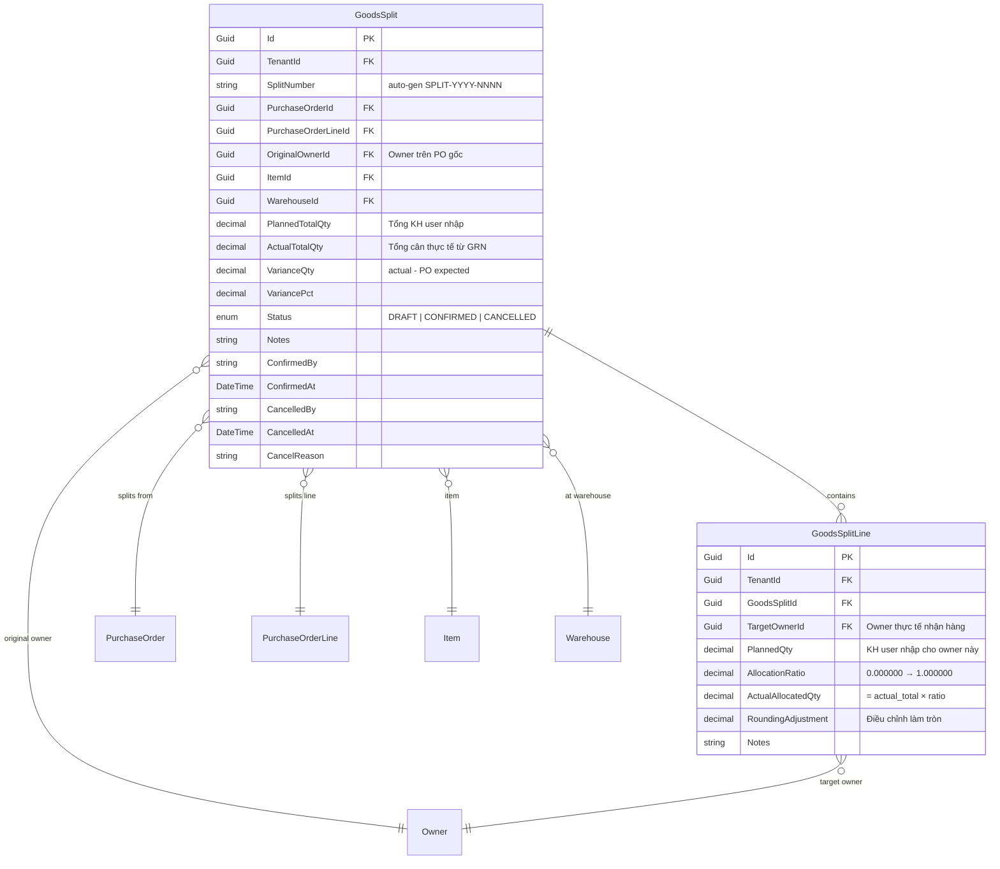

# Feature Spec: Goods Split / Ownership Transfer (Chia Hàng — Đổi Chủ)

## Overview

**Domain**: Inbound → Inventory (Post-Receipt)
**Priority**: High
**Complexity**: High
**Phase**: 4+ (Operations Extension)
**Related Modules**: PO (Inbound), Inventory Engine, Owner Master, Weighbridge

### Problem Statement

TVL (Thoresen) được uỷ quyền đứng ra nhận hàng từ tàu/xe cho nhiều chủ hàng (Owner) khác nhau. Tại thời điểm tạo PO và nhận hàng, toàn bộ hàng hoá được ghi nhận dưới **1 Owner duy nhất** (Owner uỷ quyền trên PO). Sau khi hoàn tất nhận hàng và có tổng cân thực tế, cần **chia lại hàng cho các Owner thực tế** theo tỉ lệ kế hoạch, phân bổ dựa trên số cân thực tế.

Hiện tại hệ thống **không có chức năng** nào hỗ trợ việc này. Tồn kho (`on_hand`) chỉ ghi nhận dưới Owner gốc trên PO, không phản ánh đúng thực tế sở hữu hàng hoá.

### Business Context

Đây là case đặc thù của ngành logistics đường thuỷ & đường bộ, nơi 1 đơn vị được uỷ quyền nhận hàng hộ. Module mới sẽ:

- Tạo phiếu chia hàng (Goods Split) từ PO đã nhận hàng
- Tính tỉ lệ phân bổ từ số lượng kế hoạch do user nhập
- Phân bổ lại số lượng thực tế (từ GRN/Weighbridge) theo tỉ lệ
- Cập nhật `invent_trans` → materialize `on_hand` theo đúng Owner thực tế
- Đảm bảo audit trail truy vết toàn bộ quá trình

**Ví dụ**:

| Bước | Dữ liệu |
|------|----------|
| PO tạo | Owner=TVL, SKU=A, expected_qty=50 tấn |
| Nhận hàng xong | SUM(GRN actual)=49 tấn → on_hand(TVL, A)=49 tấn |
| Chia hàng KH | Owner_A=25t, Owner_B=15t, Owner_C=10t → tổng KH=50t |
| Tỉ lệ | A=50%, B=30%, C=20% |
| Phân bổ thực tế | A=24.5t, B=14.7t, C=9.8t → tổng=49t ✓ |

---

## System Mapping

### Vị trí trong kiến trúc hệ thống

```
Smartlog.sln
├── Smartlog.Domain
│   └── Entities/
│       └── GoodsSplit.cs                   ← NEW: GoodsSplit aggregate root
│       └── GoodsSplitLine.cs               ← NEW: Line entity
│
├── Smartlog.Domain.Shared
│   └── Enums/
│       └── GoodsSplitStatus.cs             ← NEW: Draft, Confirmed, Cancelled
│
├── Smartlog.Application
│   └── Features/
│       └── GoodsSplits/                    ← NEW: Feature folder (Vertical Slice)
│           ├── Commands/
│           │   ├── CreateGoodsSplit.cs      ← Create + Validate + Save
│           │   ├── UpdateGoodsSplit.cs      ← Edit draft split
│           │   ├── ConfirmGoodsSplit.cs     ← Core: post InventTrans + update on_hand
│           │   └── CancelGoodsSplit.cs      ← Reverse if CONFIRMED
│           ├── Queries/
│           │   ├── GetGoodsSplitById.cs
│           │   ├── GetGoodsSplitsList.cs    ← DynamicGridQueryHandler
│           │   └── GetSplittablePOs.cs      ← POs eligible for split
│           ├── Dtos/
│           │   └── GoodsSplitDto.cs
│           └── Mappings/
│               └── GoodsSplitMappings.cs
│
├── Smartlog.Infrastructure
│   └── Persistence/
│       └── Configurations/
│           └── GoodsSplitConfiguration.cs   ← EF Core entity config
│       └── DynamicQuery/
│           └── GoodsSplits.json             ← Dynamic grid query config
│
├── Smartlog.Api
│   └── Controllers/
│       └── GoodsSplitsController.cs         ← REST endpoints
│
└── Frontend
    └── src/features/
        └── goods-splits/                    ← NEW: Frontend feature
            ├── index.tsx                    ← createEntityPage() hoặc custom page
            ├── api/
            │   └── goods-splits-api.ts
            ├── data/
            │   └── schema.ts               ← Zod schemas
            ├── config/
            │   ├── list-config.ts           ← ViewConfig cho danh sách
            │   └── form-config.ts           ← FormFieldConfig cho form
            └── components/
                ├── GoodsSplitProvider.tsx
                ├── GoodsSplitDialogs.tsx
                ├── SplitAllocationTable.tsx  ← Editable table cho phân bổ
                └── SplitConfirmDialog.tsx    ← Review & confirm dialog
```

### Database — Schema `ops` (Operations)

**Bảng mới** trong schema `ops`:



**Entity base class**: `BaseSoftDeletedEntity` (kế thừa audit fields + soft delete)

### Inventory Impact — InventTrans Posting Pattern

Module Chia hàng tuân thủ **Golden Rule**: mọi thay đổi inventory đều đi qua `invent_trans`, không cập nhật `on_hand` trực tiếp.

**TransType mới**: `OWNERSHIP_TRANSFER`
**Stages sử dụng**: `PHYSICAL` (di chuyển physical_qty giữa các InventDim khác OwnerId)

```
ConfirmGoodsSplit flow → InventTrans posting:

Batch #1 — SPLIT_OUT (trừ Owner gốc):
┌──────────────────────────────────────────────────────────────────┐
│ INSERT invent_trans                                              │
│   trans_type: OWNERSHIP_TRANSFER                                 │
│   stage: PHYSICAL                                                │
│   qty: -49.000 (negative = giảm)                                 │
│   qty_mt: -49.000                                                │
│   invent_dim → (warehouse, location, owner=TVL, lot, AVAILABLE)  │
│   reference_type: GOODS_SPLIT                                    │
│   reference_id: split_id                                         │
│ INSERT inventory_event_outbox (PENDING)                          │
└──────────────────────────────────────────────────────────────────┘

Batch #2..N — SPLIT_IN (cộng từng Owner thực tế):
┌──────────────────────────────────────────────────────────────────┐
│ INSERT invent_trans                                              │
│   trans_type: OWNERSHIP_TRANSFER                                 │
│   stage: PHYSICAL                                                │
│   qty: +24.500 (positive = tăng)                                 │
│   qty_mt: +24.500                                                │
│   invent_dim → (warehouse, location, owner=Owner_A, lot, AVAILABLE) │
│   reference_type: GOODS_SPLIT                                    │
│   reference_id: split_id                                         │
│ INSERT inventory_event_outbox (PENDING)                          │
└──────────────────────────────────────────────────────────────────┘

Repeat for Owner_B (+14.700), Owner_C (+9.800)

→ Materialization Worker processes outbox:
   on_hand(TVL, A, warehouse, loc) physical_qty -= 49.000
   on_hand(Owner_A, A, warehouse, loc) physical_qty += 24.500
   on_hand(Owner_B, A, warehouse, loc) physical_qty += 14.700
   on_hand(Owner_C, A, warehouse, loc) physical_qty += 9.800
```

**Quan trọng**: Tất cả entries trong cùng 1 `batch_id` (Guid) để truy vết giao dịch chia hàng hoàn chỉnh.

### Lot Handling

Khi chia hàng, Lot được xử lý theo 2 cách:

| Chiến lược | Mô tả | Khi nào dùng |
|---|---|---|
| **Lot giữ nguyên** | Các Owner mới cùng share Lot gốc. InventDim mới chỉ khác OwnerId | Hàng bulk cùng nguồn gốc, không cần phân biệt Lot theo Owner |
| **Lot mới per Owner** | Tạo Lot mới cho mỗi Owner (SourceLotId trỏ về Lot gốc) | Cần truy xuất nguồn gốc riêng biệt per Owner |

**Đề xuất Phase 1**: **Lot giữ nguyên** — đơn giản, phù hợp case TVL. Lot mới per Owner để Phase 2 nếu cần.

Khi giữ nguyên Lot, `InventDim` mới được tạo cho mỗi Owner:

```
InventDim gốc:   (warehouse=W1, location=LOC-01, owner=TVL,     lot=LOT-001, status=AVAILABLE)
InventDim mới A: (warehouse=W1, location=LOC-01, owner=Owner_A, lot=LOT-001, status=AVAILABLE)
InventDim mới B: (warehouse=W1, location=LOC-01, owner=Owner_B, lot=LOT-001, status=AVAILABLE)
InventDim mới C: (warehouse=W1, location=LOC-01, owner=Owner_C, lot=LOT-001, status=AVAILABLE)
```

`InventDimService.ResolveAsync()` sẽ tự resolve/create DimHash cho mỗi combination mới.

---

## User Stories

### Story 1: Tạo phiếu chia hàng từ PO đã nhận hàng

```
As a warehouse supervisor,
I want to create a Goods Split from a completed PO,
So that I can allocate the received goods to actual owners based on planned quantities.
```

### Story 2: Hệ thống tự tính tỉ lệ và phân bổ thực tế

```
As a warehouse supervisor,
I want the system to automatically calculate allocation ratios from planned quantities
  and apply those ratios to actual received quantities,
So that the split is proportional and accounts for any variance (gain/loss) during transport.
```

### Story 3: Xác nhận phiếu chia hàng và cập nhật tồn kho

```
As a warehouse manager,
I want to confirm a Goods Split so that inventory is updated to reflect actual ownership,
So that on-hand balances per owner are accurate for billing, storage, and outbound operations.
```

### Story 4: Huỷ phiếu chia hàng đã confirm

```
As a warehouse manager,
I want to cancel a confirmed Goods Split and reverse the inventory changes,
So that I can correct mistakes before any of the split inventory is dispatched.
```

### Story 5: Xem danh sách phiếu chia hàng

```
As a warehouse operator,
I want to view a filterable list of all Goods Splits with their status and details,
So that I can track split operations and audit past splits.
```

---

## API Endpoints

### REST Convention

| Method | Endpoint | Command/Query | Description |
|--------|----------|---------------|-------------|
| GET | `/api/goods-splits` | `GetGoodsSplitsList` | Danh sách phiếu chia hàng (DynamicGrid) |
| POST | `/api/goods-splits/search` | `GetGoodsSplitsList` | Danh sách + filter nâng cao |
| GET | `/api/goods-splits/{id}` | `GetGoodsSplitById` | Chi tiết phiếu chia hàng |
| POST | `/api/goods-splits` | `CreateGoodsSplit` | Tạo phiếu mới (DRAFT) |
| PUT | `/api/goods-splits/{id}` | `UpdateGoodsSplit` | Cập nhật phiếu DRAFT |
| PUT | `/api/goods-splits/{id}/confirm` | `ConfirmGoodsSplit` | Xác nhận → post InventTrans |
| PUT | `/api/goods-splits/{id}/cancel` | `CancelGoodsSplit` | Huỷ phiếu (reverse nếu đã confirm) |
| DELETE | `/api/goods-splits/{id}` | `DeleteGoodsSplit` | Soft delete (chỉ DRAFT) |
| GET | `/api/goods-splits/splittable-pos` | `GetSplittablePOs` | PO lines eligible for split |

### Phụ trợ (dùng endpoint có sẵn)

| Endpoint | Mục đích |
|----------|----------|
| `GET /api/owners/lookup` | Dropdown chọn Owner thực tế |
| `GET /api/purchase-orders/{id}` | Lấy thông tin PO + lines |
| `GET /api/inbound-receipts?poId={id}` | Lấy danh sách GRN → tổng cân thực tế |

---

## Business Rules

| ID | Rule | Category | Description |
|----|------|----------|-------------|
| BR-001 | PO Status gate | Hard block | Chỉ PO có `status IN (FULLY_RECEIVED, CLOSED)` mới eligible để chia hàng. PO CONFIRMED hoặc PARTIALLY_RECEIVED → không cho chia vì chưa có đủ cân thực tế |
| BR-002 | PO Line chưa split | Hard block | Mỗi PO Line chỉ được split **1 lần**. Kiểm tra: không tồn tại `GoodsSplit` với `purchase_order_line_id = X` và `status IN (DRAFT, CONFIRMED)` |
| BR-003 | Minimum 2 owners | Validation | Phiếu chia hàng phải có ít nhất 2 `GoodsSplitLine` (2 Owner thực tế). Nếu chỉ 1 Owner thì không cần chia |
| BR-004 | No duplicate owners | Validation | Mỗi `TargetOwnerId` chỉ xuất hiện 1 lần trong danh sách `GoodsSplitLine` |
| BR-005 | Owner must exist | Validation | `TargetOwnerId` phải tồn tại trong `Owner` master data, `IsActive = true` |
| BR-006 | Owner warehouse access | Validation | `TargetOwnerId` phải có `OwnerWarehouseAccess` cho warehouse của PO. Nếu chưa có → warning (soft) nhưng không block (có thể tạo access sau) |
| BR-007 | Planned qty > 0 | Validation | Mỗi `GoodsSplitLine.PlannedQty` phải > 0 |
| BR-008 | Total planned > 0 | Validation | `SUM(PlannedQty) > 0` |
| BR-009 | Actual total from GRN | Derivation | `ActualTotalQty = SUM(InboundReceiptLine.ReceivedQtyKg)` WHERE `InboundReceipt.PurchaseOrderId = PO.Id` AND `InboundReceiptLine.PurchaseOrderLineId = POLine.Id` AND `InboundReceipt.Status = RECEIVED` |
| BR-010 | Actual > 0 | Hard block | `ActualTotalQty` phải > 0. Nếu = 0 → PO có thể RECEIVED nhưng không có cân thực tế → không cho chia |
| BR-011 | Ratio calculation | Logic | `AllocationRatio = PlannedQty / SUM(PlannedQty)`. Lưu trữ dạng `DECIMAL(10,6)` |
| BR-012 | Actual allocation | Logic | `ActualAllocatedQty = ActualTotalQty × AllocationRatio`. Làm tròn theo `Uom.DecimalPrecision` (default 3 decimal places cho Kg/Tấn) |
| BR-013 | Rounding adjustment | Logic | `delta = ActualTotalQty - SUM(rounded ActualAllocatedQty)`. Nếu `delta ≠ 0`: cộng/trừ delta vào line có `AllocationRatio` lớn nhất |
| BR-014 | Sum must match | Hard block | Sau rounding adjustment: `SUM(ActualAllocatedQty) = ActualTotalQty` — **chính xác tuyệt đối, không sai lệch** |
| BR-015 | Sufficient on-hand | Hard block | Tại thời điểm Confirm: `on_hand.PhysicalQty` cho `(ItemId, InventDim[Owner=OriginalOwner])` phải >= `ActualTotalQty`. Nếu không đủ → block confirm, hiển thị lỗi |
| BR-016 | Atomic transaction | Technical | Toàn bộ InventTrans posting (N+1 entries) phải trong **1 database transaction**. Nếu bất kỳ entry fail → rollback toàn bộ |
| BR-017 | Draft editable | State | Phiếu `DRAFT` có thể chỉnh sửa tự do (thêm/xoá line, thay đổi planned qty) |
| BR-018 | Confirmed immutable | State | Phiếu `CONFIRMED` không thể sửa. Muốn thay đổi phải Cancel rồi tạo mới |
| BR-019 | Cancel reversibility | State | Cancel phiếu CONFIRMED → post reverse InventTrans (đảo tất cả entries trong batch). **Điều kiện**: on_hand của từng TargetOwner phải >= ActualAllocatedQty (chưa xuất kho) |
| BR-020 | Planned vs PO warning | Soft warning | Nếu `ABS(SUM(PlannedQty) - POLine.ExpectedQtyKg) / POLine.ExpectedQtyKg > 5%` → hiển thị warning, KHÔNG block |
| BR-021 | Four-eyes principle | Authorization | Người tạo (DRAFT) ≠ người confirm. `CreatedBy ≠ ConfirmedBy` |
| BR-022 | InventTrans reference | Technical | Tất cả `invent_trans` entries ghi `reference_type = 'GOODS_SPLIT'`, `reference_id = GoodsSplit.Id` |

---

## Acceptance Criteria

### Story 1: Tạo phiếu chia hàng

**AC-1.1 — Happy Path: Tạo phiếu từ PO eligible**
```
Given a PO with status FULLY_RECEIVED, PO line cho SKU=A, actual received = 49 tấn
  And PO line chưa được split
When user chọn PO line này và nhập:
  - Owner A: planned_qty = 25
  - Owner B: planned_qty = 15
  - Owner C: planned_qty = 10
Then hệ thống tạo GoodsSplit với:
  - status = DRAFT
  - split_number auto-generated (SPLIT-2026-NNNN)
  - actual_total_qty = 49.000 (từ GRN)
  - planned_total_qty = 50.000
  - variance_qty = -1.000, variance_pct = -2.00%
  - 3 GoodsSplitLines với ratio và actual_allocated_qty đã tính
```

**AC-1.2 — Block: PO chưa FULLY_RECEIVED**
```
Given a PO with status CONFIRMED or PARTIALLY_RECEIVED
When user cố tạo GoodsSplit cho PO này
Then hệ thống trả lỗi 400: "PO chưa hoàn tất nhận hàng"
```

**AC-1.3 — Block: PO Line đã split rồi**
```
Given a PO line đã có GoodsSplit status = CONFIRMED
When user cố tạo GoodsSplit mới cho cùng PO line
Then hệ thống trả lỗi 400: "PO line này đã được chia hàng"
```

**AC-1.4 — Block: Chỉ 1 Owner**
```
Given user nhập chỉ 1 Owner trong danh sách
When user submit form
Then validation error: "Phải có ít nhất 2 chủ hàng"
```

**AC-1.5 — Block: Trùng Owner**
```
Given user nhập Owner A 2 lần trong danh sách
When user submit form
Then validation error: "Chủ hàng không được trùng lặp"
```

**AC-1.6 — Warning: Tổng planned chênh lệch > 5%**
```
Given PO line expected = 50 tấn
  And user nhập tổng planned = 60 tấn (chênh 20%)
When user submit form
Then hiển thị warning: "Tổng kế hoạch chia (60) chênh lệch 20% so với dự kiến PO (50)"
  And cho phép tiếp tục tạo (không block)
```

### Story 2: Tính toán tỉ lệ và phân bổ

**AC-2.1 — Tính ratio chính xác**
```
Given planned: A=25, B=15, C=10 (total=50)
Then ratio: A=0.500000, B=0.300000, C=0.200000
  And SUM(ratio) = 1.000000
```

**AC-2.2 — Phân bổ thực tế**
```
Given actual_total = 49.000 tấn
  And ratios: A=0.500000, B=0.300000, C=0.200000
Then actual_allocated: A=24.500, B=14.700, C=9.800
  And SUM(actual_allocated) = 49.000 ✓
```

**AC-2.3 — Xử lý rounding**
```
Given actual_total = 49.000, 3 owners mỗi người planned = 100 (equal split)
  ratio = 0.333333 mỗi người
Then trước rounding: 16.333317, 16.333317, 16.333366
  After round(3): 16.333, 16.333, 16.333 = 48.999 (delta = 0.001)
  Adjustment: line với ratio lớn nhất (line cuối 0.333334) += 0.001
  Final: 16.333, 16.333, 16.334 = 49.000 ✓
```

### Story 3: Confirm và cập nhật tồn kho

**AC-3.1 — Happy Path: Confirm thành công**
```
Given GoodsSplit DRAFT với 3 lines, đã tính đủ
  And on_hand(TVL, SKU=A, W1) >= 49.000
  And ConfirmedBy ≠ CreatedBy
When user confirm
Then status → CONFIRMED
  And InventTrans posted:
    - 1 entry: OWNERSHIP_TRANSFER, PHYSICAL, qty=-49.000, dim=(owner=TVL)
    - 3 entries: OWNERSHIP_TRANSFER, PHYSICAL, qty=+24.5/+14.7/+9.8, dim=(owner=A/B/C)
    - All entries share same batch_id
  And inventory_event_outbox: 4 entries PENDING
  And after materialization:
    on_hand(TVL, A, W1) physical_qty -= 49.000
    on_hand(Owner_A, A, W1) physical_qty += 24.500
    on_hand(Owner_B, A, W1) physical_qty += 14.700
    on_hand(Owner_C, A, W1) physical_qty += 9.800
```

**AC-3.2 — Block: Insufficient on-hand**
```
Given on_hand(TVL, SKU=A, W1) = 30.000 (đã xuất 1 phần)
  And GoodsSplit actual_total = 49.000
When user confirm
Then lỗi 400: "Tồn kho không đủ. Cần 49.000, hiện có 30.000"
```

**AC-3.3 — Block: Same user create & confirm**
```
Given GoodsSplit CreatedBy = "user_01"
  And current user = "user_01"
When user cố confirm
Then lỗi 403: "Người tạo không thể xác nhận phiếu này"
```

**AC-3.4 — Atomicity: Partial failure**
```
Given ConfirmGoodsSplit đang post InventTrans entry thứ 3/4
  And DB connection drops giữa chừng
Then toàn bộ transaction rollback
  And GoodsSplit status vẫn là DRAFT
  And on_hand không thay đổi
  And không có invent_trans entries nào được commit
```

### Story 4: Huỷ phiếu đã confirm

**AC-4.1 — Cancel CONFIRMED thành công**
```
Given GoodsSplit CONFIRMED, batch_id = "xxx"
  And on_hand(Owner_A) >= 24.500
  And on_hand(Owner_B) >= 14.700
  And on_hand(Owner_C) >= 9.800
When user cancel với reason = "Sai thông tin chủ hàng"
Then status → CANCELLED
  And Reverse InventTrans posted (new batch_id):
    - 3 entries: OWNERSHIP_TRANSFER, PHYSICAL, qty=-24.5/-14.7/-9.8, dim=(owner=A/B/C)
    - 1 entry: OWNERSHIP_TRANSFER, PHYSICAL, qty=+49.000, dim=(owner=TVL)
  And after materialization: on_hand trở về trạng thái trước split
```

**AC-4.2 — Block Cancel: Owner đã xuất kho**
```
Given GoodsSplit CONFIRMED, Owner_A allocated_qty = 24.500
  And on_hand(Owner_A) physical_qty = 10.000 (đã xuất 14.500)
When user cố cancel
Then lỗi 400: "Không thể huỷ. Owner A đã xuất kho, tồn kho hiện tại (10.000) < số cần hoàn (24.500)"
```

**AC-4.3 — Cancel DRAFT**
```
Given GoodsSplit DRAFT
When user delete
Then soft delete (DeletedTime, DeletedBy populated)
  And không có InventTrans nào bị ảnh hưởng
```

### Story 5: Xem danh sách

**AC-5.1 — Danh sách với filter**
```
Given 10 GoodsSplit records
When user mở /goods-splits
Then hiển thị danh sách DynamicGrid với columns:
  - Split Number, PO Number, Original Owner, Item (SKU), Actual Total Qty,
    # Owners, Status (badge), Created By, Created At
  And filter: PO number, Original Owner, Item, Status, Date range
  And sort: default CreatedAt DESC
  And pagination: 20 records/page
```

---

## Commands — Detailed Handler Logic

### CreateGoodsSplit

```
CreateGoodsSplitHandler.Handle(command):
│
├─ 1. VALIDATE PO
│   ├─ PO exists, status IN (FULLY_RECEIVED, CLOSED)
│   ├─ PO Line exists, belongs to this PO
│   └─ No existing GoodsSplit for this PO Line with status IN (DRAFT, CONFIRMED)
│
├─ 2. COMPUTE ACTUAL TOTAL
│   ├─ Query: SUM(InboundReceiptLine.ReceivedQtyKg)
│   │   WHERE InboundReceipt.PurchaseOrderId = PO.Id
│   │   AND InboundReceiptLine.PurchaseOrderLineId = POLine.Id
│   │   AND InboundReceipt.Status = 'RECEIVED'
│   ├─ IF actual_total = 0 → THROW "Không có cân thực tế để chia"
│   └─ variance_qty = actual_total - po_line.expected_qty_kg
│       variance_pct = variance_qty / po_line.expected_qty_kg * 100
│
├─ 3. VALIDATE LINES
│   ├─ lines.Count >= 2
│   ├─ No duplicate TargetOwnerId
│   ├─ All TargetOwnerId exists in Owner, IsActive = true
│   ├─ All PlannedQty > 0
│   └─ WARNING (not block) if |SUM(PlannedQty) - expected| / expected > 5%
│
├─ 4. CALCULATE RATIOS & ALLOCATIONS
│   ├─ planned_total = SUM(lines.PlannedQty)
│   ├─ FOR each line:
│   │   ratio = line.PlannedQty / planned_total  (precision 6)
│   │   raw_allocated = actual_total * ratio
│   │   line.ActualAllocatedQty = ROUND(raw_allocated, decimal_precision)
│   │
│   ├─ delta = actual_total - SUM(line.ActualAllocatedQty)
│   ├─ IF delta ≠ 0:
│   │   max_ratio_line = line with MAX(ratio)
│   │   max_ratio_line.ActualAllocatedQty += delta
│   │   max_ratio_line.RoundingAdjustment = delta
│   │
│   └─ ASSERT: SUM(ActualAllocatedQty) == actual_total
│
├─ 5. SAVE
│   ├─ Generate split_number via NumberSequence
│   ├─ INSERT GoodsSplit (status=DRAFT)
│   ├─ INSERT GoodsSplitLines
│   └─ Audit log
│
└─ 6. RETURN split_id
```

### ConfirmGoodsSplit

```
ConfirmGoodsSplitHandler.Handle(command):
│
├─ 1. VALIDATE
│   ├─ GoodsSplit exists, status = DRAFT
│   ├─ current_user ≠ GoodsSplit.CreatedBy  (four-eyes)
│   └─ Re-validate SUM(ActualAllocatedQty) = ActualTotalQty
│
├─ 2. CHECK ON-HAND SUFFICIENCY
│   ├─ Compute available for original owner from invent_trans (NOT on_hand)
│   │   advisory lock: pg_advisory_xact_lock(tenant, item, dim)
│   │   available = SUM(PHYSICAL qty) for (Item, InventDim[Owner=OriginalOwner, Warehouse, AVAILABLE])
│   └─ IF available < ActualTotalQty → THROW InsufficientInventoryException
│
├─ 3. RESOLVE INVENT_DIMS
│   ├─ source_dim = InventDimService.ResolveAsync(warehouse, location, OriginalOwner, lot, AVAILABLE)
│   ├─ FOR each line:
│   │   target_dim = InventDimService.ResolveAsync(warehouse, location, TargetOwner, lot, AVAILABLE)
│   │   (same warehouse, location, lot — only OwnerId differs)
│
├─ 4. POST INVENT_TRANS (single DB transaction)
│   ├─ batch_id = Guid.NewGuid()
│   │
│   ├─ Entry #1 — SPLIT_OUT:
│   │   InventTransService.PostAsync({
│   │     BatchId: batch_id,
│   │     ItemId, InventDimId: source_dim,
│   │     TransType: OWNERSHIP_TRANSFER,
│   │     Stage: PHYSICAL,
│   │     Qty: -ActualTotalQty,
│   │     QtyMt: -ActualTotalQtyMt,
│   │     ReferenceType: "GOODS_SPLIT",
│   │     ReferenceId: split_id,
│   │     EventType: "GOODS_SPLIT_OUT"
│   │   })
│   │
│   ├─ FOR each line — SPLIT_IN:
│   │   InventTransService.PostAsync({
│   │     BatchId: batch_id,
│   │     ItemId, InventDimId: target_dim[line],
│   │     TransType: OWNERSHIP_TRANSFER,
│   │     Stage: PHYSICAL,
│   │     Qty: +line.ActualAllocatedQty,
│   │     QtyMt: +line.ActualAllocatedQtyMt,
│   │     ReferenceType: "GOODS_SPLIT",
│   │     ReferenceId: split_id,
│   │     EventType: "GOODS_SPLIT_IN"
│   │   })
│
├─ 5. UPDATE GOODS_SPLIT
│   ├─ status → CONFIRMED
│   ├─ confirmed_by = current_user
│   ├─ confirmed_at = UTC_NOW
│
├─ 6. COMMIT TRANSACTION
│
└─ 7. PUBLISH DOMAIN EVENTS
    ├─ GoodsSplitConfirmedEvent (audit, notification)
    └─ InventTransPostedEvent (materialization trigger)
```

### CancelGoodsSplit

```
CancelGoodsSplitHandler.Handle(command):
│
├─ 1. VALIDATE
│   ├─ GoodsSplit exists
│   ├─ IF status = DRAFT → soft delete, RETURN (no InventTrans needed)
│   ├─ IF status = CONFIRMED → proceed with reversal
│   └─ IF status = CANCELLED → THROW "Phiếu đã bị huỷ"
│
├─ 2. CHECK REVERSIBILITY (only for CONFIRMED)
│   ├─ FOR each GoodsSplitLine:
│   │   available = compute from invent_trans for (Item, InventDim[Owner=TargetOwner])
│   │   IF available < line.ActualAllocatedQty:
│   │     THROW "Không thể huỷ. {TargetOwner.Name} tồn kho ({available}) < cần hoàn ({allocated})"
│
├─ 3. POST REVERSE INVENT_TRANS (single transaction)
│   ├─ reverse_batch_id = Guid.NewGuid()
│   │
│   ├─ FOR each line — Reverse SPLIT_IN:
│   │   PostAsync(TransType: OWNERSHIP_TRANSFER, Stage: PHYSICAL,
│   │     Qty: -line.ActualAllocatedQty, InventDim: target_dim[line])
│   │
│   ├─ Reverse SPLIT_OUT:
│   │   PostAsync(TransType: OWNERSHIP_TRANSFER, Stage: PHYSICAL,
│   │     Qty: +ActualTotalQty, InventDim: source_dim)
│
├─ 4. UPDATE GOODS_SPLIT
│   ├─ status → CANCELLED
│   ├─ cancelled_by, cancelled_at, cancel_reason
│
└─ 5. COMMIT + PUBLISH CancelledEvent
```

---

## Queries

### GetSplittablePOs

Trả về danh sách PO Lines eligible để chia hàng.

```sql
SELECT
    po.id AS po_id,
    po.po_number,
    po.po_type,
    o.storer_key AS owner_code,
    o.name AS owner_name,
    pol.id AS po_line_id,
    pol.line_number,
    i.sku,
    i.name AS item_name,
    pol.expected_qty_kg,
    COALESCE(SUM(irl.received_qty_kg), 0) AS actual_received_qty,
    pol.expected_qty_kg - COALESCE(SUM(irl.received_qty_kg), 0) AS variance_qty
FROM purchase_order po
JOIN purchase_order_line pol ON pol.purchase_order_id = po.id
JOIN owner o ON o.id = po.owner_id
JOIN item i ON i.id = pol.item_id
LEFT JOIN inbound_receipt ir ON ir.purchase_order_id = po.id AND ir.status = 'RECEIVED'
LEFT JOIN inbound_receipt_line irl ON irl.inbound_receipt_id = ir.id
    AND irl.purchase_order_line_id = pol.id
WHERE po.tenant_id = @tenantId
    AND po.status IN ('FULLY_RECEIVED', 'CLOSED')
    AND po.deleted_time IS NULL
    -- Exclude PO Lines that already have an active split
    AND NOT EXISTS (
        SELECT 1 FROM goods_split gs
        WHERE gs.purchase_order_line_id = pol.id
            AND gs.status IN ('DRAFT', 'CONFIRMED')
            AND gs.deleted_time IS NULL
    )
GROUP BY po.id, po.po_number, po.po_type, o.storer_key, o.name,
         pol.id, pol.line_number, i.sku, i.name, pol.expected_qty_kg
HAVING COALESCE(SUM(irl.received_qty_kg), 0) > 0
ORDER BY po.created_time DESC;
```

### GetGoodsSplitById

Trả về chi tiết phiếu chia hàng bao gồm lines.

```csharp
// DTO shape
public record GoodsSplitDto
{
    public Guid Id { get; init; }
    public string SplitNumber { get; init; }
    public string PoNumber { get; init; }
    public int PoLineNumber { get; init; }
    public string OriginalOwnerCode { get; init; }
    public string OriginalOwnerName { get; init; }
    public string Sku { get; init; }
    public string ItemName { get; init; }
    public string WarehouseCode { get; init; }
    public decimal PlannedTotalQty { get; init; }
    public decimal ActualTotalQty { get; init; }
    public decimal VarianceQty { get; init; }
    public decimal VariancePct { get; init; }
    public string Status { get; init; }
    public string Notes { get; init; }
    public string CreatedBy { get; init; }
    public DateTime CreatedTime { get; init; }
    public string? ConfirmedBy { get; init; }
    public DateTime? ConfirmedAt { get; init; }
    public string? CancelledBy { get; init; }
    public DateTime? CancelledAt { get; init; }
    public string? CancelReason { get; init; }
    public List<GoodsSplitLineDto> Lines { get; init; }
}

public record GoodsSplitLineDto
{
    public Guid Id { get; init; }
    public string TargetOwnerCode { get; init; }
    public string TargetOwnerName { get; init; }
    public decimal PlannedQty { get; init; }
    public decimal AllocationRatio { get; init; }
    public decimal ActualAllocatedQty { get; init; }
    public decimal RoundingAdjustment { get; init; }
    public decimal VarianceVsPlanned { get; init; }  // ActualAllocated - Planned
    public string? Notes { get; init; }
}
```

---

## Frontend Guide

### Screens & Routes

| Screen | Route | Purpose |
|--------|-------|---------|
| Goods Split List | `/goods-splits` | Danh sách phiếu chia hàng, filter, search |
| Goods Split Create | `/goods-splits/new?poLineId=:id` | Tạo phiếu mới từ PO Line |
| Goods Split Detail | `/goods-splits/:id` | Xem chi tiết, confirm, cancel |
| Splittable POs | Dialog hoặc dropdown trong Create | Chọn PO Line eligible |

### Goods Split List — ViewConfig

```typescript
// goods-splits/config/list-config.ts
export const goodsSplitsListConfig: ViewConfig = {
  metadata: {
    mode: 'dynamic',
    requiredFormConfigs: ['OPSGSPG01', 'OPSGSS01'], // Grid + Search formCodes
  },
  layout: {
    header: {
      components: [
        { type: 'page-title', props: { titleKey: 'goodsSplits.title' } },
        { type: 'toolbar', props: {
          actions: [
            { type: 'add-button', label: 'goodsSplits.actions.create' },
            { type: 'export-button' }
          ]
        }},
        { type: 'quick-search' },
      ],
    },
    content: {
      components: [
        { type: 'search-form', props: { formCode: 'OPSGSS01' } },
        { type: 'data-grid', props: {
          formCode: 'OPSGSPG01',
          rowActions: ['view', 'delete'],  // delete only for DRAFT
          bulkActions: ['delete-batch'],
        }},
      ],
    },
    footer: { components: [{ type: 'pagination' }] },
  },
};
```

### Create/Edit Form — SplitAllocationTable Component

Đây là component **custom** (không dùng factory pattern vì logic phức tạp hơn CRUD thông thường):

```
┌───────────────────────────────────────────────────────────────────────────┐
│  TẠO PHIẾU CHIA HÀNG                                          [Lưu nháp]│
├───────────────────────────────────────────────────────────────────────────┤
│                                                                           │
│  Chọn PO Line:  [PO-2026-0315 / Line 1 — SKU: A — TVL      ▼]          │
│                                                                           │
│  ┌─ THÔNG TIN PO ──────────────────────────────────────────────────────┐ │
│  │  Mã PO: PO-2026-0315        Loại: Đường thuỷ                       │ │
│  │  Chủ hàng gốc: TVL          Kho: W1-HCM                           │ │
│  │  SKU: A (Phân bón DAP)      Dự kiến PO: 50.000 tấn                │ │
│  │  Tổng cân thực tế (GRN):    49.000 tấn                             │ │
│  │  Hao hụt: -1.000 tấn (-2.00%)                                      │ │
│  └─────────────────────────────────────────────────────────────────────┘ │
│                                                                           │
│  ┌─ PHÂN BỔ CHỦ HÀNG ──────────────────────────────── [+ Thêm dòng] ─┐ │
│  │  #  │ Chủ hàng (▼)  │ KH (tấn) │ Tỉ lệ    │ Thực tế (tấn) │ 🗑  │ │
│  │ ─── │ ────────────── │ ──────── │ ──────── │ ───────────── │ ─── │ │
│  │  1  │ Chủ hàng A     │  25.000  │  50.00%  │    24.500     │  ×  │ │
│  │  2  │ Chủ hàng B     │  15.000  │  30.00%  │    14.700     │  ×  │ │
│  │  3  │ Chủ hàng C     │  10.000  │  20.00%  │     9.800     │  ×  │ │
│  │ ─── │ ────────────── │ ──────── │ ──────── │ ───────────── │ ─── │ │
│  │     │ TỔNG           │  50.000  │ 100.00%  │    49.000     │     │ │
│  └─────────────────────────────────────────────────────────────────────┘ │
│                                                                           │
│  ⚠ Tổng kế hoạch (50.000) chênh lệch 2.00% so với dự kiến PO (50.000) │
│                                                                           │
│  Ghi chú: [_________________________________________________]            │
│                                                                           │
│                                              [Huỷ] [Lưu nháp] [Xác nhận]│
└───────────────────────────────────────────────────────────────────────────┘
```

**Hành vi UI:**

| Tương tác | Hệ thống phản hồi |
|---|---|
| User chọn PO Line từ dropdown | Auto-fill: PO info, actual_total_qty, variance |
| User nhập/thay đổi planned_qty bất kỳ dòng | Real-time recalculate: ratio, actual_allocated cho TẤT CẢ dòng |
| User thêm/xoá dòng | Recalculate lại toàn bộ ratio + actual_allocated |
| User chọn trùng Owner | Validation error inline: "Chủ hàng đã tồn tại" |
| User click [Lưu nháp] | POST /api/goods-splits → status=DRAFT |
| User click [Xác nhận] | Mở SplitConfirmDialog → review → PUT /confirm |

### Confirm Dialog

```
┌─────────────────────────────────────────────────────────────────┐
│  XÁC NHẬN CHIA HÀNG                                     [×]    │
├─────────────────────────────────────────────────────────────────┤
│                                                                  │
│  Bạn đang xác nhận chia hàng cho phiếu SPLIT-2026-0001.        │
│  Hành động này sẽ cập nhật tồn kho theo chủ hàng.               │
│                                                                  │
│  ┌─ TÓM TẮT PHÂN BỔ ────────────────────────────────────────┐ │
│  │ Chủ hàng    │ KH (tấn)│ Tỉ lệ  │ Thực tế (tấn)│ Chênh  │ │
│  │ ─────────── │ ─────── │ ────── │ ──────────── │ ────── │ │
│  │ Chủ hàng A  │  25.000 │ 50.00% │    24.500    │ -0.500 │ │
│  │ Chủ hàng B  │  15.000 │ 30.00% │    14.700    │ -0.300 │ │
│  │ Chủ hàng C  │  10.000 │ 20.00% │     9.800    │ -0.200 │ │
│  │ ─────────── │ ─────── │ ────── │ ──────────── │ ────── │ │
│  │ TỔNG        │  50.000 │  100%  │    49.000    │ -1.000 │ │
│  └────────────────────────────────────────────────────────────┘ │
│                                                                  │
│  Hao hụt vận chuyển: 1.000 tấn (2.00%)                         │
│  Hao hụt phân bổ đều theo tỉ lệ cho tất cả chủ hàng.          │
│                                                                  │
│                            [Quay lại chỉnh sửa] [Xác nhận chia]│
└─────────────────────────────────────────────────────────────────┘
```

### Zod Schemas

```typescript
// goods-splits/data/schema.ts
import { z } from 'zod';

// Entity schema (API response)
export const goodsSplitSchema = z.object({
  id: z.string().uuid(),
  splitNumber: z.string(),
  purchaseOrderId: z.string().uuid(),
  purchaseOrderLineId: z.string().uuid(),
  poNumber: z.string(),
  poLineNumber: z.number(),
  originalOwnerId: z.string().uuid(),
  originalOwnerCode: z.string(),
  originalOwnerName: z.string(),
  itemId: z.string().uuid(),
  sku: z.string(),
  itemName: z.string(),
  warehouseId: z.string().uuid(),
  warehouseCode: z.string(),
  plannedTotalQty: z.number(),
  actualTotalQty: z.number(),
  varianceQty: z.number(),
  variancePct: z.number(),
  status: z.enum(['DRAFT', 'CONFIRMED', 'CANCELLED']),
  notes: z.string().nullable(),
  createdBy: z.string(),
  createdTime: z.string().datetime(),
  confirmedBy: z.string().nullable(),
  confirmedAt: z.string().datetime().nullable(),
  cancelledBy: z.string().nullable(),
  cancelledAt: z.string().datetime().nullable(),
  cancelReason: z.string().nullable(),
  lines: z.array(z.object({
    id: z.string().uuid(),
    targetOwnerId: z.string().uuid(),
    targetOwnerCode: z.string(),
    targetOwnerName: z.string(),
    plannedQty: z.number(),
    allocationRatio: z.number(),
    actualAllocatedQty: z.number(),
    roundingAdjustment: z.number(),
    notes: z.string().nullable(),
  })),
});

// Form schema (user input)
export const goodsSplitFormSchema = z.object({
  purchaseOrderLineId: z.string().uuid({ message: 'Vui lòng chọn PO Line' }),
  notes: z.string().max(500).optional(),
  lines: z.array(z.object({
    targetOwnerId: z.string().uuid({ message: 'Vui lòng chọn chủ hàng' }),
    plannedQty: z.number().positive({ message: 'Số lượng phải > 0' }),
    notes: z.string().max(200).optional(),
  }))
  .min(2, { message: 'Phải có ít nhất 2 chủ hàng' })
  .refine(
    (lines) => {
      const ownerIds = lines.map(l => l.targetOwnerId);
      return new Set(ownerIds).size === ownerIds.length;
    },
    { message: 'Chủ hàng không được trùng lặp' }
  ),
});

export type GoodsSplitEntity = z.infer<typeof goodsSplitSchema>;
export type GoodsSplitForm = z.infer<typeof goodsSplitFormSchema>;
```

### API Layer

```typescript
// goods-splits/api/goods-splits-api.ts
import { apiClient } from '@/lib/api-client';

export const goodsSplitsApi = {
  search: (params: SearchParams) =>
    apiClient.post('/api/goods-splits/search', params),

  getById: (id: string) =>
    apiClient.get(`/api/goods-splits/${id}`),

  getSplittablePOs: (params?: { search?: string }) =>
    apiClient.get('/api/goods-splits/splittable-pos', { params }),

  create: (data: GoodsSplitForm) =>
    apiClient.post('/api/goods-splits', data),

  update: (id: string, data: GoodsSplitForm) =>
    apiClient.put(`/api/goods-splits/${id}`, data),

  confirm: (id: string) =>
    apiClient.put(`/api/goods-splits/${id}/confirm`),

  cancel: (id: string, reason: string) =>
    apiClient.put(`/api/goods-splits/${id}/cancel`, { reason }),

  deleteById: (id: string) =>
    apiClient.delete(`/api/goods-splits/${id}`),

  deleteByIds: (ids: string[]) =>
    apiClient.delete('/api/goods-splits/delete-multiple', { data: { ids } }),
};
```

---

## Domain Events

| Event | Published By | Subscribers |
|-------|-------------|-------------|
| `GoodsSplitCreatedEvent` | CreateGoodsSplitHandler | Audit log |
| `GoodsSplitConfirmedEvent` | ConfirmGoodsSplitHandler | InventTrans materialization, audit log, notification to owners |
| `GoodsSplitCancelledEvent` | CancelGoodsSplitHandler | InventTrans materialization (reverse), audit log |
| `InventTransPostedEvent` | InventTransService | Materialization Worker → on_hand update |

---

## Security & Authorization

### Permissions

| Permission | SecurityEntity | Roles |
|---|---|---|
| `GoodsSplit.View` | `GoodsSplit` | Warehouse Staff, Supervisor, Manager |
| `GoodsSplit.Create` | `GoodsSplit` | Warehouse Supervisor, Manager |
| `GoodsSplit.Edit` | `GoodsSplit` | Warehouse Supervisor, Manager (only DRAFT) |
| `GoodsSplit.Confirm` | `GoodsSplit` | Warehouse Manager |
| `GoodsSplit.Cancel` | `GoodsSplit` | Warehouse Manager |
| `GoodsSplit.Delete` | `GoodsSplit` | Warehouse Manager (only DRAFT) |

**Four-eyes enforcement**: `ConfirmGoodsSplitHandler` kiểm tra `command.UserId ≠ goodsSplit.CreatedBy`. Nếu vi phạm → throw `ForbiddenException`.

### Data Scope

`GoodsSplit` tuân thủ multi-tenant (TenantId from JWT) + `UserWarehouseAccess` (user chỉ thấy phiếu của warehouse mình có quyền).

---

## Database Migration

### EF Core Entity Configuration

```csharp
// GoodsSplitConfiguration.cs
public class GoodsSplitConfiguration : IEntityTypeConfiguration<GoodsSplit>
{
    public void Configure(EntityTypeBuilder<GoodsSplit> builder)
    {
        builder.ToTable("goods_split", DatabaseConstants.Schemas.Operations);

        builder.HasKey(x => x.Id);
        builder.Property(x => x.SplitNumber).HasMaxLength(20).IsRequired();
        builder.Property(x => x.PlannedTotalQty).HasPrecision(18, 3);
        builder.Property(x => x.ActualTotalQty).HasPrecision(18, 3);
        builder.Property(x => x.VarianceQty).HasPrecision(18, 3);
        builder.Property(x => x.VariancePct).HasPrecision(8, 4);
        builder.Property(x => x.Status).HasConversion<string>().HasMaxLength(20);
        builder.Property(x => x.Notes).HasMaxLength(500);

        builder.HasIndex(x => new { x.TenantId, x.SplitNumber }).IsUnique();
        builder.HasIndex(x => new { x.TenantId, x.PurchaseOrderLineId, x.Status });

        builder.HasOne<PurchaseOrder>().WithMany()
            .HasForeignKey(x => x.PurchaseOrderId).OnDelete(DeleteBehavior.Restrict);
        builder.HasOne<PurchaseOrderLine>().WithMany()
            .HasForeignKey(x => x.PurchaseOrderLineId).OnDelete(DeleteBehavior.Restrict);
        builder.HasOne<Owner>().WithMany()
            .HasForeignKey(x => x.OriginalOwnerId).OnDelete(DeleteBehavior.Restrict);
        builder.HasOne<Item>().WithMany()
            .HasForeignKey(x => x.ItemId).OnDelete(DeleteBehavior.Restrict);
        builder.HasOne<Warehouse>().WithMany()
            .HasForeignKey(x => x.WarehouseId).OnDelete(DeleteBehavior.Restrict);

        builder.HasMany(x => x.Lines).WithOne()
            .HasForeignKey(x => x.GoodsSplitId).OnDelete(DeleteBehavior.Cascade);
    }
}

// GoodsSplitLineConfiguration.cs
public class GoodsSplitLineConfiguration : IEntityTypeConfiguration<GoodsSplitLine>
{
    public void Configure(EntityTypeBuilder<GoodsSplitLine> builder)
    {
        builder.ToTable("goods_split_line", DatabaseConstants.Schemas.Operations);

        builder.HasKey(x => x.Id);
        builder.Property(x => x.PlannedQty).HasPrecision(18, 3);
        builder.Property(x => x.AllocationRatio).HasPrecision(10, 6);
        builder.Property(x => x.ActualAllocatedQty).HasPrecision(18, 3);
        builder.Property(x => x.RoundingAdjustment).HasPrecision(18, 3);
        builder.Property(x => x.Notes).HasMaxLength(200);

        builder.HasIndex(x => new { x.GoodsSplitId, x.TargetOwnerId }).IsUnique();

        builder.HasOne<Owner>().WithMany()
            .HasForeignKey(x => x.TargetOwnerId).OnDelete(DeleteBehavior.Restrict);
    }
}
```

### NumberSequence Configuration

```sql
INSERT INTO number_sequence (id, tenant_id, code, prefix, format_pattern, current_value, daily_reset)
VALUES (gen_random_uuid(), @tenantId, 'GOODS_SPLIT', 'SPLIT', 'SPLIT-{YYYY}-{NNNN}', 0, false);
```

### TransType Enum Extension

```csharp
// Domain.Shared/Enums/TransType.cs — thêm value
public enum TransType
{
    RECEIPT,
    ISSUE,
    ADJUSTMENT,
    STATUS_CHANGE,
    TRANSFER_ISSUE,
    TRANSFER_RECEIPT,
    OWNERSHIP_TRANSFER    // ← NEW
}
```

---

## Edge Cases

| # | Case | Xử lý |
|---|------|-------|
| EC-01 | **PO multi-line**: PO có 3 SKU cần chia | Mỗi PO Line tạo 1 GoodsSplit riêng. UI cho phép chọn từng PO Line |
| EC-02 | **Owner gốc cũng là target**: TVL vừa là owner uỷ quyền, vừa nhận 1 phần hàng | Cho phép. InventTrans vẫn trừ hết rồi cộng lại (audit trail rõ ràng). Net effect cho TVL = ActualAllocatedQty - ActualTotalQty (âm) |
| EC-03 | **On-hand phân tán nhiều Location/Lot**: Hàng TVL nằm ở 3 location khác nhau | Phase 1: Split tại level Owner (không chỉ định location cụ thể). InventTrans trừ tổng tại InventDim tổng hợp → cần xác định Location nào sẽ trừ. **Giải pháp**: trừ theo FIFO location (location có hàng cũ nhất) hoặc cho phép user chọn location. **Đề xuất Phase 1**: dùng Adjustment approach — trừ/cộng ở tầng Owner aggregate, không chỉ định location cụ thể |
| EC-04 | **Concurrent confirm**: 2 user confirm cùng lúc | Advisory lock trên (tenant, item, invent_dim) ngăn race condition. User thứ 2 sẽ fail do on_hand không đủ |
| EC-05 | **Actual total = PO expected**: Không có hao hụt | Tổng actual = tổng planned (nếu planned = expected). Mỗi owner nhận đúng planned qty |
| EC-06 | **Actual total > PO expected**: Hàng dư | Hàng dư được phân bổ theo tỉ lệ. Mỗi owner nhận nhiều hơn planned. Warning hiển thị nhưng không block |
| EC-07 | **Cancel sau khi 1 owner đã tạo SO**: Owner A có SO draft từ hàng đã split | Check: on_hand(Owner_A).physical_qty - allocated_qty >= ActualAllocatedQty. Nếu allocated > 0 nhưng physical still >= split qty → cho cancel (allocated sẽ fail sau do on_hand giảm) |
| EC-08 | **PO PARTIALLY_RECEIVED muốn chia**: Mới nhận 1 phần | Block chia. Phải đợi PO FULLY_RECEIVED hoặc CLOSED. Tránh chia trên số liệu chưa chốt |
| EC-09 | **Cùng PO Line tạo split DRAFT rồi Cancel, tạo lại**: Có 1 CANCELLED, tạo mới | Cho phép. Query check `status IN (DRAFT, CONFIRMED)` — CANCELLED không block |
| EC-10 | **Rounding với số lượng rất nhỏ**: 3 owner chia 0.001 tấn | Precision 3 decimal. 0.001 / 3 = 0.000333... → round 0.000 × 3 = 0.000. Delta = 0.001 → cộng hết vào line đầu: 0.001, 0.000, 0.000. Cần validate: nếu ActualAllocatedQty = 0 → warning |

---

## i18n Keys

```json
// i18n/locales/vi/goodsSplits.json
{
  "goodsSplits": {
    "title": "Chia hàng (Đổi chủ)",
    "create": "Tạo phiếu chia hàng",
    "detail": "Chi tiết phiếu chia hàng",
    "fields": {
      "splitNumber": "Mã phiếu",
      "poNumber": "Mã PO",
      "originalOwner": "Chủ hàng gốc",
      "item": "Mã hàng",
      "plannedTotal": "Tổng kế hoạch",
      "actualTotal": "Tổng thực tế",
      "variance": "Chênh lệch",
      "status": "Trạng thái",
      "targetOwner": "Chủ hàng thực tế",
      "plannedQty": "Số lượng KH",
      "ratio": "Tỉ lệ",
      "actualAllocated": "Thực tế phân bổ"
    },
    "status": {
      "DRAFT": "Nháp",
      "CONFIRMED": "Đã xác nhận",
      "CANCELLED": "Đã huỷ"
    },
    "actions": {
      "create": "Tạo phiếu",
      "confirm": "Xác nhận chia",
      "cancel": "Huỷ phiếu",
      "addLine": "Thêm chủ hàng",
      "removeLine": "Xoá",
      "saveDraft": "Lưu nháp"
    },
    "messages": {
      "confirmTitle": "Xác nhận chia hàng",
      "confirmBody": "Hành động này sẽ cập nhật tồn kho theo chủ hàng. Không thể hoàn tác.",
      "cancelReason": "Lý do huỷ",
      "varianceWarning": "Tổng kế hoạch chênh lệch {{pct}}% so với dự kiến PO",
      "insufficientStock": "Tồn kho không đủ. Cần {{required}}, hiện có {{available}}",
      "alreadySplit": "PO line này đã được chia hàng",
      "poNotReady": "PO chưa hoàn tất nhận hàng",
      "fourEyesViolation": "Người tạo không thể xác nhận phiếu này",
      "cannotCancelDispatched": "Không thể huỷ. {{owner}} tồn kho ({{available}}) < cần hoàn ({{required}})"
    }
  }
}
```

---

## Open Questions

| # | Question | Proposed Answer | Decision |
|---|----------|-----------------|----------|
| OQ-01 | Tổng kế hoạch chia có bắt buộc = PO expected qty không? | Không. Chỉ warning nếu chênh > 5%. Thực tế tổng chia có thể khác PO | Pending |
| OQ-02 | Location handling khi split: phân bổ tới location cụ thể hay level Owner? | Phase 1: level Owner (aggregate). Phase 2: per-location nếu cần | Pending |
| OQ-03 | Lot handling: giữ nguyên Lot hay tạo Lot mới per Owner? | Phase 1: giữ nguyên Lot. Phase 2: option tạo Lot mới | Pending |
| OQ-04 | Có tích hợp Billing module sau split không? (tính phí lưu kho theo owner mới) | Tự động — DailyStorageSnapshot đã dựa trên on_hand per Owner. Sau split, snapshot sẽ tự ghi nhận đúng owner | Confirmed |
| OQ-05 | Hao hụt quy trách nhiệm riêng hay chia đều? | Phase 1: chia đều theo tỉ lệ. Phase 2: option quy riêng nếu cần | Pending |
| OQ-06 | Hỗ trợ PO đường bộ ngay Phase 1? | Có — logic giống nhau, chỉ khác `PoType`. Không cần filter theo PoType | Pending |
| OQ-07 | Four-eyes có bắt buộc hay configurable? | Mặc định bắt buộc. Có thể thêm SystemConfig flag để disable cho tenant nhỏ | Pending |
| OQ-08 | User có thể override tỉ lệ phân bổ thủ công (nhập trực tiếp actual allocated)? | Phase 1: Không — tỉ lệ tự tính từ planned. Phase 2: option manual override | Pending |
